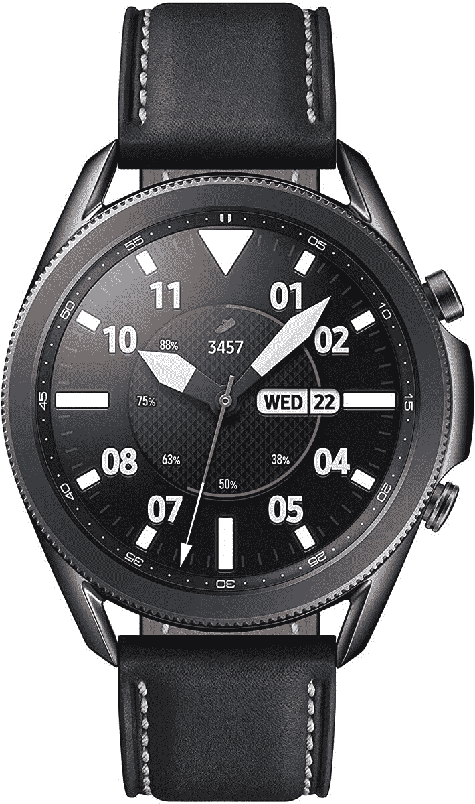
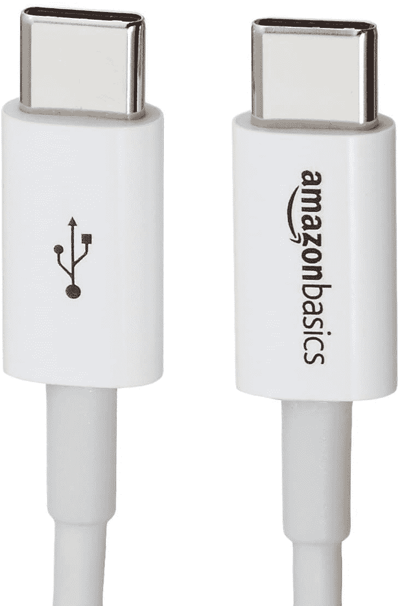
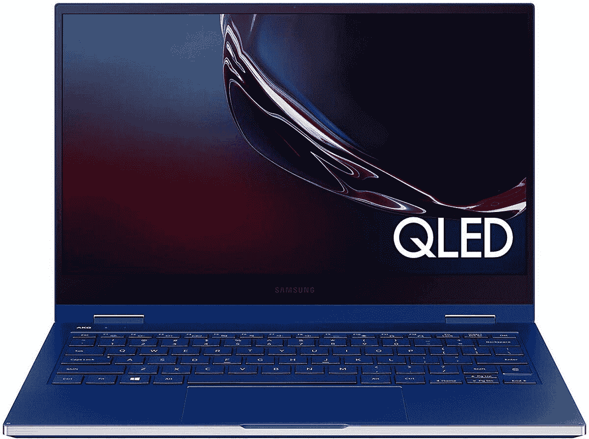
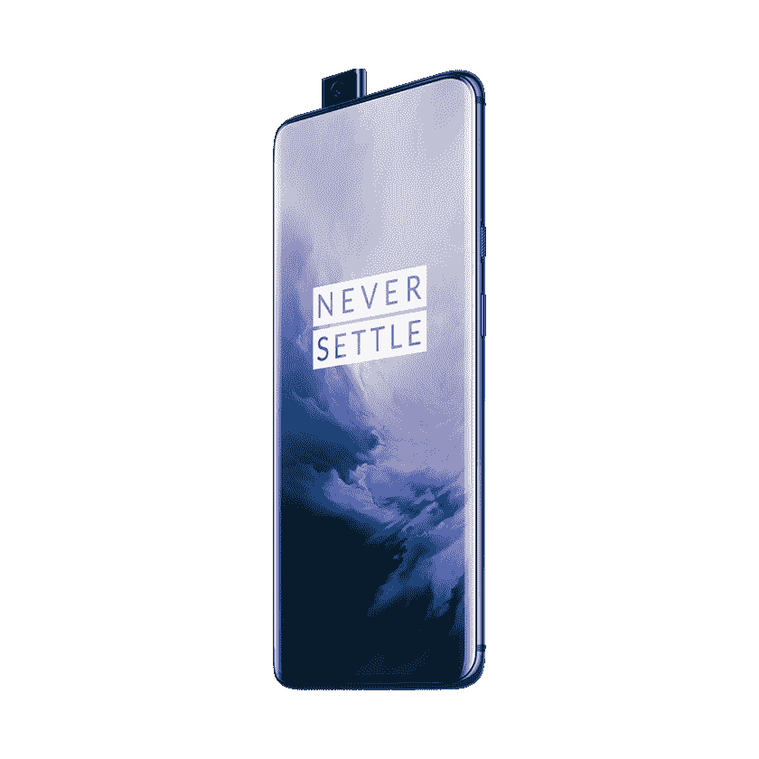

# 今天的顶级技术交易:430 美元的一加 7 专业版，1200 美元的 Galaxy Book Flex！

> 原文：<https://www.xda-developers.com/top-5-deals-september-8/>

我不知道加菲猫为什么讨厌星期一——坦白说，我觉得星期二最糟糕。至少在周一，你在周末得到了很好的休息。到周二的时候，你可能已经花了一整天的时间在工作上，并且没有把工作和私人时间很好的分开。很累，而且不像一周的其他时间，很少有什么值得期待的！嗯，我们将在一周的每一天都有很棒的交易，所以你现在可以期待每周二。

今天的顶级技术交易包括解锁的一加 7 Pro，价格低至 430 美元，比三星 Galaxy Book Flex 低 150 美元，等等！

## 三星 Galaxy Watch 3 售价 365 美元(优惠 65 美元！)

寻找一款智能手表来激励你再次运动？或者是一个看起来很时尚，会给你通知的？[三星 Galaxy Watch 3](https://www.amazon.com/gp/product/B089DNNJ1S?tag=xda-bmktb6t-20&ascsubtag=UUxdaUeUpU29754&asc_refurl=https%3A%2F%2Fwww.xda-developers.com%2Ftop-5-deals-september-8%2F&asc_campaign=Short-Term) 是这两者兼而有之，你可以在亚马逊花 365 美元买到一款。你可以监测你的心率(有助于锻炼和休息)，戴在你的手腕上很好看，手表一次充电可以持续几天。减价 65 美元，你还能要求什么？

 <picture></picture> 

Samsung Galaxy Watch 3 (45mm)

##### 三星 Galaxy 手表 3

三星 Galaxy Watch 3 拥有出色的健身跟踪技术，看起来很棒，并且无需充电即可使用几天。它甚至知道你何时绊倒，因此如果需要的话，它可以发出求救信号。不管你的年龄和健康状况如何，这都是一个非常有用的功能！

## 10 包 USB-C 转 USB-C 充电线，仅售 22 美元

能够为您的设备充电对于高科技生活至关重要。大多数现代产品都转向了 USB-C 充电，这对消费者来说非常好——你不再需要 20 根不同的电缆来给所有东西充电。然而，这些电缆也不可避免地会磨损，所以为什么不在这种情况下省去寻找替代品的麻烦，只需 22 美元就能买到 10 条装的 AmazonBasics 充电电缆呢？这是 USB-C 到 USB-C，所以确保你的电源适配器是好的，但你可以把它们捡起来藏在任何地方。把一些放在你的车里、钱包里或办公室的桌子上，再也不用去找电缆了。

 <picture></picture> 

AmazonBasics USB-C to USB-C Charging Cables (10-pack)

##### 亚马逊基本款 USB-C 至 USB-C 充电线(10 条装)

身边多一些充电线也无妨。只需 22 美元就能买到 10 条装的 USB-C 转 USB-C 电缆，不用担心很快就能找到替代电缆。

## 三星 Galaxy Book Flex 13.3 英寸优惠 150 美元

如果你需要一台更小但功能强大的笔记本电脑，以便在旅行时携带，[三星 Galaxy Book Flex](https://www.amazon.com/Samsung-Display-Processor-Bluetooth-Enabled-NP930QCG-K01US/dp/B085D2HHBT?tag=xda-bmktb6t-20&ascsubtag=UUxdaUeUpU29754&asc_refurl=https%3A%2F%2Fwww.xda-developers.com%2Ftop-5-deals-september-8%2F&asc_campaign=Short-Term) 是一个很好的选择。凭借超长的电池续航时间、与 S Pen 的兼容性以及户外模式，Book Flex 旨在让您随时随地随身携带。13.3 英寸的尺寸也很容易放入随身行李或钱包中，并且在亚马逊上便宜 150 美元。

 <picture></picture> 

13.3-inch Samsung Galaxy Book Flex

##### 三星 Galaxy Book Flex

如果您经常旅行，无论是工作还是休闲，三星 Galaxy Book Flex 都是您想要随身携带的笔记本电脑。凭借超长的电池续航时间、纤薄的设计和高效的功能，这款笔记本电脑物有所值。

## Anker 的 PowerCore Slim Bank 10000 毫安时，售价 20 美元

电源对于紧急情况是必不可少的，如果你有一部电池“不如以前好”的老化手机，它也会很有帮助。 [Anker 的 PowerCore Slim power bank](https://www.amazon.com/Anker-Ultra-Compact-High-Speed-VoltageBoost-Technology/dp/B07QXV6N1B?tag=xda-bmktb6t-20&ascsubtag=UUxdaUeUpU29754&asc_refurl=https%3A%2F%2Fwww.xda-developers.com%2Ftop-5-deals-september-8%2F&asc_campaign=Short-Term) 可以容纳大量电荷，并且小巧轻便，便于随身携带。这个包甚至有 PowerIQ 快速充电技术，如果你在亚马逊页面上剪下优惠券，你只需 20 美元就可以拥有这个方便的配件。此外，它将与那些 [USB-C 到 USB-C 充电线](https://www.amazon.com/gp/product/B07CZWZCK6?tag=xda-bmktb6t-20&ascsubtag=UUxdaUeUpU29754&asc_refurl=https%3A%2F%2Fwww.xda-developers.com%2Ftop-5-deals-september-8%2F&asc_campaign=Short-Term)完美配合！

 <picture></picture> 

Anker PowerCore Slim Bank (10,000 mAh)

##### Anker PowerCore 超薄 10000 PD

每个人都应该有一个为停电和其他紧急情况准备的电源银行，但是当你可以得到一个可以快速充电的电源银行时，为什么要满足于一个普通的电源银行呢？Anker PowerCore 将为您提供所需的电量，同时不会让您感到携带不便。

## 一加 7 专业版 256GB(无锁版 Sprint + GSM)售价 430 美元，仅限今日

仅限今天(或售完为止)，Woot！拥有 256GB 内存的星云蓝一加 7 Pro 仅售 430 美元。这是一个令人难以置信的交易，因为我在一加 7 号线上看到的下一个最好的交易是 B&H 影业的[一加 7T 128GB 智能手机，售价 450 美元](http://xda.tv/OnePlus7TDealBH)。这是一部解锁的手机，但这只适用于 GSM 和 MVNO 网络，所以你不能在威瑞森使用它。如果这不是一个交易破坏者，行动要快，因为如果你等太久，这些可能会卖光！

 <picture></picture> 

OnePlus 7 Pro 256GB (Unlocked)

##### 一加 7 专业版

仅在今天提供，不要在解锁的 OnePlue 7 Pro 上享受这一优惠！这款手机兼容 GSM 和 MVNO 网络，这款非常蓝的手机是一个不错的预算选择。

## 更多技术交易

寻找更多的技术交易？下面我们为你准备了！