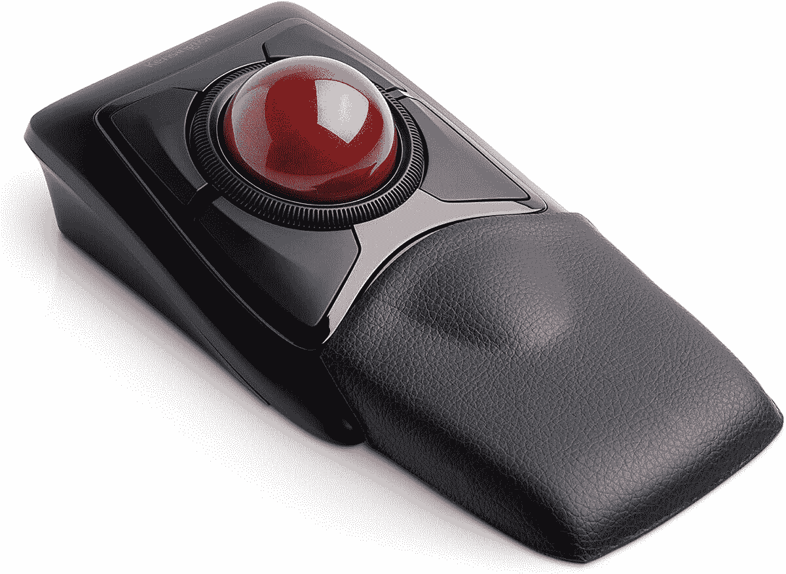
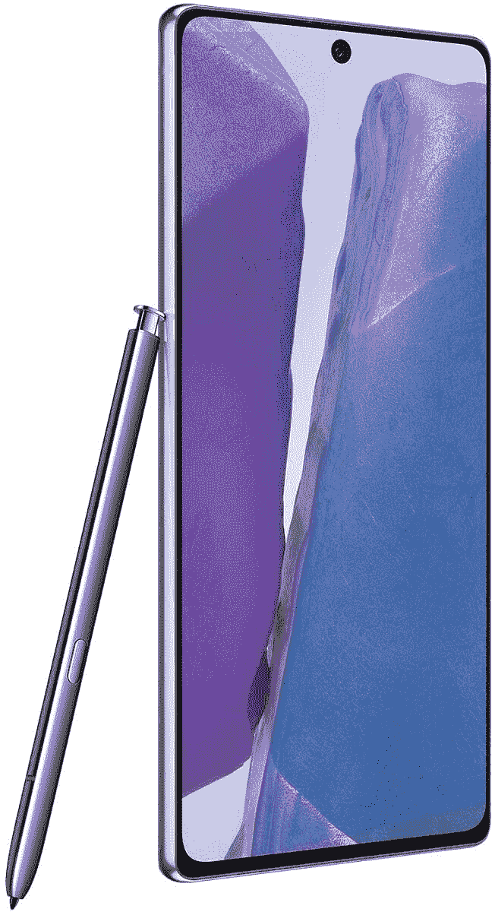
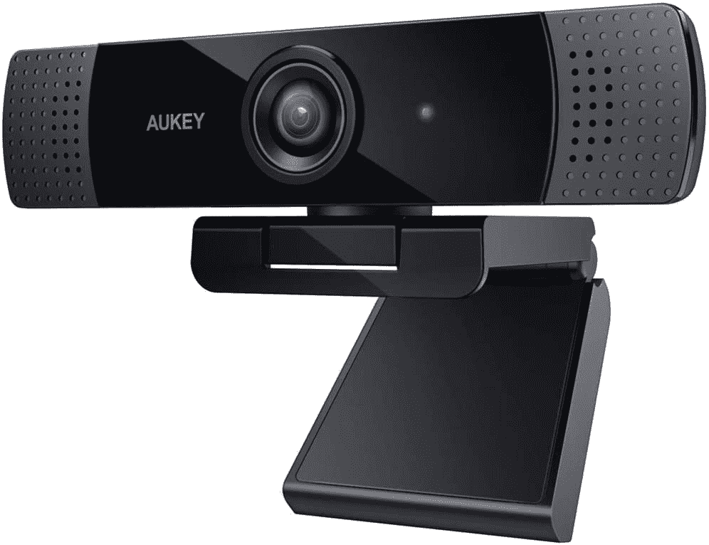
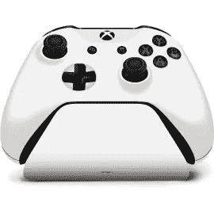

# 今天的顶级技术交易:任天堂 Switch 建兴，800 美元的 Note 20，等等！

> 原文：<https://www.xda-developers.com/top-5-deals-september-9/>

好消息- [Android 11 正式上路](https://www.xda-developers.com/android-11-stable-google-pixel-oneplus-xiaomi-realme-oppo/)！如果你对你的手机是否会获得最新的操作系统感兴趣，我们已经准备了一个方便的 [Android 11 更新跟踪器](https://www.xda-developers.com/android-11-update-tracker/)来让你随时了解情况。我的手机已经用了两年多了，如果 Android 11 被推出来，它可能会融化。也许是时候升级了？

事实上，今天的顶级技术交易包括三星 Galaxy Note 20 降价 200 美元，任天堂 Switch Lites 终于有货，等等。这就好像零售商知道人们需要升级他们的手机和小工具！

## 肯辛顿轨迹球鼠标，售价 84 美元

记得轨迹球吗？虽然几乎每个人都在电脑上使用不起眼的鼠标，但还是有很好的理由选择高质量的轨迹球。因为你使用轨迹球的方式，你可以帮助防止你的手腕和前臂受伤，或者如果你患有腕管综合症，简单地让你更容易使用电脑。[肯辛顿的蓝牙轨迹球](https://www.amazon.com/dp/B01936N73I?tag=xda-395l0m5-20&ascsubtag=UUxdaUeUpU29771&asc_refurl=https%3A%2F%2Fwww.xda-developers.com%2Ftop-5-deals-september-9%2F&asc_campaign=Short-Term)售价 84 美元，低于 100 美元的建议零售价，为什么不买一个试试呢？

 <picture></picture> 

Kensington Expert Wireless Trackball

##### 肯辛顿专家无线轨迹球

使用 Kensington 的轨迹球，让您的手腕和前臂免受持续使用鼠标的痛苦。可能需要一点时间来适应，但你的手臂会感谢你的。

## 三星 Galaxy Note 20 5G 售价 800 美元

我一直在关注 Galaxy Note 20，它的笔功能、强大的规格和整体时尚的外观。但是，正如你可能从某个写交易的人那里猜到的，1000 美元的价格有点难以下咽。亚马逊对一台[未锁定的 Galaxy Note 20](https://www.amazon.com/dp/B01936N73I?tag=xda-395l0m5-20&ascsubtag=UUxdaUeUpU29771&asc_refurl=https%3A%2F%2Fwww.xda-developers.com%2Ftop-5-deals-september-9%2F&asc_campaign=Short-Term) 实行 200 美元的统一价格，如果你不想签约某个特定的运营商，这是比较好的交易之一。

 <picture></picture> 

Samsung Note 20 (Unlocked)

##### 三星 Galaxy Note 20

三星新的旗舰手机拥有智能电池、S Pen 功能和出色的规格。如果你想买一部新手机，现在你有机会享受 200 美元的折扣了！

## Aukey 的 1080p 网络摄像头售价 40 美元

网络摄像头仍然缺货，但 Aukey 的 1080p 网络摄像头不仅可以买到，而且你可以花 40 美元买到它！这个网络摄像头比 60 美元的建议零售价低 10 美元，但是你可以在页面上夹一张优惠券，这样可以多省 10 美元。Aukey 是一个很好的预算品牌，所以你知道你会以一个很好的价格得到一个不错的网络摄像头。

 <picture></picture> 

Aukey FHD 1080p Webcam

##### AUKEY 概述 1080p FHD 网络摄像头

厌倦了在家工作时必须快速购买的低质量网络摄像头？花 40 美元升级到 Aukey 的 1080p 网络摄像头。它会完成任务，而且会做得很好。

## 任天堂 Switch 建兴在百思买有现货

在这一点上，只要看到库存的任天堂 Switch 或 Switch Lite 就觉得是一笔交易。当然，百思买的 Switch Lites 在 MSRP，但如果你已经花了几周或几个月的时间试图找到一个可以玩任天堂游戏的东西，这仍然是一个很容易买到的东西。截至本文撰写之时，所有四种颜色都还在库存中，包括更难找到的珊瑚色。动作要快，因为谁知道什么时候股票会卖光！

 <picture></picture> 

Nintendo Switch Lite

##### 任天堂 Switch 建兴

你有没有尝试过一段时间拿起一个开关建兴没有运气？在撰写本文时，百思买已经有了 Switch Lite 的所有四种颜色可供购买！你还在等什么？抓住一个，否则就太晚了！

## Xbox One Controller Pro 充电支架售价 26 美元

Xbox 系列 X 和系列 S 正式揭晓——终于！更好的消息是，Xbox One 控制器与新游戏机兼容。这太棒了，因为我的 Xbox One 控制器是我最喜欢的玩大多数 PC 游戏的方式。唯一的问题是缺少可充电电池...这可以通过直接从微软商店购买 Xbox One Controller Pro 充电支架来解决！它的售价为 26 美元，你可以买到一个与你的控制器相匹配的支架和电池盖，同时给你的控制器一个好位置。

 <picture></picture> 

Xbox One Controller Charging Stand

##### 微软 Xbox One 手柄充电座

给你的 Xbox One 控制器充电，同时用微软的官方支架给它一个时尚的位置。你可以获得与你的控制器相匹配的颜色，甚至可以在新的 X 系列和 S 系列上使用 Xbox One 控制器！

## 更多技术交易

寻找更多的技术交易？下面我们为你准备了！事实证明， [Galaxy Book Flex](https://www.amazon.com/Samsung-Display-Processor-Bluetooth-Enabled-NP930QCG-K01US/dp/B085D2HHBT?tag=xda-395l0m5-20&ascsubtag=UUxdaUeUpU29771&asc_refurl=https%3A%2F%2Fwww.xda-developers.com%2Ftop-5-deals-september-9%2F&asc_campaign=Short-Term) 自昨天以来又下跌了 6 美元。谁知道它是否会继续下降或反弹到 MSRP，所以如果你感兴趣，不要拖延。