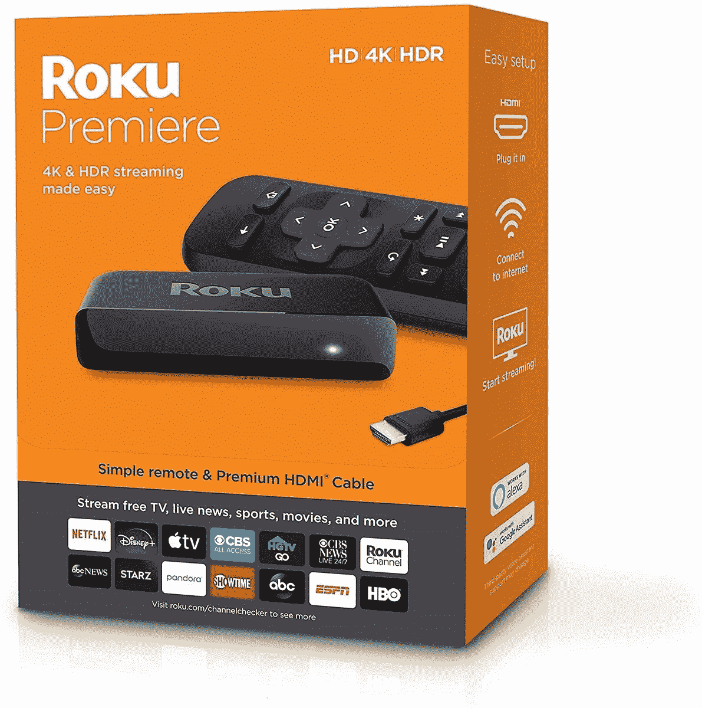
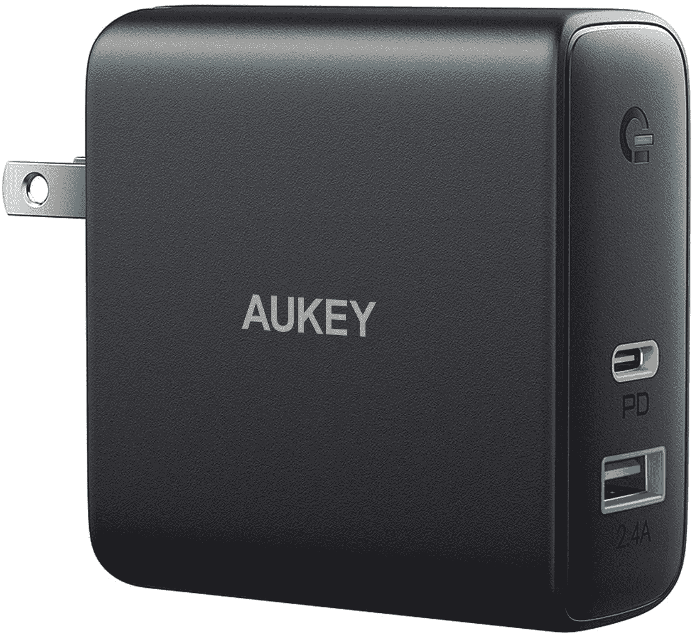

# 今天的技术交易:190 美元的 AirPods Pro，27 美元的 Roku Premiere，等等！

> 原文：<https://www.xda-developers.com/top-5-tech-deals-october-12/>

这是暴风雨前的平静。2020 年亚马逊优惠日明天开始，你可以肯定会有足够多的交易让你头晕目眩。一些零售商，如沃尔玛，已经在这个大日子之前开始了他们的活动！但是每天总会有一些很棒的技术交易等着你去挑选，甚至像今天这样的一天也不例外。

今天的顶级技术交易包括 190 美元的苹果 AirPods Pro，仅 27 美元的 Roku Premiere，等等！

## 大优惠活动:价值 66 美元的罗技无线游戏耳机

我以前谈论过罗技 G533 耳机——我甚至为自己买了一副，以取代我那副不行的 PC 耳机。它们在亚马逊上的价格是 74 美元，但在沃尔玛的大减价活动中，价格甚至更低！购买这款无线耳机仅需 66 美元，送完即止。G533 很舒适，声音很棒，充电时间长达 15 小时，所以你知道这些对你有好处。你甚至可以在附近的沃尔玛注册免费提货。

 <picture></picture> 

Logitech G533 Wireless Gaming Headset

##### 罗技 G533 游戏耳机

由于沃尔玛的大减价活动，买一个便宜耐用的无线耳机。凭借舒适的杯子和超长的电池续航时间，G533s 不会中断长时间的游戏。

## 苹果 AirPods Pro 售价 190 美元，仅限今日

苹果的产品总是价格不菲，但好东西(和好交易)总是留给那些耐心等待的人。今天只在伍特！，以 190 美元的价格从 250 美元的建议零售价入手[一双全新的苹果 AirPods Pro。这是无线耳塞迄今为止最低的价格之一，低于本周零售商促销活动期间的价格。但是，你必须今天就去拿，在它们在 Woot 卖光之前！(这是非常现实的可能性)。不要拖延！](https://www.anrdoezrs.net/links/100122946/type/dlg/sid/UUxdaUeUpU30172/https://electronics.woot.com/offers/apple-airpods-pro-14)

 <picture></picture> 

Apple AirPods Pro

##### 苹果 AirPods Pro

低价购买苹果优质耳塞，仅限今天！呜！AirPods Pro 将以 190 美元的价格出售，这是该设备有史以来的最低价格之一，但你需要尽快抢购这些产品，因为它们很可能会售罄。如果你是亚马逊 Prime 会员，你将获得免费送货！

## 早期交易日交易:克利普施 SPL-120 12 英寸低音炮，售价 689 美元

Target 已经开展了大约一周的早期交易日活动，但今天是在真正的活动开始之前利用早期折扣的最后一天。购买 Klipsch 12 英寸低音炮可节省 149 美元，总价格降至 689 美元。这可能看起来很贵，但音响发烧友知道 Klipsch 是周围最好的品牌之一，这款低音炮物有所值。它还配有无线低音炮套件，因此您可以将它放在客厅中任何需要的地方，以获得最佳声音。

 <picture></picture> 

Logitech G533 Wireless Gaming Headset

##### 克利普施 SPL-120 12 英寸超重低音扬声器

为您的家庭影院选择最好的产品。Klipsch 的 12 英寸低音炮是早期交易，仅售 689 美元。它还配有无线低音炮套件，因此您可以在任何需要的地方设置它，无需电线，以获得最佳声音。

## Roku 首映，27 美元

亚马逊上今天没有很多好的交易——这是可以理解的，因为 Prime Day 将从 PDT 午夜开始。然而，这家大型在线零售商并非完全没有交易，因为你可以以 27 美元的低价买到 Roku Premiere。首映有一个超级简单的设置，将让你流 4K 和 HDR 的内容。它也适用于 Alexa，如果你有一个[回声点](https://www.amazon.com/Echo-Dot/dp/B07FZ8S74R?tag=xda-2pbl80t-20&ascsubtag=UUxdaUeUpU30172&asc_refurl=https%3A%2F%2Fwww.xda-developers.com%2Ftop-5-tech-deals-october-12%2F&asc_campaign=Short-Term)来使用它！

 <picture></picture> 

Roku Premiere

##### Roku 首映

有一个愚蠢的电视？用 Roku 首映来美化一下吧！让 4K 和 HDR 像连接首映式并打开它一样容易。只要 27 美元，比买一台新电视便宜多了！

## 欧凯福克斯 60W PD 充电器，售价 19 美元

今天是最后一天，但你可以给自己买一个新的壁式充电器，而不用马上处理黄金日的疯狂！ [Aukey 的 60W 壁式充电器](https://www.amazon.com/dp/B07V2Z6WFN?tag=xda-2pbl80t-20&ascsubtag=UUxdaUeUpU30172&asc_refurl=https%3A%2F%2Fwww.xda-developers.com%2Ftop-5-tech-deals-october-12%2F&asc_campaign=Short-Term)通过剪下优惠券并在结账时使用 **ERY42D7T** 今天仅售 19 美元。使用这款壁式充电器快速轻松地为您的任何设备充电，再也不用坐在那里等着用低功率充电器给手机充电了。

 <picture></picture> 

AUKEY Focus 60W PD Charger

##### AUKEY PA-D3 Focus Mix 60W 充电器

为什么要把时间浪费在质量较低的壁式充电器上呢？通过剪下优惠券，并在结账时使用代码 **ERY42D7T** ，你可以只花 19 美元获得 Aukey 的 60W 壁式充电器。不过，代码今天就到期了，所以不要等了！

## 更多技术交易

寻找更多的技术交易？下面我们为你准备了！