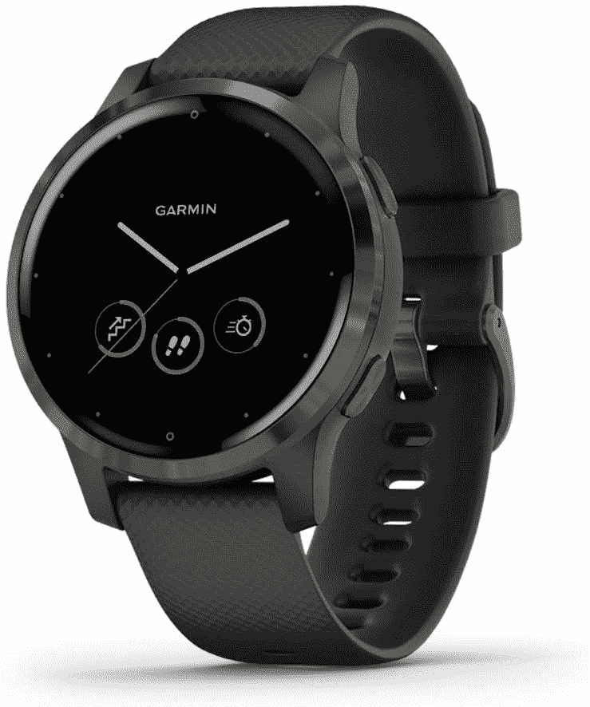
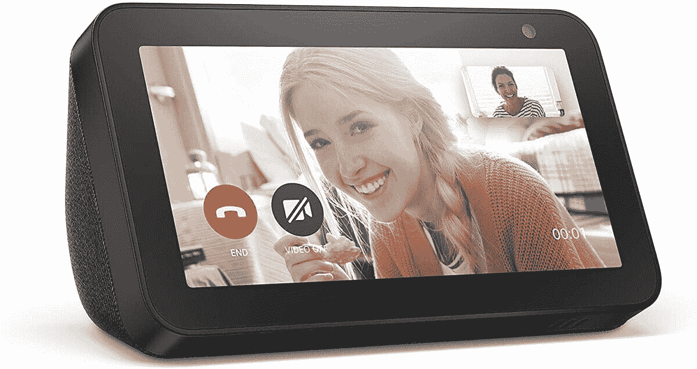
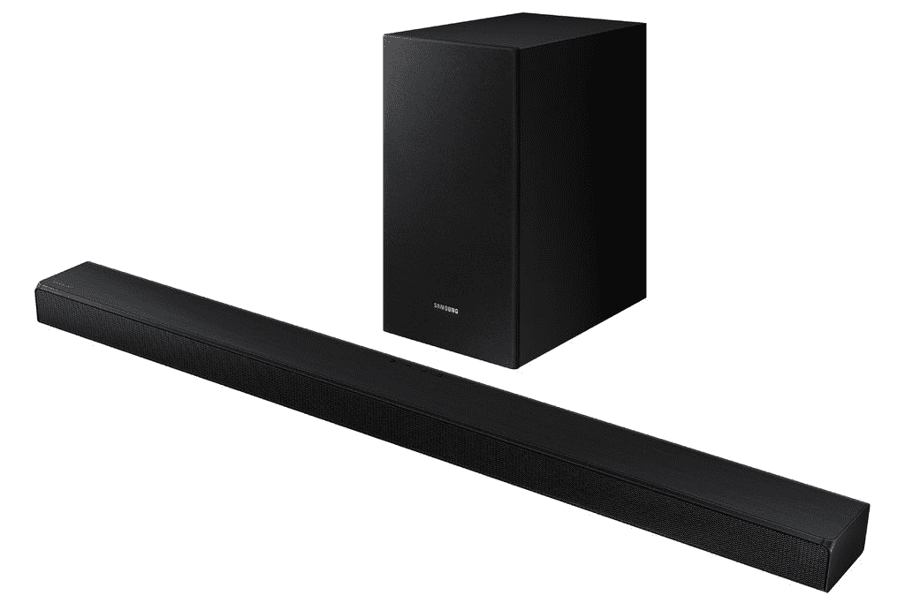
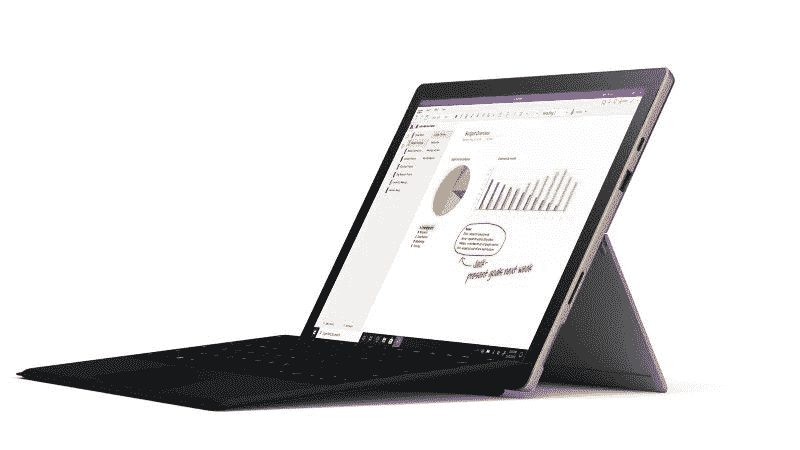
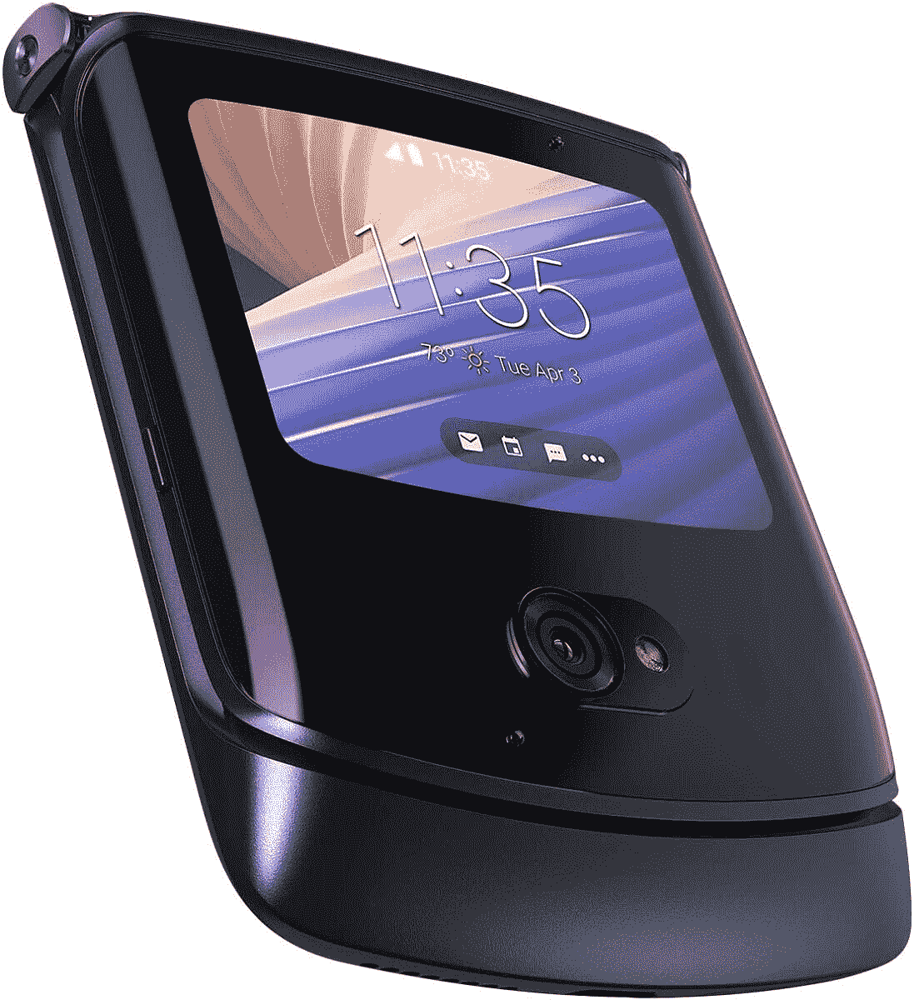

# 今天的技术交易:Surface Pro 7 套装 599 美元，Echo Show 5 45 美元！

> 原文：<https://www.xda-developers.com/top-5-tech-deals-october-6/>

星期二快乐！我在倒计时，离质数日还有一周。你可能想知道，对于像我这样的交易大师来说，黄金日是不是一个有趣的日子。我的回答是著名的抑制你的热情 gif 和一个空的银行账户。因此，我不会给你一个直截了当的答案，我会看看这张 [Galaxy Note 20 封面和外壳](https://www.xda-developers.com/best-galaxy-note-20-cases/)的综述，因为我想知道这款旗舰产品下周是否会有更大的折扣。

今天的顶级技术交易包括 Echo Show 5 作为早期 Prime Day 交易的一半，Surface Pro 7 捆绑包的折扣等等！

## Garmin Vivoactive 4S，八折优惠

保持锻炼的动力可能很难，但有一样东西对我帮助很大，那就是智能手表。举例来说，我喜欢看数据，在我的各种应用程序中取悦机器人激励器也总是感觉很好。今天在亚马逊，你可以花 280 美元买到 Garmin Vivoactive 4S，比建议零售价低 70 美元。这款手表可以跟踪从步数到能量水平到压力程度的一切，允许你下载歌曲和连接蓝牙耳机以便于收听，等等。如果你真的想健身和追踪，这款手表绝对不会错。

 <picture></picture> 

Garmin Vivoactive 4S

##### 佳明活力 4S

使用 Garmin Vivoactive 4S 跟踪所有内容。在亚马逊只需 270 美元，你就可以跟踪你所有的健身活动、电话通知，以及你从未认为你需要知道的事情。今天就抢一个！

## 早黄金日交易:回声秀 5 半价

黄金日离今天还有一周，但为什么要等着利用这些优惠呢？如果你是[亚马逊 Prime](https://www.amazon.com/amazonprime?tag=xda-3uk2q8m-20&ascsubtag=UUxdaUeUpU30101&asc_refurl=https%3A%2F%2Fwww.xda-developers.com%2Ftop-5-tech-deals-october-6%2F&asc_campaign=Short-Term) 会员，你可以半价购买 [Echo Show 5，价格为 45 美元](https://www.amazon.com/dp/B07HZLHPKP?tag=xda-3uk2q8m-20&ascsubtag=UUxdaUeUpU30101&asc_refurl=https%3A%2F%2Fwww.xda-developers.com%2Ftop-5-tech-deals-october-6%2F&asc_campaign=Short-Term)。这款便捷的智能家居设备可以读取时间，连接到各种应用程序，并允许您通过简单的命令查看房子周围的摄像头。如果你喜欢智能家居生活，Echo Show 绝对应该在你的购买清单上。

 <picture></picture> 

Amazon Echo Show 5

##### 亚马逊回声秀 5

使用 Echo Show 5 更好地设置您的智能家居。控制房子周围的智能摄像头，获得一步一步的烹饪说明，等等。亚马逊 Prime 会员目前只需 45 美元！

## 三星 3.1 声道音箱，带低音炮，优惠 30 美元

在假日购物季节，最常见的一件东西是一台新电视。这很好，但一台好的电视需要一个好的音响系统才能真正引人入胜。在沃尔玛购买三星条形音箱和低音炮组合，只需 270 美元，您就能拥有一个完美的家庭影院系统。

 <picture></picture> 

Samsung 3.1ch Soundbar with Subwoofer

##### 三星 310W 3.1 声道条形音箱

为您的新电视配备一套音响系统。使用 Samsung soundbar 和低音炮，您可以获得高品质的声音，而无需花费太多...没有你的邻居抱怨噪音。

## Surface Pro 7 +型封面套装起价 599 美元

就工作效率而言，推荐高端平板电脑比推荐真正的笔记本电脑更容易。有了键盘盖和合适的规格，平板电脑更容易携带，更轻便，具有触摸屏功能，而许多笔记本电脑都没有。在微软商店，你可以买到一台带键盘盖的[Surface Pro 7](https://www.microsoft.com/en-us/p/surface-pro-7-type-cover-bundle/8rchnrmn80bw?activetab=pivot%3aoverviewtab)，起价 599 美元。基本规格是 4GB 内存和 128 GB，但如果需要，您可以在检查之前扩展这些内存。

 <picture></picture> 

Surface Pro 7 + Type Cover Bundle

##### 微软 Surface Pro 7

需要随时随地保持高效工作？Surface Pro 7 很轻，可以做任何你需要的事情。起价 599 美元，如果需要的话，你可以定制捆绑包，为设备提供更多的功能！

## 摩托罗拉 Razr 5G(无锁版)售价 1200 美元

准备好进入可折叠手机的世界了吗？以更低的价格购买[摩托罗拉 Razr 5G，价格比](https://www.amazon.com/Motorola-Unlocked-Camera-Polished-Graphite/dp/B08F2R2DBr?tag=xda-3uk2q8m-20&ascsubtag=UUxdaUeUpU30101&asc_refurl=https%3A%2F%2Fwww.xda-developers.com%2Ftop-5-tech-deals-october-6%2F&asc_campaign=Short-Term)低 200 美元，解锁手机的总价格为 1200 美元。这款可折叠翻盖手机全球解锁，可用于美国境内外的任何 4G 网络。如果您的运营商提供 5G 网络，您也可以在 5G 网络上使用 Razr！

 <picture></picture> 

Motorola Razr 5G (Unlocked)

##### 摩托罗拉 Razr 5G

今天就用 Razr 5G 加入可折叠手机生活，目前在亚马逊可享受 200 美元的优惠。虽然这个模型是为美国创建的，但它是全球解锁的，所以你应该可以在任何计划中使用它。

## 更多技术交易

寻找更多的技术交易？下面我们为你准备了！

## 2020 年黄金日早期交易

我们已经收集了目前为止在下面找到的 2020 年 Prime Day 早期交易！