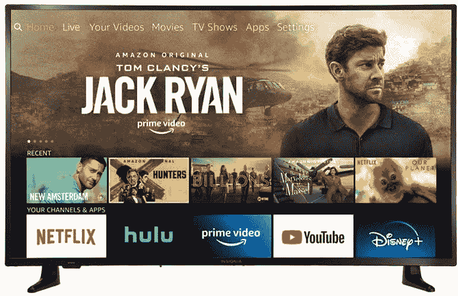
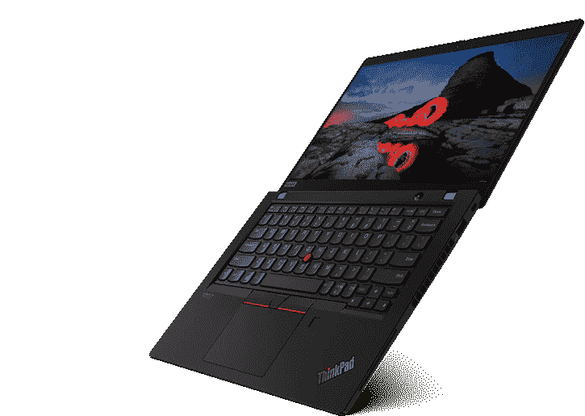

# 今天的科技交易:200 美元的 Insignia 电视，146 美元的三星 Sport 智能手表！

> 原文：<https://www.xda-developers.com/top-5-tech-deals-october-7/>

已经是工作周的中间了。当你在寻找技术交易时，时间过得真快！随着多家零售商准备迎接黄金日，本周的交易在“非常好”和“几乎不存在”之间剧烈波动，这取决于你在哪里看。但是，如果你知道去哪里找，总会有省钱的方法。

这就为我们带来了今天的热门交易！其中包括三星 Gear Sport 智能手表优惠 50 美元，Insignia 智能电视仅售 200 美元，等等！

## 戴尔的显示器销售

厌倦了我挑选显示器，只是想为自己浏览一个集合？[戴尔显示器目前正在大减价](https://deals.dell.com/en-us/mpp/category/monitors)，所以现在你有机会挑选你需要的电脑和办公设备。选择各种形状、尺寸和刷新率的显示器，节省高达 31%的费用。有些甚至附带 100 美元的戴尔 eGift 卡，所以不要犹豫，立即购买您需要的显示器！

 <picture></picture> 

Dell Monitor Sale

##### 戴尔 UltraSharp 34 曲面 U3421WE

通过戴尔显示器销售，获得您想要的显示器！购买各种各样的显示器，您可以节省高达 31%的费用，有些显示器甚至附带价值 100 美元的 Dell eGift 卡！

## 黄金时段早期交易:Insignia 43 英寸智能电视，售价 200 美元

电视一直是黄金日和黑色星期五等大型销售活动的高价商品。但是，亚马逊提前开始了电视销售，这款 [Insignia 43 "智能电视](https://www.amazon.com/dp/B086VRY8GZ?tag=xda-24464h7-20&ascsubtag=UUxdaUeUpU30116&asc_refurl=https%3A%2F%2Fwww.xda-developers.com%2Ftop-5-tech-deals-october-7%2F&asc_campaign=Short-Term)仅售 200 美元(比建议零售价低 100 美元)。它的尺寸非常适合放在房间里的第二台电视上，例如卧室里，并且有 Fire TV，所以你可以轻松地观看所有你喜欢的流媒体服务。你需要成为亚马逊的高级会员才能享受这一优惠，如果你还不是，[在这里注册](https://www.amazon.com/amazonprime?tag=xda-24464h7-20&ascsubtag=UUxdaUeUpU30116&asc_refurl=https%3A%2F%2Fwww.xda-developers.com%2Ftop-5-tech-deals-october-7%2F&asc_campaign=Short-Term)！

 <picture></picture> 

Save with Insignia's 43-inch 4K TV

##### Insignia DF71 43 英寸 4K 电视

为卧室买一台全新的 4K 电视，价格便宜！如果你是亚马逊 Prime 会员，你可以花 200 美元买到这台 43 英寸的 Insignia 电视。这款智能电视配有 Fire TV，可以在一个地方轻松观看所有流媒体服务。

## 索尼 WF XB 700 真无线耳塞售价 78 美元

索尼的 WF-XB700 耳塞非常棒，这并不令人吃惊。它们也不经常打折，但是你现在可以在亚马逊上只花 78 美元买到这些花蕾。WF-XB 700 的电池续航时间长达 9 小时，拥有额外的低音，甚至可以用于电话和视频通话。它们非常通用！

 <picture></picture> 

Sony WF-XB700 True Wireless Earbuds

##### 索尼 WF-XB700

索尼 WF-XB700 无线耳塞售价 78 美元，有黑色和蓝色两种颜色可供选择。nin 小时的电池续航时间可以让它们工作一整天，额外的低音可以提供出色的音效。

## 仅在今天，三星 Gear Sport 智能手表的价格是 146 美元

昨天的 [Vivoactive 4S](https://www.amazon.com/dp/B07W8ZMXG5?tag=xda-24464h7-20&ascsubtag=UUxdaUeUpU30116&asc_refurl=https%3A%2F%2Fwww.xda-developers.com%2Ftop-5-tech-deals-october-7%2F&asc_campaign=Short-Term) 在数据方面是不是有点太多了？只是需要一些东西来跟踪你的健身和通知，并呼吁一天？只有今天，沃特！拥有[三星 Gear Sport 智能手表](https://www.anrdoezrs.net/links/100122946/type/dlg/sid/UUxdaUeUpU30116/https://electronics.woot.com/offers/samsung-gear-sport-smartwatch)，仅售 146 美元。这款智能手表可以为你轻松跟踪健身和卡路里，甚至可以在游泳时戴在身上。像往常一样和 Woot 在一起！交易，你只能在当天结束前或售罄前获得这款智能手表。如果你或你认识的人会喜欢这块手表，现在就买一块吧！

 <picture></picture> 

Samsung Gear Sport Smartwatch

##### 三星 Gear Sport 智能手表

买一只智能手表，只跟踪你今天需要的东西！三星的 Gear Sport 智能手表售价仅为 146 美元，它可以跟踪你的健身活动和卡路里。亚马逊 Prime 会员免运费！

## 联想 ThinkPad X13 第一代笔记本电脑起价 683 美元

联想现在正在进行它的[半年度销售](https://shop-links.co/link/?exclusive=1&publisher_slug=xda&article_name=Today%27s+Top+Tech+Deals%3A+%24200+Insignia+Smart+TV%2C+%24146+Samsung+Gear+Sport+Smartwatch%2C+and+More%21&article_url=https%3A%2F%2Fwww.xda-developers.com%2Ftop-5-tech-deals-october-7%2F&u1=UUxdaUeUpU30116&url=https%3A%2F%2Fwww.lenovo.com%2Fus%2Fen%2Fd%2Fdeals%2Fdoorbusters%2F%3Famp%253BcurrentResultsLayoutType%3Dgrid%26sort%3DsortBy&ourl=https%3A%2F%2Fwww.lenovo.com%2Fus%2Fen%2Fd%2Fdeals%2Fdoorbusters%3Fsort%3DsortBy%26amp%3BcurrentResultsLayoutType%3Dgrid)，有很多东西要筛选！不过，有一件东西你不需要搜索，那就是这款 [ThinkPad X13 Gen 1 笔记本电脑](https://shop-links.co/link/?exclusive=1&publisher_slug=xda&article_name=Today%27s+Top+Tech+Deals%3A+%24200+Insignia+Smart+TV%2C+%24146+Samsung+Gear+Sport+Smartwatch%2C+and+More%21&article_url=https%3A%2F%2Fwww.xda-developers.com%2Ftop-5-tech-deals-october-7%2F&u1=UUxdaUeUpU30116&url=https%3A%2F%2Fwww.lenovo.com%2Fus%2Fen%2Fp%2F20UFCTO1WWENUS0&ourl=https%3A%2F%2Fwww.lenovo.com%2Fus%2Fen%2Flaptops%2Fthinkpad%2Fthinkpad-x%2FThinkPad-X13-amd%2Fp%2F20UFCTO1WWENUS0)，起价仅为 683 美元。基本型号有 8GB 内存、128GB 硬盘和锐龙 3 PRO 4450U 处理器，但您可以定制笔记本电脑以满足您的需求。请确保优惠券代码 **THINKSALE** 在结账时适用于全额折扣！

 <picture></picture> 

Lenovo ThinkPad X13 Gen 1 Laptop

##### 联想 ThinkPad X13

以大幅折扣获得轻薄的 ThinkPad X13！在收银台使用代码 **THINKSALE** 获得这款起价 683 美元的笔记本电脑，并可以根据您的需求进行定制。

## 更多技术交易

寻找更多的技术交易？下面我们为你准备了！

## 2020 年黄金日早期交易

我们已经总结了目前为止在下面找到的 2020 年 Prime Day 早期交易。无论是否有技术交易，利用这些交易在黄金日可能节省更多！