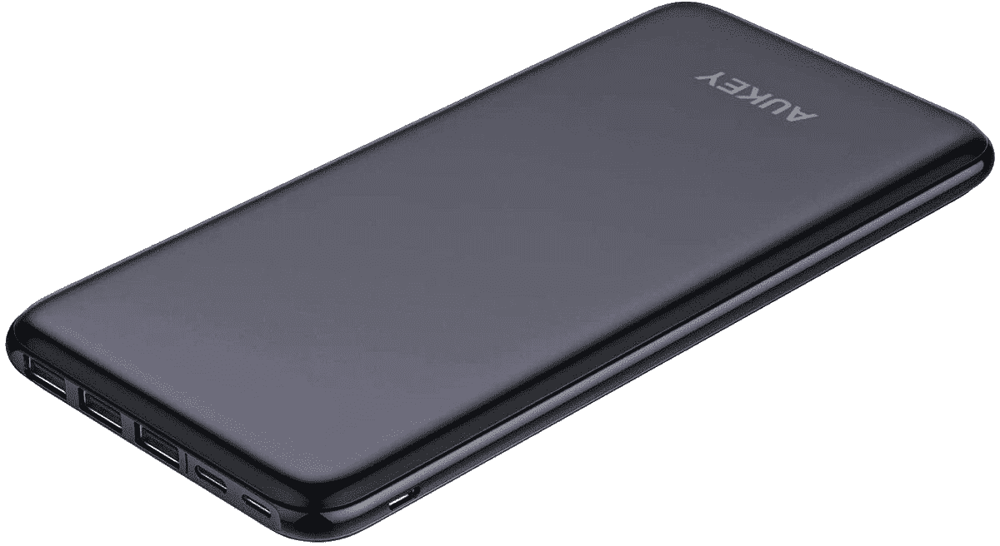
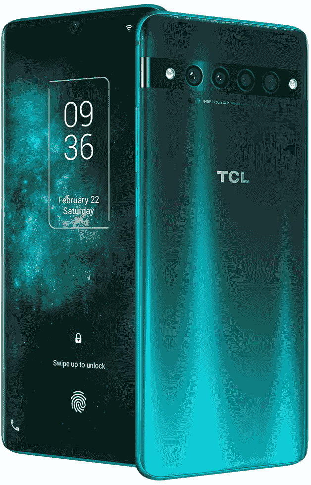
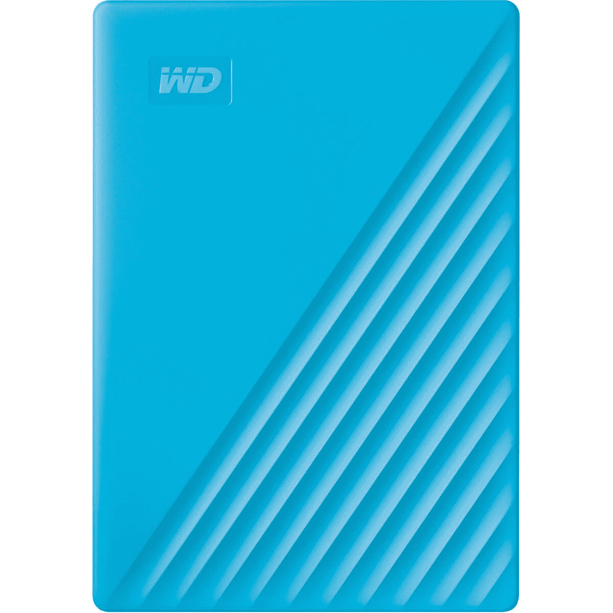

# 今天的技术交易:TCL 10 Pro 售价 380 美元，Aukey 电池组售价 27 美元！

> 原文：<https://www.xda-developers.com/top-5-tech-deals-october-8/>

你知道什么很酷吗？[chrome book 很酷](https://www.xda-developers.com/best-chromebooks/)。它们是非常有用的小型生产力设备，具有超长的电池寿命，能够真正完成工作。我使用 Chromebook 多年，因为工作需要我离开桌面，直到有一项工作需要我运行 Photoshop 来为我的帖子创建图像——Photoshop 是一个绝对的应用程序，它像没有明天一样消耗内存和处理能力。但是只要你不需要 Photoshop，并且对 Chrome 操作系统的一些怪癖没有意见，我强烈推荐 Chromebook 来完成工作。

当然，说了这么多，我没有任何 Chromebook 交易给你...也就是今天。我们可能会在黄金周的疯狂期间看到这些交易。相反，今天的技术交易包括 TCL 10 Pro 降价 70 美元，一个仅售 27 美元的强大电池组，等等！

这款小巧的[宏基便携式显示器](https://www.amazon.com/gp/product/B07VT1WXGV?tag=xda-6t8iqc5-20&ascsubtag=UUxdaUeUpU30138&asc_refurl=https%3A%2F%2Fwww.xda-developers.com%2Ftop-5-tech-deals-october-8%2F&asc_campaign=Short-Term)售价仅为 130 美元，但库存非常有限。如果它们仍然可用，并且您正在市场上购买便携式显示器，请快速抢购一台！

## 海盗船 VOID Elite 耳机，售价 60 美元

距离我们上次看到游戏耳机交易已经有一段时间了。上个月它们似乎风靡一时！如果你现在需要一个新的耳机，海盗船公司有它的 [VOID Elite 耳机](https://www.amazon.com/Corsair-Surround-Premium-Gaming-Headset/dp/B07XF2TGFX?tag=xda-6t8iqc5-20&ascsubtag=UUxdaUeUpU30138&asc_refurl=https%3A%2F%2Fwww.xda-developers.com%2Ftop-5-tech-deals-october-8%2F&asc_campaign=Short-Term)出售，售价 60 美元，比建议零售价低 20 美元。凭借其在亚马逊的 4.5 评级和耐用的结构，这款耳机承诺将持续多年。当然，你可能会找到一个更便宜的耳机，但是当你可以买到一个耐用的耳机时，为什么要浪费在质量差的耳机上呢？

 <picture></picture> 

Corsair Void RGB Elite USB Premium Gaming Headset

##### 海盗船虚空精英耳机

在亚马逊买一个耐用的耳机，优惠 20 美元。Corsair VOID Elite 耳机专为游戏设计，具有耐用的结构，旨在为长时间游戏提供舒适体验。多花点钱，省得自己以后买多个便宜的耳机！

## AUKEY 20000mAh 超薄电池组，售价 27 美元

奥基总是有高质量而低成本的配件，今天你只需 27 美元就能买到他们的超薄包装。这个轻薄的包有 20，000 mAh 的功率，可以同时为多达四个设备充电。通过使用代码 **4CNEPWO5** 并剪下 5 美元的优惠券，你将获得仅售 27 美元的超薄电池组。

 <picture></picture> 

AUKEY 20000mAh Slimline Battery Pack

##### AUKEY PB-Y14 超薄 20000mAh 电池组

Aukey 的超薄电池组轻薄，便于随身携带。通过使用代码 **4CNEPWO5** 并剪下优惠券，只需 27 美元就能买到这款小巧但功能强大的电池组。此优惠活动截止到 10 月 12 日！

## 仅在今天，亚马逊 Fire 电视棒才 20 美元

你会认为这是另一个早期的黄金日交易，但它不是！今天只在伍特！，你可以在一个全新的[亚马逊 Fire 电视棒](https://www.anrdoezrs.net/links/100122946/type/dlg/sid/UUxdaUeUpU30138/https://www.woot.com/offers/amazon-fire-tv-stick-with-voice-remote)上节省 50%,使得购买只需 20 美元。如果你不想买智能电视，这是下一个最好的选择，让你可以轻松地观看你最喜欢的流媒体服务的节目！精通技术的人可能也知道 Fire 电视棒的一些额外用途...[提示，提示](https://forum.xda-developers.com/fire-tv)。只需 20 美元，这是冲动购买领域，但你只有在一天结束前得到一个！

 <picture></picture> 

Amazon Fire TV Stick

##### 亚马逊 Fire 电视棒

以低于外卖的价格抢一台亚马逊 Fire 电视！今天只在伍特！，您可以使用 Fire 电视棒从任何电视上观看您最喜爱的流媒体节目。

## TCL Pro 10(未锁定)，优惠 70 美元

当你可以用像 [TCL 10 Pro](https://www.amazon.com/dp/B087LW5VR1?tag=xda-6t8iqc5-20&ascsubtag=UUxdaUeUpU30138&asc_refurl=https%3A%2F%2Fwww.xda-developers.com%2Ftop-5-tech-deals-october-8%2F&asc_campaign=Short-Term) 这样的手机获得类似的体验时，为什么要花高价购买高端旗舰手机呢？如果你不需要处于技术的前沿，这款手机将通过高通骁龙 675 和 6GB 的内存完成工作。通常零售价为 450 美元，你可以在亚马逊页面上剪下优惠券，以 380 美元的价格获得这款绿色智能手机。

 <picture></picture> 

TCL 10 Pro (Unlocked)

##### TCL 10 Pro

在亚马逊，购买 TCL Pro 10 可节省 70 美元！这是一款解锁手机，可以支持 CDMA 网络以及威瑞森的 LTE 网络。所以不管你的运营商，你都可以免费使用这款廉价手机！

## WD My Passport 4TB 外置硬盘，售价 110 美元

外置硬盘永远有用，WD 是最值得信赖的品牌之一。在 Staples 购买 4TB WD My Passport 可节省 30 美元，还可获得新备份存储设备的免费运费。这款硬盘有一种亮蓝色，对于那些想要为自己的配件添加一种流行色彩的人来说，这是一个额外的奖励...或者让你容易丢失的东西更容易被找到！

 <picture></picture> 

WD My Passport 4TB External Hard Drive

##### WD My Passport 外置硬盘

获得一个漂亮的 4TB 外置硬盘，在 Staples 节省 30 美元！WD 是值得信赖的硬盘品牌，因此您知道您的数据会得到妥善保管。

## 更多技术交易

寻找更多的技术交易？下面我们为你准备了！

## 2020 年黄金日早期交易

我们已经总结了目前为止在下面找到的 2020 年 Prime Day 早期交易。无论是否有技术交易，利用这些交易在黄金日可能节省更多！