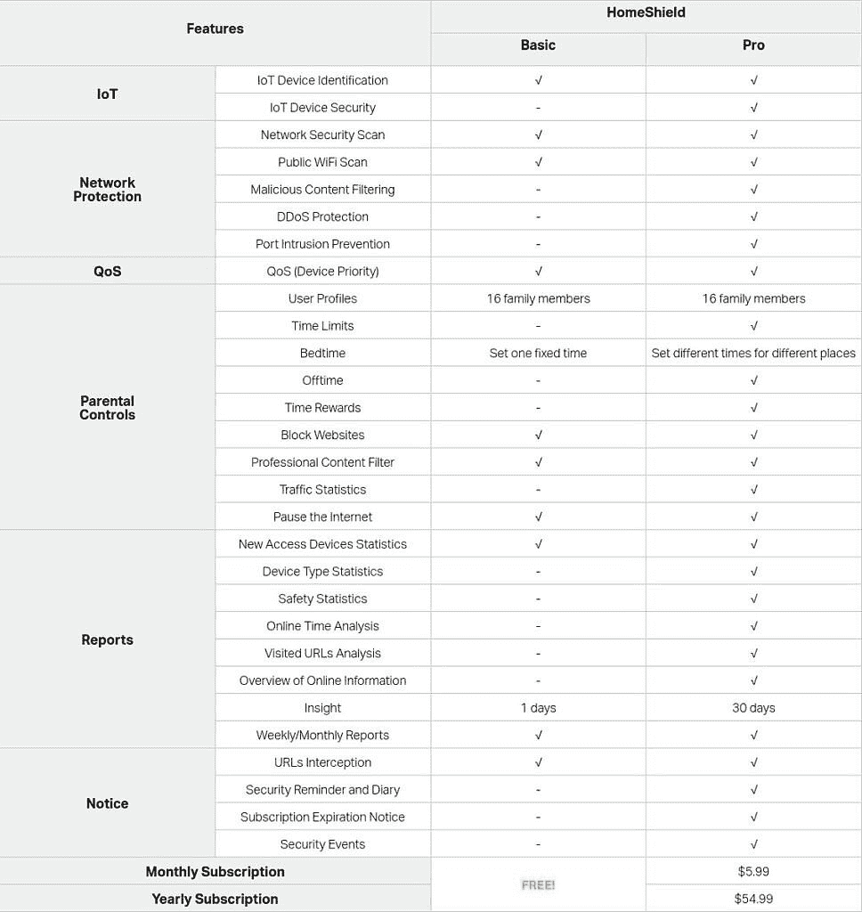
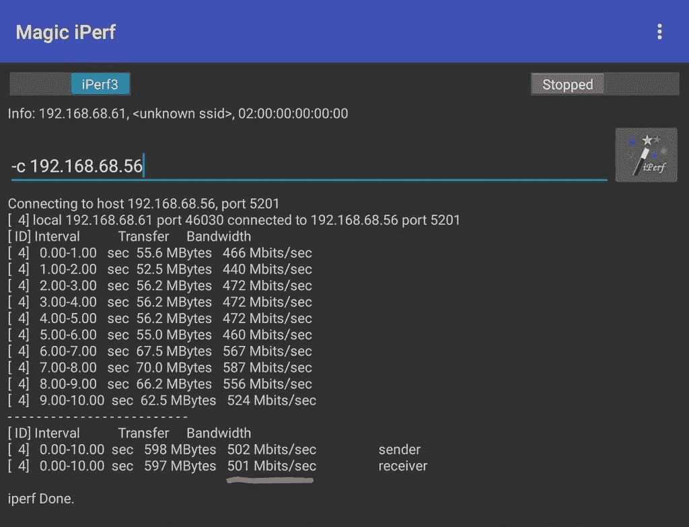
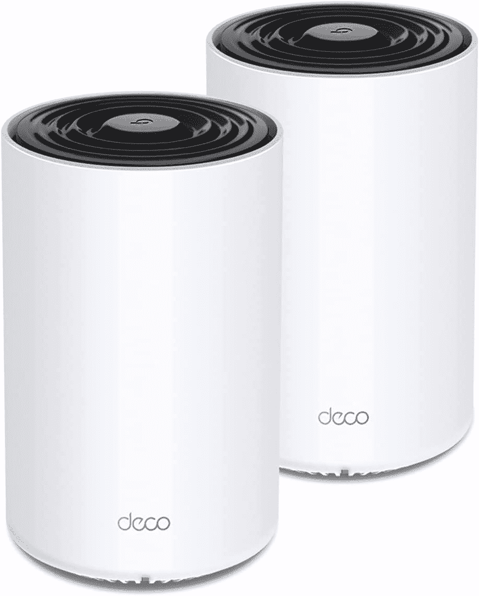

# TP-Link Deco X68 回顾:一个好的网状网路由器被离奇的软件毁了

> 原文：<https://www.xda-developers.com/tp-link-deco-x68-review/>

即使在世界上的一些地方已经关闭了，在家工作也结束了，许多人仍然将他们的家庭网络推到了极限。网飞流媒体、Zoom 通话和在线游戏对家庭网络的要求很高，如果你的 Wi-Fi 不能覆盖你家的每个角落，那么世界上最好的互联网连接也不会有太大帮助。值得庆幸的是，随着网状 Wi-Fi 系统的兴起，这个问题已经开始消失，如 [Google Nest Wi-Fi](https://www.xda-developers.com/google-nest-wifi-smart-speaker/) ，Eero 系列和 Netgear Orbi。

TP-Link 已经拥有许多网状 Wi-Fi 系统，但该公司最近发布了另一个系统:Deco X68。这是一个新的高端选项，支持三频段和 4×4 MU-MIMO 连接，价格接近 300 美元。Deco X68 还可以与其他 Deco 品牌的网络设备配合使用，对于已经加入 TP-Link 硬件生态系统的人来说，这是一个极具吸引力的升级选择。

## TP-Link Deco X68:设计和硬件

TP-Link 出售的 Deco X68 只有一种配置:一个 279.99 美元的包，包括两个基站，总共能够覆盖“多达 5550 平方英尺”。我不认为大多数人会需要比 Deco 双包更多的覆盖范围，因为它可以合理地覆盖 3-5 间卧室的房子，但值得注意的是，你不能只购买*多一个*站(你可以与谷歌巢 Wifi 和其他一些竞争对手)。增加网络的覆盖范围需要购买另一个双包或者[增加一个扩展器/中继器](https://www.amazon.com/TP-Link-Deco-Whole-System-Plug/dp/B07YVYRXTT?tag=xda-1a6hpc2-20&ascsubtag=UUxdaUeUpU3128&asc_refurl=https%3A%2F%2Fwww.xda-developers.com%2Ftp-link-deco-x68-review%2F&asc_campaign=Short-Term)，它们不具备网状单元的所有功能。

在包装盒中，您可以获得两个 Deco X68 工作站、一根以太网电缆和每个工作站的电源适配器。每个 Deco 单元都是一个圆柱体，尺寸为 4.1 x 4.1 x 6.7 英寸(105 x 105 x 169 毫米)，与普通智能扬声器的尺寸大致相同。我更喜欢不同的颜色，而不是白色，考虑到站在生活空间的中心效果最好，但装饰站也不太难看。不过，顶盖确实会积灰。

每个 Deco 单元都配备了一个 1.5 GHz 的四核 CPU，背面有两个千兆以太网连接器。有些网状网络系统在每个节点上都没有以太网端口，更不用说两个了。但是，您仍然被限制在基站的一个端口上，因为其中一个端口用于连接到 ISP 的调制解调器/路由器。如果你需要更多的有线连接，你总是可以得到一个简单的[网络交换机](https://www.amazon.com/Ethernet-Splitter-Optimization-Unmanaged-TL-SG105/dp/B00A128S24?tag=xda-1a6hpc2-20&ascsubtag=UUxdaUeUpU3128&asc_refurl=https%3A%2F%2Fwww.xda-developers.com%2Ftp-link-deco-x68-review%2F&asc_campaign=Short-Term)。

## 设置和软件

TP-Link 的设置过程类似于大多数其他现代网状网路由器。您使用附带的以太网电缆将其中一个电台(任何一个都可以)连接到 ISP 的调制解调器或路由器，将其插入墙上的插座，然后在 iOS 或 Android 设备上下载 Deco 应用程序。该应用程序将引导您创建一个帐户(如果您还没有 TP-Link 帐户)，找到电台，并设置您的 Wi-Fi 网络。这个过程花了我大约五分钟。

我不是 Deco 手机应用的粉丝。一个问题是所有的东西都分散在标签栏、侧菜单和各种子页面中，所以一开始很难找到你要找的东西。所有连接的设备都列在“概述”页面上，您可以在此设置自定义名称/图标并查看当前网络流量。“更多”页面有系统的大多数其他设置，包括网络本身的选项、设备块、固件更新和 WPS 设置。

一些混乱的组织是由于 TP-Link 专注于同时管理多个 Deco 系统。该应用程序允许你将朋友或家庭成员添加为“管理员”，他们可以使用他们的 TP-Link 帐户更改设置和检查设备。这是一个非常好的功能，我希望更多的路由器都有这个功能，特别是对于偶尔需要技术帮助的家庭成员。尽管如此，如果你不想使用它，移动应用程序对这一功能的关注就会成为一个缺点。例如，在您从列表中选择网络之前，您无法在概览屏幕上看到已连接的设备，即使您只有一个网络也是如此。

Deco 应用的另一个痛点是“HomeShield”标签。这是一个包含各种安全和性能功能的混乱页面，包括设备优先级和更改 Wi-Fi 广播频道。该页面还可以作为 [HomeShield Pro](https://www.tp-link.com/us/homeshield/) 的持续广告，这是一种订阅服务，可以在 Deco 系统中实现额外的功能。HomeShield Pro 每月售价 5.99 美元，如果你按年付费，则为 54.99 美元。

 <picture></picture> 

Comparison between HomeShield Basic (free) and HomeShield Pro (paid)

我可以理解有一个运行服务器成本的功能(如外部防火墙)的可选订阅，但 HomeShield Pro 作为基本路由器功能的 TP-Link 二次浸渍。在某个设备上暂停上网或显示详细的客户信息没有运行成本，那么为什么 TP-Link 对这些功能收取月租费呢？DDoS 保护是大多数路由器(甚至是非网状模型)的标准功能，为什么它在这里是在付费墙后面？

TP-Link 允许您通过 web 面板更改一些设置并监控网络活动，在浏览器中导航到网络网关(在我的例子中是 192.168.1.1)即可访问该面板。我希望你可以在移动应用程序中做的一切也可以通过面板访问，因为如果我的电脑就在我面前，我仍然必须伸手拿手机或平板电脑，这有点傻。然而，这个问题并不仅限于 Deco X68——谷歌和 Eero 的网状 Wi-Fi 系统根本没有网络接口*。*

 *## 网络和性能

TP-Link Deco X68 支持 Wi-Fi 6 (IEEE 802.11ax/ac/n/a 5 GHz，IEEE 802.11ax/n/b/g 2.4 GHz)，理论速度在 2.4 GHz 连接上可达 574 Mbps，在 5 GHz 连接上可达 1802 Mbps。它还支持 4×4 MU-MIMO，因此您设备上的所有可用天线都可以用于额外带宽。两个网络(2.4 GHz 和 5 GHz)都以相同的名称和密码广播，没有办法分开。但是，您可以打开或关闭每个频率。

尽管 Deco X68 有 Wi-Fi 6，但它不支持更新的 [Wi-Fi 6E 标准](https://www.xda-developers.com/wifi-alliance-certifying-products-wifi-6e-support/)。更新后的标准允许 Wi-Fi 使用 6GHz 频谱，大大减少了网络拥塞，给你带来更快的速度(但代价是范围缩小)。许多设备还不能连接到 Wi-Fi 6E，因此 Deco X68 系统缺乏支持现在并没有太大关系，但缺少的功能使 X68 不太适应未来。

Deco X68 更重要的功能之一是三频连接，这是许多廉价网状系统所不具备的。Tri-band 为 Deco X68 提供了一个专用的 5 GHz 频段，用于站间通信，因此辅助设备的网络速度不会降低。无论你在家里的什么地方，你都应该获得最快的无线连接。

我在 Deco X86 上没有遇到任何网络性能问题。诚然，我的一居室公寓很容易覆盖，即使只有一个 Wi-Fi 接入点，但装饰给了我充分的酒吧，无论我在哪里。Wi-Fi 6 连接也适用于我拥有的支持该标准的设备，比如我的 Galaxy S21。然而，我的最高无线速度并没有广告中的 1802 Mbps 那么高。

 <picture></picture> 

Network test using Iperf3

在我的本地网络上，我只能达到大约 500-600 Mbps 的速度，基准服务器直接插入 Deco 基站，另一台大约 5 英尺远，使用 5GHz Wi-Fi 5。这明显低于 TP-Link 承诺的 1802 Mbps 支持，但与笔记本电脑电池测试一样，广告中的数字通常来自实验室测试，不能准确反映现实世界。我也不是在一个理想的场景中，因为我周围的 2.4 和 5 GHz 频段被我邻居的 Wi-Fi 网络严重堵塞。

我还注意到来自 Deco 系统本身的令人担忧的网络行为。我使用 [NextDNS](https://nextdns.io) 监控我家网络的互联网流量，显示 Deco X68 几乎每分钟都在向 [Avira](https://www.avira.com/) 拥有的域名发送网络请求——NextDNS 仅在 24 小时内就记录了超过 42，000 次查询。 [Avira 与 TP-Link](https://www.avira.com/en/press/avira-and-tp-link-join-forces-to-offer-wi-fi-routers-with-iot-security-for-the-smart-home) 合作，为路由器提供云安全，但应用程序中没有解释这种情况正在发生，也没有关闭数据传输的选项。

Deco 系统还向一个通常用于识别你的公共 IP 地址的网站发送了数千个请求。我不知道为什么 Deco 系统需要检查自己的 IP 信息超过 20，000 次，但与 Avira pings 不同，ifconfig 的数据在几天后就停止了。

其他人也在其他 Deco 系统上发现了这种过度的网络活动，[包括 Deco X90](https://community.tp-link.com/us/home/forum/topic/263256) 。我已经要求 TP-Link 解释 Deco 的过度网络活动，但该公司在这篇评论发表之前没有回应。

**更新:** TP-Link 表示，网络活动是由于“Avira 云数据库[区分][网络请求]是安全数据还是恶意软件。”固件更新正在进行中，如果应用程序中没有 Avira 网络功能，该功能将被关闭，但目前还没有估计的时间表。

## 结论

多年来，我一直是 TP-Link 智能家居产品的粉丝(我自己也买过几个 Kasa 智能插座和安全摄像头)，该公司在网络设备方面有着悠久的历史。Deco X68 的功能与广告宣传的一样，提供覆盖我整个家的快速网状 Wi-Fi，但我仍然几乎不可能推荐它。

我不是 Deco 应用的粉丝，它的菜单杂乱无章，不断为 TP-Link 的 HomeShield Pro 订阅做广告。订阅本身也包括许多其他路由器的标准功能(例如，Eero 和 Google Wifi 可以暂停特定设备上的互联网)。最后，令人震惊的是，Deco X68 默认向第三方公司*发送了多少关于我的网络活动的数据*，而且似乎没有办法关闭它。

如果 TP-Link 解决了过多的数据传输问题(或许还能改善应用程序的界面)，Deco X68 就很容易推荐了。这是目前最便宜的三频带网状网络系统之一，它有一些在一些竞争设备中不常见的功能，如(有限的)网络面板和每个节点上的两个以太网端口。在那之前，你最好有一个 [Eero 6](https://www.amazon.com/Staging-Product-Not-Retail-Sale/dp/B085WS7H6K?tag=xda-1a6hpc2-20&ascsubtag=UUxdaUeUpU3128&asc_refurl=https%3A%2F%2Fwww.xda-developers.com%2Ftp-link-deco-x68-review%2F&asc_campaign=Short-Term) 、[谷歌 Wifi](https://www.amazon.com/Google-Wifi-System-Router-Replacement/dp/B08GG9CMLR?tag=xda-1a6hpc2-20&ascsubtag=UUxdaUeUpU3128&asc_refurl=https%3A%2F%2Fwww.xda-developers.com%2Ftp-link-deco-x68-review%2F&asc_campaign=Short-Term) ，或者任何其他的无线网络系统。

 **<picture></picture> 

TP-Link Deco X68

##### TP-Link Deco X68

TP-Link 的新 AX3600 (Deco X68)三频 WiFi 6 mesh 路由器实现了其范围承诺，但我无法看到宣传的速度，并希望 TP-Link 解决 Deco 应用程序无法解释的数据传输和软件问题***