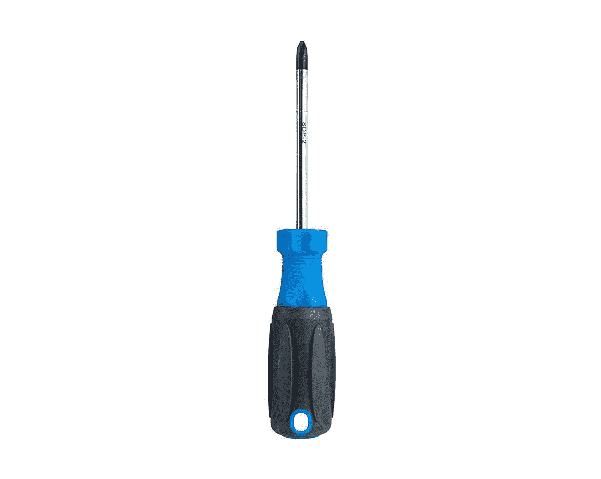

# 如何升级 ThinkPad X1 Carbon 的内存和存储

> 原文：<https://www.xda-developers.com/upgrade-ram-storage-thinkpad-x1-carbon/>

新款[联想 Thinkpad X1 Carbon](https://www.xda-developers.com/lenovo-thinkpad-x1-carbon-review/) 配备了一系列可靠的硬件功能，使其成为一款功能强大的商务笔记本。它采用最新的英特尔第 11 代 Tiger Lake CPU 选项，最高可配酷睿 i7-1185G7，以及 32GB 内存和 1TB PCIe 固态硬盘。

通常，这种尺寸的笔记本允许升级 RAM 和存储。然而，在 Thinkpad X1 Carbon Gen 9 的情况下，你只能升级 SSD，因为内存是焊接在主板上的。这款笔记本配备了标准的 M.2 固态硬盘，这意味着它应该不会那么难更换。

一个警告的话，虽然，**不要试图更换固态硬盘，如果你从来没有这样做过。**事实上，最好从训练有素的专业人员那里获得升级，因为你最终可能会使你的保修失效。

## 先决条件

*   至少 16GB 的 USB 驱动器。
*   外置 USB 硬盘(可选)。
*   一个 M.2 2280 的 SSD。
*   一种撬开工具。
*   十字螺丝刀。
*   联想 ThinkPad X1 碳素。

 <picture></picture> 

Jonard Tools SDP-2 Screwdriver

##### Jonard 工具 SDP-2 螺丝刀

 <picture></picture> 

Stick Spudger Opening Pry Tool Kit

##### 斗杆销座开口撬工具套件

 <picture></picture> 

Samsung 980 Pro 2TB

## 准备您的联想 ThinkPad X1 Carbon

在您更换 M.2 SSD 之前，备份您的系统并创建恢复介质非常重要。

1.  如果您的笔记本电脑上有重要数据，请将其移动到您首选的云存储中，如 OneDrive，或者只使用外部存储设备，如 USB 硬盘。
2.  接下来，我们需要准备 u 盘。虽然 16GB 的容量应该不错，但这完全取决于恢复映像的大小。
3.  将 USB 驱动器插入计算机。
4.  在搜索框中键入“Recovery ”,按 enter 键，然后单击*创建恢复驱动器*选项。
5.  单击用户帐户控制窗口中的*是*，允许恢复媒体创建程序启动，并按照屏幕上的说明创建一个恢复 USB 驱动器。

如果您想要完全擦除现有固态硬盘上的所有数据，请阅读以下步骤，否则请跳到如何打开 [ThinkPad X1 Carbon](https://www.xda-developers.com/lenovo-thinkpad-x1-carbon-review/) 底部机箱的部分。

1.  导航至设置->更新和安全->恢复->入门。
2.  头移除一切->本地重装。
3.  接下来，它应该允许您更改需要启用选项来清洗驱动器的设置。
4.  单击“确认”重置并删除 SSD 中的所有数据。

## 打开联想 ThinkPad X1 Carbon

联想没有添加任何复杂的螺钉或程序来打开 ThinkPad X1 Carbon。你只需要一把标准的十字螺丝刀。

1.  关闭笔记本电脑，并断开所有连接的电缆，包括交流电源。
2.  继续打开固定底盖的五颗螺丝。
3.  将它们全部卸下后，使用开口或撬动工具将机箱从内部夹子中撬出。不要使用任何过度的力量。

## 更换联想 ThinkPad X1 Carbon 上的 M.2 固态硬盘

1.  SSD 位于冷却风扇和电池之间，隐藏在用两颗螺钉固定的外壳下。
2.  卸下螺钉和盘柜，以便接触到 SSD。
3.  它应该从底部弹出。轻轻滑出。
4.  取出新的 M.2 SSD，将其滑回插槽，标签朝上。
5.  重新安装存储模块，并用您卸下的两颗螺钉将其固定。
6.  将笔记本电脑的底盖扣上，并将所有五颗螺丝拧紧。

## 重新安装 Windows 10

恭喜你，你已经成功升级了你的固态硬盘。现在你需要做的就是重新安装 Windows。

1.  连接用于创建系统恢复的 USB 驱动器。
2.  将交流充电器插入笔记本电脑，然后按下电源按钮。
3.  看到 ThinkPad 徽标后，重复按 F12 进入启动菜单。
4.  选择恢复 USB 驱动器作为引导设备，然后按“enter”键。
5.  接下来，按照屏幕上的说明完成该过程并安装 Windows 10。

你们都完了！享受全新固态硬盘带来的全新 Windows 笔记本电脑。

你正在寻找一台新的笔记本电脑吗？那么请务必查看我们的 2021 年最佳笔记本电脑清单[。如果您关心安全性，我们也有一份带有 Windows Hello](https://www.xda-developers.com/best-laptops/) 安全登录的[笔记本电脑列表。](https://www.xda-developers.com/best-laptops-with-windows-hello/)

 <picture></picture> 

Lenovo ThinkPad X1 Carbon Gen 9

##### 联想 ThinkPad X1 Carbon Gen 9

联想 ThinkPad X1 Carbon 是一款搭载最新英特尔第 11 代处理器的坚固商务机。