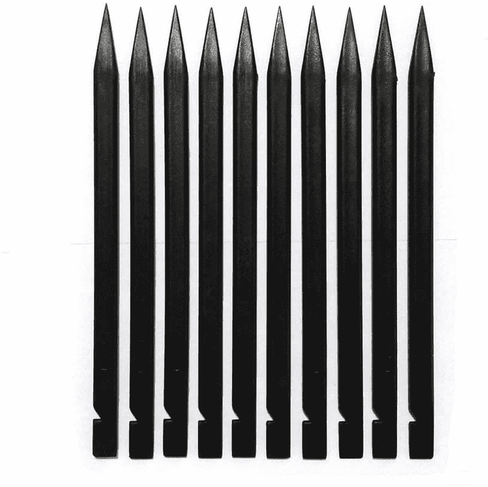
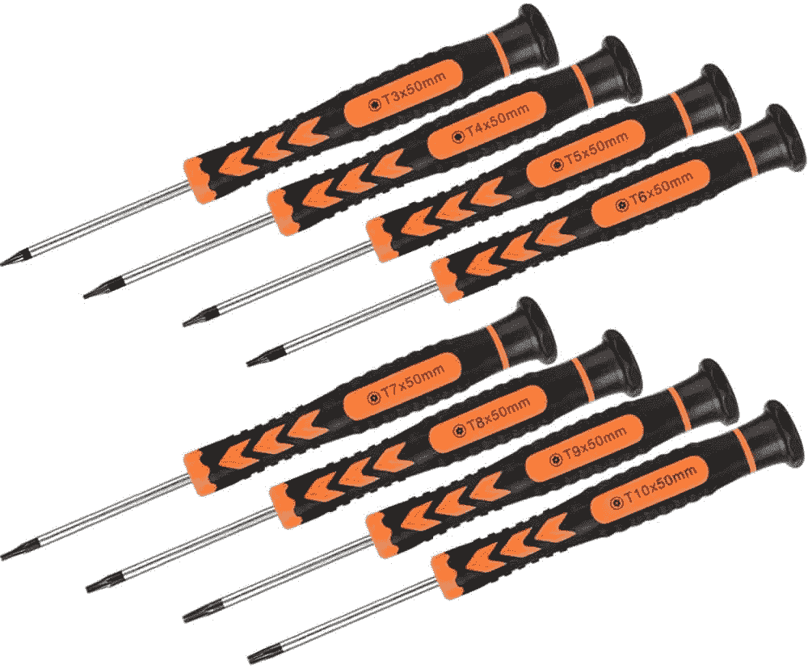

# 如何升级 Surface Laptop 5 中的存储

> 原文：<https://www.xda-developers.com/upgrade-storage-surface-laptop-5/>

如果你的 Surface 笔记本电脑需要更多的存储空间，好消息是你可以更换内部的固态硬盘。这样做的过程其实和 [Surface Laptop 4](https://www.xda-developers.com/how-to-change-ssd-surface-laptop-4/) 上的差不多。然而，这样做需要很多工具和耐心，并不像你对其他[优秀笔记本电脑](https://www.xda-developers.com/best-laptops/)的期望那么简单。

首先，在采取适当的安全预防措施的同时，您必须移除键盘面板和设备下的支脚。最大的原因是这样做在技术上并不是微软所推荐的。虽然您可以自己更换 SSD，并且微软认为该部件是一个可维修的组件，但像橡胶脚这样的更换部件可能很难找到。微软[将](https://learn.microsoft.com/en-us/surface/surface-laptop-5-overview)这些列为客户可更换单元，只能通过 Surface 商业授权设备经销商购买。

该公司还提到，自己动手修理可能会有人身伤害的风险，并提醒你，你对表面造成的任何损坏都不在保修范围内。最好通过授权维修店更换存储。但是如果你愿意承担风险，以下是你可以独立完成的方法。

## 你需要什么

如果你想升级 Surface Laptop 5 的存储，你需要几样东西:

*   **M.2 2230 SSD:** 这是 Surface Laptop 5 配合使用的 SSD 类型。但是，一定要确保你购买的是 M.2 2230，而不是 M.2 2280 SSD，那样会太大。你需要一个更小尺寸的 SSD，下面我们有一个建议。
*   **T5 梅花螺丝刀:**该螺丝刀将 SSD 从其外壳中释放出来。购买套件是一个好主意，因为它带有不同大小的提示，您可以与您的其他设备一起使用。
*   **容量至少为 16GB 的 USB 驱动器:**作为此过程的一部分，您将为重新安装 Windows 创建一个恢复驱动器，这涉及到从微软网站下载 Windows 11 和 Surface Laptop 5 驱动程序。请确保将其格式化为 FAT32，否则 Windows 会自动为您格式化。
*   **撬工具:**我们建议您使用一种工具来撬起 Surface Laptop 5 的支脚，这样您就可以接触到螺丝来拆卸底座。
*   **防静电手环:Y** 使用这款手环，您可能需要正确接地，以避免静电损坏您的系统。
*   **替换橡胶支脚(可选):**如果你最终损坏了 Surface Laptop 5 的支脚，你需要一套替换的。微软不直接向消费者出售这些，但亚马逊上有许多第三方选项。

*   ##### 三星 1TB M.2 2230 SSD for Surface

    这是一款 m . 2 2230 SSD，存储容量为 1TB，可与 Surface Laptop 5 配合使用。

*   <picture></picture>

    三星 DUO 加闪存盘

    ##### 三星 DUO 加 USB Type-C 盘

    这个 u 盘可以用来为你的 Surface Laptop 5 创建 Windows 恢复镜像。

    T34
*   ##### iFixit 防静电腕带

    维修时，使用此防静电腕带保护您和您的电子设备。

*   <picture></picture>

    粘桩器开口撬工具箱

    ##### 粘桩器开口撬工具箱

    有了这个工具，你就可以撬起并取下 Surface 笔记本电脑 5 底部的支脚来升级固态硬盘。

    T34
*   <picture></picture>

    梅花螺丝刀套装

    ##### Tekprem 梅花螺丝刀套装

    这款螺丝刀套装有你需要拆下笔记本电脑 5 底部螺丝的大小螺丝刀。

*   ##### 8 个笔记本电脑橡胶脚垫

    如果你损坏了 Surface 笔记本电脑 5 上的脚垫，这些都是不错的替代品。这不是官方的脚，但它们仍然会像微软的原装产品一样好用。

    T34

## 步骤 1:备份您的数据

要开始更换过程，你需要准备好你的 Surface Laptop 5。最重要的是备份你所有的数据。我们建议使用 OneDrive 等服务，或者使用外置 SSD 或硬盘等离线解决方案。你将安装一个新的固态硬盘和一个干净的 Windows 版本。当该过程完成后，您可以将这些文件复制并恢复到 Surface Laptop 5 中。

如果您正在寻找外部存储进行备份，三星 T5 便携式固态硬盘是一个很好的选择。

##### 三星 T5 便携式固态硬盘

这款三星 SSD 可以用来备份你的 Surface Laptop 5。它可以通过 USB-C 或 USB-A 连接。这两条电缆都包含在包装盒中。

在下一步中，您将为 Surface Laptop 5 创建一个恢复驱动器。你可以在装上新的固态硬盘后用它来启动 Windows 11。下面是要做的事情。

1.  访问 [S **表面恢复页面**T3。](https://support.microsoft.com/en-us/surface-recovery-image)
2.  向下滚动到**选择你的 Surface，**选择 **Surface Laptop 5，**输入你的序列号。
3.  点击**继续。**
4.  单击列表中您的设备旁边列出的**下载图像** 链接。
5.  等待它下载。下载的文件将是一个. ZIP 文件。
6.  将您正在使用的 USB 驱动器插入 Surface Laptop 5 的 **USB 端口**。
7.  在任务栏的搜索框中，键入***恢复驱动器****，然后从结果中选择**创建恢复驱动器**或**恢复驱动器** 。*
**   点击**是**，然后从列表中选择您的 USB 驱动器。*   然后点击**创建**。按照屏幕上的指示，然后点击**完成。***   找到刚刚下载的文件，双击**。您先前下载的 ZIP 文件**可以打开它。*   点击键盘上的 **CTRL+A** ，选择恢复镜像文件夹中的所有文件。然后，点击 **CTRL + C** 进行复制。*   打开新的文件资源管理器窗口。进入侧边栏的**这台电脑** ，双击你正在使用的 USB 驱动器的图标。*   点击 **CTRL+V** 将文件粘贴到您创建的 USB 恢复驱动器中。*   出现提示时，选择**选择要替换文件的目标位置。***   等待文件被复制过来。*

 *一旦你完成了这些步骤，你应该有一个全新的 Windows 11 副本来重新安装到你的 Surface 上，以及 Surface Laptop 5 的正确驱动程序。

## 第三步:移除 Surface Laptop 5 中的固态硬盘

备份和恢复驱动器准备就绪，现在可以更换 Surface Laptop 5 上的 SSD 了。这是一个非常复杂的过程。下面是要做的事情。

1.  把你的 Surface 笔记本电脑翻过来。
2.  寻找角落里的四只橡胶脚。
3.  **拆下橡胶脚**。这最好用开口工具来完成。
    *   支脚被粘在适当的位置，并有固定它们的尖头，所以小心不要用工具损坏支脚。试着在脚下滑动工具。
    *   有两只不同的脚。前脚有三个塑料尖头，后脚没有尖头。后脚也更深，所以要小心注意哪只脚往哪走。

4.  在脚自由的情况下，**用 Torx 5 螺丝刀拆下四个 Torx 螺钉**。保管好螺丝，最好将它们放在一个单独的表面上，这样你就能记住以后如何将它们放回原处。
5.  将 **Surface Laptop 5** 翻转过来，像平常一样打开。
6.  从前到后，滑动开口工具(或你的指甲)到**，从底座上取下键盘座**。甲板是磁性附着的。
7.  戴上您的**防静电腕带**并将其连接到笔记本电脑机箱的一侧，以便您自己接地。
8.  **拆下连接键盘和底座的带子**。我们建议拍张照，这样你就知道是怎么摆放的了。
9.  使用 Torx 5 螺丝刀，**拧下 SSD** 前面的螺钉。
10.  将 SSD 从插槽中滑出。

以上就是移除 Surface Laptop 5 上原有 SSD 的步骤。如果您需要发送您的设备进行保修索赔，我们不建议删除并妥善保管它。

## 步骤 4:安装新的固态硬盘

在这一步中，您将安装新的 SSD 来代替旧的 SSD。

1.  从盒子中取出**新固态硬盘**。
2.  将它插入原来的插槽中。确保针脚对齐。
3.  用**梅花螺钉**拧紧 SSD，将其固定到位。
4.  重新连接键盘的**带状电缆**。它应该卡到位。
5.  将键盘放回底部底座。它会磁性锁定到位。
6.  从手上取下**防静电腕带**。
7.  关闭笔记本电脑，然后像开始一样将 Surface Laptop 5 翻过来。
8.  **将梅花螺钉**拧回原位，注意它们取出时的原始位置和方向。
9.  将橡胶支脚卡入孔中。确保带脚爪的脚被正确插回。如果你的橡胶脚垫坏了，试试我们建议的替换脚垫。如果不行，你也可以试着把原来的脚粘回去。

## 第五步:重新安装 Windows 11

在这最后一步，你将重新安装 Windows 11。以下是必需的步骤:

1.  给你的 Surface Laptop 5 接上电源。
2.  将您之前创建的 **USB 驱动器**插入您的 Surface。
3.  按住表面上的**音量调低按钮**。同时，按下并松开**电源按钮**。
4.  Microsoft 徽标将会出现。一直按住**音量调低按钮**，当看到一个旋转的轮子时，松开按钮。
5.  选择语言和布局。
6.  选择**故障排除。**
7.  选择**从驱动器中恢复。**
8.  选择您的**恢复驱动器**，并按照屏幕上的步骤重新安装 Windows。

现在你知道了！你现在应该有一个全新的 Windows 11 安装。请随意从云端或外部固态硬盘恢复您的文件。现在，市场上最好的 Surface 电脑之一[将为您提供更多存储空间，满足您的一切需求。](https://www.xda-developers.com/best-microsoft-surface-pcs/)

##### 微软 Surface Laptop 5

Surface Laptop 5 是微软最新推出的 Surface。它拥有第 12 代英特尔 CPU，有花哨的新颜色，并有 13 和 15 英寸型号可供选择。*