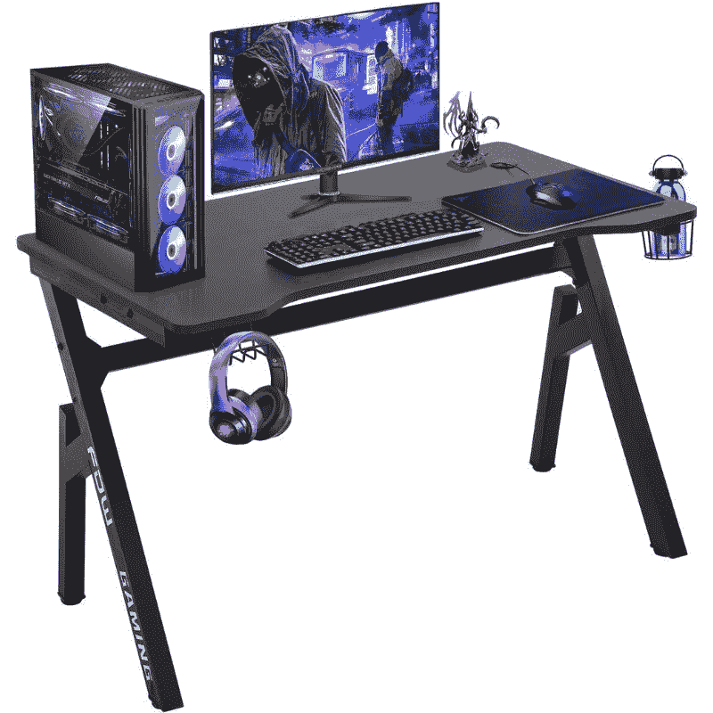
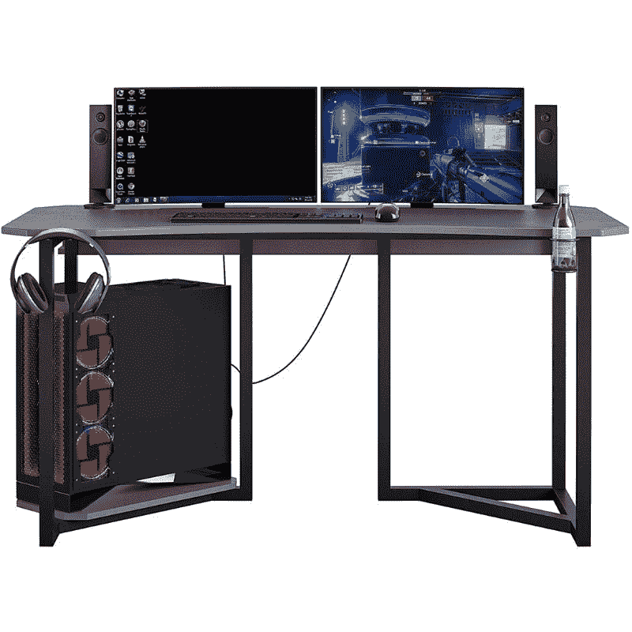

# 使用这些游戏桌升级您的网络星期一设置

> 原文：<https://www.xda-developers.com/upgrade-your-setup-this-cyber-monday-with-these-gaming-desks/>

# 使用这些游戏桌升级您的网络星期一设置

如果你想在市场上买一个新的游戏桌，那么你应该在亚马逊上看看这些惊人的网络星期一交易。

用闪亮的新桌子升级你的家庭办公室或游戏室从来都不是一个坏时机。如果你在游戏桌上找不到任何好的[黑色星期五交易](https://www.xda-developers.com/black-friday/)，那么我们有适合你的东西。我们设法在亚马逊上为那些想买新游戏桌的人找到了两个最好的网络星期一交易。

首先，我们有一个来自亚马逊 FDW 商店的惊人的游戏桌。售价仅为 60 美元，这是我们在亚马逊上能找到的最实惠的游戏桌之一，整体评价非常好。这是一款外观简单的游戏桌，附带一些方便的附件，让您的生活更加轻松。这款外观现代的电脑桌宽 47.2 英寸，深 23.6 英寸，这意味着它有足够的空间来放置电脑机箱和大尺寸显示器。

 <picture></picture> 

FDW Store gaming desk

##### FDW 商店游戏桌

这款外观简单的游戏桌可以为您的游戏室增添一份整洁。它的顶部有一层碳纤维涂层，还有一个杯架和一个耳机挂钩。

这张桌子最好的一点是它的顶面有一层碳纤维涂层。它不仅看起来很酷，而且非常容易清洗。我们也喜欢在表面上增加孔，以便电线穿过。底部还有一个线缆管理盒，以及一个耳机挂钩和一个方便的杯架。

 <picture></picture> 

NTENSE Quest gaming desk

##### NTENSE Quest 游戏桌

NTENSE Quest 是一款高品质的游戏桌，可以为您的游戏室增添一道亮丽的风景线。它的底部还有一个搁板，可以放置电脑机箱。

如果你不介意增加你的预算，那么你也可以去看看 NTENSE Quest 游戏桌。这张桌子今天从平常的 250 美元降到了 162 美元。NTENSE Quest 游戏桌的尺寸约为 60 英寸，比我们上面提到的那款更宽。书桌底部还有一个搁板，用来放置电脑机箱。还包括一个杯架和一个电缆管理架，让您可以更轻松地布置所有电脑电缆。

我们建议您看看我们收集的[最佳电脑和游戏交易](https://www.xda-developers.com/best-black-friday-pc-gaming-deals/)页面，找到更多优惠。许多黑色星期五的交易仍然有效，包括这个 [Razer Iskur 游戏椅](https://www.xda-developers.com/razer-iskur-ergonomic-gaming-chair-deal-black-friday/)。