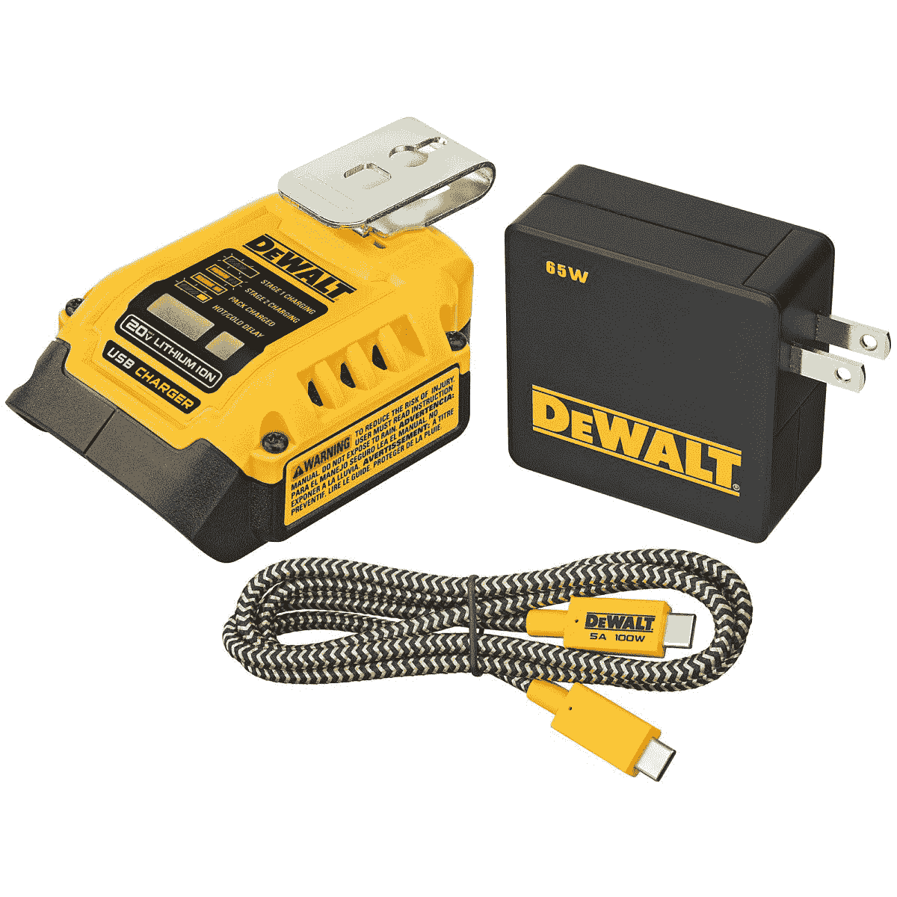

# 多亏了 DeWalt 和 Ryobi，USB Type-C 终于出现在电动工具中

> 原文：<https://www.xda-developers.com/usb-type-c-power-tools/>

# USB Type-C 最终出现在电动工具中，实现了它作为一个真正的端口的使命

DeWalt 和 Ryobi 都宣布了由 USB Type-C 供电的可拆卸电池。

[USB Type-C](https://www.xda-developers.com/usb-standards-explained/) 旨在成为几乎所有数据和充电需求的通用连接器，随着不断发展的 [USB 供电标准](https://www.xda-developers.com/best-usb-pd-fast-charger/)和[更高质量的电缆](https://www.xda-developers.com/best-usb-cables/)，它正在慢慢取代无数类型的专有充电器。现在，每个人最喜欢的端口正在转向电动工具，因为两家公司已经宣布了电池和工具的连接器。

无线电动工具已经存在多年，许多公司在其产品中使用共享的电池大小/标准，但大多数都需要您在一个特殊的坞站中为电池组充电。 [Ryobi 宣布了一个新的“USB Lithium”系列工具](https://toolguyd.com/ryobi-usb-lithium-cordless-power-tools/)(通过*[The Verge](https://www.theverge.com/2022/1/27/22905482/dewalt-ryobi-milwaukee-usb-c-power-tool-batteries)*)，都使用相同的 2.0Ah 可移动电池，带有 USB Type-C 端口进行充电。这意味着你不需要定制坞站来给电池充电——如果你迫切需要削减一些 2x4 的，而你所拥有的只是一个 MacBook Pro 充电器，那(可能)会起作用。

另一家受欢迎的电动工具制造商 DeWalt 也加入了 USB Type-C 的行列。DeWalt 和 Ryobi 都在生产适配器，允许他们现有的较大电池用 USB Type-C 充电，以及所需的墙壁适配器。 [DeWalt 的墙壁适配器](https://www.dewalt.com/products/accessories/miscellaneous-accessories/mobile-accessories/usb-charging-kit/dcb094k)有一个双向 USB Type-C 端口，支持高达 100W 的功率，因此除了给电动工具电池充电，它还可以将这些电池变成 USB 设备的电源。它还有一个额外的 USB Type-A 连接器，用于为其他设备充电，类似于 [Anker PowerPort PD 2](https://www.amazon.com/Charger-Anker-Adapter-PowerPort-Foldable/dp/B08M5C86NL?tag=xda-6viehiv-20&ascsubtag=UUxdaUeUpU499&asc_refurl=https%3A%2F%2Fwww.xda-developers.com%2Fusb-type-c-power-tools%2F&asc_campaign=Short-Term) 。

很高兴看到更多类型的设备转向通用标准，如 USB Type-C。尽管连接器和 USB-PD 充电标准并不完美，但只适用于少数产品的专有充电器往往更快地被扔进垃圾填埋场，导致全球范围内的气候变化。

 <picture></picture> 

DeWalt USB Charging Kit

##### DeWalt USB 充电套件

这可以通过 USB Type-C 为 DeWalt 的 20V 和 FlexVolt 电池充电，也可以将这些电池用作其他 USB 设备的电源。