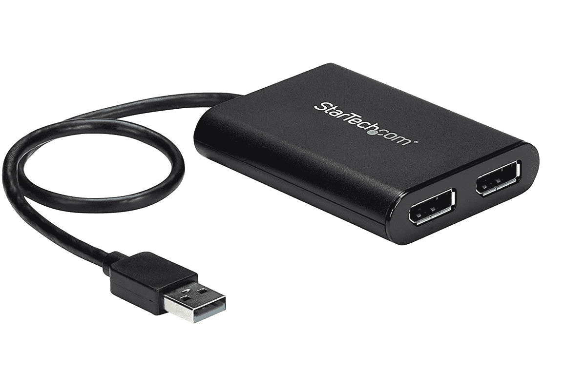

# 我可以在新的 24 英寸 M1 iMac 上使用外接显示器吗？

> 原文：<https://www.xda-developers.com/use-external-monitor-with-m1-imac/>

苹果的新款 iMac 已经上市，拥有漂亮的颜色和 M1 处理器。我们称 M1 的 MacBook Air 为苹果用户最实惠的笔记本电脑，iMac 应该为台式机用户提供这样的质量。但是在你订购之前，你需要知道你是否还能使用你可爱的多显示器系统。答案是取决于你想用多少台显示器。

配备 M1 **的 24 英寸 iMac 支持一个最高 **6K 分辨率**和 **60Hz 刷新率**的外部显示器**(巧合的是，这一规格与[苹果 Pro 显示器 XDR](https://shop-links.co/1739513139880343621?u1=26ceb19e-0e5d-45be-8277-344d792eb9d2) 完全匹配)。这是否意味着 ***而不是*** 你可以使用多个低分辨率的屏幕。如果您试图使用一个以上的外部屏幕，它将开始镜像显示。尝试将显示器连接到不同的端口也不会成功。

这是所有 M1 MAC 电脑的一个局限。苹果自己的[文档](https://support.apple.com/en-us/HT202351)说你也不能通过使用 dock 来增加支持的显示器数量。唯一的例外是 Mac mini，它可以让你在 USB 4 端口上连接一个显示器，在 HDMI 端口上连接一个显示器。24 英寸 iMac 没有 HDMI 端口。

值得注意的是，虽然 MacBook Air 是雷电 3 的最佳笔记本电脑之一，但它实际上并没有兑现 Thunderbolt 的承诺。雷电 3 应该在一个端口上支持双 4K 显示器。

相比之下，英特尔驱动的 27 英寸 iMac 有一系列外部显示器选项。您可以在一个 Thunderbolt 端口上连接双 4K 显示器或一个 6K 显示器。如果你有一台 AMD 镭龙 Pro 5700 或镭龙 Pro 5700 XT，你可以连接双 6K 显示器。

简短的回答是，只要你在寻找双显示器设置，你就可以选择 24 英寸的 M1 iMac。当然，这两种显示器中的一种将是 iMac 本身。如果你需要三个或更多的屏幕，你必须使用另一种解决方案。例如， [DisplayLink 的图形连接驱动](https://www.displaylink.com/downloads/macos)承诺解决问题。您还需要一个适配器，一旦我们有了设备，我们将对此进行测试。

如果你想要更高刷新率但分辨率更低的显示器，我们仍在探索哪些组合是可能的——显然，苹果也没有明确的答案。

 <picture></picture> 

24-inch iMac with 4.5K display

##### 苹果 iMac (2021 年)

苹果的新一体机有 4.5K 显示屏，M1 芯片组，并且有漂亮的颜色

 <picture></picture> 

StarTech.com USB 3.0 to Dual DisplayPort Adapter

##### StarTech.com USB 3.0 转双显示端口适配器