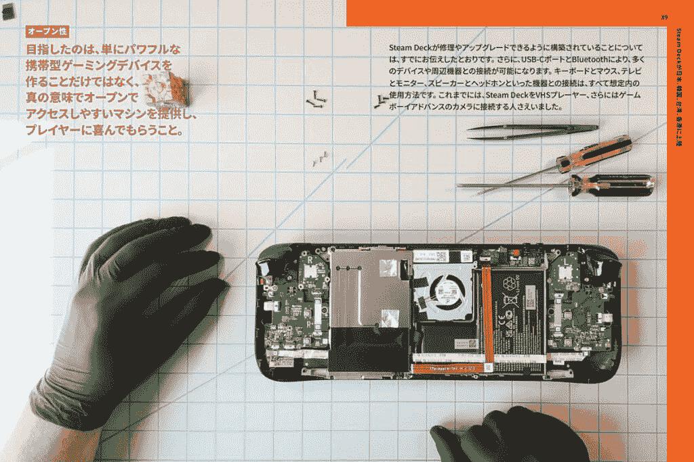

# Valve 的小册子讲述了公司的历史和 Steam Deck 的未来

> 原文：<https://www.xda-developers.com/valve-steam-deck-booklet-released/>

本月初，Valve 宣布将为亚洲用户开放预订。该公司宣布将与 Komodo 合作，后者将成为该地区的授权经销商。为了庆祝即将发布的控制台，Valve 制作了一本小册子，以便人们可以更好地了解公司及其产品，当然还有 Steam Deck。这本 50 页的小册子现已推出，可以下载英文、日文、韩文和繁体中文版本。

这本书提供了关于 Valve 及其哲学的见解，并分享了它如何创造其产品和硬件。本文还详细介绍了 Steam，这是大约 20 年前推出的一个非常成功的在线市场。最重要的是，这本书还谈到了蒸汽甲板以及它是如何和为什么被设计的，以及它与科莫多的合作关系。此外，这本书充满了许多美丽的图像，展示了控制台的构建质量，它的各种原型，等等。

 <picture></picture> 

The booklet is also available in Japanese, Korean, and Traditional Chinese.

也许这本小册子中包含的最好的金块之一是当 Valve 讨论蒸汽甲板的未来时。该公司表示，该控制台只是一个开始，该公司将“跟进这一产品，对硬件和软件进行改进和迭代，将新版本的 Steam Deck 推向市场。”当然，这是一个非常小的收获，但是知道未来的产品正在研发中仍然是令人兴奋的。同样值得高兴的是，由于这款游戏机是由 Steam 驱动的，你目前所有的游戏都可以在未来的硬件版本上使用。

Valve 将亮相 2022 年东京游戏展。东京游戏展在九月中旬举行，这是日本最大的游戏展之一，有超过 200，000 人参加。如果你碰巧路过 Valve 的展位，它将为蒸汽甲板提供动手操作部分。您还可以拿到 Steam Deck 小册子的纸质副本。蒸汽甲板销售将于年底在亚洲开始。其他地区的订单[应该会在年底](https://www.xda-developers.com/steam-deck-updates-reservation-system/)完成。如果你有兴趣查看 Steam Deck 小册子的全文，你可以从下面的链接下载。

* * *

来源:[阀门蒸汽商店](https://store.steampowered.com/news/app/1675200/view/3401926123919972634)