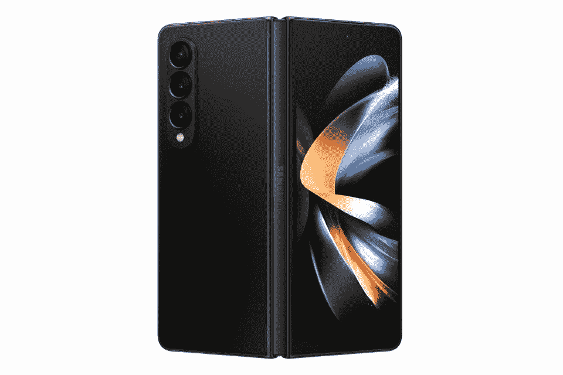

# 威瑞森正在为三星最新的可折叠产品提供一些优惠

> 原文：<https://www.xda-developers.com/verizon-deals-samsung-galaxy-z-fold-5-galaxy-z-flip-4/>

在今天的 Galaxy Unpacked 活动上，三星终于推出了其最新的可折叠产品——Galaxy Z Fold 4 和 T2 Galaxy Z Flip 4。除了新手机，该公司还宣布了全新的 [Galaxy Watch 5](https://www.xda-developers.com/samsung-galaxy-watch-5-launch/) 、 [Galaxy Watch 5 Pro](https://www.xda-developers.com/samsung-galaxy-watch-5-pro-launch/) 和 [Galaxy Buds 2 Pro](https://www.xda-developers.com/samsung-galaxy-buds-2-pro-launch/) 。从今天开始，所有这些设备都可以在美国购买。但如果你是威瑞森的用户，你可能不想通过三星的网站订购设备，而更喜欢直接从威瑞森订购。这是因为运营商正在为所有新产品提供一些惊人的交易，包括有吸引力的以旧换新优惠、折扣等。

## 威瑞森交易三星 Galaxy Z Fold 4

威瑞森的用户可以通过 36 个月的分期付款获得一台崭新的 Galaxy Z Fold 4，年利率为 0%，仅需 49.99 美元。对于那些不想预先支付 1799 美元要价的人来说，这是一个完美的选择。如果你有一部旧手机，你可以在合格的 5G 无限制计划中额外获得 800 美元的折扣。

 <picture></picture> 

Samsung Galaxy Z Fold 4

威瑞森为三星最新旗舰产品 foldable 提供一些独家优惠和分期付款选项，使购买更容易消化。

这种折价积分将在 36 个月内每月应用于您的账单，使购买更容易消化。在有限的时间内，威瑞森还将免费为您升级到更高的存储版本。此外，如果你从另一家运营商换机，威瑞森会在你注册后给你 200 美元的电子贺卡。喜欢这个声音吗？您应该通过点击上面提供的链接来订购 Galaxy Z Fold 4。

## 威瑞森交易三星 Galaxy Z Flip 4

威瑞森也为 Galaxy Z Flip 4 提供类似的分期付款选项，这有助于你在 36 个月内每月支付 27.77 美元，年利率为 0%。此外，该运营商还为合格的 5G 无限制计划提供额外 800 美元的合格以旧换新优惠。

 <picture></picture> 

Samsung Galaxy Z Flip 4

如果你通过威瑞森购买，全新的 Galaxy Z Flip 4 每月只需 27.77 美元。点击下面的链接订购您的产品。

您可以通过上面的链接订购 Galaxy Z Flip 4。在有限的时间内，威瑞森还将免费为您升级到更高的存储版本。如果你从一个不同的运营商转换，运营商将增加 200 美元的电子贺卡，进一步增加交易的甜头！

如果你想购买 Galaxy Watch 5 或 Galaxy Watch 5 Pro，威瑞森会让你的钱包轻松起来，普通型号的分期付款计划最低为每月 9.16 美元，年利率为 0%，Pro 版本的分期付款计划最低为每月 13.88 美元。

除了上述所有优惠，威瑞森还将在限定时间内为您提供部分三星手机壳 50%的折扣和部分三星充电器 25%的折扣。此外，购买 Galaxy Z Fold 4 或 Galaxy S22 系列设备可以节省 75 美元购买一副新的 Galaxy Buds 2 Pro。

您是否在考虑购买一款新的三星折叠式手机？你会得到哪一个？请在下面的评论区告诉我们。