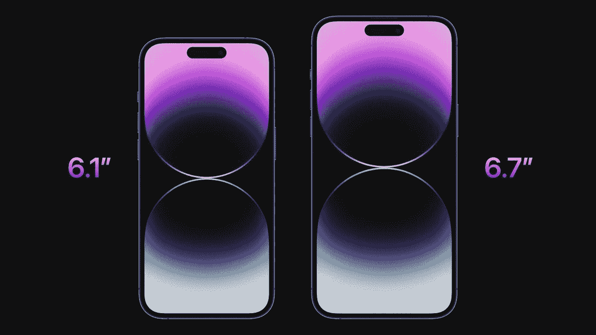

# 威瑞森推出新计划，iPhone 一个无限

> 原文：<https://www.xda-developers.com/verizon-debuts-new-plan-one-unlimited-for-iphone/>

苹果举办了一场别开生面的活动，发布了新款 iPhone、 [Apple Watch](https://www.xda-developers.com/apple-watch-series-8/) 和 [AirPods Pro](https://www.xda-developers.com/apple-airpods-pro-2) 。正如预期的那样，无线运营商现在正在为即将发布的 iPhone 提供优惠和促销。今天，威瑞森宣布了其“iPhone 无限通”的新计划，该计划将包括无限通话、短信和数据，但也将捆绑 Apple Music、Apple TV+、Apple Arcade 和 iCloud+。

该计划将从每月每条线路 50 美元开始，最多可开通四条线路。为了符合 50 美元的价格，用户需要使用自动转账和无纸化账单。威瑞森表示，该计划将提供每年 480 美元的价值。那些注册了 One Unlimited for iPhone 计划的用户将获得 Apple One 访问权限，单线帐户可以访问 Apple One 个人计划，双线或更多线帐户可以访问 Apple One 家庭计划，最多可与五名家庭成员共享。

如果你不熟悉的话，Apple One 计划是苹果提供的一项服务，它将六项服务捆绑到一项订阅中。作为 Apple One 的订阅者，用户将可以访问 Apple Music、Apple TV+、Apple Arcade、iCloud+、Apple News+和 Apple Fitness+。对任何人来说都有相当多的东西。也许这项服务最好的一点是，它捆绑了苹果最受欢迎的服务，并以较低的月费提供。如果您注册了个人或家庭计划，您将获得 Apple Music、Apple TV+、Apple Arcade 和 iCloud+的访问权限。个人计划每月花费 14.95 美元，而家庭计划每月花费 19.95 美元。这家无线运营商表示，该计划甚至可以用于 Android 手机。

 <picture></picture> 

Apple iPhone 14 Pro and iPhone 14 Pro Max

苹果的最新产品，威瑞森的最佳产品。

如果有兴趣，你可以点击下面的链接或者查看百思买的促销活动。两家零售商都将销售苹果的所有最新手机，包括 [iPhone 14 和 iPhone 14 Pro](https://www.xda-developers.com/apple-iphone-14-pro/) 。

* * *

**来源** : [威瑞森](https://www.anrdoezrs.net/links/100122946/type/dlg/sid/UUxdaUeUpU43414/https://www.verizon.com/plans/one-unlimited-for-iphone/)