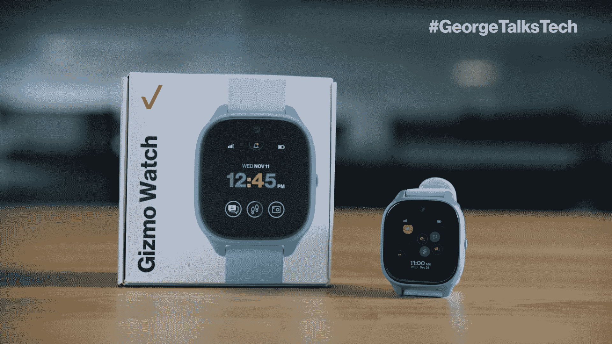

# 威瑞森推出了 Razer Edge 5G 和 Gizmo Watch 3，并有特别折扣

> 原文：<https://www.xda-developers.com/verizon-razer-edge-5g-gizmo-watch-3-release/>

在 CES 2023 的第一个正式日，威瑞森无线有很多东西要分享，提供了备受期待的 [Razer Edge 5G](https://www.xda-developers.com/the-razer-edge-5g-makes-its-official-debut-retail-release-slated-for-january/) 游戏手持设备的价格和发布日期，以及关于其儿童友好型 Gizmo Watch 3 的细节，以及它如何将优质有线网络 Starz 添加到其 [Plus Play 内容平台](https://www.xda-developers.com/verizon-plus-play-beta-launch-free-netflix/)中，该平台现在推出了 20 多种不同的流媒体服务。

## Razer Edge 5G

Razer Edge 5G 将于 1 月 26 日开始在威瑞森独家发售，零售价为 599.99 美元。那些注册了一系列服务的人将在手持游戏机上获得限时折扣，价格为 359.99 美元。如果你买一部 5G 智能手机，威瑞森甚至愿意加大优惠力度，将游戏机打折至 179.99 美元。当然，如果你只是想买一个不带 5G 的，你可以直接从 Razer 那里买一个。

## Gizmo 手表 3

## 

威瑞森还发布了第三代 Gizmo Watch 3，为其屡获殊荣的年轻人智能手表系列增添了新成员。Gizmo Watch 3 提供了轻松访问联系人、跟踪和监控功能、用于与可信联系人进行视频通话的前置摄像头、新的手表外观、游戏等。

最重要的是，它由高通的骁龙磨损 4100 SoC 提供动力和出色的电池寿命。这款手表将从今天开始发售，价格为 149.99 美元，附带一系列服务。威瑞森还将开展一项促销活动，如果你同时购买两块手表，第二块手表可以打折 100 美元。

## Starz 在威瑞森加玩

就在上个月，威瑞森推出了测试版的[新内容中心](https://www.xda-developers.com/verizon-plus-play-beta-launch-free-netflix/)，Plus Play 是一些最大的流媒体服务的所在地，让威瑞森客户可以在一个方便的位置轻松组织他们的流媒体生活。从今天开始，Starz 将可以在 Plus Play 上使用，这意味着您又多了一项流媒体服务。

虽然目前没有提供任何折扣，但威瑞森确实有计划让 Plus Play 用户在未来省钱。不幸的是，它还没有提供如何实现这一点。对于来自 CES 2023 的所有最新消息，请务必查看本周将推出的所有内容。

* * *

**来源**:威瑞森 [1](https://www.anrdoezrs.net/links/100122946/type/dlg/sid/UUxdaUeUpU1001551/https://www.verizon.com/about/news/verizon-razer-edge-5g-ultimate) 、 [2](https://www.anrdoezrs.net/links/100122946/type/dlg/sid/UUxdaUeUpU1001551/https://www.verizon.com/about/news/verizon-gizmo-watch-3) 、 [3](https://www.anrdoezrs.net/links/100122946/type/dlg/sid/UUxdaUeUpU1001551/https://www.verizon.com/about/news/starz-joins-verizons-play-platform)