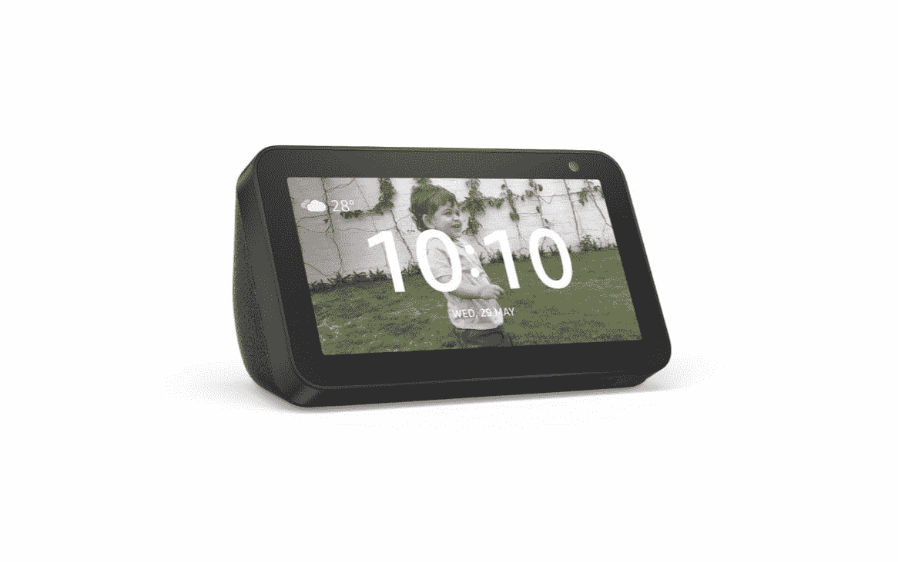

# 威瑞森黑色星期五交易提供超过 1300 美元的手机和免费 PS Plus

> 原文：<https://www.xda-developers.com/verizons-black-friday-deals/>

黑色星期五快乐！等等，那是下周？你可能骗过了我，因为许多零售商提前一周就开始了他们的大促销(有些甚至更早)。威瑞森就是其中一家零售商，如果你想换其他运营商，他们今年有很多非常好的交易。考虑到他们通常的促销数量，这并不令人震惊，但这些威瑞森黑色星期五的交易真的是在另一个层面上！

今年，如果你[换到威瑞森](https://www.anrdoezrs.net/links/100122946/type/dlg/sid/UUxdaUeUpU30717/https://www.verizon.com/smartphones/)，注册更多的 Play，做更多的事情或获得更多的无限制计划，并以旧手机折价，你将有资格获得一系列优惠，包括:

*   12 个月免费使用 PlayStation Plus 和 PlayStation Now
*   支持 5G 的手机最高可优惠 1350 美元
*   免费威瑞森流媒体电视

然而，有几件事需要记住。首先，你用新的 5G 手机获得的电量将取决于型号，所以当你决定时，请确保检查并查看你选择的智能手机将获得多少电量。接下来，PlayStation Plus 和 PlayStation Now 的 12 个月仅针对新的产品线，如果你从另一家运营商换来，这是有意义的。如果您只是升级您的手机，并且已经是威瑞森的客户，您可以获得 3 个月的两种服务。最后，威瑞森流电视只为新帐户工作-如果你因为这样或那样的原因在过去有它，你不能再免费得到这项服务。

明白了吗？然后去购物，也许我们的[最佳威瑞森手机](https://www.xda-developers.com/best-verizon-phones/)能帮你解决问题！

 <picture></picture> 

Verizon Black Friday Smartphone Deals

##### 苹果 iPhone 12

转到威瑞森？通过以旧换新节省大量手机费用，并免费获得 12 个月的 PlayStation Plus 和 PlayStation Now！

但是，这还不是全部。威瑞森的黑色星期五交易还包括一些转向该公司互联网服务 [Fios](https://www.anrdoezrs.net/links/100122946/type/dlg/sid/UUxdaUeUpU30717/https://www.verizon.com/home/fios-fastest-internet) 的激励措施。有 200 Mbps、400 Mbps 和 1GB 连接可供选择，您可以选择最适合您且位于您所在区域的 Fios 速度。如果你在 11 月 30 日之前注册，你还会得到很多额外的好处:

*   12 个月免费使用 PlayStation Plus 和 PlayStation Now
*   亚马逊 Echo Dot 和 Smart Plus(200 Mbps 注册)
*   亚马逊 Echo Show 5(400 Mbps 和 1GB 注册)
*   Amazon Ring Stick Up(带 1GB 注册)
*   威瑞森流媒体电视(带 1GB 注册)

确实很多，而且这些速度至少比我所在地区的大多数其他服务要好。查看您所在地区的可用性！

 <picture></picture> 

Amazon Echo Show 5

##### 威瑞森·FiOS

使用威瑞森 Fios 获得该国最快的互联网。你还将获得免费的亚马逊智能家居设备和免费的 12 个月 PlayStation Plus 和 PlayStation Now。