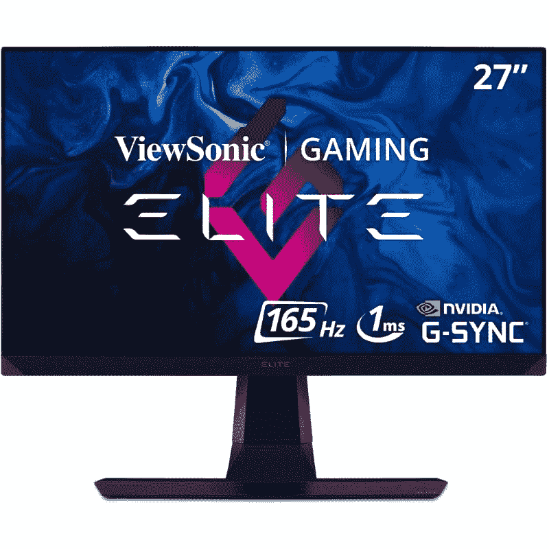

# 优派精英 XG270QG 评测:最好的 1440p 游戏显示器？

> 原文：<https://www.xda-developers.com/viewsonic-elite-xg270qg-monitor-review/>

优派 XG270QG 是那些希望为他们的游戏设置购买高质量 1440p 显示器的人的绝佳选择。它在 1440p 时支持 165Hz 的最大刷新率，具有出色的响应时间和极低的输入延迟。所有这些因素结合在一起，提供了一种反应灵敏、真正令人愉快的游戏体验。尽管 IPS 面板带来了一些限制，但在我们使用该设备的时间里，我们仍然度过了玩游戏和消费媒体内容的美好时光。G-Sync 支持使它有点贵，但它仍然有一个不到 500 美元的可口价格，特别是它带来的所有功能。

除了面板的图像质量，XG270QG 还有很多令人喜欢的地方。例如，整体构建质量令人印象深刻，我们认为它的 RGB 照明量恰到好处，使它在您的设置中显得突出而不令人讨厌。我们也欣赏一些体贴的附加功能，如灵活的鼠标绳和耳机挂钩，帮助您远离[杂乱的线缆](https://www.xda-developers.com/pc-cable-management-guide/)。这是一款优质的 1440p 显示器，尽管价格昂贵，但它为 1440p 游戏显示器领域的严肃买家提供了巨大的性价比。

 <picture></picture> 

Viewsonic XG270QG Monitor

##### 优派 XG270QG

对于那些希望购买高端 1440p 游戏显示器的人来说，优派 XG270QG 是目前最好的选择之一。

* * *

**浏览此评论:**

* * *

## 优派精英 XG270QG 评论:价格和可用性

*   优派 XG270QG 现已上市，售价 499 美元。

优派精英 XG270QG 已经有一段时间可以购买。然而，它最近在包括印度在内的一些地区开始销售。这是作为优派精英游戏显示器系列的一部分提供的众多选项之一，因此请务必查看包括超宽和 1080p 变体在内的选项。它们在规格和功能方面都略有不同，所以在做出购买决定之前，您可能也想看看这些显示器。在写这篇评论的时候，优派精英 XG270QG 已经可以在美国亚马逊上以 499 美元的价格买到了。在印度，你可以买到₹46,990 的这款显示器，把它放在其他高端显示器旁边。

* * *

## 优派精英 XG270QG 评论:规格

在我们开始审查优派 XG270QG 游戏显示器之前，先快速浏览一下规格，看看它能带来什么

| 

**规格**

 | 

**优派 XG270QG**

 |
| --- | --- |
| **面板类型** | IPS 技术 |
| **屏幕尺寸** | 27 英寸，16:9 英寸 |
| **支持的最大分辨率** | 2560x1440 |
| **最大刷新率** | 165 赫兹，G 同步 |
| **响应时间(GTG)** | 1 毫秒 |
| **静态对比度** | 1000:1 |
| **亮度** | 350 cd/m(典型值) |
| **视角** | 178 水平，178 垂直 |
| **蓝光滤镜** | 是 |
| **色域** | 

*   DCI-P3: 98%尺寸(典型)
*   NTSC: 94%大小(标准)
*   sRGB: 133%尺寸/ 100%覆盖率(典型)

 |
| **港口** | 

*   USB 3.2 类下游:3
*   USB 3.2 类型 B 上游:1
*   3.5 毫米音频输出:1
*   HDMI 1.4: 1
*   显示端口:1
*   电源输入:DC 插座(中间正极)

 |
| **重量** | 7.7 千克(不含支架时为 4.7 千克) |
| **尺寸** | 614 x 458.7~571.6 x 265 |
| **保修** | 因市场而异 |

* * *

## 设计和制造质量

*   优派 Elite XG270QG 的金属支架能很好地支撑显示器，给人留下深刻印象。
*   这款显示器还配备了一些附加功能，如两个灵活的鼠标挂钩和一个耳机挂钩。

优派所有新的精英游戏显示器看起来与我们过去见过的旧显示器有很大不同。该公司显然在设计部门投入了大量精力，以使他们脱颖而出。结果是一个全黑的游戏显示器，我们认为它具有合适的 RGB 照明量，可以为您的设置添加一点 RGB 色彩。虽然支架的底座是由金属制成的，但机身的其余部分——至少是外观——是由塑料制成的。不过，这并不一定是件坏事，因为这使他们能够减轻显示器的整体重量，从而使其易于操作、设置和调整。

Elite XG270QG 随附的显示器臂也有许多调节选项。显示器可以向左或向右旋转 45 度，倾斜角度在-5 到 20 度之间，也可以旋转 90 度进入纵向模式。如果您不喜欢显示器附带的支架和显示器支架，您也可以使用任何外部 VESA 支架或支架。在我们的审查过程中，我们在使用支架获得完美的游戏角度方面没有任何问题。

显示器背面的 VESA 支架上有一个六边形的 RGB 条环。这些灯可以编程显示不同颜色的静态或脉冲环。您可以通过显示器底部的 OSD 控件或从优派网站下载专用软件来更改它们。此外，显示屏底部还有两个可以独立控制的 RGB 条。底部的这些灯，以及后面的 RGB 环，构成了非常酷的欠辉光和背景照明效果。当然，RGB 照明对显示器来说并不陌生，但我们喜欢 Elite XG270QG 恰到好处的照明，为您的设置增添更多个性，而不是让它看起来粗糙。

底部的 RGB 条旁边是两个位于显示器底部的柔性鼠标条。虽然我不确定它们是否足以取代我的传统鼠标蹦极，但我对它的工作效果感到惊喜。这对于那些还没有单独的鼠标弹力器的人来说非常有用。由于 Elite XG270QG 的两侧都有一个这样的设备，所以即使是那些用左手使用鼠标的人也能轻松使用。值得注意的是，显示器左侧还有一个耳机挂钩，可以在不使用时悬挂耳机。这些都是我们希望在其他顶级显示器上实现的一些深思熟虑的附加功能。

* * *

## 优派精英 XG270QG 评论:端口

*   优派精英 XG270QG 的背后有一个很好的端口选择。
*   所有电缆也可以很容易地布线，以隐藏他们从平原的视线。

Elite XG270QG 游戏显示器背面的所有端口都朝下，便于布线。这款显示器配备了一个 HDMI 2.0 端口和一个 DisplayPort 1.4 端口作为主要连接。您还可以获得三个 USB 3.0 端口和一个 USB Type-B 上游端口。线缆可以很容易地穿过显示器臂上的孔，从而隐藏起来。还有一个塑料盖，用于隐藏后面的端口区域。

显示器的 2W 扬声器下方也有一个 Kensington 锁，也位于背面。虽然您可以完全忽略这些扬声器，因为还有一个耳机通道，但我们建议您至少尝试一次。他们不会取代一对专用的立体声扬声器，但我们认为这些扬声器足够响亮，输出清晰明了的音频。您可以在与其他人共享显示器观看电影时使用它们。

* * *

## 显示和性能

*   优派 XG270QG 采用 27 英寸高清平板显示器，带有防眩光涂层。
*   它支持高刷新率，并且由于 1 毫秒的响应时间，响应速度也非常快。
*   这款显示器提供了适合游戏、内容创作和媒体消费的显示效果。

优派 Elite XG270QG 配备 27 英寸 16:9 面板，分辨率为 2，560x1，440。这是一个 IPS 面板，采用了该公司所谓的“无边框”设计。显示屏周围的挡板确实非常薄，使其整体看起来非常现代。这也是一款高刷新率显示器，最大刷新率支持高达 165Hz。IPS 和这种反应灵敏的面板的结合使它成为游戏玩家的可靠选择。正如该公司所指出的，Elite XG270QG 覆盖了 100%的 sRGB 色彩空间。

它甚至覆盖了高达 88%的 Adobe RGB 空间，这基本上告诉你在处理内容创建任务时显示器将如何工作。最后，它还覆盖了高达 98%的 DCI-P3 色彩空间，这意味着它还应该为电影和电视节目提供令人愉快的内容消费体验。Elite XG270QG 不是市场上最亮的显示器，峰值亮度为 350 尼特，尽管考虑到您将在室内使用显示器玩游戏，我们怀疑这是否会是一个问题。

至于游戏，我们使用这款显示器玩了各种各样的游戏，包括对视觉要求很高的单人游戏，如《战神》,以及一些快节奏的多人游戏，如《Apex Legends》。正如我们前面提到的，IPS 和高刷新率的结合使它成为一款响应迅速、令人愉悦的游戏显示器。与 TN 面板不同，TN 面板速度快，反应灵敏，但在玩游戏时有时看起来模糊不清，Elite XG270QG 轻松应对了所有游戏。对于快节奏的多人游戏，显示器的整体性能令人印象深刻，整体视觉质量也是如此。更不用说，它还支持 G-SYNC 可变刷新率(VRR)技术，以减少屏幕撕裂。然而，这只能通过 DisplayPort 连接来实现，所以请记住这一点。

如果你有足够的硬件来以 1440 便士的价格销售所有游戏，你将会享受到一次绝对的享受。像《战神》、《埃尔登环》和《微软飞行模拟器》这样的游戏在最高分辨率下运行时看起来令人惊叹。锐利的视觉效果也让我们清楚地看到了像 Valorant 和 Apex Legends 这样的多人游戏中的一切。监视器 1 毫秒的响应时间也将为许多人敲定这笔交易。无论是动作密集的多人游戏还是像《红色死亡救赎 2》这样的视觉杰作，Elite XG270QG 都将通过其超级响应和颜色准确的面板确保您按照预期的方式玩游戏。

值得指出的是，我们注意到一些光线流失，特别是在漆黑的环境中的一些视觉效果。你也不会得到最好的静态对比度与此面板或更深的黑色。你可能会注意到一个明显的质量差异，如果你来自，比如说，VA 小组。然而，许多其他的优点超过了这些缺点。更不用说，这些都是 IPS 的特点，并不是这个特定的显示器所独有的。

* * *

## 优派精英 XG270QG 点评:值得购买吗？

优派 Elite XG270QG 提供了许多出色的功能，我们认为这款显示器有很多优点。话虽如此，它并不适合所有人。

### 谁应该购买优派精英型 XG270QG 显示器？

*   如果您想购买支持高刷新率和快速响应时间的高端 1440p 游戏显示器。
*   如果您想在市场上购买一台可靠的 1440p 显示器，用于游戏、内容创作工作负载和媒体消费。
*   这是一个伟大的显示器，提供了令人印象深刻的建设质量和一些周到的补充，如鼠标 bungees 和耳机挂钩。
*   如果你想要一个支持 G-Sync 的可变刷新率(VRR)面板，这也是一个可靠的选择。

### 哪些人不应该购买优派精英型 XG270QG 显示器？

*   精英版 XG270QG 不支持 HDR，所以你可能不得不去别处看看。
*   对于经济型购物者来说，这不是最好的选择，因为有更便宜的选择，尽管没有那么令人兴奋的功能。

优派 Elite XG270QG 是 2022 年购买的一款出色的 1440p 游戏显示器。它提供了一系列出色的功能，以及清晰、色彩准确的面板，适合游戏、内容创作工作负载等。这也是最好看的显示器之一，应该是大多数设置的理想选择。整体建造质量非常好，我们也很欣赏添加剂。G-Sync 支持使它比我们想要的价格要贵一点，但不可否认，它是最好的 1440p 显示器之一。在我们收集的[最佳游戏显示器](https://www.xda-developers.com/best-gaming-monitors/)中，这款显示器绝对值得拥有一席之地。

 <picture></picture> 

Viewsonic XG270QG Monitor

##### 优派 XG270QG

对于那些希望购买高端 1440p 游戏显示器的人来说，优派 XG270QG 是目前最好的选择之一。