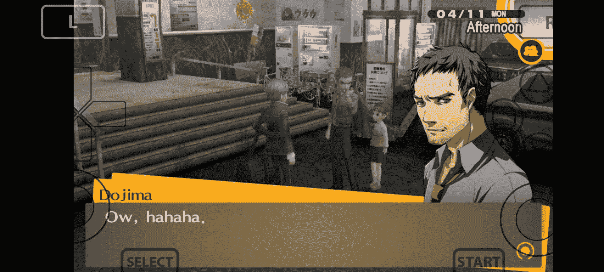

# 作为第一款移动 PlayStation Vita 模拟器，官方发布了 Vita3K for Android

> 原文：<https://www.xda-developers.com/vita3k-android-playstation-vita-emulator/>

我们经常读到程序员通过模仿原始平台找到让旧游戏在现代智能手机上运行的方法。感谢 Android 的[主机模拟器的丰富，这真的是重温我们童年最美好的游戏记忆的一种美妙方式。此外，仿真是保存视频游戏历史的关键，这就是为什么我们总是很兴奋地看到新的仿真器走向 Android。这一次，在桌面操作系统上已经存在多年的受欢迎的 PlayStation Vita 模拟器 Vita3K 获得了官方的 Android 端口。](https://www.xda-developers.com/best-emulators-android/)

 <picture></picture> 

Persona 4 Golden running on Vita3K Android

对于不知道的人，Vita3K 项目在 2018 年开始了它的旅程。多年来，开发人员慢慢增加了对更多游戏的支持，现在它可以在 Windows、Linux 和 macOS 上运行大量 PS Vita(以及 PlayStation TV)游戏和自制应用程序。当然你不能玩所有的 Vita 游戏，但是它支持很多流行的游戏，比如 Persona 4，Uncharted，Hotline Miami 等等。

然而，将 Vita3K 移植到 Android 并不是一件容易的事情。让官方 Android 端口如此令人印象深刻的不是它是一个从一开始就没有任何问题的完美功能模拟器。它有许多小故障，当前的图形用户界面需要更多的抛光，它甚至肯定不能远程功能更密集的标题。尽管如此，最初的版本已经可以利用[为 Adreno 设备](https://www.xda-developers.com/adreno-tools-update-android-graphics-drivers/)定制驱动程序，具有 Vulkan 支持，以及大量其他调整，导致在[最佳 Android 手机](https://www.xda-developers.com/best-android-phones/)上的流畅体验。简而言之，很明显，开发人员希望向其他平台上的 Vita3K 粉丝提供一款出色的产品。

Vita3K 目前只能在运行 Android 7.0 牛轧糖或更高版本的 64 位 Android 设备上运行，支持 Vulkan 1.0 或更高版本。虽然该项目是开源的，并在 GPLv2 许可证下获得许可，但 Android 版本的源代码至少在几个月内不会可用。该团队目前只提供预编译的 apk，可以从下面链接的 GitHub 资源库下载。

**[下载 Vita3K 安卓](https://github.com/Vita3K/Vita3K-Android/releases/latest)**

值得指出的是，Vita3K 团队只开发仿真器本身。盗版 PS Vita 游戏仍然是非常非法的。即使你拥有游戏卡，下载备份仍然是一个灰色地带。让 PlayStation Vita 游戏为仿真做好准备的唯一合法方法是，自己将它们从你拥有的物理介质(或数字版本)中转储出来。