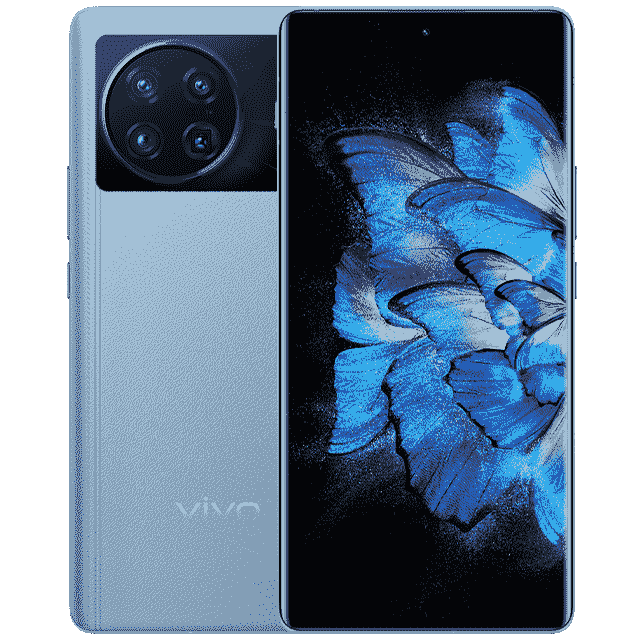
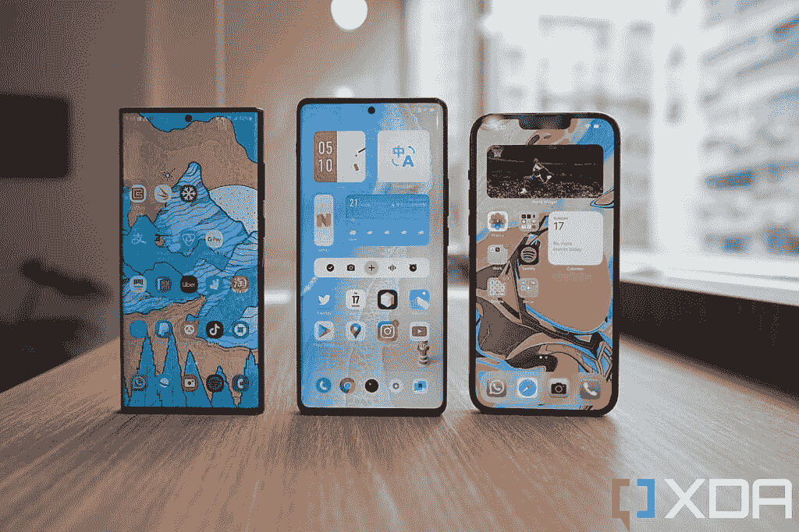

# vivo X Note hand-On:一款 7 英寸平板手机，中国独有

> 原文：<https://www.xda-developers.com/vivo-x-note-hands-on/>

Vivo [上周发布了一对新的智能手机](https://www.xda-developers.com/vivo-x-fold-launch-specifications/)——一个平板，一个可折叠——到目前为止只在 mainland China 市场独家发售。虽然每个人的注意力都被可折叠设备吸引了，但更传统的平板电脑 Vivo X Note 有几个有趣的功能，使其有别于市场上的平板手机。

首先是它的尺寸:Vivo X Note 拥有 7 英寸的显示屏，是三年多来第一款突破 6.6 英寸大关的主要品牌手机。我能想到的最后一款这么大的手机是 2018 年的华为 Mate 20X。第二个有趣的因素是，X Note 运行在 OriginOS 上，这是 Vivo 仅在中国使用的软件，虽然仍然是 Android 皮肤，但看起来与大多数其他版本的 Android 截然不同。它让 Vivo 的全球软件 FunTouchOS 看起来低调朴素。

虽然 X Note 在我所在的香港没有销售，但我可以从进口商[三一电子公司借一台。](https://www.facebook.com/Trinityelectronic/)我的早期印象？Vivo 制造漂亮硬件的热潮仍在继续，但 OriginOS 对我来说有点太时髦了，我猜大多数读者也是如此。

 <picture></picture> 

Vivo X Note

##### Vivo X Note

Vivo 的 X Note 是一款巨型 7 英寸智能手机，拥有出色的相机系统。不幸的是，它目前只针对中国市场。

## Vivo X 注:规格

| 

规格

 | 

Vivo X Note

 |
| --- | --- |
| **打造** | 

*   大猩猩玻璃 Victus 正面和背面(黑色款)
*   Gorilla 玻璃 Victus 正面，纯素皮革背面(蓝色和灰色款)
*   铝制框架

 |
| **尺寸&重量** | 

*   168.8 x 80.3 x 8.4 毫米
*   221g(皮革款)
*   219 克(玻璃模型)

 |
| **显示** | 

*   7 英寸有机发光二极管
*   3200 x 1440
*   LTPO 1.0

 |
| **SoC** | 

*   高通骁龙 8 代 1

 |
| **闸板&存放** | 

*   128/256GB 存储空间
*   8GB/12GB 内存

 |
| **电池&充电** | 

*   5,000 mAg
*   80W 有线充电
*   含充电砖
*   高达 50W 的无线充电

 |
| **安全** | 高通 3D Sonic Max 显示指纹传感器 |
| **后置摄像头** | 

*   **初选:** 50MP 宽，三星 GN1，f/1.57，1/1.31 寸，OIS
*   **次要:** 48MP 超宽，索尼 IMX 598，f/2.2，万向节技术
*   **第三:** 12MP 长焦，索尼 IMX 663，f/1.6，2x 光学
*   **四元:** 8MP 潜望镜，f/3.4，5 倍光学变焦

 |
| **前置摄像头** | 1600 万像素，f/2.5 自拍相机 |
| **端口** | USB-C |
| **音频** | 双立体声扬声器 |
| **连通性** |  |
| **软件** | Android 12 上的 OriginOS |
| **其他特性** | 警报滑块切换 |

***关于这次动手:**这篇文章是在测试了从三一电子(Trinity Electronics)借来的一台 Vivo X Note 后写的，三一电子是香港的一家第三方进口商，与 Vivo 无关。Vivo 和 Trinity Electronics 在这篇文章中都没有任何投入。*

* * *

## Vivo X 注:硬件和设计

关于 Vivo X Note 首先要注意的是，它是一款大手机，但它也不是真的那么大。我的意思是，如果你是那种觉得即使是标准的非超安卓旗舰产品，如一加 9 或 [Galaxy S22 Plus](https://www.xda-developers.com/samsung-galaxy-s22-plus-review/) 都太大的人，那么 X Note 对你来说会感觉荒谬地大。但我已经习惯了 Ultra 和 Pro Max 手机，当我抓住 Vivo X Note 时，我的第一反应是“哦，就这样？这个感觉没那么大。”

当然，X Note 明显比 iPhone 13 Pro Max 和 Galaxy S22 Ultra 高，并且*比 iPhone 13 Pro Max 和 Galaxy S22 Ultra 稍微宽*2-3 毫米，但是 X Note 更轻一些，没有 iPhone 的尖边或 Galaxy 的尖角。我发现 Vivo X Note 的手感比这两款设备都要舒适。

 <picture></picture> 

Samsung Galaxy S22 Ultra (left); Vivo X Note (middle); Apple iPhone 13 Pro Max (right).

除了尺寸之外，Vivo X Note 是一款非常标准的 Android 旗舰手机，如果你看过 Vivo 以前的设备，工艺会很熟悉。X Note 有黑色磨砂玻璃背(我测试的型号)或蓝色或灰色的纯素皮革背。我觉得奇怪的是，即使是我的玻璃背模型也有类似皮革制品上的缝线的纹理。很微妙；我不介意。

Vivo X Note 是一款大手机，但它也不是真的那么大——它只比 iPhone 13 Pro Max 或 Galaxy S22 Ultra 稍大一点

我是新的圆形相机模块的粉丝，因为我一直喜欢圆形模块的外观(我认为一加 7T 比大多数一加设备看起来都好，华为 Mate 30 Pro 获得了我对历史上最佳回顾的投票)。相机硬件几乎与 Vivo X70 Pro Plus 中看到的系统相同，在我看来这是一个非常好的消息，因为 X70 Pro Plus 的相机系统真的非常非常好。据我所知，这两款相机只有两个明显的区别:X Note 的 2 倍远摄变焦镜头比 X70 Pro Plus 的图像传感器更小，X Note 的超宽镜头没有微型万向节稳定系统。从蔡司 T 涂层镜头到 V1 图像处理芯片，所有其他功能都在 X Note 中得到了体现。

与 X70 Pro Plus 相比，还有四项硬件升级。

*   X Note 获得了预期的处理器提升到[骁龙 8 代 1](https://www.xda-developers.com/qualcomm-snapdragon-8-gen-1/) 。
*   显示器内指纹扫描仪使用高通令人敬畏的 3D 超声波 Max 解决方案，该解决方案具有更大的扫描面积，扫描速度不仅比光学扫描仪快得多，甚至比三星 Galaxy S22 Ultra 中使用的旧高通解决方案还要快。
*   电池容量增加到了 5000 毫安时。
*   有一个新的一加风格的警报滑块，用于设置手机振动，静音或正常。

除此之外，一切都与 Vivo X70 Pro Plus 相同——所以你得到的触觉非常好，但比 OPPO/小米/三星/谷歌在其旗舰产品中提供的触觉差一步；WQHD+有机发光二极管显示屏清晰而充满活力，但它仍然只是一个 LTPO 1.0 面板。IP68 防水防尘，无线充电功率高达 50W。包装附带一个 80W 的充电砖。

* * *

## Vivo X 注:软件- OriginOS

还记得几年前，Android 皮肤，尤其是那些来自亚洲品牌的皮肤，有着完全不同的外观和功能集，与普通 Android 大相径庭吗？在我看来，那些日子既有趣又令人沮丧。我记得每部手机都有不同的导航系统(LG 使用屏幕按钮，三星使用物理电容按钮，但 back 按钮在错误的位置，魅族有一个非常聪明的一体化按钮，既是 home 又是 back，等等)；我记得 Vivo 把快捷切换页面放在了从显示屏底部冒出来的向上滑动菜单中；我记得三星的 TouchWiz 图标看起来非常花哨。在过去的几年里，也许是由于西方消费者/评论家的批评和要求，每一个 Android 皮肤都开始表现得相似，并更接近谷歌的设想。这带来了更好的 Android 皮肤——我不再在乎使用第三方启动器，因为它在 2016 年对我来说是必须下载的——但它也带来了一种感觉有点无聊的一致性。

Vivo 的 OriginOS 似乎让那些狂野的日子又回来了。这是一个 Android 皮肤，有各种形状和大小的应用图标(看起来[类似于 iOS 15](https://www.xda-developers.com/ios-15/) )，直接在主屏幕上的交互式小工具，不和谐的颜色组合，以及拖出来的动画。正如我所说的，这个软件对我来说可能有点不可预测，不能作为日常的驱动程序使用，但它很吸引人，在某些方面很巧妙，绝对是一股清新的空气。

上面的图片显示了 OriginOS 主屏幕的样子。没有应用托盘——所有的应用都在主屏幕上。从 dock 向上滑动会带来一个“Nano Kits”列表(在下面的第二个截图中)，这就是 Vivo 所说的交互式小工具。

这些互动小工具主要用于 Vivo 自己的原生应用，但其中一些，如互动音乐播放器小工具，适用于 Spotify。我很喜欢这些互动部件的工作方式。例如，天气窗口小部件(在上面的第三个截图中)是可滚动的——我可以水平滑动来查看当天晚些时候的天气。recorder 小部件(在下面的第二个截图中)只需点击主屏幕上的 record 按钮就可以开始录制音频。你不必跳到 recorder 应用程序本身来开始记录(尽管这让我想知道意外记录是否会很常见)。每个小工具，甚至一些应用程序图标，都有独立在主屏幕上移动的微妙动画。例如，时钟部件有移动的时钟指针。日历应用程序会在午夜更改日期。

锁屏(上面的第一张截图)看起来真的不同于我见过的任何一款 Android 手机，指纹扫描仪图标在一个彩色的圆圈中，周围是应用程序，你可以通过拖动指纹扫描仪快速启动。因此，如果我将计步器拖到指纹扫描仪中，手机将解锁并直接启动 Vivo Health 应用程序，该应用程序一直在跟踪我的步数。

通知阴影仍然由向下滑动触发，行为基本相同，但快捷切换被移动到类似 iOS 控制中心的窗格，需要从右上角滑动(上面的第四个截图)。

主屏幕上有一个名为“Mood Cube”的持久图标(下面的前三个截图)，它允许快速改变主屏幕的美学，从配色方案到图标的大小和形状。

translator 小部件尤其令人印象深刻。如果我抓取了一个包含非手机默认语言文本的截图，然后点击翻译工具，翻译工具将自动扫描该截图，并将文本转换为手机的默认语言。下面，你可以看到它把 XDA 翻译成了中文(这个翻译也基本正确)。现在，翻译支持英语，中文，日语，韩语，泰语，西班牙语，法语和意大利语。

您还可以自定义一侧扫动来启动应用程序或 widget(另一侧扫动保持为“后退”手势)。例如，你可以设置它，这样从显示屏的一侧向右滑动就可以打开支付宝或微信支付(这是中国每个人都在使用的两个无处不在的支付应用)。

对于那些想知道的人来说:Vivo X Note 不附带谷歌应用程序，但他们可以从 Vivo 的应用商店或像 APK 镜报这样的可靠来源安装。谷歌移动服务框架已经是软件的一部分。

OriginOS 非常独特，对于那些喜欢使用快捷手势的人来说非常有用。但最终，我更喜欢有一个应用托盘和一个稍微不那么杂乱的主屏幕。

* * *

## Vivo X 注:相机

正如我所说，Vivo X Note 的相机硬件与 Vivo X70 Pro Plus 基本相同，因此它是一个非常强大的相机系统，具有出色的 HDR。然而，我注意到在比较 X Note 的所有四个摄像头拍摄的照片时，有些颜色不一致。或许 Vivo 还没有时间为 OriginOS 以及我的全球版 X70 Pro Plus(运行 FunTouchOS)微调相机。

尽管如此，X Note 的 HDR 还是很棒，并且一直比 iPhone 13 Pro Max 的平衡感更好。

主摄像头和超宽摄像头之间的色温变化现在是一个问题，但我相信 Vivo 可以解决这个问题，因为这些摄像头硬件与 Vivo X70 Pro Plus 相同，而这款手机没有这样的问题。

* * *

## Vivo X 注:初步印象

由于 Vivo X Note 没有在中国以外的地方销售，这篇文章更多的是出于好奇而检查一款不同类型的手机，而不是实际的买家指南。虽然 Vivo X Note 在中国的价格相对较低，为 5999 元人民币(约合 942 美元)，但对于那些想要进口的人来说，价格肯定会超过四位数。

如果你真的想要一部大屏幕手机，或者如果你最近一直是 Vivo 相机的粉丝，Vivo X Note 可能值得考虑进口，但我认为 OriginOS 对大多数西方用户来说太古怪了。也许要等到 Vivo X80 系列，它将在国际上发布，从而在 FunTouchOS 上运行。我要说的是:我不介意下一代 Ultra/Max 手机的屏幕尺寸也达到 7 英寸，因为抖音和 Instagram 等应用在更大的画布上看起来会稍微好一点，但三星和苹果将不得不剃掉那些锋利的边缘和坚硬的角落，以使他们的手机更容易握持。