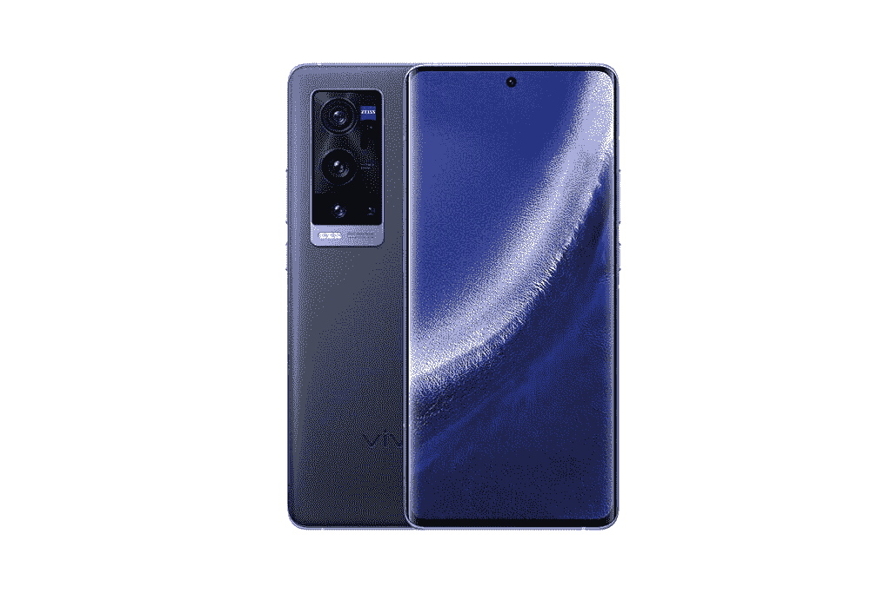
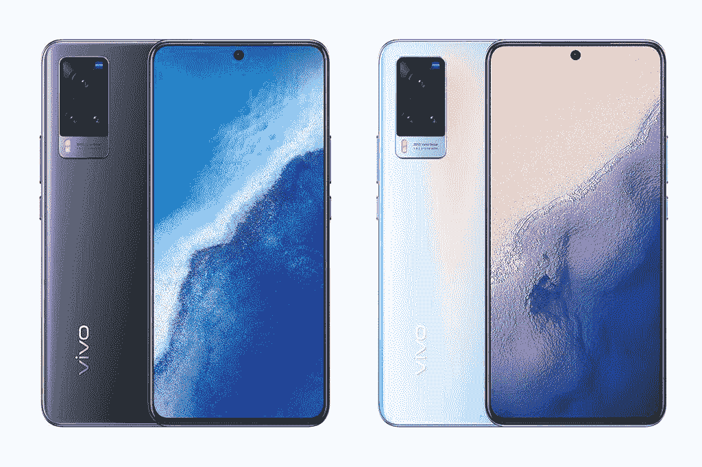

# Vivo X60 Pro 和 X60 Pro Plus 在中国做了一些改动

> 原文：<https://www.xda-developers.com/vivo-x60-pr-x60-pro-plus-india-launch/>

去年底， [Vivo 在中国推出了搭载 Exynos 1080 的 X60 系列。此后不久，该公司为 X60 产品线添加了另一款机型，称为 Vivo X60 Pro Plus，采用高通的旗舰产品骁龙 888 芯片。该公司现在将 X60 系列带到印度市场，但有一些变化。](https://www.xda-developers.com/vivo-x60-pro-exynos-1080-zeiss-lenses-launched-china/)

**[亲身体验 Vivo X60 Pro Plus:在黑暗中胜过 Galaxy S21 Ultra](https://www.xda-developers.com/vivo-x60-pro-plus-hands-on/)**

## Vivo X60 系列:规格

| 

规范

 | 

Vivo X60

 | 

Vivo X60 Pro

 | 

Vivo X60 Pro+

 |
| --- | --- | --- | --- |
| **构建** | 

*   银玻璃背面，缎面抛光
*   金属框架

 | 

*   银玻璃背面，缎面抛光
*   金属框架

 | 

*   纯素皮革背面
*   金属框架

 |
| **尺寸&重量** | 

*   午夜黑:
    *   159.63 x 75.01 x 7.36mm 毫米
    *   176 克
*   微光蓝:
    *   159.63 x 75.01 x 7.4mm 毫米
    *   177 克

 | 

*   午夜黑:
    *   158.58 x 73.24 x 7.59mm 毫米
    *   177 克
*   微光蓝:
    *   158.58 x 73.24 x 7.69mm 毫米
    *   179 克

 | 

*   158.59 x 73.35 x 9.10mm 毫米
*   191g

 |
| **显示** | 

*   6.56 英寸 FHD+ E3 AMOLED
*   120Hz 屏幕刷新率
*   平板显示器
*   中心孔穿孔机
*   HDR10+

 | 

*   6.56 英寸 FHD+ AMOLED
*   120 赫兹刷新率
*   240Hz 触摸轮询速率
*   中心孔穿孔机
*   HDR10+

 | 

*   6.56 英寸 FHD+ AMOLED
*   120 赫兹刷新率
*   240Hz 触摸轮询速率
*   中心孔穿孔机
*   HDR10+

 |
| **SoC** | 高通骁龙 870 | 高通骁龙 870 | 高通骁龙 888 |
| **闸板&存放** | 

*   8GB LPDDR5 + 128GB UFS 3.1 ROM
*   12GB + 256GB

 | 12GB LPDDR5 内存+ 256GB UFS 3.1 ROM | 12GB LPDDR5 内存+ 256GB UFS 3.1 ROM |
| **电池&充电** | 

*   4300 毫安时
*   33W 快速充电器

 | 

*   4200 毫安时
*   33W 有线快速充电

 | 

*   4200 毫安时
*   55W 有线快充

 |
| **安全** | 显示指纹扫描仪 | 显示指纹扫描仪 | 显示指纹扫描仪 |
| **后置摄像头** | 

*   4800 万像素 f/1.79 主摄像头
*   1300 万像素 f/2.2 广角摄像头，120 FoV
*   1300 万像素 f/2.46 人像相机

 | 

*   48MP f/1.48 主摄像头，万向节稳定 2.0，OIS + EIS
*   1300 万像素 f/2.2 广角摄像头，120 FoV
*   1300 万像素 f/2.46 人像相机

 | 

*   50MP ISOCELL GN1 主摄像机，OIS + EIS
*   48MP f/2.2 超宽相机，万向节稳定 2.0，114 FoV
*   32MP f/2.08 人像相机
*   8MP f/3.4 潜望镜变焦相机，5 倍光学变焦，60 倍混合变焦

 |
| **前置摄像头** | 32MP | 32MP | 32MP |
| **端口** | USB 类型-C | USB 类型-C | USB 类型-C |
| **音频** | 单声道扬声器 | 高分辨率认证 | 高分辨率认证 |
| **连通性** | 

*   双频 Wi-Fi
*   蓝牙 5.1

 | 

*   双频 Wi-Fi
*   蓝牙 5.1

 | 

*   双频 Wi-Fi
*   蓝牙 5.1

 |

* * *

从上面的规格表中可以看到，印度版 Vivo X60 Pro Plus 在很大程度上与国内推出的相同。它装有高通的骁龙 888 芯片，6.56 英寸的 FHD+ AMOLED 显示屏，刷新频率为 120 赫兹，以及 4200 毫安时的电池，支持 55 瓦快速充电。

 <picture></picture> 

Vivo X60 Pro Plus

这款手机采用了与中国版本相同的四摄像头设置，包括一个 50MP ISOCELL GN1 主摄像头，一个 48MP 超宽摄像头，具有万向节稳定 2.0，一个 32MP 长焦摄像头，具有 3 倍光学变焦，以及一个 8MP 潜望镜长焦摄像头，具有 5 倍光学变焦。在正面，它也保留了相同的 32MP 自拍相机。

然而，印度 Vivo X60 Pro Plus 并不完全相同。它只有一个 12GB RAM + 256GB ROM 的配置，Vivo 只在印度市场推出皇帝蓝素食皮革变种。虽然这些变化并不显著，但中国和印度版本的 Vivo X60 Pro 之间的差异是显著的。

印度 Vivo X60 Pro 和 Vivo X60 没有采用三星的 Exynos 1080 芯片。相反，这些设备配备了高通的骁龙 870 系统芯片。这款手机采用了相同的 6.56 英寸 FHD+ AMOLED 显示屏，刷新频率为 120 赫兹。不过，X60 Pro 配备了 4,200mAh 电池，支持 33W 快速充电，并配有单个 12GB RAM + 256GB ROM 配置。另一方面，vanilla X60 配备了 4,300mAh 电池，支持 33W 快速充电，并配有一个 8GB RAM + 128GB ROM 配置。

 <picture></picture> 

Vivo X60/X60 Pro

在相机方面，Vivo X60 Pro 背面配备了三摄像头设置，而不是像中国版本那样的四摄像头设置。它由一个 48MP 主传感器和一个 12MP 超宽相机和一个 13MP 人像相机组成。对于自拍，它包括相同的 32MP 摄像头。与 X60 Pro Plus 不同，X60 Pro 有两种外观——午夜黑和微光蓝——尺寸和重量略有不同。vanilla Vivo X60 还具有三摄像头设置，由 48MP f/1.79 主摄像头、13MP f/2.2 超宽摄像头和 13MP f/2.46 人像摄像头组成。它还有两种外观——午夜黑和微光蓝。

新的 Vivo X60 系列设备还具有显示指纹扫描仪、具有高分辨率认证的单声道扬声器、双频 Wi-Fi 和蓝牙 5.1。在软件方面，这些手机运行 Vivo 基于 Android 11 的 Funtouch OS 11.1。

* * *

## 定价和可用性

新的 Vivo X60 系列已经进入印度市场，预计很快将进入其他市场。这些设备将于 4 月 2 日开始在中国通过 Vivo 的网站、亚马逊、Flipkart 和其他主要的线下零售商购买。Vivo X60 系列定价如下:

*   **Vivo X60:**
    *   8GB + 128GB: ₹37,990(约 523 美元)
    *   12GB +256GB: ₹41,990(约 578 美元)
*   **Vivo X60 Pro:**
    *   12GB + 256GB: ₹49,990(约 688 美元)
*   **Vivo X60 Pro Plus:**
    *   12GB + 256GB: ₹69,990 (约 963 美元)

Vivo X60 和 X60 Pro 将有两种配色可供选择——午夜黑和微光蓝——而 Vivo X60 Pro Plus 将只有一种漆面——帝蓝纯素皮革。一旦 Vivo 分享了其他地区的定价和可用性细节，我们将立即更新这篇文章。