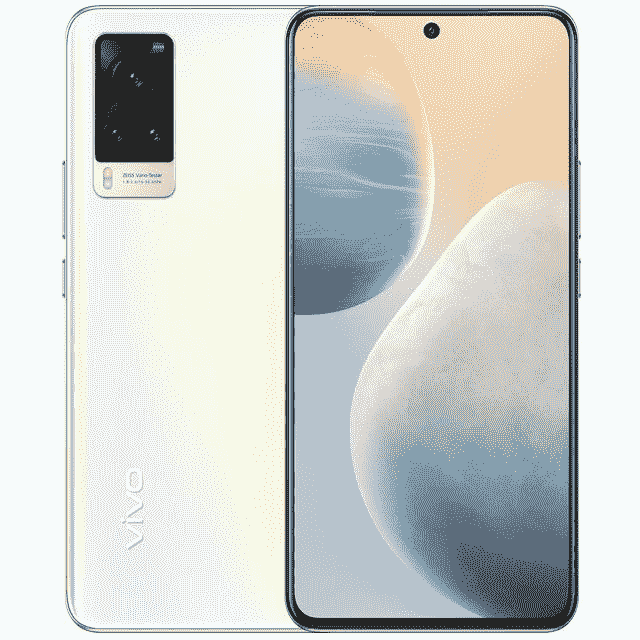
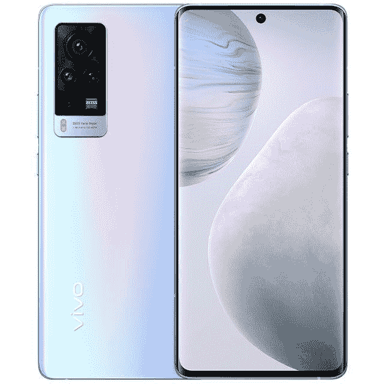

# 国内推出搭载 Exynos 1080 和蔡司镜头的 Vivo X60 和 Vivo X60 Pro

> 原文：<https://www.xda-developers.com/vivo-x60-pro-exynos-1080-zeiss-lenses-launched-china/>

在今天在中国举行的发布会上，Vivo 宣布了两款新的旗舰智能手机:Vivo X60 和 Vivo X60 Pro。新的 X60 系列继承了去年 Vivo X50 系列的[并带来了一些实质性的改进，包括更高的刷新率屏幕、带蔡司光学系统的四摄像头、更快的芯片组等等。](https://www.xda-developers.com/vivo-x50-pro-plus-series-unveiled-50mp-gimbal-camera-system-120hz-display-snapdragon-865-china-launch/)

## Vivo X60 和 Vivo X60 Pro:规格

| 

规格

 | 

Vivo X60

 | 

Vivo X60 Pro

 |
| --- | --- | --- |
| **尺寸&重量** | 

*   159.63 毫米 x 75.01mm 毫米 x 7.36 毫米
*   176.2 克

 | 

*   158.57 毫米 x 73.24mm 毫米 x 7.59mm 毫米
*   178 克

 |
| **显示** | 

*   6.56 英寸 FHD+ E3 AMOLED
*   120Hz 屏幕刷新率
*   平板显示器
*   中心孔穿孔机
*   HDR10+

 | 

*   6.56 英寸 FHD+ E3 AMOLED
*   120Hz 屏幕刷新率
*   弯曲显示器
*   中心孔穿孔机
*   HDR10+

 |
| **SoC** | 

*   三星 Exynos 1080
    *   1 个 Cortex-A78 @ 2.8GHz
    *   2 个 Cortex-A78 @ 2.6GHz
    *   4x Cortex-A55 @ 2.0GHz
*   Mali-G78 GPU
*   5 纳米 FinFET 工艺

 | 

*   三星 Exynos 1080
    *   1 个 Cortex-A78 @ 2.8GHz
    *   2 个 Cortex-A78 @ 2.6GHz
    *   4x Cortex-A55 @ 2.0GHz
*   Mali-G78 GPU
*   5 纳米 FinFET 工艺

 |
| **内存&存储** | 

*   8GB/12GB 内存
*   128GB/256GB 闪存存储
*   UFS 3.1

 | 

*   12GB 内存
*   256GB 闪存存储
*   UFS 3.1

 |
| **电池&充电** | 

*   4200 毫安时
*   33W 快速充电器(包装盒内)

 | 

*   4300 毫安时
*   33W 快速充电器(包装盒内)

 |
| **安全** | 

*   显示指纹扫描仪
*   面部解锁

 | 

*   显示指纹扫描仪
*   面部解锁

 |
| **后置摄像头** | 

*   **主:** 48MP 索尼 IMX598 定制传感器，f/1.79，四轴 OIS
*   **辅助:**1300 万长焦，f/2.46，2 倍光学变焦
*   **第三:** 13MP 超广角，120 FoV，f/2.2
    *   支持微距摄影
*   蔡司光学

 | 

*   **主:** 48MP 索尼 IMX598 定制传感器，f/1.79，四轴 OIS
*   **次要:**1300 万长焦，f/2.46，2 倍光学变焦
*   **第三:** 13MP 超广角，120 FoV，f/2.2
    *   支持微距摄影
*   **第三:** 8MP 潜望镜，5 倍光学变焦
*   蔡司光学

 |
| **前置摄像头** | 32MP，f/2.45 | 32MP，f/2.45 |
| **端口** | USB 型 | USB 型 |
| **连通性** | 

*   5G
*   蓝牙 5.1
*   双频 Wi-Fi
*   国家足球联盟
*   反向有线充电

 | 

*   5G
*   蓝牙 5.1
*   双频 Wi-Fi
*   国家足球联盟
*   反向有线充电

 |
| **软件** | 搭载 OriginOS 1.0 的 Android 11 | 搭载 OriginOS 1.0 的 Android 11 |

 <picture></picture> 

Vivo X60

Vivo X60 系列配备了 6.56 英寸的 AMOLED 显示屏，屏幕刷新率为 120Hz。基础 X60 有一个平板，而 X60 Pro 选择了曲面。两款设备上的处理都由三星最新的 [Exynos 1080 芯片组](https://www.xda-developers.com/samsung-exynos-1080-soc-arm-cortex-a78-cpu-core-mali-g78-gpu/)处理，搭配高达 12GB 的内存、Mali-G78 GPU 和高达 256GB 的 UFS 3.1 闪存存储。

 <picture></picture> 

Vivo X60 Pro

与去年的阵容类似，Vivo X60 系列继续强调相机性能，这一次，该公司与蔡司合作。在后置摄像头组件方面，两款手机都配备了 48MP 索尼 IMX598 主摄像头，配有 4 轴 OIS，13MP 广角摄像头(也可兼作微距镜头)，以及 13MP 长焦摄像头。X60 Pro 有一个额外的 800 万像素潜望镜相机，具有 5 倍光学变焦。Vivo 还声称，新的夜间模式现在可以在主传感器、广角传感器和长焦传感器之间无缝工作，从而改善了弱光性能。

为 X60 提供动力的是 4，200 毫安时的电池，而 X60 Pro 的电池略大，为 4，300 毫安时。两款手机都支持 33W 快充和反向有线充电。在软件方面，X60 系列运行的是基于 Android 11 的 Vivo 定制皮肤的最新版本 [OriginOS](https://www.xda-developers.com/originos-vivo-latest-software-release-based-android-11-features-rollout/) 。Vivo X60 系列的规格包括 5G 支持、蓝牙 5.1、NFC 和显示指纹扫描仪。

## 定价和可用性

Vivo X60 有两种型号:8GB/128GB 和 12GB/256GB，基本款在 CNY 的价格为 3498 英镑(约 535 美元)，顶级款在 CNY 的价格为 3798 英镑(约 581 美元)。与此同时，Vivo X60 Pro 只有一种型号，12GB/256GB，在 CNY 的售价为 4498 英镑(约合 688 美元)。这两款手机从今天开始在中国接受预购，正式销售从 2021 年 1 月 8 日开始。

Vivo 尚未透露后续国际发布的细节。然而，该公司确实提到它计划在产品线中再推出一款设备:Vivo X60 Pro+，该设备将采用高通骁龙 888 芯片组。