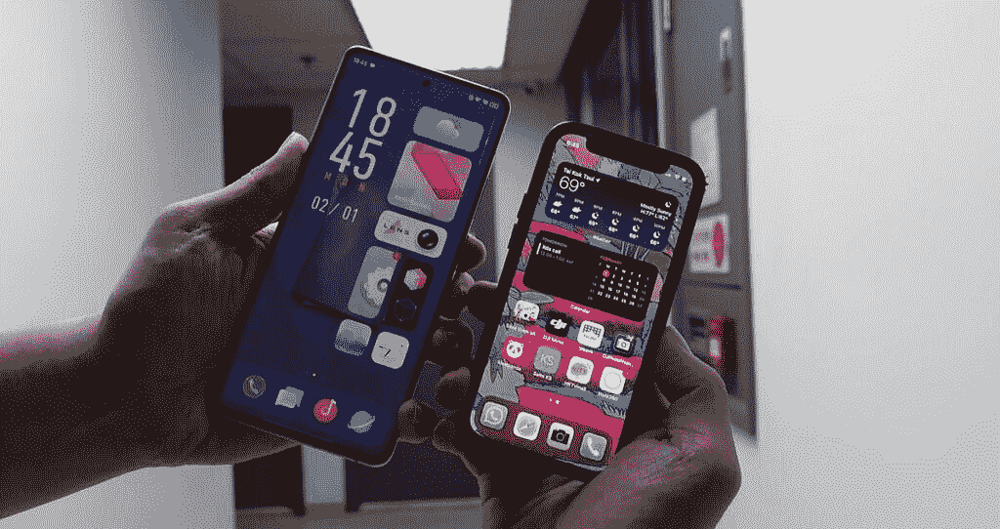

# Vivo X60 Pro Plus 在黑暗中的表现优于 Galaxy S21 Ultra

> 原文：<https://www.xda-developers.com/vivo-x60-pro-plus-hands-on/>

就在 2020 年即将结束之际，Vivo 宣布了其 [Vivo X60 系列](https://www.xda-developers.com/vivo-x60-pro-exynos-1080-zeiss-lenses-launched-china/)，该系列在 12 月 29 日发布时仅包括标准的 X60 和 X60 Pro。在中国新年之前，Vivo 为 X60 阵容增加了另一款机型:高端 Vivo X60 Pro Plus(或 Vivo 的风格，Pro+)。

由于 Vivo X60 Pro Plus 目前仅在中国上市，我们还没有官方的审查单位。然而，香港进口商[三一电子](https://www.facebook.com/Trinityelectronic)非常友好地借给我们一个中国单位进行短暂的实际测试。在我短暂的动手操作中，我想在 Vivo X60 Pro Plus 上使用蔡司光学系统来检查新的相机系统。我还想试试 Vivo 的新安卓皮肤——[OriginOS](https://www.xda-developers.com/the-vivo-x60-series-will-run-originos-vivos-successor-to-funtouchos/)——看起来很像 iOS。

## Vivo X60 系列:规格

| 

规范

 | 

Vivo X60

 | 

Vivo X60 Pro

 | 

Vivo X60 Pro+

 |
| --- | --- | --- | --- |
| **构建** | 

*   铝制中框
*   大猩猩玻璃正面和背面

 | 

*   铝制中框
*   大猩猩玻璃正面和背面

 | 

*   铝制中框
*   纯素皮革背面或大猩猩玻璃
*   大猩猩玻璃面板

 |
| **尺寸&重量** | 

*   159.6 毫米 x 75.01mm 毫米 x 7.36 毫米
*   176.2 克

 | 

*   158.6 x 73.2 x 7.59mm 毫米
*   178 克

 | 

*   158.6 x 73.35 x 9.1 毫米
*   190.6 克

 |
| **显示** | 

*   6.56 英寸 FHD+ E3 AMOLED
*   120Hz 屏幕刷新率
*   平板显示器
*   中心孔穿孔机
*   HDR10+

 | 

*   6.56 英寸 FHD+ E3 AMOLED
*   120Hz 屏幕刷新率
*   弯曲显示器
*   中心孔穿孔机
*   HDR10+

 | 

*   6.56 英寸 FHD+ E3 AMOLED
*   120Hz 屏幕刷新率
*   弯曲显示器
*   中心孔穿孔机
*   HDR10+

 |
| **SoC** | 

*   三星 Exynos 1080
    *   1 个 Cortex-A78 @ 2.8GHz
    *   2 个 Cortex-A78 @ 2.6GHz
    *   4x Cortex-A55 @ 2.0GHz
*   Mali-G78 GPU
*   5 纳米 FinFET 工艺

 | 

*   三星 Exynos 1080
    *   1 个 Cortex-A78 @ 2.8GHz
    *   2 个 Cortex-A78 @ 2.6GHz
    *   4x Cortex-A55 @ 2.0GHz
*   Mali-G78 GPU
*   5 纳米 FinFET 工艺

 | 

*   高通骁龙 888:
    *   1 个 Kryo 680 Prime 内核@ 2.84GHz
    *   3 个 Kryo 680 性能内核@ 2.4GHz
    *   4 个 Kryo 680 高效内核@ 1.8GHz

 |
| **闸板&存放** | 

*   8GB/12GB 内存
*   128GB/256GB 闪存存储
*   UFS 3.1

 | 

*   12GB 内存
*   256GB 闪存存储
*   UFS 3.1

 | 

*   8GB + 128GB
*   12GB + 256GB
*   UFS 3.1

 |
| **电池&充电** | 

*   4200 毫安时
*   33W 快速充电器(包装盒内)

 | 

*   4300 毫安时
*   33W 快速充电器(包装盒内)

 | 

*   4200 毫安时
*   33W 快速充电器(包装盒内)

 |
| **安全** | 光学显示指纹扫描仪 | 光学显示指纹扫描仪 | 光学显示指纹扫描仪 |
| **后置摄像头** | 

*   **主:** 48MP 索尼 IMX598 定制传感器，f/1.79，四轴 OIS
*   **次要:**1300 万长焦，f/2.46，2 倍光学变焦
*   **第三:** 13MP 超广角，120 FoV，f/2.2
    *   支持微距摄影
*   蔡司光学

 | 

*   **主:** 48MP 索尼 IMX598 定制传感器，f/1.79，四轴 OIS
*   **次要:**1300 万长焦，f/2.46，2 倍光学变焦
*   **第三:** 13MP 超广角，120 FoV，f/2.2
    *   支持微距摄影
*   **第三:** 8MP 潜望镜，5 倍光学变焦
*   蔡司光学

 | 

*   **主要:** 50MP GN1，f/1.57，1/1.3 英寸传感器，四轴 OIS
*   **次要:** 48MP 万向超宽相机
*   **第三:** 32MP 长焦 3x 光学变焦镜头
*   **第三:** 8MP 潜望镜，5 倍光学变焦
*   蔡司光学

 |
| **前置摄像头** | 32MP，f/2.45 | 32MP，f/2.45 | 32MP，f/2.45 |
| **端口** | USB 3.2 类型 C | USB 3.2 类型 C | USB 3.2 类型 C |
| **音频** | 单声道扬声器 | 单声道扬声器 | 单声道扬声器 |
| **连通性** | 

*   5G
*   蓝牙 5.1
*   双频 Wi-Fi
*   国家足球联盟
*   反向有线充电

 | 

*   5G
*   蓝牙 5.1
*   双频 Wi-Fi
*   国家足球联盟
*   反向有线充电

 | 

*   5G
*   蓝牙 5.1
*   双频 Wi-Fi
*   国家足球联盟
*   反向有线充电

 |

* * *

## Vivo X60 Pro Plus:设计和硬件

对于那些持有或近距离看过去年 Vivo X50 Pro 的人来说，Vivo 的 X60 Pro Plus 看起来和感觉都很熟悉。Vivo 基本上保持了相同的设计语言——前后弯曲，顶部和底部平坦，使手机能够独立站立。就像去年的 Vivo X50 Pro Plus 一样，X60 Pro Plus 有一个“纯素皮革”背部，感觉很好，但不太高档。我这么说是因为虽然我觉得它的质地很滑，但摸起来有点像塑料，而不是真皮的温暖/柔软的触感。不过，相比 Vivo 在过去几年里在大多数设备上使用的另一种梯度发光玻璃平板，我更喜欢这种平板。

X60 Pro Plus 几乎与 S21 Ultra 一样高，但它更薄更轻，更容易握持。

与运行在三星 Exynos 1080 上的标准 X60 和 X60 Pro 不同，X60 Pro Plus 由高通骁龙 888(8GB 或 12GB 内存)驱动，因此它不会缺乏处理能力。然而，这款手机只有一个底部发射扬声器，因此它落后于过去半年发布的几乎所有安卓旗舰产品。

* * *

## Vivo X60 Pro Plus:摄像头

去年的 [Vivo X50 Pro](https://www.xda-developers.com/vivo-x50-pro-camera-review/) 因其“万向摄像头系统”占据了大量头条，该系统本质上为典型的智能手机 OIS 系统增加了第三个稳定轴，以补偿前后移动。具有讽刺意味的是，技术含量更高的 X50 Pro Plus 没有提供万向节摄像头，因为它使用了三星的 GN1 传感器，这对万向节来说太重了。

这是同样的故事:我正在测试的 X60 Pro Plus*没有主摄像头的万向节系统。然而，Vivo 已经将万向节系统转移到 48MP 超宽传感器上。*

 *如果我在轻微移动时看手机的背面，我实际上可以看到超宽镜头左右移动，这是一种很好的视觉触摸。但就像去年的 X50 Pro Plus 一样，万向节系统对大多数手机中已经非常优秀的 EIS 来说，在稳定性方面只带来了微小的改善。

更有趣的是主要的 GN-1 传感器，它现在具有巨大的 1/1.3 英寸图像传感器尺寸和 f/1.57 光圈。我用手机的时间非常有限，所以我不能测试太多，但我可以确认传感器在黑暗场景中确实比 Galaxy S21 Ultra 吸收了更多的光，Galaxy S21 Ultra 在弱光摄影方面表现不俗。下面的样品是在一个黑暗的房间里拍摄的，只有来自窗户的光线，没有使用夜间模式。

然而，能够吸收更多的光线并不能自动提高照片的质量。在下面的场景中，X60 Pro Plus 照亮了天空，看起来不再像是夜间拍摄。三星的图像照亮了场景，也提高了对比度，但它更接近当时天空的样子。

X60 Pro Plus 和 Galaxy S21 Ultra 一样，也有双镜头变焦系统。它包括一个 8MP 潜望镜变焦镜头，可拍摄 5 倍光学变焦镜头和一个 32MP 3x 倍光学长焦传感器。

数字表明这是一个令人尊敬的变焦系统，但无法与 Galaxy S21 Ultra 的 10x/3x 光学变焦系统相媲美，照片显示了同样的故事。下面是两组 10x 变焦，Galaxy S21 Ultra 的拍摄只是更锐利更干净。

因为我使用手机的时间非常有限，所以我无法测试其他镜头或视频性能。如果/当我有一个审查单位时，我会测试更多的相机。

* * *

## Vivo X60 Pro Plus: OriginOS

多年来，Vivo 的 Android 皮肤被称为 FunTouch，它并不完全符合我的口味——这是许多评论者的观点。尽管 Vivo 在去年年底的 [V20 系列](https://www.xda-developers.com/vivo-v20-pro-selfie-camera-review/)中显著改进了 FunTouch，但 Vivo 知道它的软件需要彻底改革。

那个大修就在这里，它被命名为 [OriginOS](https://www.xda-developers.com/originos-vivo-latest-software-release-based-android-11-features-rollout/) 。即使在我使用它的短暂时间里，OriginOS 也与我见过的大多数 Android 软件大相径庭。首先，主屏幕避开了 Android 的标准图标形状和大小，转而支持 iOS。确切的说是 iOS 的最新版本，支持 widget。

应用程序图标和小工具可以改变大小，占据整行，但仍然适合对称的网格。Android 的扁平化设计已经一去不复返，取而代之的是 skeuomorphism。

虽然我觉得 UI 在视觉上很醒目，我也喜欢一些快捷手势(例如，你可以在屏幕的一个水平边上做一个向内滑动的手势，以表现出与另一个不同的行为)，但无法回避的事实是，OriginOS 从 iOS 14 中吸取了很多设计线索。

 <picture></picture> 

OriginOS and iOS 14 side by side

* * *

## Vivo X60 Pro Plus:我的早期印象

Vivo X60 Pro Plus 在中国的售价大约相当于 750 美元，这个价格可以买到 120 赫兹的有机发光二极管屏幕、骁龙 888、主摄像头和超宽摄像头，以及一个精致的变焦系统。

我不认为 X60 Pro Plus 比小米 Mi 11 0r Galaxy S21 Ultra 好，但它的与众不同足以具有吸引力。我们不知道 Vivo 是否会在国际上发布，但我想说机会很大。如果真的有国际发布，XDA 肯定会对这款设备进行更深入的报道。*