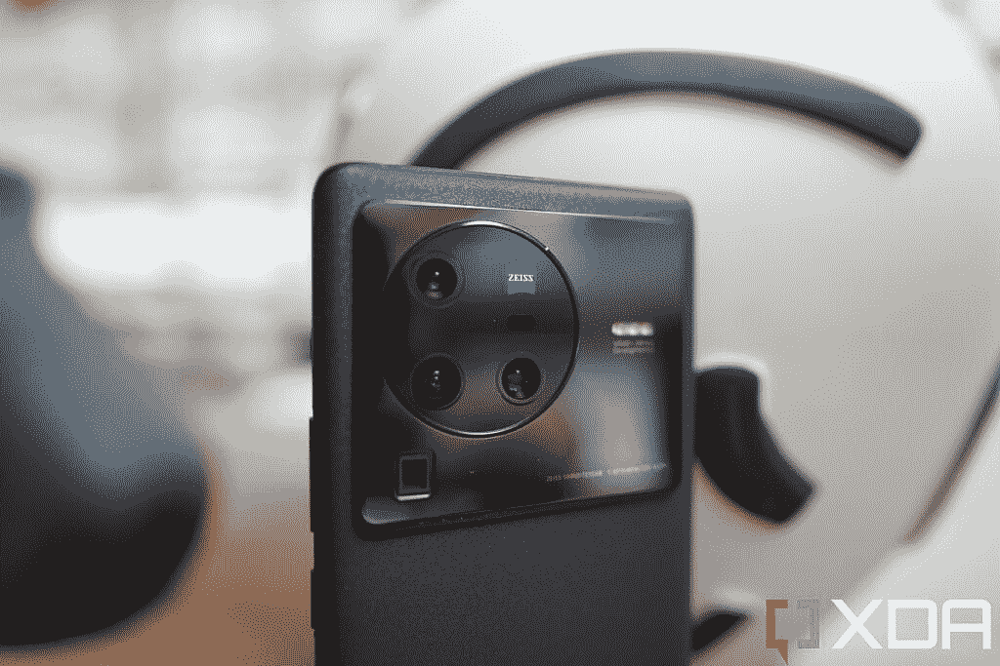

# Vivo 将其旗舰产品 Vivo X80 系列推向国际市场

> 原文：<https://www.xda-developers.com/vivo-x80-pro-launch/>

Vivo [于今年四月底在中国发布了其最新旗舰产品阵容](https://www.xda-developers.com/vivo-x80-pro-series-launch-spec-features/)-Vivo X80 系列。新的产品线包括两款设备，Vivo X80 和 Vivo X80 Pro，与去年的 Vivo X70 系列相比有多项改进，包括更好的显示器、更快的芯片组、改进的摄像头等等。Vivo 现在终于将这对组合推向国际市场，这里是你需要了解的关于新 Vivo X80 和 Vivo X80 Pro 的一切。

## Vivo X80 系列:规格

| 

规格

 | 

Vivo X80

 | 

Vivo X80 Pro

 |
| --- | --- | --- |
| **尺寸&重量** | 

*   164.95 x 75.23 x 8.3mm 毫米
*   206 克

 | 

*   164.47 x 75.30 x 9.10mm 毫米
*   219 克

 |
| **显示** | 

*   6.78 英寸 FHD+ AMOLED
*   2400 x 1080p 像素
*   388 PPI
*   120 赫兹刷新率
*   1500 尼特峰值亮度
*   100% DCI-P3 覆盖率

 | 

*   6.78 英寸 2K AMOLED
*   3200 x 1440p 像素
*   517PPI
*   120 赫兹刷新率
*   300Hz 触摸采样率
*   1500 尼特峰值亮度
*   100% DCI-P3 覆盖率

 |
| **SoC** | 联发科天玑九千 | 高通骁龙 8 代 1 |
| **内存&存储** | 

*   8GB/12GB LPDDR5 RAM
*   128GB/256GB UFS 3.1 存储

 | 

*   12GB LPDDR5 内存
*   256GB UFS 3.1 存储空间

 |
| **电池&充电** | 

*   4500 毫安时
*   80W 有线快充支持

 | 

*   4700 毫安时
*   80W 有线快充支持
*   50W 无线充电

 |
| **安全** | 显示光学指纹扫描仪 | 支持两个手指的显示式超声波指纹扫描仪 |
| **后置摄像头** | 

*   主要:50MP IMX866，f/1.75，OIS
*   超宽:12MP IMX663，f/2.0，108 FoV
*   长焦:12MP IMX663，f/1.98，2 倍光学变焦
*   Vivo V1 Plus 成像芯片
*   蔡司光学
*   蔡司 T*镜头涂层

 | 

*   主要:50MP ISOCELL GNV，f/1.57，OIS
*   超宽:48MP，f/2.2，114.5 FoV
*   长焦:12MP，f/1.85，2 倍光学变焦，万向节稳定
*   长焦:800 万像素，f/3.4，5 倍潜望镜变焦，OIS
*   Vivo V1 Plus 成像芯片
*   蔡司光学
*   蔡司 T*镜头涂层

 |
| **前置摄像头** | 32MP，f/2.45 | 32MP，f/2.45 |
| **端口** | USB 2.0 型 | USB 3.1 类型 C |
| **音频** | 立体声扬声器 | 立体声扬声器 |
| **连通性** | 

*   蓝牙 5.2
*   802.11ax 双频 Wi-Fi
*   国家足球联盟

 | 

*   蓝牙 5.2
*   802.11ax 双频 Wi-Fi
*   国家足球联盟

 |
| **软件** | 基于 Android 12 的 Funtouch OS 12 | 基于 Android 12 的 Funtouch OS 12 |
| **其他特征** | 

*   x 轴线性电机
*   VC 冷却室
*   IP53 防尘防水等级
*   红外线增强器

 | 

*   x 轴线性电机
*   VC 冷却室
*   IP68 防尘防水等级
*   红外线增强器

 |

* * *

尽管 Vivo 在中国推出了两款 Vivo X80 Pro，但该公司只是将高通模式推向了国际市场。这款设备采用了高通的旗舰产品骁龙 8 代 1 芯片，12GB 的 LPDDR5 内存和 256GB 的快速 UFS 3.1 存储，因此其性能应该与过去几个月推出的其他骁龙 8 代 1 旗舰产品持平。

在显示屏方面，Vivo X80 Pro 采用了 6.78 英寸 2K AMOLED LTPO 显示屏。它支持 120Hz 刷新率，具有 1Hz 至 120Hz 的自适应刷新率、1500 尼特的峰值亮度和 100%的 DCI-P3 覆盖。这也使它与其他原始设备制造商的旗舰手机不相上下。

Vivo X80 Pro 的摄像头硬件使其在竞争中脱颖而出。该设备包含一个 32MP 自拍相机，一个 50MP 主相机，一个 48MP 超宽相机，一个 12MP 2x 倍长焦相机和一个 8MP 倍光学变焦的潜望镜相机。该设备还装有 Vivo 的 V1 Plus 成像芯片以增强性能，以及蔡司光学系统。

 <picture></picture> 

The Vivo X80 Pro's main camera system consists of a 50MP main camera; 48MP ultra-wide, 12MP 2x portrait lens, and 8MP Periscope 5x zoom lens.

其他值得注意的功能包括 4,700mAh 电池，支持 80W 有线快速充电，蓝牙 5.2，Wi-Fi 6，NFC 和超声波显示指纹扫描仪。Vivo X80 Pro 还提供了 IP68 防尘防水认证。

普通的 Vivo X80 是 X80 Pro 的一个小进步。它采用了与旗舰机型相同的设计，但它在内部装有联发科天玑 9000 SoC。联发科芯片组配备了高达 12GB 的 LPDDR5 内存，256GB 的 UFS 3.1 存储，以及 4500 毫安时的电池，支持 80W 有线快速充电。

虽然 Vivo X80 也有 6.78 英寸的显示屏，但它是一个 FHD+面板，刷新率为 120Hz，但不支持自适应刷新率。该设备具有与旗舰机型相同的 32MP 自拍相机，但它具有 50MP IMX866 主相机，12MP IMX663 超宽相机和 12MP IMX663 2x 光学变焦长焦相机。

Vivo 为普通 X80 配备了光学显示指纹传感器，而不是超声波显示指纹扫描仪。该设备支持蓝牙 5.2、Wi-Fi 6 和 IP53 防尘防水认证。

在软件方面，两款设备都运行 Vivo 基于 Android 12 的 Funtouch OS 12。Vivo 还承诺为这两款设备提供 3 代 Android 更新和 3 年的安全更新。

## 定价和可用性

全新的 Vivo X80 系列将在亚洲多个地区上市。vanilla 型号将在香港、台湾、印度、印度尼西亚、泰国、越南、马来西亚、菲律宾、巴基斯坦和孟加拉国上市。另一方面，Pro 版本将在香港、印度、印度尼西亚、泰国、菲律宾、马来西亚、越南、新加坡、欧洲、阿联酋、沙特阿拉伯、墨西哥、哥伦比亚、智利和秘鲁上市。

Vivo 尚未分享上述所有地区的定价和可用性细节，但该公司已经分享了 Vivo X80 系列在印度的定价细节。X80 和 X80 Pro 将以下列价格在印度上市:

*   Vivo X80(宇宙黑、都市蓝):
    *   8GB + 128GB: ₹54,999
    *   12GB + 256GB: ₹59,999
*   Vivo X80 Pro(宇宙黑):

这两款设备现在都可以预订，从 5 月 25 日开始在印度公开销售。

*如何看待 Vivo 的新旗舰智能手机？你认为 Vivo X80 和 X80 Pro 有能力与一加、三星和 OPPO 的旗舰产品竞争吗？请在下面的评论区告诉我们。敬请关注我们对 X80 Pro 的深入评测！*