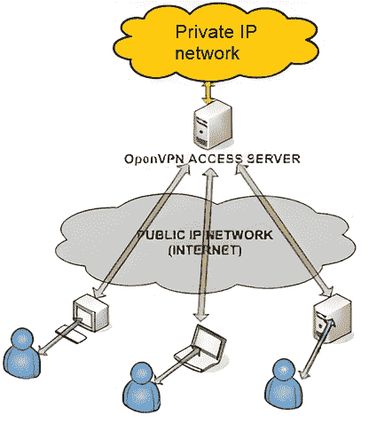

# VPN 并不像你想象的那么安全

> 原文：<https://www.xda-developers.com/vpn-safety-misunderstandings/>

虚拟专用网络(VPN)通常被认为是有益的，无论你是想隐藏你的浏览器历史以避免被窥探，还是只想访问不同国家的网飞图书馆。他们加密你进出的互联网流量，并通过他们的服务器传递，这意味着你的数据*应该是*私人的，你的位置*应该完全模糊。然而，情况并非总是如此。VPN 实际上可能会产生一种安全感，[，特别是当它很容易设置的时候，但是如果你信任 VPN 提供商多于你的 ISP，这是一个使用 VPN 的正当理由。不过，首先要考虑几件事。](https://www.xda-developers.com/how-to-use-vpn-android/)*

## 您正在将信任从您的 ISP 转移到 VPN 提供商

虽然有关于公司如何使用你的数据的信息，但你永远不会了解全貌。你所拥有的只是一家虚拟专用网公司的承诺，即它会按照自己所说的方式管理你的数据。过去，虚拟专用网曾表示，他们没有监控或记录你的连接，然后在法庭上进行测试，结果却被发现向当局提供信息。

换句话说，你在这里能做的最好的决定是调查那些已经通过独立审计甚至在法庭上测试过他们能力的 VPN 提供商。举例来说， [NordVPN 发布独立审计](https://www.anrdoezrs.net/links/100122946/type/dlg/sid/UUxdaUeUpU1001432/https://nordvpn.com/features/strict-no-logs-policy/)，据说证明它没有保留任何日志。ExpressVPN 经历了一场严峻的考验，土耳其的调查人员要求它交出与调查有关的数据，但它无法这样做[，因为它没有任何日志](https://www.expressvpn.com/blog/expressvpn-statement-andrey-karlov-investigation/)。

VPN 将通过网络传输的任何内容的控制权交给了提供商，这使得运行 VPN 的恶意行为者可以很容易地尝试和发现您连接的设备中的弱点。他们还可以查看你的流量，这就否定了你从 VPN 获得的任何感知隐私收益。据我所知，这种情况在商业 VPN 中没有发生过，但流量分析经常发生在由公司为其员工或大学学生运营的 VPN 中。

## 如果你的网络活动被监控，很容易判断出你在使用 VPN

如果你住在网络活动被监控或网站被审查的地方，使用 VPN 将帮助你避开这些。例如，众所周知，伊朗、土耳其和中国等国家在封锁网站的同时也试图限制对 VPN 的访问。然而，任何可能看到您网络流量的人(如您的 ISP)也很清楚您正在使用 VPN。原因是，所有的连接将被视为只流向一个 IP 地址，并且很可能被在此之上使用的协议所识别。

在这些情况下，使用 VPN 可能会有风险。这里不一定有另一个解决方案，但是如果你的 ISP 想知道你是否在使用 VPN，它很容易就能知道你在使用。

## 使用 VPN 会带来一致的性能和延迟

虽然这对每个人来说可能不是什么大事，但无论何时使用互联网，使用 VPN 都会导致显著的性能和延迟问题。根据您的正常连接速度，这可能并不明显，但当您从事游戏等延迟敏感的任务时，您可能会感觉到这种影响。有时，游戏玩家会将他们选择的多人游戏添加到他们 VPN 应用程序的允许列表中，以便它可以使用他们正常的家庭连接，他们通过他们的 VPN 路由所有的*或*，但这需要大量的工作。

换句话说，你支付的是稍微差一点的连接。根据你在做什么和你在哪里连接，它可能是察觉不到的，但从技术上讲，它总是会在那里。

## 你可以托管自己的 VPN，但你应该这样做吗？

 <picture></picture> 

Diagram showing the topology of an OpenVPN Access Server. Source: [OpenVPN](https://openvpn.net/images/pdf/OpenVPN_Access_Server_Sysadmin_Guide_Rev.pdf)

如果你不信任任何 VPN 提供商，你*可以*完全匿名托管你自己的 VPN。这样，您可以确保您的连接是安全的、保密的。如果你想完全匿名，你需要找到一个主机服务，允许匿名支付，并确保连接不被监测的入站 IP。从那里，您可以在服务器上配置类似 OpenVPN 的东西，生成唯一的证书，并在您的设备上设置 OpenVPN 客户端。这有其自身的缺点，做起来可能很麻烦，但这是你可以做的一个选择。

这并不是说在互联网上保护你的隐私是徒劳的。许多人都使用 VPN，当然也有很多原因让人们想使用它。重要的是要意识到使用它的局限性，并知道它不会是用户所希望的针对互联网的完美屏障。VPN 的[世界](https://www.xda-developers.com/best-vpn/)是一个黑暗的世界，你需要做你的研究，知道哪些是你可以信任的尊重你的数据和隐私的。