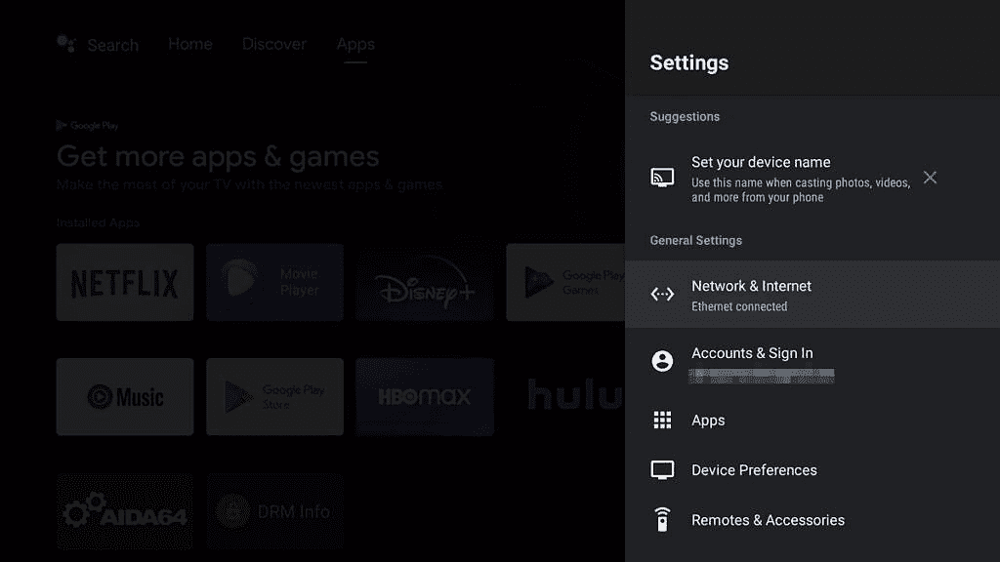
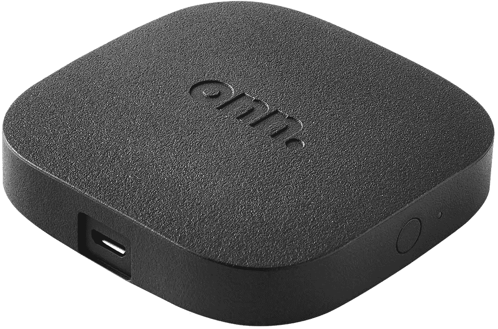

# 沃尔玛 Onn 安卓电视 4K 评论:30 美元一个引人注目的流媒体盒子

> 原文：<https://www.xda-developers.com/walmart-onn-android-tv-4k-review/>

多年来，安卓电视的一个主要问题是价格合理的流媒体机顶盒选择有限。谷歌对 Fire 电视棒和 Roku 流媒体棒的日益流行没有答案，少数低于 100 美元的安卓电视流媒体工具(如 [Mi Box S](https://www.xda-developers.com/xiaomi-mi-box-s-android-oreo-assitant-4k-hdr/) )的性能不佳，软件支持有限。

随着配备谷歌电视和其他一些设备的 [Chromecast 的推出，这种情况终于在去年开始改变。沃尔玛现在也加入了这场游戏，推出了两款安卓电视流媒体设备、一款更便宜的 1080p 记忆棒和一款 4K 盒子。后者拥有 29.88 美元的超低零售价(截至这篇评论发表时)，是目前最实惠的 4K 安卓电视设备。](https://www.xda-developers.com/google-chromecast-with-google-tv-streaming/)

名不副实的“沃尔玛 Onn 安卓电视 4K”是一款很棒的设备，但关于它的长期支持仍有一些未解的问题。

## 沃尔玛 Onn 安卓电视 4K:规格

| 

规格

 | 

沃尔玛 Onn 安卓电视 4K

 |
| --- | --- |
| **构建** | 塑料的 |
| **SoC** | 

*   Amlogic S905Y2
    *   4x ARM Cortex-A53(最高 1.8 GHz)
*   Mali G31 GPU

 |
| **闸板&存放** |  |
| **端口** | microUSB、HDMI |
| **连通性** | 

*   2.4/5 GHz 802.11 a/b/g/n/AC MIMO Wi-Fi
*   蓝牙 4.0

 |
| **软件** | 安卓电视 10.0 |
| **其他功能** | 

*   带电视音量/电源控制的遥控器
*   Chromecast 支持
*   谷歌助手

 |

*关于这篇评论:这个流媒体盒子是为了这篇评论从沃尔玛购买的，我已经用了大约一个星期了。沃尔玛没有参与这次审查的任何部分。*

## 设计和硬件

如果你对这个流媒体盒子很熟悉，那可能是因为你以前见过这个设计。正如 AFTV 新闻指出的[，沃尔玛的设备使用了与](https://www.aftvnews.com/walmarts-onn-android-tv-streaming-box-is-a-rebranded-dynalink-google-adt-3-reference-design/)[谷歌的 ADT-3 开发盒](https://store.askey.com/us/adt-3.html)相同的参考设计和硬件。同样是黑色塑料方形，圆角，一边是电源的 microUSB 接口，前面是 HDMI 接口。因为两边都会有电缆，所以这看起来不太可能放在你的电视旁边或媒体柜中——你唯一的选择是把它藏在你的电视后面。

不幸的是，microUSB 和 HDMI 是你唯一得到的端口。没有额外的 USB 端口或 microSD 卡插槽来增加更多的存储空间，也没有用于以太网的 LAN 连接器。带有谷歌电视的 Chromecast 同样缺乏连接选项，尽管谷歌出售了一个适配器来增加以太网支持。我假设适配器可以与这个盒子一起工作，因为我可以使用一个带有电源直通功能的 [microUSB OTG 适配器来连接各种 USB 设备(如以太网适配器和闪存驱动器)。](https://www.amazon.com/dp/B00LTHBCNM?tag=xda-471vvhu-20&ascsubtag=UUxdaUeUpU3526&asc_refurl=https%3A%2F%2Fwww.xda-developers.com%2Fwalmart-onn-android-tv-4k-review%2F&asc_campaign=Short-Term)

 <picture></picture> 

Ethernet connection on the Walmart Onn 4K with a microUSB adapter

内部硬件和其他低端安卓电视设备差不多。SoC 是一个 Amlogic S905Y2，一个四核 ARM 芯片，配有 8GB 存储(大约 5GB 可用)和 2GB RAM。不过，不要让这些规格欺骗了你 Onn box 的速度惊人。它启动速度快，动画流畅，大多数应用程序打开不超过几秒钟。我很高兴看到我们终于走过了廉价电视流媒体设备缓慢落后的时代。

沃尔玛采用了新的[谷歌 G10 参考设计](https://www.aftvnews.com/googles-g10-android-tv-remote-works-with-the-chromecast-and-shield-tv-but-not-with-fire-tvs/)的遥控器，其他一些安卓电视和谷歌电视设备也在使用这种遥控器。这是一个白色塑料遥控器，由两节 AAA 电池供电(包含在包装盒内)。除了 Onn 盒子本身的所有常见控制外，还有电视的音量和电源按钮，就像 Roku 和 Fire 电视遥控器一样。还有一个谷歌助手按钮(和一个麦克风)用于使用语音命令。

我对遥控器有两个主要问题。第一，外观颜色更多的是奶油色而不是纯白色，看起来有点脏。其次，底部的四个按钮是硬编码到流媒体服务(YouTube、网飞、迪士尼+和 HBO Max)的，不能更改以启动其他应用程序。流行的[按钮映射应用](https://play.google.com/store/apps/details?id=flar2.homebutton)似乎不能解决这个问题，但我想有人最终会找到解决办法。

## 软件

Onn 4K 盒子拥有完整的 Android TV 10.0 版本。这不是最新版本的 Android TV，但它与 Nvidia Shield 和最新的 Chromecast 的版本相同。Android TV 的大多数显著变化都是通过更新启动器和其他系统应用程序实现的，因此实际的操作系统版本并没有太大的关系。大多数应用程序仍然支持非常旧的 Android TV 版本(最新的网飞更新版本在 5.1 版本上运行)，所以即使沃尔玛从未更新这个盒子，你暂时也不会有兼容性问题。

Onn 4K 盒子是运行谷歌电视的*而不是*，谷歌电视是新 Chromecast 和其他一些电视/流媒体工具现在使用的[定制皮肤](https://www.xda-developers.com/new-google-tv-interface-replace-android-tv-ui/)。不过，这并不是很大的损失——尤其是谷歌已经开始将一些功能移植回 Android TV。这与谷歌电视设备在主屏幕上有相同的“发现”标签，Onn 4K 可以从 Play Store 下载并运行所有相同的应用程序。

与 ADT-3 和其他一些 Android 电视设备不同，它拥有网飞和迪士尼+全质量播放所需的所有 DRM 和加密密钥。它在我尝试的其他流媒体服务上也运行良好，包括 Hulu、Plex 和 Prime Video。

## 结论

Android TV 多年来一直缺少 Fire TV Stick 和低端 Roku 设备的竞争对手，除了 Mi Box line 等表现不佳的流媒体产品。配有谷歌电视的新 Chromecast 售价 49.99 美元，是一个很好的选择，但沃尔玛的盒子只便宜 20 美元。它有一个干净的 Android TV 10 版本，一个像样的遥控器，以及良好的性能——你不能要求比一个新的 PS5 游戏少一半的价格更多。

现在的一个警告是持续的软件支持。尚不清楚沃尔玛是否会推出重大的 Android 操作系统更新，尽管 Onn 4K 盒子与谷歌的开发盒子拥有相同的硬件。如果沃尔玛在每月补丁上懈怠，安全性也可能是一个问题。

如果你想要最便宜的支持 4K 和所有主流流媒体服务的安卓电视设备，这就是了。然而，如果你在寻找能够频繁(快速)更新软件的东西，带谷歌电视的 [Chromecast 可能值得多花 20 美元。](https://shop-links.co/1744580386841786532?u1=f6379ba2-1888-40da-8c91-ff5f85a6a7f7)

 <picture></picture> 

Onn Android TV UHD

##### Onn 安卓电视 UHD

沃尔玛的新 4K 流媒体盒子令人印象深刻，售价 30 美元，配有 Android TV 10。