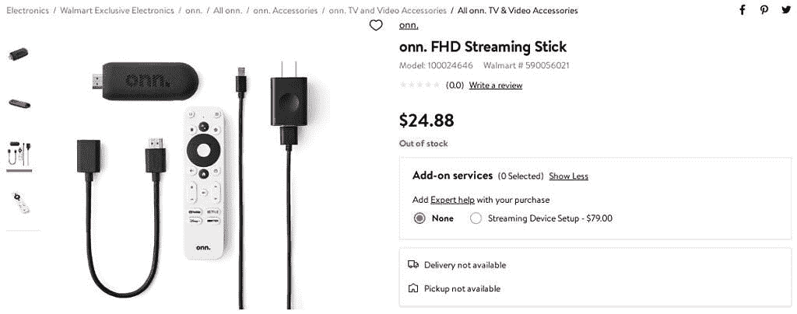

# 沃尔玛计划出售自己便宜得离谱的安卓电视流媒体棒

> 原文：<https://www.xda-developers.com/walmart-onn-fhd-absurdly-cheap-android-tv-streaming-stick/>

像许多其他零售店一样，沃尔玛在自己的“Onn”下销售各种科技产品和配件(大多数是 ODM 设计)品牌，以及苹果、谷歌、Roku 等更知名品牌的产品。该公司销售 Onn 品牌的电缆、配件，甚至安卓平板电脑，但现在沃尔玛正准备发布自己的安卓电视流媒体棒，而且真的很便宜(T2)。

沃尔玛，每个人最喜欢的[反竞争和低工资零售店](https://en.wikipedia.org/wiki/Criticism_of_Walmart)，最近为“onn”创建了一个[产品列表](https://www.walmart.com/ip/onn-FHD-Streaming-Stick/148740640)。FHD 流媒体棒”( [via *安卓电视指南*](https://twitter.com/AndroidTV_Rumor/status/1399274149835689991?s=19) )。你还不能买，但这支棍子的零售价是 24.88 美元。如果价格在发布前不变，这将使 Onn stick 成为迄今为止最便宜的 Android 电视流媒体盒子之一。带谷歌电视的 Chromecast 和 TiVo Stream 4K 的售价都是 50 美元(尽管经常以 40 美元的价格出售)，小米电视棒目前在美国的售价是 40 美元。在 Android 生态系统之外，Roku Express 的价格通常在 25 美元左右。

 <picture></picture> 

Onn Stick product listing on Walmart's website

产品清单没有很多具体的细节，但它确实确认了 1080p 的最大分辨率，杜比音频支持，1GB RAM，2.4GHz 和 5GHz Wi-Fi 支持，以及一个用于电源的 microUSB 端口。遥控器有一个谷歌助手按钮和一个麦克风，用于语音命令，以及 YouTube、网飞、迪士尼+和 HBO Max 的专用按钮。盒子里还有一个墙上电源适配器和 HDMI 延长线，以防电视上的 HDMI 或 USB 端口难以接入。

这款游戏棒是否能与亚马逊 Prime Video 兼容还有待观察，众所周知，亚马逊 Prime Video 在许多安卓电视设备上被屏蔽。网飞还屏蔽了未经该公司认证的电视设备上的内容播放，但遥控器上该服务的专用按钮表明网飞应该可用。沃尔玛也在[准备推出一款 4K 安卓电视盒子](https://www.xda-developers.com/walmart-onn-android-tv-box/)，售价约 30 美元。