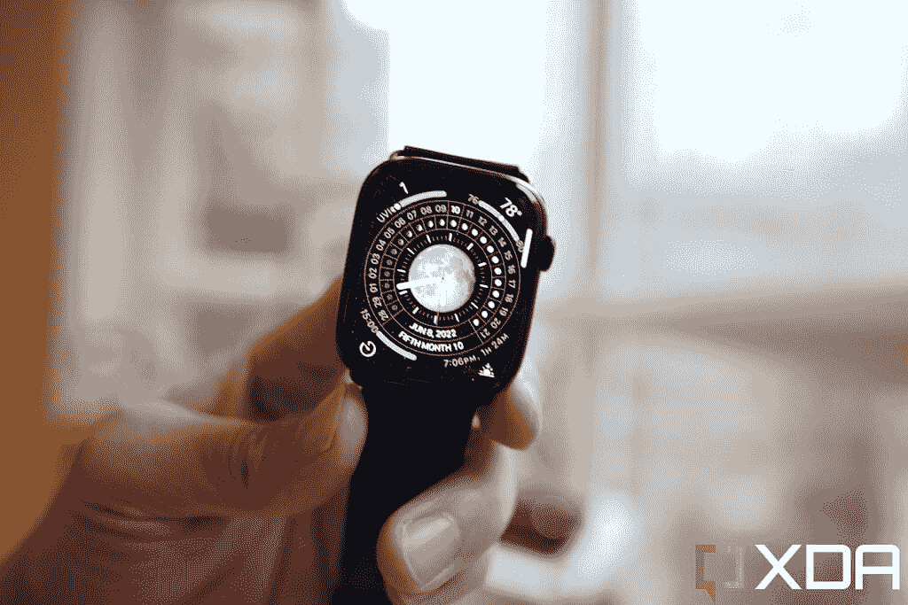
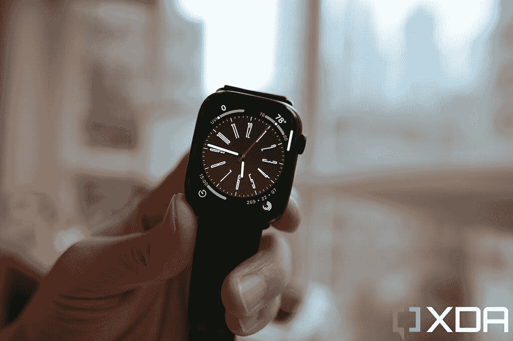
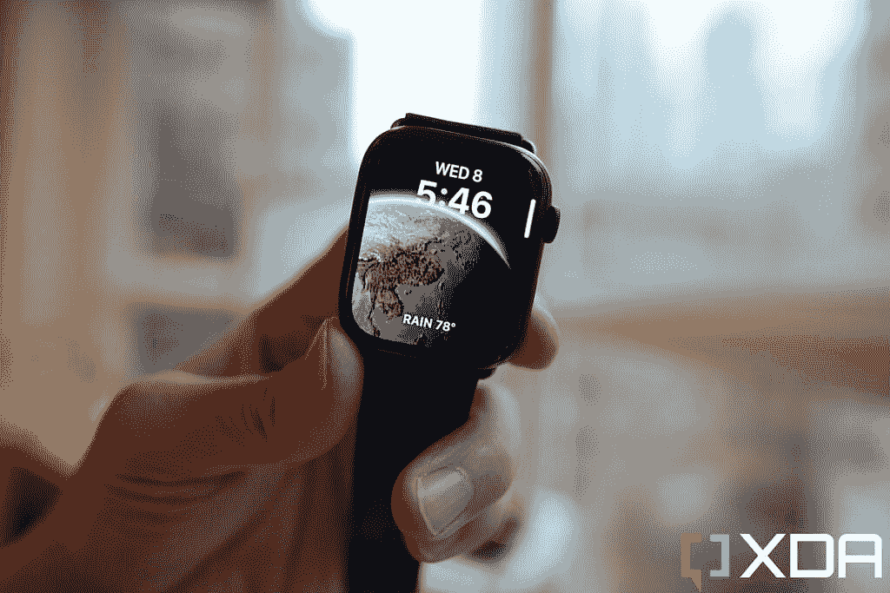
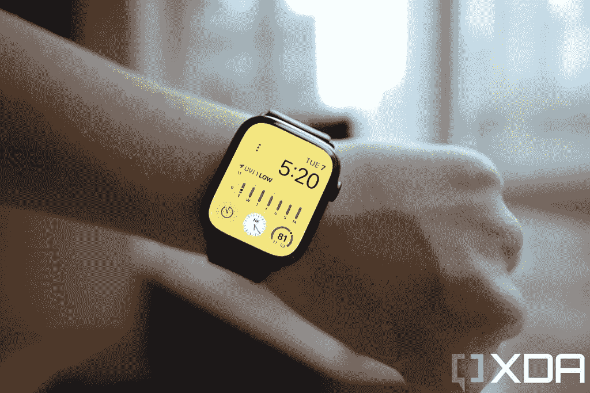
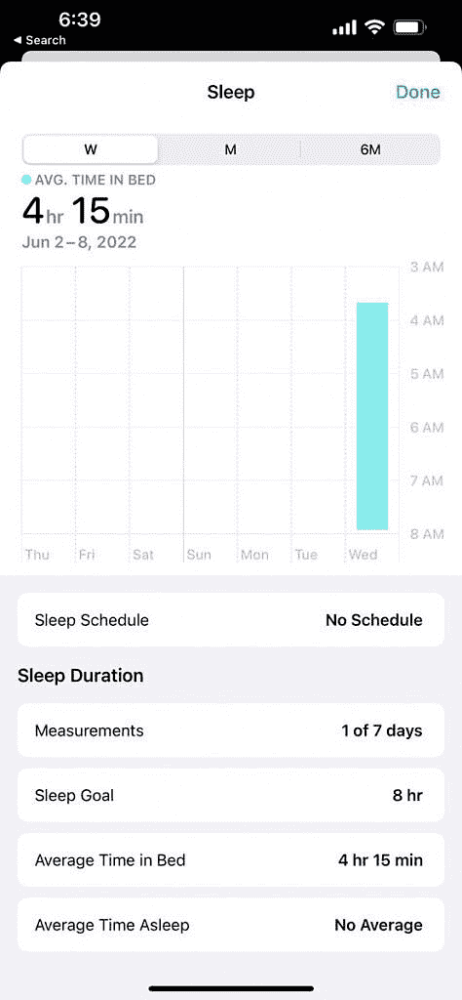
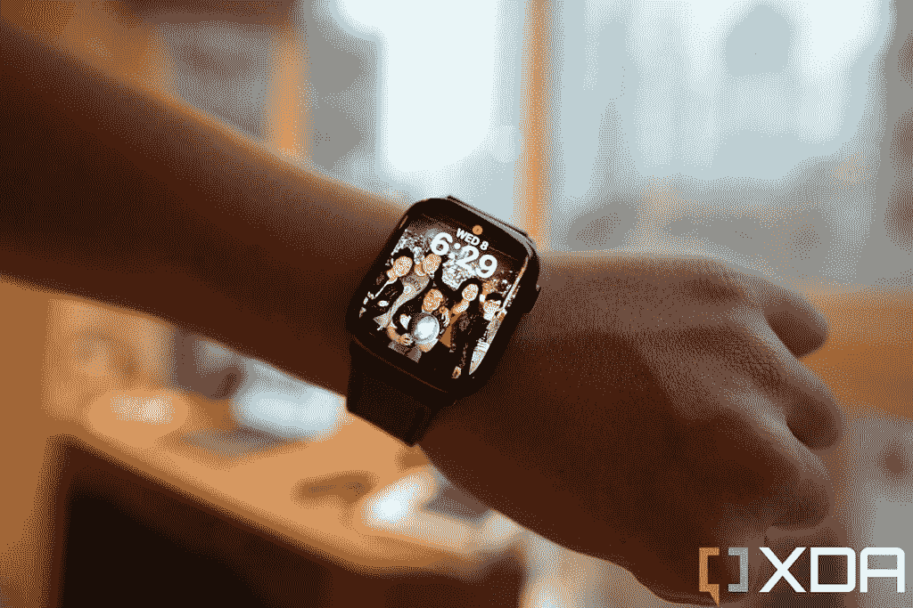
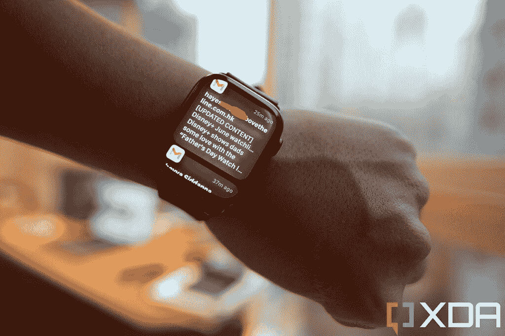

# watchOS 9 开发者 Beta 1 实践:专注于锻炼和睡眠的迭代改进

> 原文：<https://www.xda-developers.com/watchos-9-developer-beta-1-hands-on/>

与今年 WWDC(全球开发者大会)上宣布的所有其他软件更新相比，包括特别是改变游戏规则的 [iPadOS 16、](https://www.xda-developers.com/ipados-16/)用于[Apple Watch](https://www.xda-developers.com/best-apple-watch/)-[Watch OS 9](http://xda-developers.com/watchos-9)-的新软件是一次大部分迭代更新，有细微的改进。但随着这么多人佩戴 Apple Watch(据报道超过 1 亿)，以及可穿戴设备被定位为健康跟踪设备，watchOS 9 仍然是一个非常重要的更新。

我一直在我的 Apple Watch Series 7 上测试 watchOS 9 Developer Beta 1，虽然改进非常细微，但它们确实带来了有意义的好处，包括改善了睡眠和行走跟踪。以下是 watchOS 9 最显著的改进。

## 新表盘

每次新的 watchOS 更新都会带来新的手表外观，今年有四种:月球，大都会，娱乐时间和天文。所有这四个表盘都绘有厚重的图案，并根据手腕的运动或表冠的转动而呈现动画效果。

Lunar，顾名思义，是向包括中国、伊斯兰和希伯来在内的一些文化所使用的农历致敬。

 <picture></picture> 

Lunar watch face.

旋转数字表冠会在月亮周期中循环，这样你就可以看到月亮的哪个阶段与公历有关。你可以在每个角落设置四个复杂功能，不仅包括天气和下一个日历事件等基本信息，还包括微信和 Spotify 等第三方应用程序支持。

 <picture></picture> 

Metropolitan watch face

Metropolitan 腕表表盘采用经典设计，同时配备四种复杂功能。旋转表冠会使数字产生动画效果，数字的形状会变长。或许这是向经典的 1927 年科幻电影《大都会》致敬？

游戏时间，顾名思义，是一个异想天开，好玩，充满活力的表盘，似乎是为孩子们设计的。默认情况下，当手表不活跃时，它会保持暗色调，但当你抬起手腕时，它会亮起你选择的颜色(可以是黄色、红色、绿色等)。这是罕见的没有任何复杂功能的 Apple Watch 手表表面，意味着你只能看到时间——仅此而已，你不能与任何东西互动。

 <picture></picture> 

Astronomy watch face.

最好看的新表面，在我看来是天文学。这实际上是原始天文学手表表面的改进版本，但重新设计带来了新的星图和基于您的位置的当前云数据。您可以将地球、月亮或太阳系设置为主视图，并自定义字体。它只支持两种复杂功能，但屏幕上的地球是交互式的——你可以在地球上滑动来旋转它，或者旋转表冠来快进一天，看看地球如何旋转和形成的云。它在视觉上令人着迷，真正展示了典型的 Apple Watch 手表表面和 Android 智能手表上可用的手表表面之间的差异——没有一个接近这种程度的动画和图形。

如上所述，所有这些表盘都是精美的动画——下面的视频展示了它们的动作。

现有的手表表面也得到更新——我特别喜欢人像手表表面，它使用任何静态照片作为手表表面，但苹果的机器学习解密照片，并给它一点 3D 视差效果，有时会在主题后面放置字体，即使照片最初不是人像拍摄的。旋转表冠或移动手腕会将前景对象(比如说，您的头部)从背景移开。

最具功能性的表盘仍然是模块化的，watchOS 9 也对它进行了翻新，采用了可以定制的淡色背景，并支持多达六种复杂功能。

 <picture></picture> 

Modular watch face

这是我说 Apple Watch 是最好的智能手表的一个主要原因:复杂功能允许我在手腕上做智能手机的事情，例如开始录音或查看微信消息，甚至是谷歌 Keep notes。没有其他智能手表能达到这样的互动水平。

## 扩展锻炼视图

watchOS 9 的另一个新更新是扩展的锻炼视图和更精细的跟踪。例如，在步行或跑步锻炼中，Apple Watch 将结合使用陀螺仪、加速度计和机器学习来分析你的步态和步幅。

你可以在 iPhone 上的健康应用程序中看到非常详细的细分，但在 Apple Watch 上，你可以看到更多的锻炼数据。对于步行，我可以实时看到平均步速和步行距离。

对于铁人三项运动员，watchOS 9 现在支持一种新的多运动锻炼类型，可以使用运动传感器识别运动模式，在游泳、骑自行车和跑步锻炼的任何序列之间自动切换。我还没有时间带着手表真正锻炼(过去两天我住的地方一直在下雨)，但室内散步确实显示了准确的步数。我做了一些深蹲，手表能够检测到这一点，这可以从海拔的变化中看出。当天气变好的时候，我会去远足和跑楼梯来进一步测试高级锻炼追踪。苹果一直是这方面的领导者，watchOS 9 似乎保持着领先地位。

太糟糕了，这个测试软件没有提前一周发布——上周我在路上，每天走 25000 步；这将是一个很好的一周，可以看到 watchOS 9 改善跟踪的程度。

## 利用更多数据更好地跟踪睡眠

Apple Watch 已经能够跟踪睡眠好几年了(尽管最大的抱怨是缺乏自动睡眠跟踪和白天小睡跟踪)，但 watchOS 9 显然将通过使用更智能的机器学习(结合加速度计和心率监视器等传感器)来确定用户所处的特定睡眠阶段，从而改善常规睡眠跟踪。

我用“将明显改善”这个词是因为睡眠追踪似乎现在在测试版软件中不起作用——我戴着它连续睡了两个晚上；第一天晚上，我得到了一个简单的我在床上的时间记录，第二天晚上，手表根本没有跟踪。下面的截图是我的第一个晚上。

 <picture></picture> 

The Apple Watch was able to track my general sleep hours but did not pick up in-depth sleep data.

尽管如此，如果苹果承诺它正在发生，它肯定会最终可用。一旦该功能到来，它应该看起来像这个苹果分享的官方截图。

## **Siri 重新设计了新的通知功能**

Siri 有了一个新的外观，更符合 Siri 在 iOS 设备上的外观——Siri 现在是手表表面底部熟悉的圆形球体，通知现在是分组的——例如，如果我连续收到三封 Gmail 邮件，Gmail 通知卡会叠在一起，直到我点击它。

 <picture></picture> 

Siri now looks like his or herself on iPhones and iPads.

当然，你可以直接在手腕上阅读几乎整封电子邮件，这也是许多其他智能手表不允许我做的事情。

 <picture></picture> 

Gmail notifications were grouped until I tapped into it.

## 药物跟踪

watchOS 9 还引入了药物跟踪功能。这款应用可以在 Apple Watch 或 iOS 的健康应用中使用。这是一个空间，让用户管理和跟踪他们的药物，包括维生素和补充剂，设置时间表和提醒，等等。

我个人不服用任何药物，但我建立了一个虚拟档案，并编造了一些我正在服用的药物，这个过程是经过深思熟虑和直观的。用户可以输入他们的药物名称，使用 iPhone 的摄像头扫描药物标签来识别药物。然后，你可以设定服药的时间和频率，以及其他生活方式的选择(如吸烟、饮酒等)。该应用程序将通过 iPhone 或 Apple Watch 提醒你何时该服用下一剂药物。

在美国，该应用程序还会通知用户有关“关键互动”，例如提醒服药者避免饮酒或其他药物，以避免并发症。

## 其他变化

还有其他几个小的改进，如额外的语言支持，以及更新的日历应用程序，允许佩戴者直接在手腕上看到他们的整个一周，但很明显，watchOS 9 最大的改进在于帮助我们跟踪我们的健康状况——正确地行走和跑步，及时服药等。

对我来说，Apple Watch 仍然是最好的智能手表，因为我可以使用同类最佳的(智能手机)scribble 键盘和语音听写功能，直接在手腕上回复 Slack、WhatsApp 和微信消息。

 <picture></picture> 

Apple Watch Series 7

##### 苹果手表系列 7

Apple Watch Series 7 已经是一款出色的智能手表，watchOS 9 将带来进一步的改进，帮助巩固其作为市场上最好的可穿戴设备的地位。

如果你想尝试一下新软件，下面是如何在你的苹果手表上安装 watchOS 9 测试版的方法。