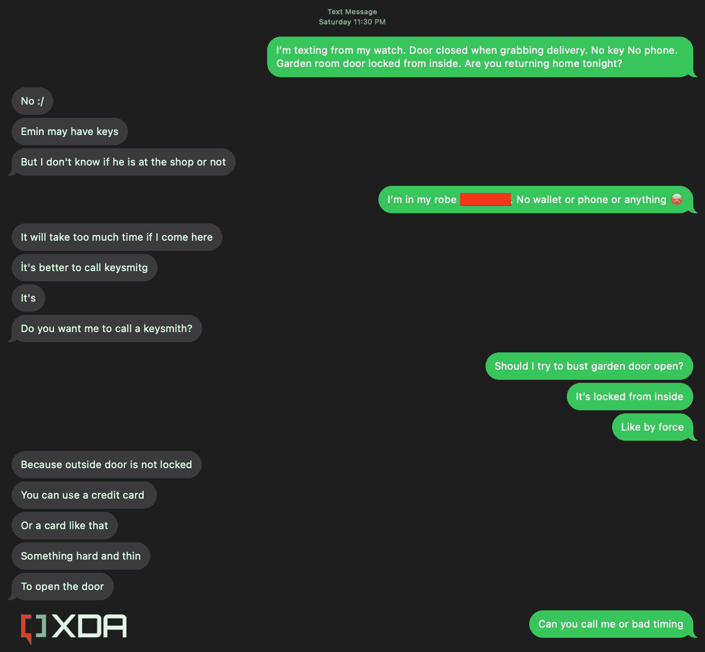

# 你的苹果手表有 3 种方法可以让你在新年前夜不被锁在外面吃炸鸡

> 原文：<https://www.xda-developers.com/ways-apple-watch-help-locked-outside/>

除夕是一年中最忙的夜晚之一。世界各地的人们与他们的家人和最亲密的朋友聚在一起吃、喝、唱、跳来庆祝新的一年的开始。通常，我会和我最好的朋友一起庆祝，因为我住在国外，远离我的家人。不过，这一次，我想独自度过一个安静的夜晚，看一些喜剧，听一些舒缓的音乐，并且通常避免去令人讨厌的拥挤的地方。

当渴望袭来的时候是晚上 11 点。我在网上订购并支付了一些炸鸡，耐心地等待门铃响。30 分钟左右，送货员到了，我冲到楼门口开锁，拿货。像往常一样，我穿了我家的睡袍，没有带钥匙、钱包或电话。我通常只是把门开着，因为接受快递只需要几秒钟。然而，九个多月来，我第一次回到家，发现房门不知何故被关上了。

我慌了。我试着穿过建筑大厅去我的后院，但是那天晚上早些时候我已经锁上了分开我的卧室和后院的门。我的室友在城市的另一个地方，离这里有几个小时的路程，那天晚上不打算回来。邻居们似乎也不在，没有身份证和合适的衣服，我哪儿也去不了。所有的希望似乎都破灭了。然后，我终于想起我戴的是我的 [Apple Watch](http://xda-developers.com/best-apple-watch) 。我用的是带 GPS 的 [Apple Watch Series 7](https://www.xda-developers.com/why-i-bought-apple-watch-7-not-8-editorial/) ，但我可以依靠它发短信和打电话，因为我的 [iPhone](http://xda-developers.com/best-iphone) 和路由器就在附近。我用听写功能给我的室友发短信，最终给他打了电话。我们试了几种方法开门，但他终于记得没锁房间的窗户。一百万年后我也不会想到这一点。

所以我没有去吃锁在外面楼梯上的炸鸡，而是进去了，这一切都是因为我有苹果手表。事实上，你可以使用很多智能手表来避免陷入类似的荒谬境地。

## 发短信和打电话

### 

如果你有一款苹果手表，并且有激活的手机套餐，那么无论你的 iPhone 在哪里，你都可以通过短信或 iMessage 给任何人发短信。如果你有一个只有 Wi-Fi 的版本，如果你连接到 Wi-Fi，你可以给别人发 iMessage 短信，如果你的 iPhone 在附近，你可以给他们发 SMS 短信。显然，在小屏幕上发短信是不切实际的，但在紧急情况下，这是一个可靠的解决方案。

如果你不想在小屏幕上打字，你可以使用听写(就像我一样)来发送信息，或者你可以通过你的运营商或 FaceTime 给任何人打电话。像发短信一样，FaceTime Audio 也可以通过 Wi-Fi 连接工作，即使你的手机不在。如果要通过运营商打电话，你需要附近有一款手机 Apple Watch 或者你的 iPhone。确保你的地址簿里有锁匠的电话号码。

## 定位您的 iPhone

如果你不确定你把 iPhone 或房子钥匙放在哪里，你可以依靠 Find My watchOS 应用程序在地图上找到它们并 ping 它们。您只需将手表连接到任何 Wi-Fi 网络，即可访问互联网。然而，要找到像钥匙这样的实物，你需要附上一个 [AirTag](https://www.xda-developers.com/apple-airtags-review/) 。

*   ##### 苹果 AirTag

    当你需要追踪一个物体时，苹果的 AirTag 提供了一个低成本、可靠的解决方案。它集成到“查找我的”网络中，这使得它可以被数百万其他苹果设备检测到。

*   ##### 苹果 AirTag 皮质钥匙圈

    苹果的皮质钥匙圈提供了一个口袋，可以插入你的 AirTag，还有一个金属环可以系上你的钥匙。不过，您需要单独购买 AirTag。

## 控制您的智能家居

如果你依赖一个兼容 HomeKit 或 Home Key 的门锁，你可以通过 Apple Watch 上的 Home 或 Wallet 应用程序分别解锁。这样，在你的手腕上轻轻一点，你就可以进入你的房子，然后担心以后找到你丢失的 iPhone 和物理钥匙。

## 没有 Apple Watch 怎么办？

如果你不是苹果用户，但有其他[最近的智能手表](https://www.xda-developers.com/best-smartwatches/)，那么你也许可以用你的 Wear OS 设备和 Android 手机复制其中一些任务。例如，如果你有一个 [Pixel 手表](https://www.xda-developers.com/google-pixel-watch-review/)，它有一个活跃的蜂窝计划，当你的 Android 智能手机不在时，你可以给人们发信息和打电话。如果你有一个只有 Wi-Fi 的智能手表，如果你的 Android 手机在蓝牙范围内，你可能仍然可以打电话给别人。

然而，定位你的 Android 手机不会那么容易，因为没有官方途径可以使用你的手表查看[查找我的设备](https://www.xda-developers.com/how-to-find-lost-android-device/)地图。相反，你可以通过在表盘上向下滑动并点击“查找我的手机”按钮来 ping 它。请注意，智能手机必须在蓝牙范围内才能响铃。你同样可以依靠 Tile 或 Galaxy SmartTag 追踪器来定位丢失的钥匙，但仍然需要依靠你的手机来获取信息。

最后，如果你使用的是 Wear OS 智能手表，你可能可以通过手表的 Google Home 应用程序或支持型号上的三星 SmartThings 应用程序来控制你的兼容锁。你还可以探索你的智能锁的品牌是否可以与 IFTTT automations 搭配，你或许可以通过专用的 IFTTT Wear OS 应用程序来运行。

* * *

所有这些都是说，我们不应该把智能手表视为理所当然的东西，或者把它们视为不必要的配件。只有在你最不经意的时候，你才会意识到它们的价值，它们能以最不可预知的方式帮助你。例如，我们总是会读到关于 Apple Watch 早期检测某些医疗状况或通过坠落/碰撞检测和紧急求救来拯救生命的故事。然而，这款[功能强大的智能手表](https://www.xda-developers.com/apple-watch-more-than-fitness/)在隐喻意义上也是救命恩人。如果我没有在除夕夜穿上它，我会在那个寒冷的夜晚睡在大楼大厅的地板上，并在与宇宙的不愉快中开始我的新年。

*   Apple Watch SE 2 错过了高端机型上提供的一些无关紧要的功能，比如永远显示、快速充电和心电图。但对于预算有限的人来说，它仍然是完美的可穿戴设备。

    T13
*   Apple Watch Series 8 是苹果公司最新的智能手表。与 Series 7 相比，这不是一个巨大的变化，但它提供了一些新功能，如碰撞检测、新的温度传感器等。