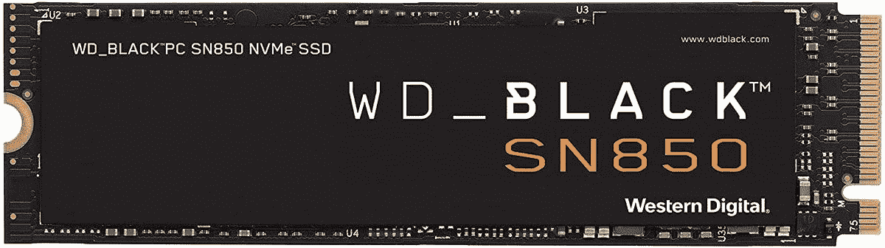

# PS5 的最佳固态硬盘在这次黄金日交易中创下了新的最低价

> 原文：<https://www.xda-developers.com/wd-black-sn850-prime-day-deal/>

一台杀手级游戏 PC 和 PS5 有什么共同点？[超赞的 SSD 存储](https://www.xda-developers.com/ps5-update-storage-expansion-m2-ssd/)。无论你玩的是哪一方的游戏，WD Black SN850 都是一样的好东西。这是你能买到的最好的 PCIe 4.0 固态硬盘之一，非常适合 PC 和主机用户。更好的是，Prime Day 通过一些重大折扣让您的存储游戏变得更加轻松。

如果你想买 1TB 或 2TB 版本的 SN850，你可以节省一大笔钱，因为这两个版本都创下了亚马逊的最低价。1TB 的价格降到了 110 美元，而 2TB 的价格可以翻倍，只需 190 美元。我在我自己的 PS5 上运行 WD Black SN850，这是一项了不起的投资。再多花一点钱，你就可以把散热器包括在内，但老实说，即使在 PS5 上，它也不是完全必要的。

那为什么这么好吃呢？作为 PCIe 4.0，你会得到非凡的性能。以 1TB 型号为例，可以获得高达 7，000 MB/s 的读取速度和 5，300 MB/s 的写入速度。当然，这是在 PC 上评价的，尽管即使是在 PS5 上，你也会从中受益匪浅。即使在我的 500GB 机型上，PS5 的写入速度也超过了 6000 MB/s。足以满足主机内部存储的需求。

 <picture></picture> 

WD Black SN850 PCIe 4.0 SSD

##### WD Black SN850 PCIe 4.0 固态硬盘

市场上最好的 PCIe 4.0 固态硬盘之一，是用于游戏 PC 或 PS5 的完美驱动器。

在 PC 中，它很强大，有了 2TB 版本，你可以为自己准备一个方便、超快的 Windows 启动驱动器以及存储你最喜欢的游戏的空间。在 PS5 上，您可以获得更多空间来存储游戏，并充分利用主机的硬件和功能。在 PC 上，还有一个配套的应用程序，可以帮助您从固态硬盘中获得最大的性能。其实还算不错的 app。

当 7 月 13 日 Prime Day 结束时，这些折扣将会消失，所以请及时购买。