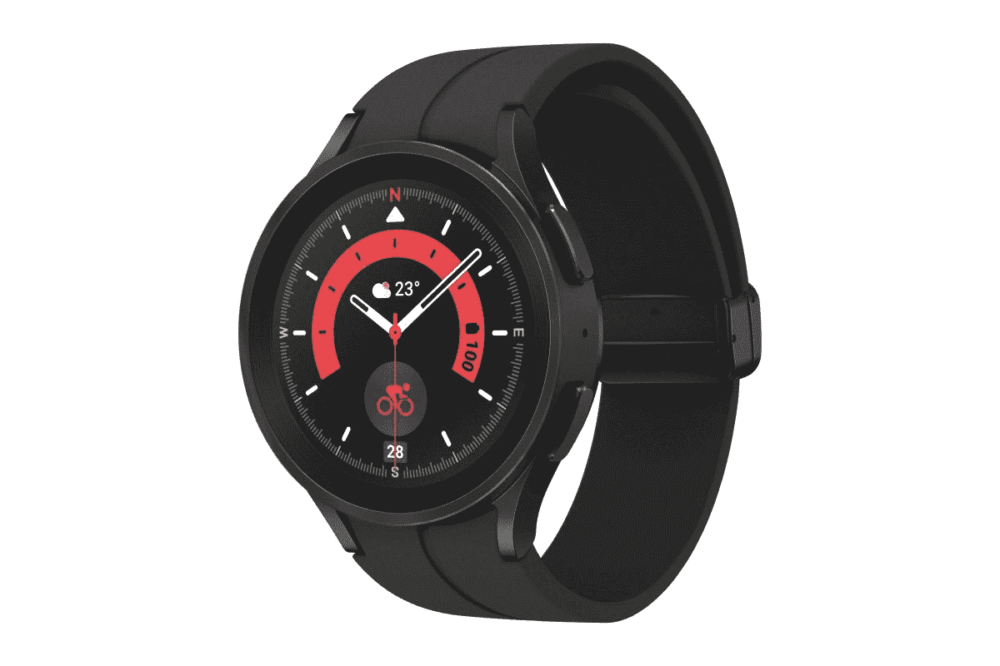
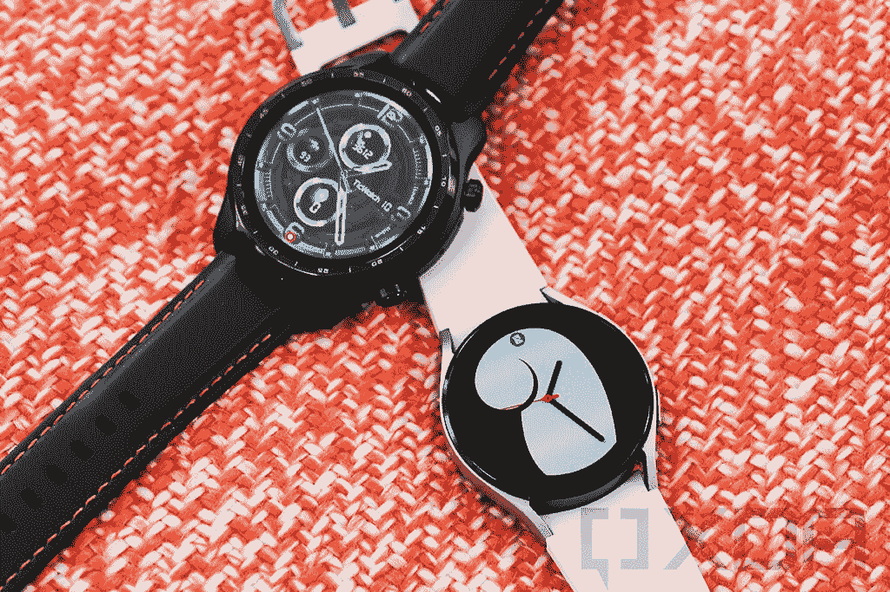

# 缺乏真正的竞争是 Galaxy Watch 5 获得“最佳穿戴操作系统智能手表”桂冠的原因

> 原文：<https://www.xda-developers.com/wear-os-lack-of-competition-editorial/>

在首款佩戴式操作系统手表 Galaxy Watch 4 取得巨大成功后，三星又推出了一款续作。新的 [Galaxy Watch 5](https://www.xda-developers.com/samsung-galaxy-watch-5-review/) 是对其前身的一次令人难以置信的小更新。它采用了相同的设计，相同的 Exynos W920 处理器，相同的显示屏，几乎相同的传感器(除了新的温度传感器)。虽然 Galaxy Watch 5 与上一代相比没有太大的改进或新功能，但它仍然是[最佳佩戴 OS 手表](https://www.xda-developers.com/best-smartwatches/)。

## Galaxy Watch 4 和 5 完全是三星手表

我们不得不称 Galaxy Watch 5 为 Android 的最佳智能手表，不是因为它毫无瑕疵，是一款完美的产品，而是因为 Wear OS 领域缺乏真正的竞争和力量失衡。难怪三星认为除了略微更好的电池寿命和充电速度(以及截至目前没有实际用途的温度传感器)之外，没有必要为 Galaxy Watch 5 添加任何值得注意的东西。因为它没有挑战极限的动机。在将近一年的时间里，Wear OS 3 是 Galaxy Watch 4 系列的专属。这确保了当 Galaxy Watch 5 系列推出时，市场上不会有任何可行的替代智能手表运行新软件。

就像它的前辈一样，Galaxy Watch 5 是彻头彻尾的三星手表*。当然，你可以将它与任何 Android 手机连接，但你不会获得完整的体验。当手表与非三星手机配对时，心电图和血压监测等功能无法工作，你必须借助[使用修改后的三星健康应用来解决这个](https://www.xda-developers.com/how-to-enable-ecg-blood-pressure-monitoring-samsung-galaxy-watch-4/)。你也不能重新编程三星支付按钮来启动谷歌钱包。更不用说，还有一个痛苦漫长的设置过程，需要安装半打三星应用程序。如果你想购买一款 Wear OS 3 智能手表，可以与任何 Android 手机兼容，没有任何限制或约束，目前没有可行的选择——除非你能负担得起昂贵的万宝龙 Summit 3。你最好的选择是等待即将到来的 [Pixel Watch](https://www.xda-developers.com/google-pixel-watch/) 。*

 <picture></picture> 

Samsung Galaxy Watch 5

Galaxy Watch 5 是市场上最好的 Wear OS 智能手表，提供了令人惊叹的设计、耐用的构造和强大的性能。

 <picture></picture> 

Samsung Galaxy Watch 5 Pro

Galaxy Watch 5 Pro 面向健身爱好者，比标准的 Galaxy Watch 5 更耐用，电池更大。

## 佩戴操作系统智能手表的选择仍然有限

当谷歌和三星去年推出 Wear OS 3 时，它为 Android 可穿戴平台注入了新的希望。但快进到 2022 年，你现在能买到的 Wear OS 3 手表只有 Galaxy Watch 4、Galaxy Watch 5 和超级贵的万宝龙 Summit 3。除了备受期待的谷歌 Pixel Watch 和今年秋天推出的 TicWatch，我们还没有听到其他公司关于他们今年推出 Wear OS 3 手表的计划。小米、一加和摩托罗拉等大型智能手机原始设备制造商迄今没有表现出任何发布 Wear OS 智能手表的兴趣，这看起来也不太乐观。

如果重新设计的 Wear OS 平台仍然掌握在少数原始设备制造商手中，谷歌继续给予三星优惠待遇，我们可能永远不会看到可穿戴平台发挥其全部潜力。缺乏竞争对消费者没有好处，对 Wear OS 的未来也没有好处。

如果谷歌继续给三星优惠待遇，我们可能永远不会看到 Wear OS 平台发挥其全部潜力。

在 Galaxy Watch 4 到来之前，Mobvoi 的 TicWatch 3 Pro 被认为是最好的 Wear OS 智能手表。凭借其有趣的双屏和双处理器设置，它提供了强大性能和多天电池续航时间的完美融合，这是其他 Wear OS 手表之前没有实现的。这是第一款符合所有条件的 Wear OS 智能手表:流畅的性能、出色的电池续航时间、出色的显示和出色的健康跟踪。

 <picture></picture> 

Mobvoi TicWatch 3 Pro and Samsung Galaxy Watch 4

如果谷歌希望看到 Wear OS 获得更大的普及和成功，它一定不能走排他性和优惠的路线。谷歌面前的任务是让更多的原始设备制造商加入进来，并给予他们平等的机会和支持，让他们能够向市场推出更多基于 Wear OS 的智能手表。

自从 2014 年平台推出以来，我们一直在等待 Wear OS 最终起飞。总有这样一种错觉，认为更好的穿戴式操作系统手表只需要一代人的时间，下一次更新将最终解决平台的所有问题，这种即将到来的处理器将最终解决性能和效率问题。

## 高通新的可穿戴芯片再次给我们带来了希望

从更积极的方面来看，高通的新可穿戴芯片看起来非常有前途，可能最终会吸引更多的玩家加入穿戴操作系统联盟。与旧的骁龙可穿戴芯片组不同，新的骁龙 Wear 5 Plus 完全是为可穿戴设备设计的，而旧的芯片组只是在效率低下和过时的工艺节点上构建的移动芯片。

高通表示，与骁龙 4100 平台相比，新芯片带来了显著的代际改进，包括电池寿命延长 50%，性能提高一倍，尺寸缩小 30%。到目前为止，Mobvoi 已经证实，今年秋天推出的下一款 TicWatch 将搭载骁龙 W5 Plus。

随着高通终于宣布了一款强大的可穿戴芯片，谷歌终于推出了自己的智能手表，我们再次忍不住对 Wear OS 的未来持积极态度。这究竟是又一个幻觉，还是引领 Wear OS 走向成功的转折点，只有时间才能证明。