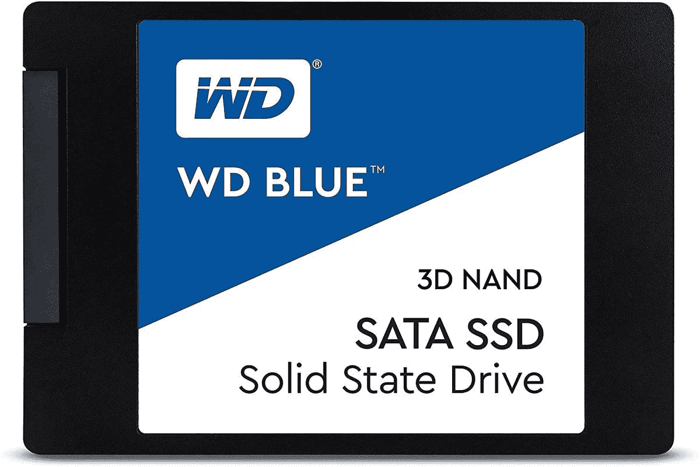

# 购买 Western Digital WD Blue 2TB 固态硬盘仅需 169 美元，这是迄今为止最低的价格

> 原文：<https://www.xda-developers.com/western-digital-wd-blue-2tb-169/>

# 购买 Western Digital WD Blue 2TB 固态硬盘仅需 169 美元，这是迄今为止最低的价格

Western Digital WD Blue 2TB SSD 在亚马逊上的价格是最低的，它将成为任何计算机的良好补充。

固态硬盘对于老旧的电脑来说是一个很好的升级，因为它们比传统硬盘快得多。获得大量空间也很好，因为当固态硬盘装满时，它们会变得更慢。拥有大量可用空间意味着您的固态硬盘将保持快速运行。它们还可以作为游戏和其他大型应用程序的额外存储，因为它们可以快速启动。如果你在市场上寻找更多的存储空间，你不会错过亚马逊上仅售 169 美元的 Western Digital WD Blue 2TB SSD，这是迄今为止的最低价。更重要的是，它通过一个普通的 SATA 端口连接，所以它应该与几乎所有的机器兼容。

 <picture></picture> 

WD Blue 2TB

##### WD 蓝色硬盘

WD Blue 2TB 的价格是迄今为止最低的，它将成为任何一台驱动器老化的计算机或者只需要更多存储空间的计算机的良好补充。

选择备用固态硬盘的理由有很多，像 2TB 价格低至 169 美元的固态硬盘这样可靠的固态硬盘并不常见。Western Digital 在存储驱动器领域已经存在多年，WD Blue 是您今天可以买到的最实惠的固态硬盘之一。它的顺序读取速度高达 560MB/s，顺序写入速度高达 530MB/s，这意味着它应该可以处理几乎所有的东西。它插入计算机上的标准 SATA 端口，并使用与 PC 中任何其他硬盘驱动器相同的电源供电。

固态硬盘非常适合存储需要快速访问的文件，如游戏或大型项目文件。2TB 也是一个很大的空间，如果你选择用它来玩游戏，你可以在上面放很多游戏。您还可以将它用作电影、音乐、电视节目等的快速存储设备。它没有三星 980 Pro 这样的 M.2 SSD 那么快[，但它肯定会以更低的成本完成这项工作。](https://www.xda-developers.com/samsung-980-pro-lowest-price-uk/)