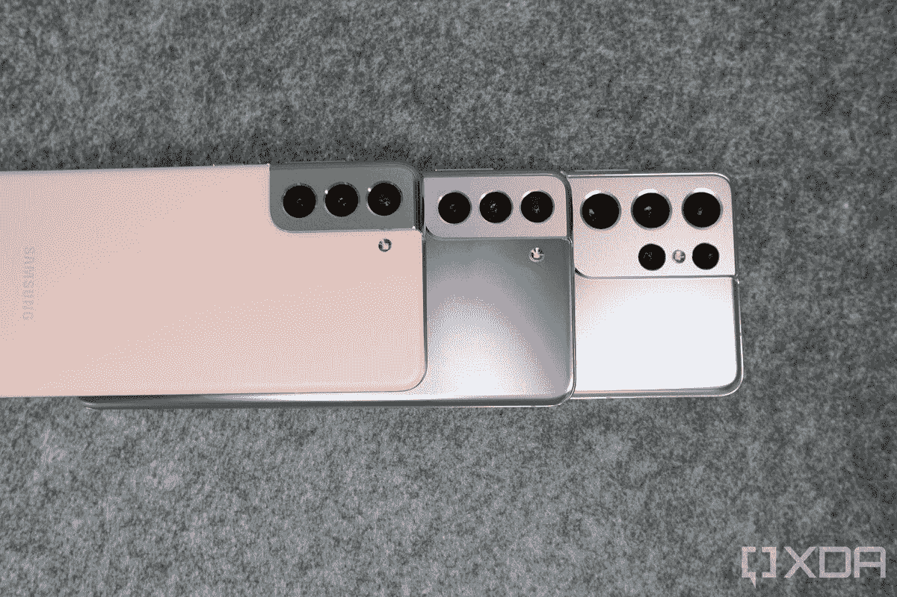
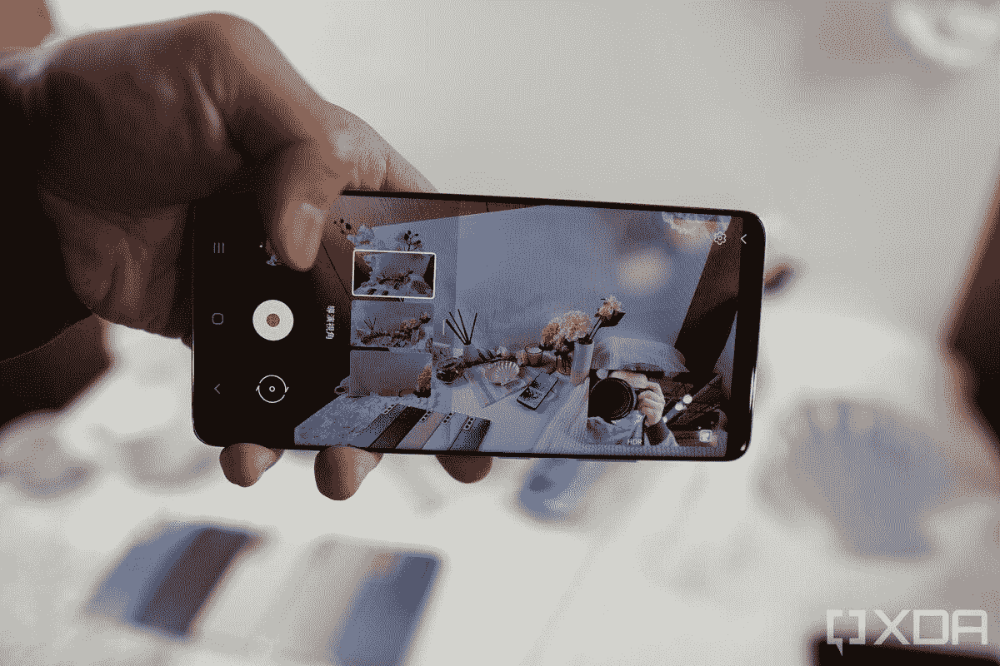
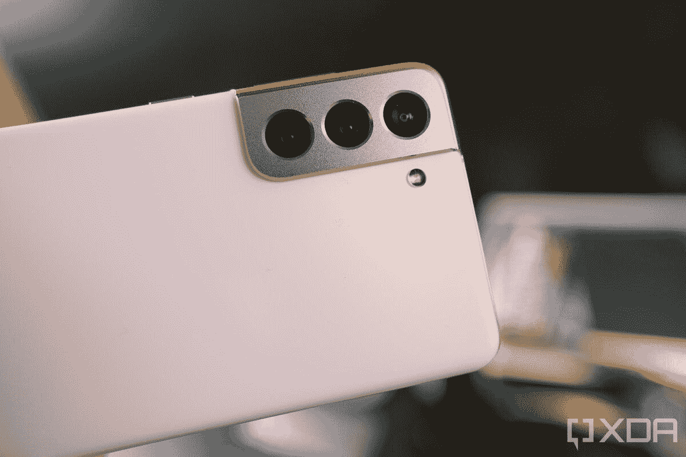
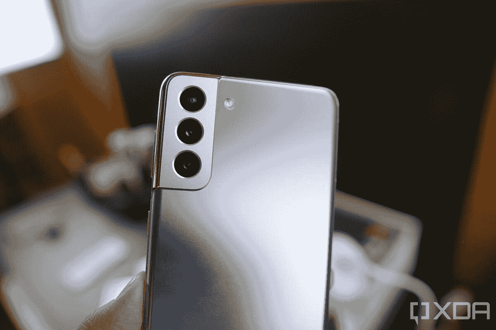
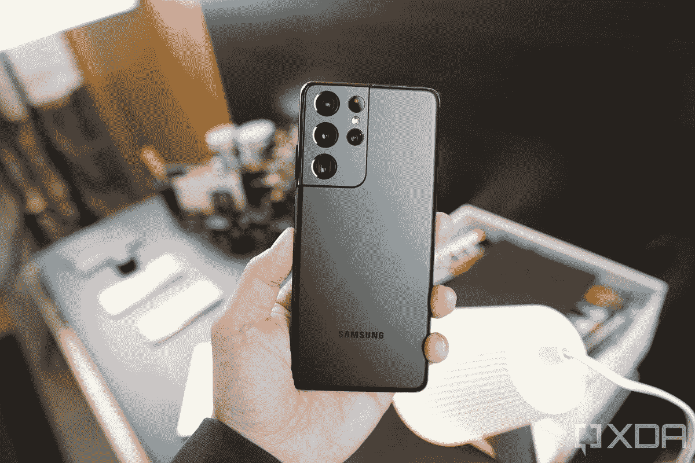
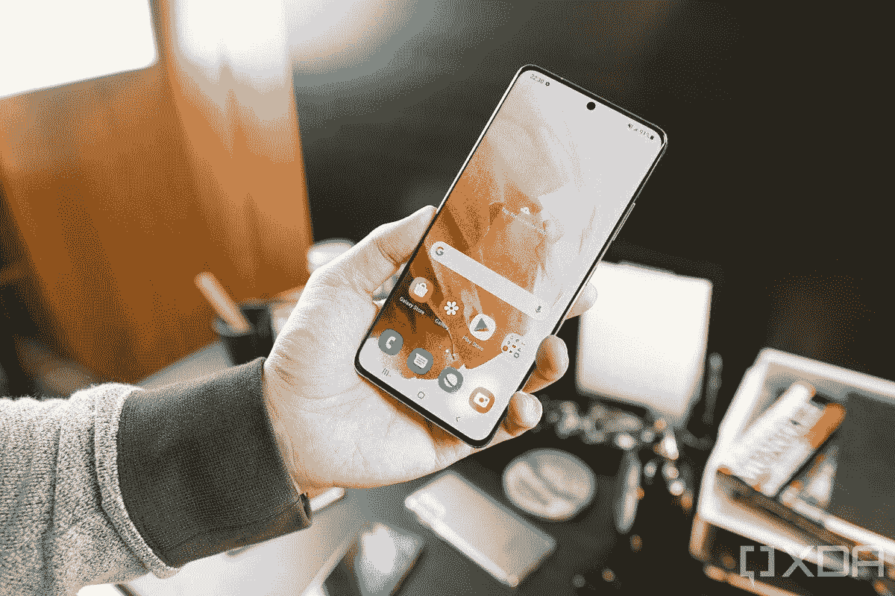
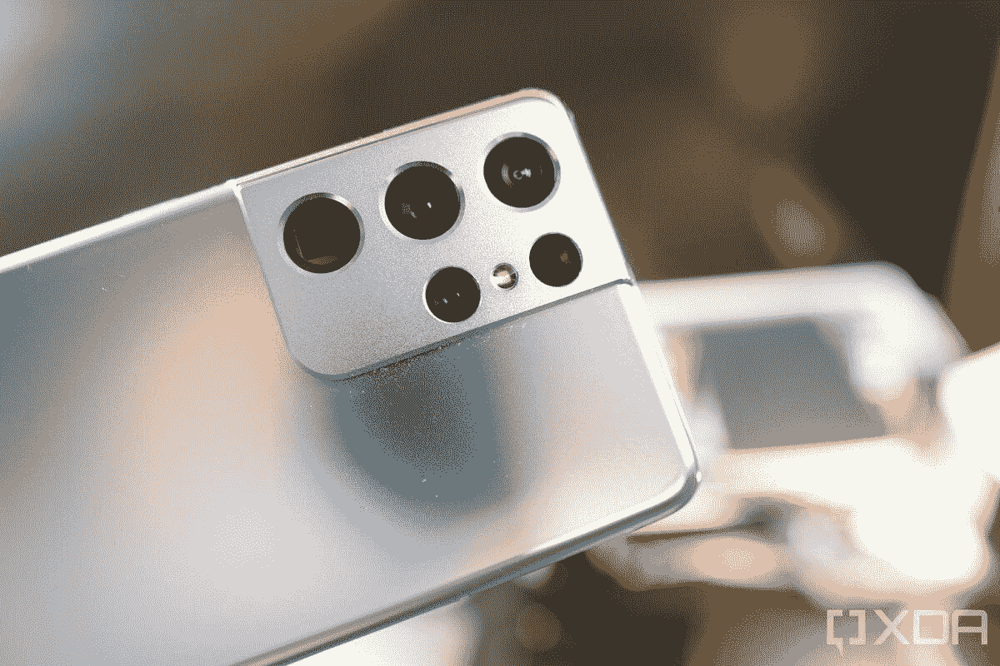
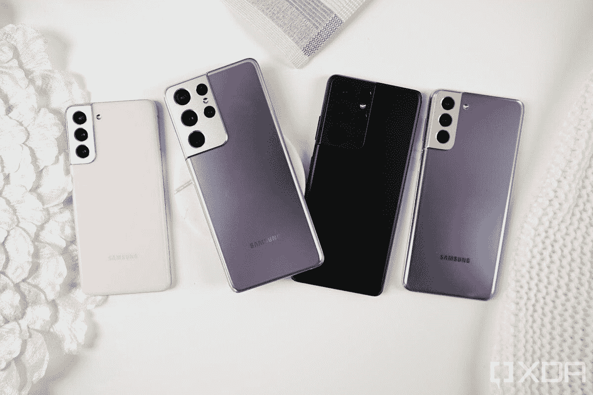

# 三星 Galaxy S21 应该买哪款？普通的，高级的还是超高级的？

> 原文：<https://www.xda-developers.com/which-galaxy-s21-should-you-buy/>

三星 Galaxy S21 系列已经上市，有三款不同的手机可供选择，三星表示每个人都有一款 Galaxy S21。与前几年不同的是，Galaxy S21 系列的所有产品都是一样的:Galaxy S21 和 Galaxy S21 Plus 是为那些想要实惠的旗舰体验的人设计的，而 Galaxy S21 Ultra 提供了你在智能手机中想要的一切。

有很多相似之处，但也有不少不同之处——即使在 Galaxy S21 和 Galaxy S21 Plus 之间也是如此——那么它们是什么，你应该购买哪一款？在这里，我们列出了所有的相似之处、不同之处以及您应该(或不应该)购买每种型号的原因！

### 三星 Galaxy S21

三星 Galaxy S21 是 2021 年新旗舰系列的起点，包装在一个旗舰 SoC 中，以及一个体面的显示器和相机设置。

**Affiliate Links**

Store

[View at Store](https://shop-links.co/1729155463072939240?u1=68a1d2c8-89df-40c0-9c07-a19ba00f5993)

### 三星 Galaxy S21 Plus

三星 Galaxy S21 Plus 是 2021 年新旗舰系列中的老二，集旗舰 SoC 和高级构建于一身，配有体面的显示屏和摄像头设置。

**Affiliate Links**

Store

[View at Store](https://shop-links.co/1729155463072939240?u1=68a1d2c8-89df-40c0-9c07-a19ba00f5993)

### 三星 Galaxy S21 Ultra

三星 Galaxy S21 Ultra 是 2021 年新旗舰系列中的终极杀手锏，集旗舰 SoC、高级构建、出色的显示屏和令人惊叹的相机设置于一身，同时还具备高级旗舰产品应有的所有额外功能。

**Affiliate Links**

Store

[View at Store](https://shop-links.co/1729155463072939240?u1=68a1d2c8-89df-40c0-9c07-a19ba00f5993)

每部手机在家庭中都有一席之地，这三种设备之间有一些微妙和不那么微妙的差异值得考虑。以下是这三款设备的完整规格列表:

### 三星 Galaxy S21、Galaxy S21 Plus 和 Galaxy S21 Ultra 全规格列表

| 

规范

 | 

三星 Galaxy S21

 | 

三星 Galaxy S21+

 | 

三星 Galaxy S21 Ultra

 |
| --- | --- | --- | --- |
| **建造** | 

*   铝制中框
*   塑料背面
*   大猩猩玻璃 Victus 正面

 | 

*   铝制中框
*   大猩猩玻璃 Victus 回
*   大猩猩玻璃 Victus 正面

 | 

*   铝制中框
*   大猩猩玻璃 Victus 回
*   大猩猩玻璃 Victus 正面

 |
| **尺寸&重量** | 

*   151.7 x 71.2 x 7.9 毫米
*   171 克

 | 

*   161.5 x 75.6 x 7.8 毫米
*   202 克

 | 

*   165.1 x 75.6 x 8.9 毫米
*   229 克

 |
| **显示** | 

*   6.2 英寸 FHD+平板动态 AMOLED 2X 显示屏
*   2400 x 1080 像素
*   421 PPI
*   120Hz 可变刷新率
*   20:9 宽高比
*   HDR10+
*   1300 尼特峰值亮度
*   始终显示
*   无限显示

 | 

*   6.7 英寸 FHD+平板动态 AMOLED 2X 显示屏
*   2400 x 1080 像素
*   394 PPI
*   120Hz 可变刷新率
*   20:9 宽高比
*   1300 尼特峰值亮度
*   HDR10+
*   始终显示
*   无限显示

 | 

*   6.8 英寸 QHD+动态 AMOLED 2X 曲面显示屏
*   3200 x 1440 像素
*   515 磅每英寸
*   120Hz 可变刷新率
    *   支持 120 赫兹 QHD+频率
    *   10-120 赫兹
*   20:9 宽高比
*   1500 尼特峰值亮度
*   HDR10+
*   始终显示
*   无限显示

 |
| **SoC** | 

*   **国际:** Exynos 2100:
    *   1x ARM Cortex X1 @ 2.9GHz +
    *   3 个 ARM Cortex A78 内核，2.8GHz 以上
    *   4 个 ARM Cortex A55 内核@ 2.2GHz
*   美国:高通骁龙 888:
    *   1 个 Kryo 680 Prime 内核@ 2.84GHz
    *   3 个 Kryo 680 性能内核@ 2.4GHz
    *   4 个 Kryo 680 高效内核@ 1.8GHz

 | 

*   **国际:** Exynos 2100:
    *   1x ARM Cortex X1 @ 2.9GHz +
    *   3 个 ARM Cortex A78 内核，2.8GHz 以上
    *   4 个 ARM Cortex A55 内核@ 2.2GHz
*   **美国:**高通骁龙 888:
    *   1 个 Kryo 680 Prime 内核@ 2.84GHz
    *   3 个 Kryo 680 性能内核@ 2.4GHz
    *   4 个 Kryo 680 高效内核@ 1.8GHz

 | 

*   **国际:** Exynos 2100:
    *   1x ARM Cortex X1 @ 2.9GHz +
    *   3 个 ARM Cortex A78 内核，2.8GHz 以上
    *   4 个 ARM Cortex A55 内核@ 2.2GHz
*   美国:高通骁龙 888:
    *   1 个 Kryo 680 Prime 内核@ 2.84GHz
    *   3 个 Kryo 680 性能内核@ 2.4GHz
    *   4 个 Kryo 680 高效内核@ 1.8GHz

 |
| **RAM &存储** | 

*   8GB LPDDR5 + 128GB
*   8GB + 256GB

 | 

*   8GB LPDDR5 + 128GB
*   8GB + 256GB

 | 

*   12GB LPDDR5 + 128GB
*   12GB + 256GB
*   16GB + 512GB

 |
| **电池&充电** | 

*   4000 毫安时
*   25W USB 供电 3.0 快充
*   15W 无线充电
*   4.5 反向无线充电
*   大多数地区包装盒中没有充电器

 | 

*   4800 毫安时
*   25W USB 供电 3.0 快充
*   15W 无线充电
*   4.5 反向无线充电
*   大多数地区包装盒中没有充电器

 | 

*   5000 毫安时
*   25W USB 供电 3.0 快充
*   15W 无线充电
*   4.5 反向无线充电
*   大多数地区包装盒中没有充电器

 |
| **安全** | 超声波显示指纹扫描仪 | 超声波显示指纹扫描仪 | 超声波显示指纹扫描仪 |
| **后置摄像头** | 

*   **主:** 12MP，广角镜头，f/1.8，1/1.76”，1.8 米，OIS，双像素自动对焦
*   **次要:** 12MP，超广角镜头，f/2.2，120 FoV，1/2.55”，1.4 m
*   **第三:** 64MP，长焦镜头，f/2.0，1/1.76”，0.8 m，OIS PDAF

 | 

*   **主:** 12MP，广角镜头，f/1.8，1/1.76”，1.8 m，OIS，双像素自动对焦
*   **次要:** 12MP，超广角镜头，f/2.2，120 FoV，1/2.55”，1.4 m
*   **第三:** 64MP，长焦镜头，f/2.0，1/1.76”，0.8 米，OIS PDAF

 | 

*   **初级:** 108 MP，广角镜头，f/1.8，79，24mm，1/1.33 "，0.8 m(诺娜-宁滨前)，OIS，PDAF，激光自动对焦
*   **次要:** 12 MP，超广角镜头，f/2.2，120 FoV，13mm，1/2.55”，1.4 m，双像素自动对焦
*   **第三:** 10 MP，长焦镜头，f/2.4，35，72mm，1/3.24”，1.22 m，OIS，3 倍光学变焦
*   **四元:**1000 万像素，长焦镜头，f/4.9，10，240 毫米，1/3.24 英寸，1.22 米，OIS，10 倍光学变焦

视频:

*   所有前置和后置摄像头的 4K 为 60fps

 |
| **前置摄像头** | 100 万像素，f/2.2，1.22 米，双像素 PDAF | 100 万像素，f/2.2，1.22 米，双像素 PDAF | 40MP，f/2.2，0.7 米，PDAF |
| **端口** | USB 3.2 类型 C | USB 3.2 类型 C | USB 3.2 类型 C |
| **音频** | 

*   AKG 的立体声扬声器
*   杜比大气

 | 

*   AKG 的立体声扬声器
*   杜比大气

 | 

*   AKG 的立体声扬声器
*   杜比大气

 |
| **连通性** | 

*   蓝牙 5.1
*   国家足球联盟
*   无线网络 6
*   5G

 | 

*   蓝牙 5.1
*   国家足球联盟
*   无线网络 6
*   5G

 | 

*   蓝牙 5.1
*   国家足球联盟
*   Wi-Fi 6E
*   5G

 |
| **软件** | 基于 Android 11 的三星 One UI 3.1 | 基于 Android 11 的三星 One UI 3.1 | 基于 Android 11 的三星 One UI 3.1 |
| **其他特色** | 

*   IP68 防水等级
*   蚂蚁+
*   三星 DeX
*   诺克斯
*   Bixby 语音助手
*   谷歌探索窗格

 | 

*   IP68 防水等级
*   蚂蚁+
*   三星 DeX
*   诺克斯
*   超宽带
*   Bixby 语音助手
*   谷歌探索窗格

 | 

*   IP68 防水等级
*   蚂蚁+
*   三星 DeX
*   诺克斯
*   超宽带
*   Bixby 语音助手
*   谷歌探索窗格
*   Wacom 手写笔和 S Pen 支持(单独销售，外部存储)

 |
| **颜色** | 

*   幻影紫
*   幻影灰色
*   幻影白
*   幻粉色

 | 

*   幻影紫
*   幻影灰色
*   幻影白
*   Samsung.com 独家:

 | 

*   幻影灰色
*   幻影白
*   Samsung.com 独家:
    *   幻影钛
    *   幽灵海军
    *   幻影棕

 |

这三种设备有什么共同点，有什么不同，您应该购买哪一种？让我们来了解一下！

## Galaxy S21 系列的共同特点

Galaxy S21 系列有几个共同的功能，尽管其中一些功能在 Galaxy S21 / S21 Plus 和 Galaxy S21 Ultra 之间的实现略有不同。

所有设备上的摄像头都有一个摄像头边框，旨在突出设备的其余部分，镜头以垂直布局排列。最新的高通骁龙 888 处理器为所有三款手机提供动力，并根据你的型号提供各种 RAM 和存储选项。每个型号上都有多个摄像头，变焦在 Galaxy S21 体验中发挥了很大作用，尽管变焦水平取决于你购买的手机。

所有设备都支持相机中新的 Single Take 2.0 功能，每秒钟可以分析更多帧，包括动态 Slo-mo 等内容，并找到最引人注目的动作瞬间。单次拍摄意味着你可以按下相机快门一次，然后它会使用所有不同的功能拍摄一系列不同的照片和视频，然后你可以从中进行选择。无需选择特定的模式，单次拍摄只需按一下相机按钮，就可以拍摄多张照片，因此您不太可能错过完美的照片。新的 Director 视图和 Vlogger 视图旨在帮助您在旅途中成为一名摄像师。前者可以让你在拍摄时从多个视角观看场景，并在镜头之间切换，而无需停止拍摄。Vlogger 视图允许您使用前置和后置摄像头进行捕捉，因此您可以捕捉动作以及您的反应；如果您想捕捉孩子的第一步、一场体育比赛或更多的瞬间，这是完美的选择。还有一系列其他 Galaxy S21 相机功能，包括无限视频录制、多麦克风录制和新的增强人像模式，用于工作室般的人像摄影。

像任何三星智能手机一样，它的显示屏是你能在任何智能手机上找到的最好的显示屏之一。每个设备都配有一个 Infinity-O 显示屏，具有 120Hz 的刷新率和动态刷新率，可以根据屏幕上显示的内容自动调整(根据型号从 10Hz 或 48Hz)到 120Hz。所有设备还具有一个改进的显示屏内指纹传感器，其尺寸是 1.7 倍，还有一个新的私人共享功能，让您可以控制别人可以查看您与他们共享的内容的时间，以及快速无线充电、USB PD 3.0 快速有线充电和无线反向充电，以帮助您为其他设备和配件充电。

现在，您已经了解了该系列的共同特点，让我们来看看每种型号之间的主要区别，以及每种型号的购买者。

## 谁应该购买 Galaxy S21？

如果你正在寻找一个不破产的三星智能手机体验的好入口，普通 Galaxy S21 是一个值得购买的好设备。打折前的起价为 799 美元，价格适中，但提供了许多更昂贵型号的功能。然而，它肯定不是 Galaxy S21 Ultra 那样的强大设备，所以如果你希望获得功能最丰富的体验，普通的 Galaxy S21 并不适合你。普通 Galaxy S21 提供了 Galaxy S21 系列的所有关键功能，6.2 英寸 Infinity-O 显示屏提供了 FHD+分辨率、HDR10+认证和自适应刷新率，可根据屏幕上的内容自动从 48Hz 调整到 120Hz。还有一个新的眼睛舒适盾功能，可以自动调节蓝光水平，以减少眼睛疲劳。

以实惠的价格体验银河之旅

S21 有三个后置摄像头，包括一个 12MP 超宽摄像头，120°视野，f/2.2 光圈，1.4 m 像素大小。12MP 宽相机采用双像素技术，对焦更快，OIS，视频录制和弱光摄影更稳定，f/1.8 光圈，1.8 米像素大小。第三个后置摄像头是一个 64MP 长焦摄像头，提供 3 倍变焦，并配备了 OIS，用于更稳定的变焦拍摄，相位检测自动对焦，f/2.0 光圈，0.8 m 像素大小。Galaxy S21 还支持所有新的相机功能，包括 Single Take 2.0，只需点击一次按钮即可拍摄各种不同的照片，Director View 可从多个视点查看场景并在拍摄中途切换镜头，以及增强的人像模式，可使用人工智能拍摄更好的工作室般的人像照片。新的高通骁龙 888 处理器为整个包提供 8GB 内存和 128GB 或 256GB 存储空间。

### 三星 Galaxy S21

如果您想要一款价格实惠但功能丰富的 Galaxy S21 系列产品，这款设备正适合您。有大量的功能，三星没有吝啬于让 S21 与众不同的功能。你还可以得到粉红色和这种华丽的幻影紫！

**Affiliate Links**

Samsung

[View at Samsung](https://shop-links.co/link/?exclusive=1&publisher_slug=xda&article_name=Which+Galaxy+S21+should+you+buy%3F+Regular%2C+Plus+or+Ultra%3F&article_url=https%3A%2F%2Fwww.xda-developers.com%2Fwhich-galaxy-s21-should-you-buy%2F&u1=UUxdaUeUpU31389&url=https%3A%2F%2Fwww.samsung.com%2Fus%2Fsmartphones%2Fthe-next-galaxy%2Freserve%2F)

## 谁应该购买 S21 Plus？

Galaxy S21 Plus 不会吸引很多人，但它不是为所有人设计的。如果你对入门级的 Galaxy S21 感兴趣，或者想要一个不会破产的大屏幕 Galaxy S21 体验(就像 Galaxy S21 Ultra 对许多人来说一样)，Galaxy S21 Plus 是适合你的手机。它几乎提供了 Galaxy S21 所做的一切，包括相同的处理器、RAM、存储和摄像头，但也有一些关键的差异。屏幕大了很多，达到 6.7 英寸，电池大了 20%，达到 4800 毫安时，Galaxy S21 Plus 还支持 Galaxy S21 Ultra 上的超宽带功能。像 Galaxy S21 Ultra 一样，背面也是玻璃的，而 Galaxy S21 上的背面是塑料的。然而，除了这些差异，Galaxy S21 Plus 基本上是 Galaxy S21 的更大版本。

### 三星 Galaxy S21 Plus

应该没有多少人会购买 Galaxy S21 Plus，但如果你想要一种实惠的体验，即不太像厨房水槽，更精致，但又有足够大的屏幕和电池让你坚持下去，Galaxy S21 Plus 是一款不错的中庸手机！

**Affiliate Links**

Samsung

[View at Samsung](https://shop-links.co/link/?exclusive=1&publisher_slug=xda&article_name=Which+Galaxy+S21+should+you+buy%3F+Regular%2C+Plus+or+Ultra%3F&article_url=https%3A%2F%2Fwww.xda-developers.com%2Fwhich-galaxy-s21-should-you-buy%2F&u1=UUxdaUeUpU31389&url=https%3A%2F%2Fwww.samsung.com%2Fus%2Fsmartphones%2Fthe-next-galaxy%2Freserve%2F)

## 谁应该购买 Galaxy S21 Ultra？

虽然 Galaxy S21 和 Galaxy S21 Plus 是为那些希望以比去年更实惠的价格获得最新旗舰体验的人设计的，去年 S20 的起价为 999.99 美元，S20 Plus 的起价为 1199.99 美元，但 Galaxy S21 Ultra 旨在提供最佳体验，不遗余力。这并不是说它没有更实惠的价格:1，199.99 美元的起价比去年的 Note 20 Ultra 便宜 200 美元。为了提供终极旗舰体验，你必须提供一切，这是看待 Galaxy S21 Ultra 的最佳方式:这是一款无所不能的手机。与去年 S20 Ultra 比 Galaxy S20 Plus 稍好不同，Ultra 是一款值得击败的手机，与同名兄弟姐妹有很大不同。

该显示器是一个 6.8 英寸的曲面动态 AMOLED 显示器，分辨率为 WQHD+分辨率，与之前的智能手机不同，它支持 120Hz 帧率下的完整 QHD+分辨率。此外，与它的兄弟姐妹不同，它可以自动从 10Hz(相对于 48Hz)调整到 120Hz。这意味着阅读书籍或浏览照片等静态内容将大大降低刷新率，因此可能会使用更少的电池。最明显的区别是在摄像头上，你会发现几个新功能，并欢迎比去年的设备改进。后置四个摄像头，首次在智能手机上配备了两个长焦镜头。第一个长焦镜头是一个 10MP 双像素镜头，提供 3 倍，而第二个是 10MP，提供 10 倍变焦。根据你拍摄的范围，相机会自动在两个长焦镜头之间切换，当它们组合时，Galaxy S21 Ultra 提供高达 100 倍的空间变焦。

三星以前使用过空间变焦品牌——去年的 Galaxy S20 Ultra——最大的问题之一是相机在最高变焦水平下有多不稳定，最终无法使用。今年，Galaxy S21 Ultra 采用了新的变焦锁定功能，以稳定拍摄。三星声称这提供了三脚架般的稳定性——我们将保留对这一点的判断，直到我们进一步测试相机——但任何改进都肯定会比去年的空间变焦显著。相机的夜间模式也有一些改进，改进了明亮的夜间传感器和非宁滨，从而改善了弱光照片。诺娜-宁滨允许三星采用 108MP 主摄像头，并将 9 个像素组合成 1 个更大的 9 像素摄像头。这意味着它将输出 1200 万像素的图像，但不是 0.8 米的硬件像素大小，nona-宁滨导致了 2.4 米的大像素大小，这应该有助于让更多的光线进入。

主摄像头仍然是 108MP，具有相位检测自动对焦和 f/1.8 光圈，但使用了新的硬件。超宽相机与 Galaxy S21 系列中的 12MP 双像素自动对焦相机相同，具有 120°视野。三星还增加了激光自动对焦功能，这意味着无论光线条件如何，对焦速度都将快如闪电，更加可靠。差异不仅仅停留在相机和显示器上；Galaxy S21 Ultra 的其他体验也有巨大的改进。不是 8GB 内存，而是 12GB 内存(128GB 或 256GB 存储)或 16GB 内存(512GB)。有一个 5000 毫安时的电池，Galaxy S21 Ultra 还支持超宽带，是第一款支持最新 Wi-Fi 6E 标准的三星智能手机。购买 Galaxy S21 Ultra 的最大原因之一也可能是 Galaxy S 系列的一个新功能:Galaxy S 设备首次支持三星标志性的 S-Pen。与 Galaxy Note 系列不同，它使 S-Pen 变得如此特殊，并且在三星设备中无处不在，Ultra 是 S21 系列中唯一支持 S-Pen 的成员，它没有内置 S-Pen。相反，它的单机售价为 39 美元，带占位符的外壳售价为 69 美元。如果您想要 Galaxy S21 提供的所有功能，并且想要使用 S-Pen，Galaxy S21 Ultra 就是您的最佳选择。

### 三星 Galaxy S21 Ultra

如果你想要一台无所不能的设备，或者你是超级用户，那么 Galaxy S21 Ultra 就是你的不二之选。这是一部什么都有、什么都做的手机，而且在一笔相当可观的支出之后，将让你在未来几年继续使用。如果您需要精英中的精英，Galaxy S21 Ultra 就是您的理想之选。

**Affiliate Links**

Samsung

[View at Samsung](https://shop-links.co/link/?exclusive=1&publisher_slug=xda&article_name=Which+Galaxy+S21+should+you+buy%3F+Regular%2C+Plus+or+Ultra%3F&article_url=https%3A%2F%2Fwww.xda-developers.com%2Fwhich-galaxy-s21-should-you-buy%2F&u1=UUxdaUeUpU31389&url=https%3A%2F%2Fwww.samsung.com%2Fus%2Fsmartphones%2Fthe-next-galaxy%2Freserve%2F)

## 你应该买 Galaxy S21、Galaxy S21 Plus 还是 Galaxy S21 Ultra？

我们已经分析了购买每款手机的原因，但是你应该购买其中任何一款吗？如果是，你应该购买哪一款？Galaxy S21 是一款容易推荐的手机。它以一个很好的起价提供了许多旗舰功能，尤其是当你考虑到所有 Galaxy S21 交易都可以为你进一步节省时。另一方面，Galaxy S21 Plus 是一款很难向大多数人推荐的手机，因为它没有提供 Galaxy S21 所提供的许多功能。如果你想要更大的电池和更大的显示屏，那么它是值得购买的，但值得考虑的是，这额外的 200 美元支出对你来说是否真的值得。Galaxy S21 Ultra 可能是最受欢迎的手机，就像 S20 Ultra 和 Note 20 Ultra 一样。这款手机完成了所有的功能，真正实现了三星迎合高级用户的账单。Galaxy S21 Ultra 的起价低于去年，再加上 Galaxy S21 Ultra 的大量交易可以帮助您节省更多费用，它可能会继续成为三星最受欢迎的产品系列之一。