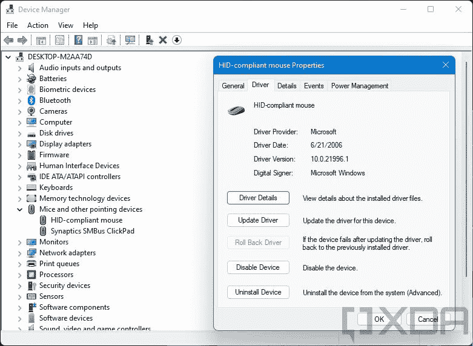

# 我的鼠标和键盘可以在 Windows 11 上使用吗？

> 原文：<https://www.xda-developers.com/will-keyboard-mouse-work-windows-11/>

每当有新的重大更新时，很自然会有关于它对你意味着什么的疑问。这也适用于 Windows 11。无论是应用程序还是设备，你都想知道更新后事情会如何。毕竟，你在这些设备上花了钱，所以你希望能够使用它们。当这些设备是您电脑的重要组成部分时，这一点就更加重要了。如果你担心你是否能在 Windows 11 上使用你当前的鼠标和[键盘](https://www.xda-developers.com/best-mechanical-keyboards)，那就没有理由担心。像这样的外围设备几乎肯定会像以前一样继续工作。

正如你可能已经看到的，Windows 11 [最近在网上泄露](https://www.xda-developers.com/hands-on-windows-11/)，官方预览版即将推出。我们已经在不同的配置和不同的设备上测试了新的操作系统几天了，我们没有遇到任何兼容性问题。当然，我们的测试只代表了一小部分可能的设备，所以很难保证。但有两个关键原因让你不必担心。

## 鼠标和键盘很少需要特殊的驱动程序

设备是否能在您的电脑上运行通常取决于该设备和特定 Windows 版本的可用驱动程序。这就是为什么几年后，旧设备可能不再适用于最新版本的 Windows。同样，新设备可能无法与旧版本的 Windows 兼容。打印机等附件，甚至显卡或 CPU 等内部组件都会发生这种情况。

尽管鼠标和键盘通常是不同的。这些输入设备几乎总是与通用的 Windows 驱动程序一起工作。如果你现在有一个用了十年的鼠标或键盘，只要你的电脑硬件有支持它的端口，它就可以在 Windows 11 上运行。

如果它没有这些端口，一个[雷电坞](https://www.xda-developers.com/best-thunderbolt-docks/)可能会解决你的问题。插入 USB 端口的任何鼠标或键盘通常开箱即可工作，所有按钮都按预期工作。Windows 为类似这样的基本设备内置了一套驱动程序，所以你不需要担心。

 <picture></picture> 

Generic Windows driver being used for a USB mouse

如果你有专门的设备，比如游戏键盘或鼠标，情况可能会有所不同。RGB 灯光效果、宏按钮和其他快捷方式可能需要配置专用软件。如果该软件较旧，它可能无法在较新版本上运行。但这就是第二点发挥作用的地方。

## Windows 11 和 Windows 10 有很多共同之处

Windows 11 带来了很多巨大的变化，但大多数都是积极的变化。有一种新的设计理念渗透到用户界面最突出的元素中。你会在更多的地方看到圆角和浮动菜单，新的透明材料，居中的任务栏，等等。还有一些新功能，比如支持 Android 应用和更好的微软商店。但是这些变化都不是突破性的变化。微软表示，你可以期待所有运行 Windows 10 的设备也能运行 Windows 11。同样，运行 Windows 10 [的应用和程序也有望像以前一样运行](https://www.xda-developers.com/windows-11-app-compatibility/)。

这些东西可以随时改变，但驱动程序和应用程序的兼容性对大多数设备来说已经不是问题了。自 2015 年[发布](https://docs.microsoft.com/en-us/windows/release-health/status-windows-10-1507)以来，Windows 10 已经获得了大量的功能更新，但基本上所有适用于该版本的软件仍然适用于[版本 21H1](https://www.xda-developers.com/windows-10-may-2021-update-now-available-for-everyone/) 。说到底，Windows 11 只是 Windows 10 的又一次功能更新。除非微软在未来宣布任何突破性的变化，否则你可以期待你的鼠标和键盘像在 Windows 10 甚至 Windows 7 或 8.1 上一样工作。

总之，是的，当 Windows 11 发布时，你的鼠标和键盘几乎肯定会兼容 Windows 11，特别是如果它已经可以在 Windows 10 上工作的话。Windows 为这些类型的设备提供了基本的驱动程序，因此它们至少可以开箱即用。如果你有旧版本的 Windows，一些定制软件可能与新版本不兼容，但如果它适用于 Windows 10，它就适用于 Windows 11。