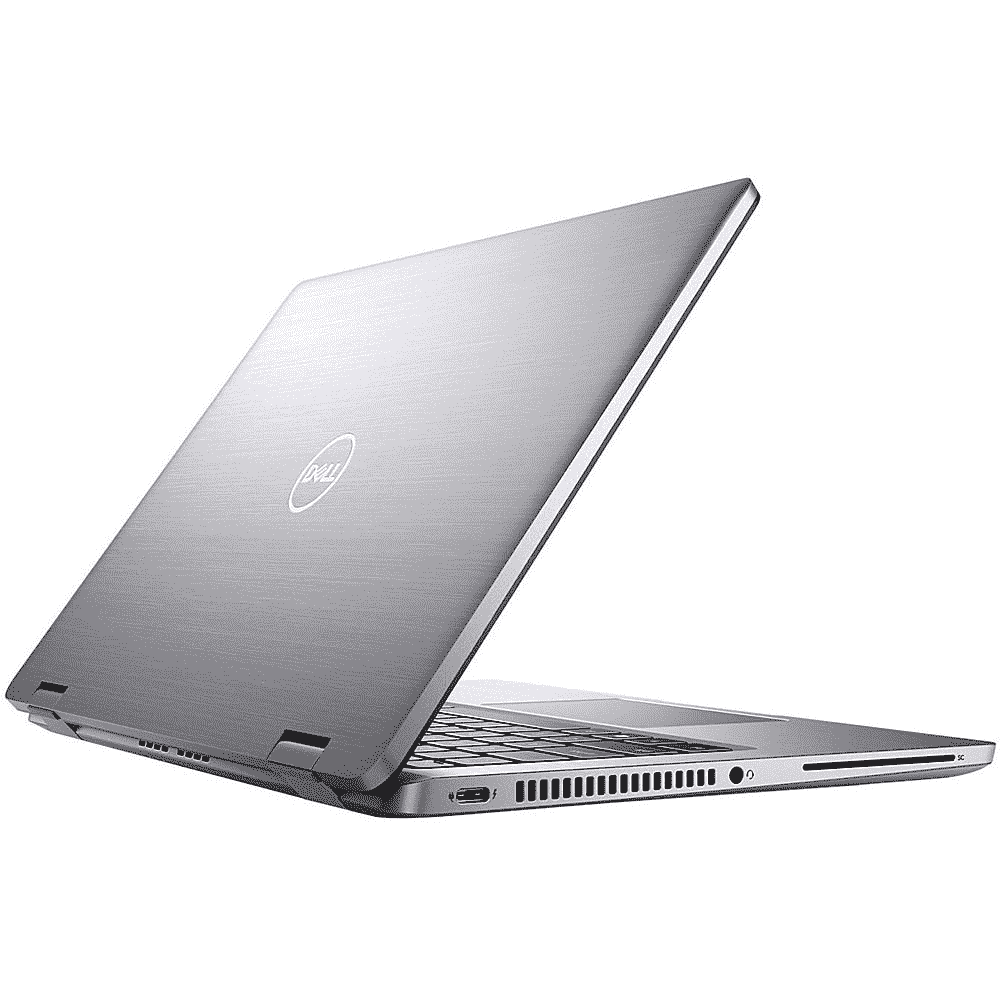
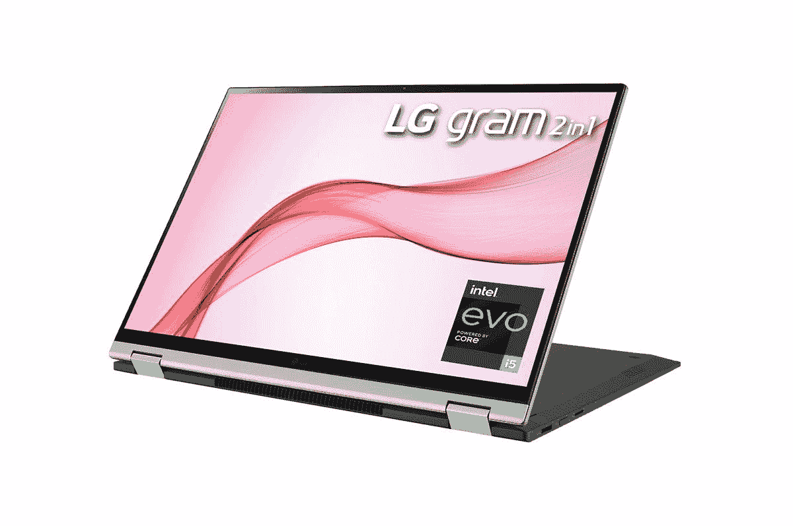
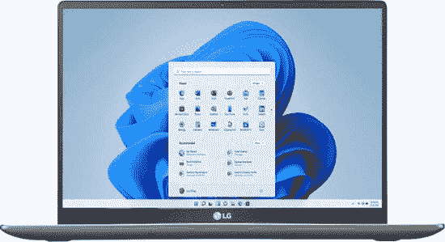
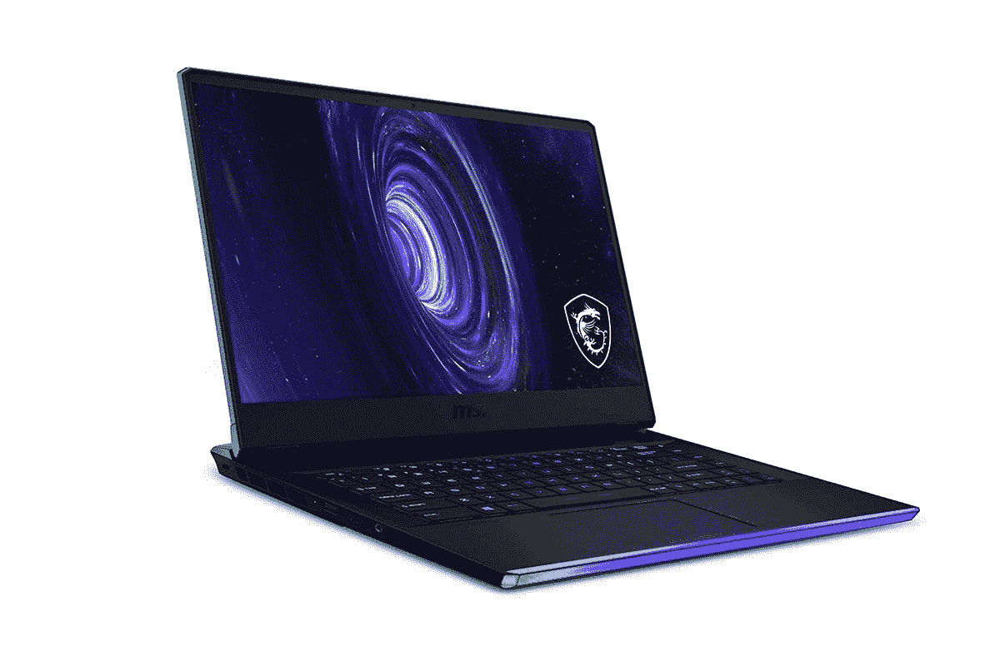
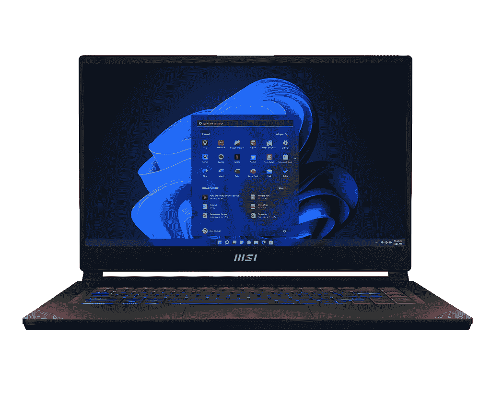
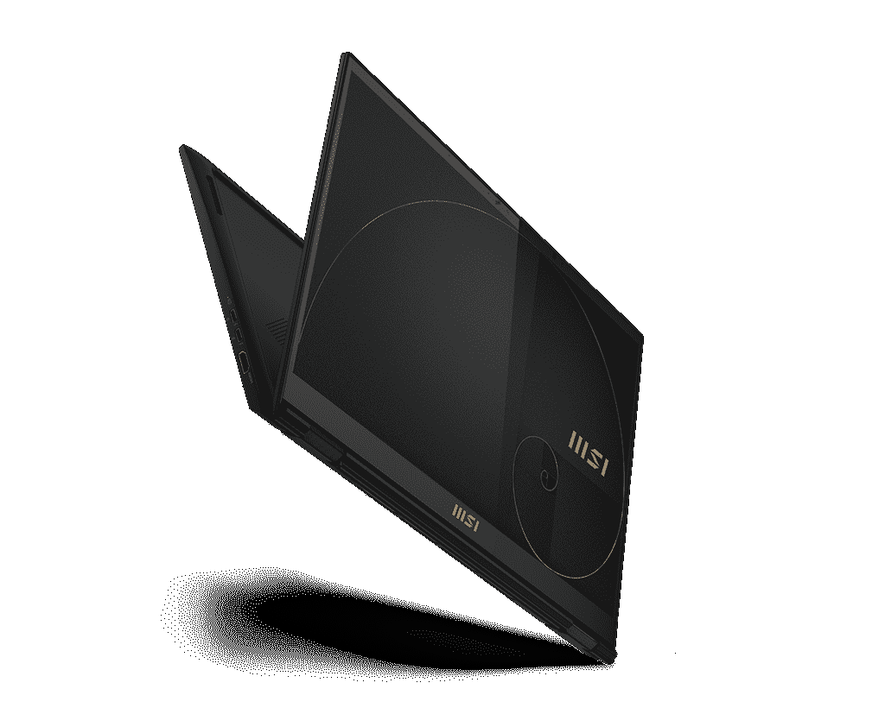
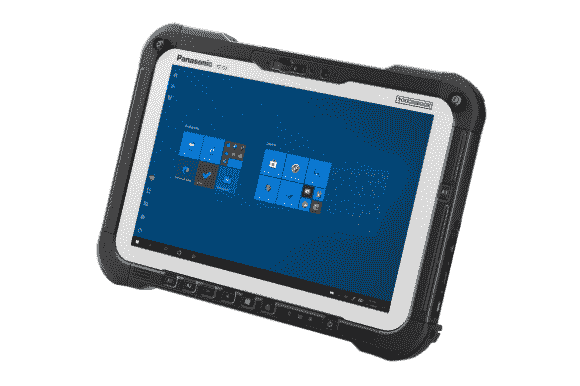

# 这些都是可以升级到 Windows 11 的 PC

> 原文：<https://www.xda-developers.com/windows-11-compatible-pc/>

Windows 11 已经有一年多的历史了，但它仍然记忆犹新，我们中的许多人还没有升级。毕竟，这是一个可选的更新，随着对[系统要求](https://www.xda-developers.com/windows-11-minimum-requirements/)的一些重大改变，特别是当涉及到支持 Windows 11 的[CPU 时，我们很多人都无法升级。但这正是问题所在。如果你有一台旧电脑，你可能想知道它是否可以升级到 Windows 11](https://www.xda-developers.com/cpus-compatible-windows-11/)

我们已经收集了所有可以升级到 Windows 11 的电脑，您可以在下面看到它们。这是由每个制造商提供的列表和关于每个公司支持哪些笔记本电脑的大量研究的混合，但自然会有一些差距，因为有成千上万的笔记本电脑。如果你想确保你的笔记本电脑可以升级到 Windows 11，最简单的方法就是使用微软提供的 [PC 健康检查](https://support.microsoft.com/en-us/windows/how-to-use-the-pc-health-check-app-9c8abd9b-03ba-4e67-81ef-36f37caa7844)应用程序来检查你特定系统的兼容性。尽管如此，下面的列表会给你一些指导。我们还包括了一些已经安装了 Windows 11 的笔记本电脑，如果你想买一台新的。今天你能买到的大多数笔记本电脑都包含 Windows 11，所以你实际上不必太费力去寻找。

## 宏基电脑公司

宏碁提供了一份可以升级到 Windows 11 的个人电脑清单，其中包括大量笔记本电脑。当然，如果你想买一台新的笔记本电脑，你可以看看今天上市的[最好的宏碁笔记本电脑](https://www.xda-developers.com/best-acer-laptops/)，其中大多数都配有 Windows 11(自然，Chromebooks 没有)。我们还提供了以下几个选项来简化这一过程:

*   <picture></picture>

    宏碁 Swift 5(2022)

    ##### 宏碁 Swift 5 (2022)

    宏碁 Swift 5 是一款配备英特尔 P 系列处理器和四核高清 16:10 显示屏的 14 英寸笔记本电脑，非常适合完成工作。

*   <picture></picture>

    宏碁 Predator Triton 500 SE

    ##### 宏碁 Predator Triton 500 SE

    宏碁 Predator Triton 500 SE 是一款功能强大、外观时尚的游戏笔记本电脑，具有强大的性能和出色的 16:10 显示屏，非常适合玩游戏、看电影和工作。

*   ##### 宏碁 Aspire Vero 15 英寸

    对于注重环保的用户来说，宏碁 Aspire Vero 在机箱中采用了大量回收材料，提供了多种性能。不过，它仍然是一台非常强大的机器，拥有最新的英特尔处理器和可靠的规格。

    T34

如果您需要受支持电脑的完整列表，您可以在下面找到宏碁列出的型号:

## 华硕

如果你想从华硕购买一台[笔记本电脑，现在有一些已经运行 Windows 11 的好选择。以下是我们推荐的几种:](https://www.xda-developers.com/best-asus-laptops/)

*   ##### 华硕 ROG Flow X13

    华硕 ROG Flow X13 是一款重量惊人的笔记本电脑，配备强大的 AMD 锐龙 6000 系列处理器和 Nvidia GeForce RTX 3050 Ti GPU。这是一辆敞篷车，所以它也非常通用。

*   <picture></picture>

    华硕 ZenBook 14 有机发光二极管

    ##### 华硕 ZenBook 14 有机发光二极管

    华硕 Zenbook 14 有机发光二极管是一款价格实惠的笔记本电脑，采用第 12 代英特尔酷睿处理器，配备令人惊艳的 2.8K 有机发光二极管显示屏，所有这些都采用了轻薄的设计，但仍有大量的端口。

*   <picture></picture>

    华硕 ROG Zephyrus G14(2022)

    ##### 华硕 ROG Zephyrus G14(2022)

    华硕 Zephyrus G14 是一款小巧且相对轻便的游戏笔记本电脑，但在 AMD 锐龙处理器和镭龙 GPU 的帮助下，它仍然拥有充足的性能。它还有一个带 LED 灯的酷酷的盖子，你可以定制不同的图案。

如果你想知道你目前的电脑是否会支持 Windows 11，华硕已经有了一个它知道的所有支持升级的电脑的完整列表。你可以试着在下面找到你的。

## （里面或周围有树的）小山谷

戴尔是世界上最大的个人电脑制造商之一，其在 Windows 11 之前发布的大多数最受欢迎的个人电脑都支持此次更新。今天，所有最好的戴尔笔记本电脑都配备了 Windows 11，所以这里有一些很好的选择:

*   ##### 戴尔 XPS 13 (2022 年)

    2022 年戴尔 XPS 13 是一款非常小巧轻便的笔记本电脑，有棕色和天空等大胆颜色。它拥有第 12 代英特尔处理器和出色的显示屏。

*   ##### 戴尔 XPS 13 Plus

    戴尔 XPS 13 Plus 是一款具有未来感的笔记本电脑，采用强大的 P 系列英特尔处理器和时尚的设计，甚至没有可视的触摸板。它还有一个令人惊叹的显示屏，包括一个有机发光二极管选项。

*   ##### 戴尔 XPS 15 (2022)

    戴尔 XPS 15 配备 45 瓦英特尔处理器和独立 Nvidia RTX 显卡，是内容创作者的绝佳笔记本电脑。它也有很好的显示器选项，包括 OLED 面板或 4K IPS 显示器。

*   <picture></picture>

    戴尔 Latitude 7330

    ##### 戴尔 Latitude 7330

    对于企业用户来说，戴尔 Latitude 7330 是一款轻便的笔记本电脑，具有您需要的所有性能，并且在规格和设计方面有大量的配置选项。

*   <picture></picture>

    外星人 m17 R5

    ##### 戴尔外星人 m17 R5

    外星人 m17 R5 是一款功能强大的游戏笔记本电脑，采用 AMD 锐龙处理器，顶级显卡，高达 480Hz 的显示屏。

*   ##### 戴尔 Inspiron 灵越 14 2 合 1 一体机

    如果您没有巨额预算，戴尔 Inspiron 灵越 14 2 合 1 一体机是一款出色的多功能笔记本电脑，具有强大的规格和相当独特的设计，包括三面触摸板。

    T34

与华硕一样，戴尔拥有一份完整的清单，列出了所有经过 Windows 11 兼容性测试的电脑。以下是完整列表:

## 动画本

Dynabook 的前身是东芝(Toshiba ),尚未公布将获得 Windows 11 更新的笔记本电脑的完整官方名单。然而，该公司表示，它将把这种体验带到 Tecra、Portégé和 Satellite Pro 笔记本电脑上。如果你想买一台新的 Dynabook 电脑，这里有几个支持 Windows 11 的选项。

*   <picture></picture>

    Dynabook portégéX40L-K

    ##### Dynabook Portege X40L-K

    Dynabook portégéX40L-K 是一款采用第 12 代英特尔处理器和 16:10 显示屏的轻型商务笔记本电脑。

*   ##### dyna book Tecra A50-K

    dyna book Tecra A50-K 是一款相对简单但现代的商务笔记本电脑，配有第 12 代英特尔酷睿处理器和数字键盘。

*   ##### dyna book port ege X30W-K

    dyna book portégéX30W-K 是一款商务敞篷车，采用轻量化设计和第 12 代英特尔处理器。

    T17

至于将支持更新的笔记本电脑的完整列表，正如我们提到的，Dynabook 尚未分享完整列表，但这里是我们可以找到的所有内容:

*   E10-S
*   综合港 A30-E
*   盖世 X20W-E 港
*   gé X30-E 港
*   gé X30-F 港
*   GéGéX30-G
*   盖特 X30L-G 港
*   gé X30L-J 港
*   gé X30W-J 端口
*   gé X30T-E 港
*   WT30-E 港
*   盖斯 40-G 港
*   波特格 X40-J
*   gé X50-G 港
*   卫星 Pro C40-H
*   卫星 Pro C50-H
*   卫星 Pro L50-G
*   Tecra A30-G
*   Tecra A30-J
*   Tecra A40-E
*   Tecra A40-G
*   Tecra A40-J
*   Tecra A50-E
*   Tecra A50-EC
*   Tecra A50-F
*   Tecra A50-5
*   Tecra A50-J
*   Tecra C50-E
*   Tecra X40-E
*   Tecra X40-F
*   Tecra X50-F
*   Tecra Z50-E

## 荣耀

Honor 以前是华为的子品牌，在 MagicBook 品牌下有自己的笔记本电脑系列。虽然该公司尚未发布支持升级的笔记本电脑的官方列表，但该公司已经制作的设备列表相对较短。首先，如果你想购买一台开箱即用的 Windows 11 笔记本电脑，这里有几个选项，仅在英国提供:

*   ##### Honor magic book 16

    Honor magic book 16 由 AMD 锐龙 5000 H 系列处理器驱动，它有一个 16 英寸的大显示屏，非常适合完成工作。

*   <picture></picture>

    Honor magic book Pro

    ##### Honor magic book 15

    The Honor magic book 15 采用 AMD 锐龙 5000 U 系列处理器，设计更加便携。

没有太多新型号可用，Honor 似乎在从华为分拆后大幅缩减了笔记本电脑业务。至于支持的笔记本电脑的完整列表，这里是我们设法找到的:

### 表彰符合 Windows 11 标准的电脑

*   荣耀 MagicBook 英特尔
*   荣誉 MagicBook 14 AMD (2019)
*   荣耀 magic book 14 AMD(2020 年初)
*   荣耀 magic book 14 AMD(2020 年末)
*   荣耀 MagicBook 14 英特尔(2021)
*   荣誉 MagicBook 15 AMD (2019)
*   荣耀 magic book 15 AMD(2020 年初)
*   荣耀 magic book 15 AMD(2020 年末)
*   荣耀 MagicBook 15 英特尔(2021)
*   荣誉 MagicBook Pro AMD (2020 年)
*   荣誉 MagicBook Pro Intel (2021)
*   荣誉 MagicBook X 14
*   荣誉 MagicBook X 15

## 大功率(High Power)ˌ高压(High Pressure)ˌ高性能(High Performance)ˌ高聚物(High Polymer)

惠普也没有宣布可升级设备的完整列表，但该公司 2021 年销售的所有笔记本电脑都应该支持升级。当然，今天大多数的惠普笔记本电脑也安装了 Windows 11。以下是几个选项:

*   ##### 惠普 Spectre x360 13.5

    惠普 Spectre x360 13.5 对于任何人来说都是一款梦幻般的可变形笔记本电脑，采用第 12 代英特尔酷睿处理器和令人惊叹的双色设计，再加上一个高 3:2 显示屏，包括有机发光二极管配置。

*   ##### 惠普 Spectre x360 16(2022)

    更面向创作者，更大的 Spectre x360 16 配备了 H 系列或 P 系列英特尔处理器，可选英特尔 Arc 显卡，同时保留了相同的双色外观。它还有一个 16 英寸的大面板，长宽比为 16:10。

*   ##### 惠普精英蜻蜓 G3

    惠普精英蜻蜓 G3 是一款轻便的商用笔记本电脑，配有高 3:2 显示屏和第 12 代英特尔酷睿处理器，以及具有智能功能的锐利 500 万像素网络摄像头。

*   ##### 惠普蜻蜓 Folio G3

    如果你想要更独特的东西，惠普蜻蜓 Folio 是一款 Folio 风格的敞篷车，拥有与常规蜻蜓型号相同的强大处理器，但具有更多功能的外形。此外，它还有一个更好的 800 万像素网络摄像头。

*   ##### 惠普 Pavilion Aero 13

    如果你想要一台实惠的笔记本电脑，没有比惠普 Pavilion Aero 更好的了。这是一款超轻笔记本电脑，有不同的颜色，配有快速的 AMD 锐龙处理器和 16:10 显示屏。

*   ##### 惠普 Omen 16

    Omen 16 是一款功能强大的游戏笔记本电脑，最高可配 Nvidia GeForce RTX 3070 Ti 和顶级英特尔处理器。

    T17

虽然惠普还没有公布支持 Windows 11 的官方电脑名单，但我们已经找到了尽可能多的符合要求的电脑。可能有更多，但所有这些都是兼容的。

## 华为

华为有几款支持 Windows 11 的笔记本电脑，还有几款已经搭载了最新操作系统。如果你想购买，有一些很好的选择，如下所示:

*   ##### 华为 MateBook D16

    华为 MateBook D16 是一款功能强大的高端笔记本电脑，配有 16 英寸 16:10 显示屏和 1080p 网络摄像头。它由英特尔的 H 系列处理器驱动，因此非常强大。

*   <picture></picture>

    华为 MateBook 14s

    ##### 华为 Matebook 14s

    华为 mate book 14s 是一款非凡的笔记本电脑，拥有强大的 H 系列处理器和其他规格，以及 14 英寸的显示屏，长宽比为 3:2。

*   <picture></picture>

    华为 MateBook X Pro(2022)

    ##### 华为 mate book X Pro(2022)

    华为 mate book X Pro 是一款强大而轻薄的笔记本电脑，采用英特尔第 12 代 P 系列处理器和高 3:2 显示屏。

至于支持更新的笔记本电脑的完整列表，这是我们能找到的。像往常一样，如果没有官方名单，可能会有更多:

### 华为 PC 符合 Windows 11 标准

*   MateBook 13 (WRT-W19 / WRT-W29)
*   MateBook 13 2019 AMD (HN-W19R)
*   MateBook 13 2020 (WRTB-WFE9L)
*   MateBook 13 2020 (WRTB-WAH9L)
*   MateBook 13 2021 (WRTD-WFE9Q)
*   mate book 14 2021(KLVL-wfe 9/KLVL-wdh 9)
*   mate book D 14 AMD 2019(Nbl-WAQ9R/Nbl-WAP9R)
*   mate book D 14 2020(NbB-wah 9/NbB-WAE9P)
*   mate book D 15 AMD(Boh-WAQ9R/WAP 9 ar)
*   mate book D 15(BoB-wai 9/BoB-WAI9Q/BoB-wah 9)
*   MateBook D 15 2021 (Bod-WFH9)
*   MateBook D 15 2020 AMD (BohL-WDQ9)
*   MateBook X 2020 (EUL-W19P)
*   MateBook X Pro (MACH-W19 / MACH-W29)
*   mate book X Pro 2020(MACHC-WAE9LP/MACHC-WAH9LP)
*   mate book X Pro 2021(MACHD-wfe 9/MACHD-wfe 9 q)

## 联想（电脑的品牌名）

作为世界上最大的个人电脑制造商之一，联想也有支持升级到 Windows 11 的完整型号列表。你也可以从该公司购买任何现代笔记本电脑，因为现在大多数联想笔记本电脑都搭载了 Windows 11。以下是几个不错的选择:

*   ##### 联想 Yoga 9i

    联想 Yoga 9i 是一款漂亮的敞篷笔记本电脑，拥有金属底盘和闪亮的弧形边缘。它采用英特尔 P 系列处理器，并拥有漂亮的有机发光二极管显示屏选项。

*   ##### 联想 ThinkPad X1 Carbon Gen 10

    ThinkPad X1 Carbon 是最经典的商务笔记本电脑，最新款非常棒。它拥有第 12 代英特尔处理器、16:10 高显示屏和大量可用的配置选项。

*   ##### 联想 Yoga 6 Gen 7

    联想 Yoga 6 是一款价格实惠、功能多样的笔记本电脑，采用可转换设计，搭载高达 8 核的 AMD 锐龙处理器。它甚至有一个类似于 Yoga 9i 的设计语言，但有一个可选的织物覆盖的盖子。

*   ##### 联想 ThinkPad Z13

    ThinkPad Z13 是 ThinkPad 家族的真正重组，拥有全新的设计和漂亮的双色外观。它由 AMD 锐龙 6000 系列处理器驱动，具有出色的显示屏，并且支持 USB4 40Gbps。

*   <picture></picture>

    联想军团 5 Pro

    ##### 联想军团 5 Pro

    对于游戏玩家来说，联想军团 5 Pro 是一款非常强大的笔记本电脑，拥有多种配置选项，包括 Intel 和 AMD 版本。它还有一个 16:10 的高显示屏，所以如果你需要的话，它非常适合工作。

*   ##### 联想 IdeaPad Duet 5i

    联想 IdeaPad Duet 5i 是一款带有可拆卸键盘的平板电脑，采用第 12 代英特尔处理器，具有出色的显示屏。

至于支持 Windows 11 的电脑的完整列表，这里是我们根据最低要求找到的内容。

### 符合 Windows 11 标准的联想电脑

*   点子板
    *   IdeaPad 1 11ADA05
    *   IdeaPad 1 11IGL05
    *   IdeaPad 1 14ADA05
    *   IdeaPad 1 14IGL05
    *   IdeaPad 14m 4G/5G 2021
    *   IdeaPad 14m 4G/5G 2021 DM
    *   IdeaPad 14sALC 2021
    *   IdeaPad 14sARE 2020
    *   IdeaPad 14sIIL 2020
    *   IdeaPad 14sIML 2020
    *   IdeaPad 14sITL 2021
    *   IdeaPad 15s ALC 2021
    *   IdeaPad 15sARE 2020
    *   IdeaPad 15sIIL 2020
    *   IdeaPad 15sIML 2020
    *   IdeaPad 15sITL 2021
    *   IdeaPad 3 14ADA05
    *   IdeaPad 3 14ADA6
    *   IdeaPad 3 14ALC6
    *   IdeaPad 3 14ARE05
    *   IdeaPad 3 14IGL05
    *   IdeaPad 3 14IIL05
    *   IdeaPad 3 14IML05
    *   IdeaPad 3 14ITL05
    *   IdeaPad 3 14ITL6
    *   IdeaPad 3 15ADA05
    *   IdeaPad 3 15ADA6
    *   idea pad 3 15c 6
    *   IdeaPad 3 15ALC6 巴西
    *   IdeaPad 3 15ARE05
    *   IdeaPad 3 15IGL05
    *   IdeaPad 3 15IIL05
    *   IdeaPad 3 15IML05
    *   IdeaPad 3 15ITL05
    *   IdeaPad 3 15ITL6
    *   IdeaPad 3 15ITL6 巴西
    *   IdeaPad 3 17ADA6
    *   IdeaPad 3 17ALC6
    *   IdeaPad 3 17ARE05
    *   IdeaPad 3 17IIL05
    *   IdeaPad 3 17IML05
    *   IdeaPad 3 17ITL6
    *   IdeaPad 4G/5G (14 英寸，05 英寸)
    *   IdeaPad 5 (14 英寸，05 英寸)
    *   IdeaPad 5 14ALC05
    *   IdeaPad 5 14ITL05
    *   IdeaPad 5 15ALC05
    *   IdeaPad 5 15ARE05
    *   IdeaPad 5 15IIL05
    *   IdeaPad 5 15ITL05
    *   IdeaPad 5 Pro 14ACN6
    *   IdeaPad 5 Pro 14ITL6
    *   IdeaPad 5 Pro 16ACH6
    *   IdeaPad 5 Pro 16IHU6
    *   IdeaPad 5 专业版(14 英寸，06 英寸)
    *   IdeaPad 5 专业版(16 英寸，06 英寸)
    *   IdeaPad 5i Pro(14 英寸，06 英寸)
    *   IdeaPad 5i Pro(16 英寸，06 英寸)
    *   Ideapad 730S-13IML
    *   IdeaPad C340-14API
    *   Ideapad C340-14IML
    *   IdeaPad C340-14IWL
    *   Ideapad C340-15IIL
    *   Ideapad C340-15IML
    *   IdeaPad Creator 5 (16 英寸、6 英寸)
    *   IdeaPad Creator 5 15IMH05
    *   IdeaPad Duet 3i (10 英寸，5 英寸)
    *   IdeaPad Flex 3 11ADA05
    *   IdeaPad Flex 3 11IGL05
    *   IdeaPad Flex 5 (14 英寸，5 英寸)
    *   IdeaPad Flex 5 (15 英寸，5 英寸)
    *   IdeaPad Flex 5 14ALC05
    *   IdeaPad Flex 5 14ARE05
    *   IdeaPad Flex 5 14IIL05
    *   IdeaPad Flex 5 14ITL05
    *   IdeaPad Flex 5 15ALC05
    *   IdeaPad Flex 5 15IIL05
    *   IdeaPad Flex 5 15ITL05
    *   IdeaPad Flex 5i (14 英寸，5 英寸)
    *   IdeaPad Flex 5i (15 英寸，5 英寸)
    *   IdeaPad Flex-14API
    *   IdeaPad Flex-15IWL
    *   IdeaPad 游戏 3 (15 英寸、6 英寸)
    *   IdeaPad 游戏 3 15ACH6
    *   IdeaPad 游戏 3 15ARH05
    *   IdeaPad Gaming 3 15IHU6
    *   IdeaPad Gaming 3 15IMH05
    *   IdeaPad Gaming 3 15IMH05 BR
    *   IdeaPad 游戏 3i (15 英寸、6 英寸)
    *   IdeaPad L3 15IML05
    *   IdeaPad L3 15ITL6
    *   IdeaPad S340-13IML
    *   IdeaPad S340-14IIL
    *   IdeaPad S340-15IIL
    *   idea pad S340-15ii 触摸
    *   IdeaPad S540-13API
    *   IdeaPad S540-13ARE
    *   idea pad S540-13 毫升
    *   idea pad S540-13ml D(适用于 DIS，印度)
    *   idea pad S540-13ml U(适用于 UMA 和印度)
    *   IdeaPad S540-13ITL
    *   IdeaPad S740-14IIL
    *   IdeaPad S740-15IRH
    *   IdeaPad S740-15IRH Touch
    *   IdeaPad S940-14IIL
    *   型号: IdeaPad S940-14IWL
    *   型号: IdeaPad Slim 7 14ITL05
    *   型号: IdeaPad Slim 7 15ITL05
    *   型号: IdeaPad Slim 7 Carbon 14ACN6
    *   IdeaPad Slim 7-14ARE-05
    *   IdeaPad Slim 7-14IIL-05
    *   IdeaPad Slim 7-14 ITU-05
    *   IdeaPad Slim 7-15IIL-05
    *   IdeaPad Slim 7-15IMH-05
    *   IdeaPad Slim 9 14ITL5(NA)
    *   型号 IdeaPad Z5000 MT
    *   IdeaPad Z5000ARE 2020 功能特色
    *   型号: Ideapad130-14IKB
    *   型号: Ideapad130-15IKB

*   关于 IdeaCentre and Desktops
    *   510/510A-15ICB
    *   510/510A-15ICK
    *   小行星 510S-07ICK
    *   型号 AIO 3 22ADA6
    *   型号 AIO 3 22ITL6
    *   型号 AIO 3 24ADA6
    *   型号 AIO 3 24ALC6
    *   型号 AIO 3 24ITL6
    *   型号 AIO 3 27ALC6
    *   型号 AIO 3 27ITL6
    *   型号 AIO 330-20IGM
    *   型号 AIO 5 24ALC6
    *   AIO 5 24IOB6 型号
    *   型号 AIO 5 27IOB6
    *   AIO 520-22IKU SMB0 i3-7020u
    *   AIO 520-24IKU SMB0 i3-7020u
    *   型号 AIO 520-27ICB
    *   型号 AIO 540-24API
    *   型号 AIO 540-24ICB
    *   型号 AIO 540-27ICB
    *   关于 E76
    *   关于 E76A
    *   关于 E76P
    *   E76X
    *   关于 E77
    *   关于 E96
    *   E96X
    *   E97
    *   E98
    *   Ideacentre 5 14IOB6
    *   Ideacentre A340-22IGM
    *   Ideacentre A340-22IWL
    *   Ideacentre A340-24ICB
    *   Ideacentre A340-24IGM
    *   Ideacentre A340-24IWL
    *   Ideacentre 3 07ADA05
    *   Ideacentre 3 07IMB05
    *   IdeaCentre 310S-08IGM
    *   Ideacentre 5 14ACN6
    *   Ideacentre 5 14ARE05
    *   Ideacentre 5 14IMB05
    *   Ideacentre 510S-07ICB
    *   地址:Ideacentre 720-18APR
    *   IdeaCentre 720-18ICB
    *   Ideacentre A340-22ICB
    *   Ideacentre A340-22ICK 系列
    *   Ideacentre A340-24ICK 系列
    *   Ideacentre AIO 3 22ADA05
    *   Ideacentre AIO 3 22IIL05
    *   Ideacentre AIO 3 22IMB05
    *   Ideacentre AIO 3 24ARE05
    *   Ideacentre AIO 3 24IIL0
    *   Ideacentre AIO 3 24IMB05
    *   Ideacentre AIO 3 27IMB05
    *   Ideacentre AIO 5 24IMB05
    *   Ideacentre AIO 5 27IMB05
    *   IdeaCentre Creator 5 14IMB05 功能特色
    *   Ideacentre Creator 5 14IOB6 功能特色
    *   Ideacentre G5 14ACN6 系列
    *   Ideacentre G5 14AMR05
    *   Ideacentre G5 14IMB05 系列
    *   Ideacentre G5 14IOB6 系列
    *   Ideacentre Mini5 01IMH05
    *   联想 V330-20ICB
    *   联想 V530-15ICB
    *   联想 V530-22ICB
    *   联想 V530-24ICB
    *   联想 V530S-07ICB
    *   联想 V540-24IWL
    *   型号 M3900D
    *   型号 M3900Q
    *   关于 M4900O
    *   关于 M4900Q
    *   关于 M4900T
    *   M630e SMB Tiny
    *   型号 M6900D
    *   M6900N
    *   关于 P780
    *   关于 S4430
    *   关于 S4450
    *   关于 S5430
    *   关于 S5450
    *   型号 S660IIL22
    *   型号 S660IIL24
    *   关于 T4900K
    *   T540-15AMA 游戏
    *   T540-15ICB 游戏
    *   T540-15ICK 游戏
    *   关于 T6900V
    *   型号 V130-20IGM
    *   型号 V30a 22IIL
    *   型号 V30a 24IIL
    *   V30a-22IML
    *   型号 V30a-24IML
    *   型号 V330-15IGM
    *   型号 V330-20ICB
    *   型号 V35s-07ADA
    *   型号 V50a-22IMB
    *   型号 V50a-24IMB
    *   型号 V50s-07IMB
    *   型号 V50t G2 13IOB
    *   型号 V50T-13IMB
    *   型号 V530-15ICR
    *   型号 V530-22ICB
    *   型号 V530-24ICB
    *   型号 V530s-07ICR
    *   型号 V540-24IWL
    *   型号 V55T-15API
    *   型号 V55T-15ARE
    *   型号 V55t G2 13ACN
    *   W4900k 税控
    *   W4900o 税控
    *   关于 W6900N
    *   W6900V
    *   白 5 Pro-22-IMB
    *   维 6-24-IML
    *   杨天 M6900s
    *   型号 YangtianM2900d
    *   型号 YangtianM460IRL
    *   杨天 M4900D
    *   型号 YangtianM4900n
    *   型号 YangtianM4900s
    *   别名:YangtianM590ACN
    *   型号 YangtianM600IRL
    *   型号 YangtianP680
    *   型号 YangtianP880ICL
    *   型号 YangtianS2310
    *   型号 YangtianS3350
    *   型号 YangtianS4350
    *   型号 YangtianS5350
    *   型号 YangtianS5430
    *   型号 YangtianS660ITL22
    *   型号 YangtianS660ITL24
    *   型号 YangtianT4900V
    *   型号 YangtianT490IRL
    *   YangtianW4900n(税控)
    *   YangtianW4900v(税控)
    *   型号 YangtianW490IRL
    *   型号: Yoga A940-27ICB
    *   型号:Yoga AIO 7 27ACH6
    *   型号: Yoga AIO 7 27ARH6
    *   刃 7000-28APR
    *   刃 7000-28ICB
    *   刃 7000k-26L
    *   刃 7000P-26L
    *   刃 9000/K-34L
    *   刃 9000-28ICO
    *   天逸 510Pro-15ICB
    *   天逸 510Pro-15ICK
    *   拯救者 Y530Cube-19ICB
    *   拯救者 Y730Cube-19ICO
    *   拯救者 刃 7000-28ICB
    *   拯救者 刃 7000-28ICBR
    *   拯救者 刃 7000-28IMB
    *   拯救者 刃 7000K-28IMB
    *   拯救者 刃 9000-28ICO
    *   拯救者 刃 9000-34IMZ
    *   拯救者 刃 9000K-34IMZ
    *   拯救者 极 MAX-28APR

*   瑜伽吗
    *   Yoga 13s 2021(AMD)
    *   Yoga 13s 2021i (中国)
    *   瑜伽 13sACN 2021 (PRC)
    *   瑜伽 14cACN 2021
    *   瑜伽 14cITL 2021
    *   瑜伽 14s ARH 2021
    *   瑜伽 14sACH 2021
    *   瑜伽 14sACH 2021 D
    *   瑜伽 14sACH 2021 O
    *   瑜伽 14sACH 2021 OD
    *   瑜伽 14sACN 2021
    *   瑜伽 14sIHU 2021
    *   瑜伽 14sIHU 2021
    *   瑜伽 14sITL 2020
    *   瑜伽 14sITL 2021 M
    *   瑜伽 15sIMH 2020
    *   型号: Yoga 15sITL 2020a
    *   瑜伽 530-14IKB
    *   瑜伽 6 13ALC6
    *   Yoga 6 13ARE05 Fabric 系列
    *   瑜伽 7 14ACN6
    *   瑜伽 7 14ITL05
    *   Yoga 7 14ITL5 巴西
    *   瑜伽 7 15ITL05
    *   瑜伽 730-13kb
    *   瑜伽 730-13 wl
    *   瑜伽 730-15 公斤
    *   瑜伽 730-15IWL
    *   瑜伽 730-15IWL 有机发光二极管
    *   瑜伽 8.5 针
    *   瑜伽 9 14ITL5
    *   瑜伽 9 15IMH5
    *   瑜伽 C630-13Q50
    *   瑜伽 C640-13 毫升
    *   瑜伽 C740-14IML
    *   瑜伽 C740-15IML
    *   瑜伽 C930-13kb
    *   瑜伽 C930-13kb 玻璃
    *   瑜伽 C940-14IIL
    *   瑜伽 C940-15IRH
    *   瑜伽创造者 7 15IMH05
    *   瑜伽二重奏 2020
    *   瑜伽二重奏 7 (13”，05)
    *   瑜伽二重奏 7i (13”，06)
    *   Yoga Pro 13s 2021(中国)
    *   瑜伽专业 14c ITL 2021
    *   Yoga Pro 14sITL 2020(中国)
    *   瑜伽 S730-13 毫升
    *   瑜伽 S730-13WHL
    *   瑜伽 S740-14IIL
    *   瑜伽 S740-14IIL 巴西
    *   Yoga S740-14IIL D(适用于印度 DIS)
    *   瑜伽 S740-14IIL U(适用于 UMA，印度)
    *   瑜伽 S740-15IRH
    *   瑜伽 S940-14IIL
    *   瑜伽 S940-14IWL
    *   瑜伽瘦身 7 Pro 14ITL5
    *   瑜伽瘦身 7 Pro 14ITL5 D(印度)
    *   瑜伽瘦身 7 Pro 14ITL5 U(印度)
    *   瑜伽瘦身 7 13ACN5
    *   瑜伽瘦身 7 14ITL05
    *   瑜伽瘦身 7 14ITL05 D
    *   瑜伽瘦身 7 14ITL05 U
    *   瑜伽瘦身 7 15ITL05
    *   瑜伽瘦身 7 15ITL05 D
    *   瑜伽瘦身 7 15ITL05 U
    *   瑜伽瘦身 7 Pro 14ACH5
    *   瑜伽修身 7 Pro 14ACH5 D
    *   瑜伽瘦身 7 Pro 14ACH5 O
    *   瑜伽瘦身 7 Pro 14ACH5 OD
    *   瑜伽瘦身 7 Pro 14ARH5
    *   瑜伽瘦身 7 Pro 14IHU5
    *   瑜伽瘦身 7 Pro 14IHU5 D
    *   瑜伽瘦身 7 Pro 14IHU5 DO
    *   瑜伽瘦身 7 Pro 14IHU5 O
    *   瑜伽瘦身 7 Pro 14IHU5 U
    *   瑜伽瘦身 7 Pro 14IHU5 UO
    *   瑜伽瘦身 7(13 英寸，05 英寸)
    *   瑜伽瘦身 7-14ARE-05
    *   瑜伽瘦身 7-14IIL-05
    *   瑜伽瘦身 7-15IIL-05
    *   瑜伽瘦身 7-15IMH-05
    *   瑜伽瘦身 7-15ITU-05
    *   瑜伽修身 7i (13 英寸，05 英寸)
    *   瑜伽瘦身 7i 碳纤维
    *   瑜伽瘦身 9 14ITL5

*   思维本
    *   ThinkBook Plus G2 ITG
    *   ThinkBook 13s G2 ITL
    *   ThinkBook 13s G3 ACN
    *   ThinkBook 13s IML
    *   ThinkBook 13s IWL
    *   ThinkBook 13x ITG
    *   ThinkBook 14 G2 是
    *   ThinkBook 14 第三代
    *   ThinkBook 14 G2 ITL
    *   ThinkBook 14 G3 ACL
    *   ThinkBook 14 IIL
    *   ThinkBook 14 IML
    *   ThinkBook 14p G2 ACH
    *   ThinkBook 14s G2 ITL
    *   ThinkBook 14s 瑜伽 ITL
    *   ThinkBook 14s 是
    *   ThinkBook 14s IML
    *   ThinkBook 14s IWL
    *   ThinkBook 15 G2 是
    *   ThinkBook 15 G3 ITL
    *   ThinkBook 15 G2 ITL
    *   ThinkBook 15 G3 ACL
    *   ThinkBook 15 IIL
    *   ThinkBook 15 IML
    *   ThinkBook 15p IMH
    *   ThinkBook 16p G2 ACH
    *   ThinkBook K3
    *   ThinkBook K3 ACN
    *   ThinkBook K4
    *   K4 ACN
    *   ThinkBook 加 IML

*   ThinkPad
    *   11e(第五位)
    *   11e 瑜伽 5 号
    *   11e 瑜伽(第六)
    *   E14
    *   E14 第二代英特尔
    *   E14 第三代 AMD
    *   E14 AMD 第二代
    *   E14 第二代
    *   E15 第二代英特尔
    *   E15 第二代(AMD)
    *   E15 第三代 AMD
    *   E15/R15
    *   E480
    *   E490 SWG
    *   E490 UMA
    *   E490s
    *   E495E580
    *   E590
    *   E595
    *   L13
    *   L13 第二代
    *   L13 瑜伽
    *   L13 瑜伽第二代
    *   L13 Yoga 第二代(AMD)
    *   L14
    *   L14 AMD
    *   L14 AMD 第二代
    *   L14 第二代
    *   L15
    *   L15 AMD
    *   L15 AMD 第二代
    *   L15 第二代
    *   L380
    *   L380 瑜伽
    *   L390
    *   L390 瑜伽
    *   L480
    *   L490
    *   L580
    *   L590
    *   联想平板 10
    *   第一亲代
    *   P1 Gen3
    *   P1 Gen4
    *   P1(第二)
    *   P14s
    *   P14s AMD 第二代
    *   P14s 第一代(AMD)
    *   P14s 第二代
    *   P15
    *   P15 第二代
    *   P15s
    *   P15s 第二代
    *   P15v 第一代
    *   P15v 第二代
    *   P17 第一代
    *   P17 第二代
    *   P43s
    *   P52
    *   P52s
    *   P53
    *   P53s
    *   P72
    *   P73
    *   R14
    *   R14 第二代(AMD)
    *   R480
    *   R490
    *   R580
    *   S1(第四名)
    *   S2
    *   S2(第三位)
    *   S2 第四代
    *   S2 瑜伽(第三)
    *   S2 瑜伽(第五)
    *   S3(第二代)
    *   S3-490
    *   T14
    *   T14 AMD 第二代
    *   T14 第一代(AMD)
    *   T14 第二代
    *   T14 HC Ed
    *   T14 HC Ed Gen2
    *   T14s
    *   T14s AMD 第二代
    *   T14s 第一代(AMD)
    *   T14s 第二代
    *   T15
    *   T15 第二代
    *   T15g 第一代
    *   T15p 第一代
    *   T15p 第二代
    *   T480
    *   T480s
    *   T490
    *   T490 HC Ed
    *   T490s
    *   T495
    *   T495s
    *   T580
    *   T590
    *   X1 碳(第 9 位)
    *   X1 碳(第 7 位)
    *   X1 碳(第 8 位)
    *   X1 碳(第 6 位)
    *   X1 极致版
    *   X1 至尊版(第二款)
    *   X1 至尊第三代
    *   X1 至尊第四代
    *   X1 折叠 Gen1
    *   X1 纳米第一代
    *   X1 平板电脑(第三代)
    *   X1 钛
    *   X1 瑜伽(第三)
    *   X1 瑜伽(第四)
    *   X1 瑜伽(第五)
    *   X1 瑜伽第六名
    *   X12 可拆卸第一代
    *   X13 AMD 第二代
    *   X13 第二代
    *   X13 第一代(AMD)
    *   X13 英特尔第一代产品
    *   X13 瑜伽
    *   X13 瑜伽第二代
    *   X280
    *   X380 瑜伽
    *   X390
    *   X390 瑜伽
    *   X395

*   ThinkCentre(及相关一体机型号)
    *   ThinkCentre M600t
    *   ThinkCentre M60e
    *   ThinkCentre M70a
    *   ThinkCentre M70a 第二代
    *   ThinkCentre M70c
    *   ThinkCentre M70q
    *   ThinkCentre M70q 第二代
    *   ThinkCentre M70t/s
    *   ThinkCentre M70t/s 第二代
    *   ThinkCentre M720e
    *   ThinkCentre M720e KT
    *   ThinkCentre M720q
    *   ThinkCentre M720q KT
    *   ThinkCentre M720t/s
    *   ThinkCentre M720t/s KT
    *   ThinkCentre M730e
    *   ThinkCentre M730q
    *   ThinkCentre M730t/s
    *   ThinkCentre M737t
    *   ThinkCentre M740q
    *   ThinkCentre M740t/s
    *   ThinkCentre M747t
    *   ThinkCentre M75n
    *   ThinkCentre M75n 物联网
    *   ThinkCentre M75q 第二代
    *   ThinkCentre M75q-1
    *   ThinkCentre M75s-1
    *   ThinkCentre M75ts 第二代
    *   ThinkCentre M80q
    *   ThinkCentre M80t/s
    *   ThinkCentre M820z
    *   ThinkCentre M820z KT
    *   ThinkCentre M828z
    *   ThinkCentre M830z
    *   ThinkCentre M830z 第二代
    *   ThinkCentre M838z
    *   ThinkCentre M838z 第二代
    *   ThinkCentre M90a
    *   ThinkCentre M90a 第二代
    *   ThinkCentre M90n-1 物联网
    *   ThinkCentre M90n-1
    *   ThinkCentre M90q
    *   ThinkCentre M90q 第二代
    *   ThinkCentre M90t/s
    *   ThinkCentre M90t/s 第二代
    *   ThinkCentre M920q
    *   ThinkCentre M920t/s
    *   ThinkCentre M920t/s KT
    *   ThinkCentre M920x
    *   ThinkCentre M920x KT
    *   ThinkCentre M920z
    *   ThinkCentre M920z KT
    *   ThinkCentre M930q
    *   ThinkCentre M930t/s
    *   ThinkCentre M930z
    *   ThinkCentre M930z 第二代
    *   ThinkCentre M940t/s
    *   ThinkCentre M993t
    *   ThinkCentre M90n-1
    *   EPC300
    *   齐天 A310
    *   启天 A530
    *   启天 A530 Gen2
    *   启天 A710
    *   启天 A730
    *   启天 A815
    *   启天 A835
    *   启天 A850
    *   启天 B425
    *   启天 B428
    *   启天 B435
    *   启天 B445
    *   启天 M220
    *   启天 M420
    *   启天 M420c
    *   启天 M422
    *   启天 M425
    *   启天 M427
    *   启天 M428
    *   启天 M430
    *   启天 M430c
    *   启天 M435
    *   启天 M445
    *   启天 M530
    *   启天 M540
    *   启天 M620
    *   启天 M630
    *   启天 M640

*   大量的
    *   军团 5 15ACH6
    *   军团 5 15ACH6A
    *   军团 5 15ACH6H
    *   军团 5 15ARH05
    *   军团 5 15ARH05H
    *   军团 5 15IMH05
    *   军团 5 15IMH05H
    *   巴西军团 5 15IMH05H
    *   军团 5 15IMH6
    *   军团 5 15ITH6H
    *   巴西第 5 军团
    *   军团 5 17ACH6
    *   军团 5 17ACH6
    *   军团 5 17ACH6H
    *   军团 5 17ARH05H
    *   军团 5 17IMH05
    *   军团 5 17IMH05H
    *   军团 5 17ITH6H
    *   军团 5 Pro 16ACH6
    *   军团 5 Pro 16ACH6
    *   军团 5 Pro 16ACH6H
    *   军团 5 Pro 16ITH6H
    *   军团 5P 15ARH05H
    *   军团 5P 15IMH05
    *   军团 5P 15IMH05H
    *   军团 5P 16 ACH
    *   军团 7 15IMH05
    *   军团 7 15IMHg05
    *   军团 7 16ACHg6
    *   军团 7 16ITH6
    *   军团 7 16ITHg6
    *   军团 C7 15IMH05
    *   2020 年 R7000 军团
    *   R70002021 军团
    *   军团 R70002021A
    *   军团 R70002021H
    *   军团 R7000P2020H
    *   军团 R7000P2021
    *   军团 R7000P2021A
    *   军团 R7000P2021H
    *   军团 R9000K2021H
    *   军团 R9000P2021
    *   军团 R9000P2021H
    *   军团 R9000X 2021
    *   军团 R9000X2021R
    *   S7 军团 15ACH6
    *   S7 15ARH5 军团
    *   军团 S7 5IMH05
    *   Y530-15ICH 军团
    *   Y530-15ICH 军团(1060)
    *   Legion Y530-15ICH(巴西)
    *   Legion Y540-15(巴西)
    *   军团 Y540-15IRH
    *   军团 Y540-15IRH-PG0
    *   军团 Y540-17IRH
    *   军团 Y540-17IRH-PG0
    *   军团 Y545
    *   军团 Y545 PG0
    *   军团 Y7000 2019
    *   军团 Y7000 2019 1050
    *   军团 Y7000 2019 PG0
    *   军团 Y7000 2020
    *   军团 Y7000 2020H
    *   军团 Y70002020R
    *   军团 Y70002021H
    *   军团 Y7000P
    *   军团 Y7000P 2019
    *   军团 Y7000P 2019 PG0
    *   军团 Y7000P 2020
    *   Legion Y7000P(1060)
    *   军团 Y7000P2020H
    *   军团 Y7000P2021H
    *   军团 Y740-15IRH
    *   军团 Y740-15IRHg
    *   军团 Y740-17IRH
    *   军团 Y740-17IRHg
    *   军团 Y740S-15IMH
    *   军团 Y740S-15IRH
    *   军团 Y9000K 2019 SE
    *   军团 Y9000K 2020
    *   Legion Y9000K 2021 年
    *   军团 Y9000K2020H
    *   军团 Y9000K2021H
    *   军团 Y9000P2021H
    *   军团 Y9000X 2020
    *   Legion Y9000X 2021 年
    *   军团 Y9000X2020R
    *   军团 Y530-1060 BR
    *   军团 C530-19ICB
    *   军团 C730-19ICO
    *   军团 T5 26IOB6
    *   军团 T530-28APR
    *   军团 T530-28ICB
    *   军团 T7 34IMZ5
    *   军团 T730-28ICO
    *   联想 Legion R5 28IMB05
    *   联想 Legion T5 26AMR5
    *   联想 Legion T5 28ICB05
    *   联想 Legion T5 28IMB05
    *   联想 Legion T7 34IMZ5

*   关于 ThinkStation
    *   P328
    *   关于 P330
    *   P330-R2
    *   型号 P330Tiny
    *   P340
    *   型号 P340Tiny
    *   P350
    *   型号 P350Tiny
    *   关于 P520
    *   型号 P520C
    *   P620
    *   关于 P720
    *   关于 P920

*   有人吗
    *   第 100 名 2nd Gen
    *   第 100 个 Windows AMD_pollock
    *   100w 3rd 第一代
    *   14w 第二代
    *   300 第二代
    *   第 300 个 Windows AMD_pollock
    *   300w 3rd 第一代
    *   型号 330-14IGM
    *   330-14IKBR
    *   330-15IGM
    *   330-15IGM 巴西
    *   330-15IKBR
    *   330-15IKBR 触控
    *   330-15IKBR(巴西)
    *   330-17IKBR
    *   型号 330C-14IKB
    *   型号 330C-15IKB
    *   340C-15API(PRC)
    *   型号 340C-15IGM
    *   340c-15IIL(PRC)
    *   340C-15IKB(PRC)
    *   340C-15IWL
    *   500W Gen3 JSL
    *   型号:530S-14IKB
    *   型号:530S-15IKB
    *   730-13IWL
    *   型号 B330-15IGM
    *   B330-15IKBR
    *   BS145-15IGM
    *   BS145-15IWL
    *   C340-14IWL 巴西
    *   C340-15IWL
    *   型号 D330-10IGL
    *   型号 D330-10IGM
    *   D335
    *   联想 Ducati 5i
    *   E41-50
    *   E41-55
    *   E43-80
    *   E53-80
    *   Flex 5 14IIL 巴西
    *   Flex 5G(美国)
    *   型号: Flex 6-14IKB
    *   型号: Flex Pro-13IKB
    *   型号 Flex-14IML
    *   型号: Flex-15IIL
    *   型号 Flex-15IML
    *   型号 Flex-15IWL
    *   型号 K43C-80
    *   关于 K4-ARE
    *   L340-15API
    *   L340-15API Touch 功能特色
    *   L340-15IRH Gaming 系列
    *   L340-15IRH Gaming(巴西)
    *   L340-15IRH PE
    *   L340-15IWL
    *   L340-15IWL 触控
    *   L340-17API
    *   L340-17IRH Gaming 游戏机
    *   L340-17IWL
    *   型号: S14 G2 ALC
    *   型号 S14 G2 ITL
    *   型号 S145-14API
    *   型号 S145-14IGM
    *   S145-14IIL
    *   型号 S145-14IKB
    *   S145-14IWL
    *   S145-15API
    *   S145-15API(巴西)
    *   S145-15IGM
    *   S145-15IGM(巴西)
    *   S145-15IIL
    *   S145-15IIL(巴西)
    *   S145-15IKB
    *   S145-15IKB(巴西)
    *   S145-15IWL
    *   S145-15IWL(巴西)
    *   型号: S15 G2 ALC
    *   型号: S15 G2 ITL
    *   S340-13IML
    *   S340-14API
    *   型号 S340-14IML
    *   S340-14IWL
    *   型号 S340-14IWL Touch
    *   S340-15API
    *   S340-15API Touch 功能特色
    *   S340-15IML
    *   S340-15IML 触摸
    *   S340-15IWL
    *   型号 S340-15IWL Touch
    *   S530-13IML
    *   S530-13IWL
    *   S540-13IML
    *   S540-14API
    *   型号 S540-14IML
    *   S540-14IWL
    *   型号 S540-14IWL Touch
    *   S540-15IML
    *   S540-15IWL
    *   S540-15IWL GTX 型号
    *   型号 V130-14IGM
    *   V130-14IKB 型
    *   型号 V130-15IGM
    *   V130-15IKB
    *   V14 - ADA
    *   V14 - ARE
    *   型号 V14 G1 IML
    *   型号 V14 G2 ALC
    *   型号 V14 G2 ITL
    *   型号 V140-15IWL
    *   关于 V14-IGL
    *   型号 V14-IL
    *   型号 V14-IIL DIS
    *   V14-IKB
    *   V14-IWL
    *   V15 - ADA
    *   型号 V15 G1 IML
    *   型号 V15 G2 ALC
    *   型号 V15 G2 ITL
    *   型号 V155-15API
    *   型号 V15 IGL
    *   V15-IIL
    *   型号 V15-IIL DIS
    *   V15-IKB
    *   V15-IWL
    *   型号 V17 Gen 2
    *   型号 V17-IIL UMA
    *   型号 V310-15IGM
    *   型号 V320-14IKB
    *   型号 V320-14IKBR
    *   型号 V320-15IKB
    *   型号 V320-15IKBR
    *   型号 V330-14IGM
    *   型号 V330-14IKB
    *   型号 V330-14ISK
    *   型号 V330-15IGM
    *   型号 V330-15ISK
    *   型号 V330 15IKB
    *   V340-17IWL
    *   卫 6-14IIL
    *   卫 6-15IIL
    *   肖鑫 15ALC 2021
    *   肖鑫-13 毫升 2020
    *   小西奈尔 15ALC 2021
    *   小新 Pro-13API 2019
    *   小新 Pro-13ARE 2020
    *   小新 Pro-13IML 2020
    *   威 5 Pro-14-IML
    *   威 5 Pro-15-IML
    *   威 5-14IKB
    *   威 5-15IKB
    *   威 6 14 ARE
    *   威 6 14 ITL
    *   威 6 15 ARE
    *   威 6 15 ITL
    *   威 6 Pro-13-IML
    *   威 6 Pro-13-IWL
    *   威 6 Pro-14-IML
    *   威 6 Pro-14-IWL
    *   威 6-14-IML
    *   威 6-15-IML
    *   小新 14 2021
    *   小新 14ALC 2021
    *   小新 530S-14IKB
    *   小新 530S-15IKB
    *   小新 Air 13IML
    *   小新 Air 13IWL
    *   小新 Air-14 2019
    *   小新 Pro 16 2021
    *   小新 Pro 16 2021i
    *   小新 Pro-13(故宫版)
    *   小新-13 2019
    *   小新-14 2019
    *   小新-14API 青春版 2019
    *   小新-14ARE 2020
    *   小新-14IGM 青春版 2019
    *   小新-14IIL 2019
    *   小新-14IIL 2020
    *   小新-14IIL 青春版 2019
    *   小新-14IKB 青春版 2019
    *   小新-14IML 2019
    *   小新-14ITL 2021 i
    *   小新-14IWL 青春版 2019
    *   小新-15 2019
    *   小新-15ARE 2020
    *   小新-15IIL 2019
    *   小新-15IIL 2020
    *   小新-15IML 2019
    *   小新-15ITL 2021
    *   小新 Air 14 2021
    *   小新 Air 14+ 2021
    *   小新 Air 14+ 2021i
    *   小新 Air 14+ ACN 2021
    *   小新 Air 14+ ITL 2021
    *   小新 Air 14ALC 2021
    *   小新 Air 14ITL 2021i
    *   小新 Air-13 2019
    *   小新 Air-14IML 2019
    *   小新 Air-15 2019
    *   小新 Air-15IML 2019
    *   小新 Air-15ITL 2021
    *   小新 Pro 13ITL 2021
    *   小新 Pro 13sITL 2021
    *   小新 Pro 14ACH 2021
    *   小新 Pro 14ACH 2021 D
    *   小新 Pro 14ARH 2021
    *   小新 Pro 14IHU 2021
    *   小新 Pro 14ITL 2021
    *   小新 Pro 16 ACH 2021
    *   小新 Pro 16 ACH 2021 G
    *   小新 Pro 16IHU 2021
    *   小新 Pro-13 2019
    *   小新 Pro-13 2020
    *   小新 Pro-13S 2020
    *   扬天 S340-14IIL
    *   扬天 S340-14-IML
    *   扬天 S340-15IIL
    *   扬天 S340-15-IML
    *   扬天 S540-13-IML
    *   扬天 S540-13-IWL
    *   扬天 S540-14-IML
    *   扬天 S540-14-IWL
    *   扬天 S550-14-API
    *   扬天 S550-14-ARE
    *   扬天 V340-14-IIL
    *   扬天 V340-14-IML
    *   扬天 V340-15-IIL
    *   扬天 V340-15-IML
    *   拯救者 Y7000
    *   拯救者 Y7000(1060)
    *   拯救者 Y7000P
    *   拯救者 Y7000P(1060)
    *   昭阳 E4-IIL
    *   昭阳 E4-IML
    *   昭阳 E4-ITL
    *   昭阳 E5-IIL
    *   昭阳 E5-IML
    *   昭阳 E5-ITL
    *   昭阳 K3
    *   昭阳 K3-IML
    *   昭阳 K3-IWL
    *   昭阳 K4
    *   昭阳 K4e-ACL
    *   昭阳 K4e-ARE
    *   昭阳 K4e-IIL
    *   昭阳 K4e-IML
    *   昭阳 K4e-ITL
    *   昭阳 K4-IML
    *   昭阳 K4-IWL

## 水平规ˌ水准仪(Level Gauge)

虽然该公司主要以其他设备闻名，但 LG 也生产一些非常优质的笔记本电脑，这些笔记本电脑也必然会更新到 Windows 11。如果你想买一台新的笔记本电脑，最新的 LG 笔记本电脑已经配备了 Windows 11:

*   ##### LG Gram 14 二合一

    LG Gram 14 二合一是目前最轻的 14 英寸变形本之一，搭载英特尔第 12 代处理器，采用 16:10 宽高比的高显示屏。

*   ##### 【LG Gram 16(2022)

    LG Gram 16 是市场上最轻的 16 英寸笔记本电脑之一，它拥有 16:10 宽高比和 99% DCI-P3 的神奇四核高清面板。它还采用了 P 系列英特尔处理器。

    T17
*   <picture></picture>

    LG Gram 16 二合一

    ##### LG Gram 16 二合一

    LG Gram 16 的二合一版本拥有让标准型号变得伟大的一切，但增加了敞篷车的多功能性。

*   ##### LG gram 17(2022)

    LG gram 17 是 gram 16 的更大版本，在轻质机箱中拥有相同的强大规格和出色的显示屏。不过，它的电池更大，所以电池寿命很长。

    T34
*   <picture></picture>

    LG ultra PC 17

    ##### LG ultra PC 16

    LG ultra PC 16 是 LG 笔记本电脑阵容中搭载 AMD 锐龙 CPU

    的最新 16 英寸笔记本电脑
*   <picture></picture>

    LG ultra PC 17

    ##### LG ultra PC 17

    LG ultra PC 17 面向休闲游戏玩家，它由英特尔酷睿 i7-1260P 处理器提供动力，并配备 Nvidia GeForce RTX 3050 Ti GPU，使其非常适合

至于兼容电脑的完整名单，该公司尚未公布官方名单。通过挖掘 LG 的网站，我们找到了以下兼容型号:

### 符合 Windows 11 标准的 LG 电脑

*   1g 克
    *   LG 克 13 (13z975)
    *   LG 克 13 (13Z980)
    *   LG 克 13 (13Z990)
    *   LG 克 14 (14Z980)
    *   LG 克 14 (14Z990)
    *   LG 克 14 (14Z995)
    *   LG 克 14 (14Z90N)
    *   LG 克 14 (14Z90P)
    *   LG 克 14 二合一(14T990)
    *   LG 克 14 二合一(14T90N)
    *   LG 克 14 二合一(14T90P 便士)
    *   LG 克 15 (15Z975)
    *   LG 克 15 (15z980)
    *   LG 克 15 (15Z990)
    *   LG 克 15 (15Z995)
    *   LG gram 15 (15Z90N)
    *   LG 克 15 (15Z90P)
    *   LG 克 15 (15Z95N)
    *   LG 克 16 (16Z90P)
    *   LG 克 16 二合一(16T90P)
    *   LG 克 17 (17Z990)
    *   LG gram 17 (17Z90N)
    *   LG gram 17 (17Z90P)
    *   LG gram 17 (17Z95N)

*   LG 超个人电脑
    *   LG Ultra PC 13 (13U70P)
    *   LG Ultra PC 17 (17U70N)
    *   LG Ultra PC 17 (17U70P)

## 微软 Surface

如果你想买一台 Surface PC，那么今天你能买到的几乎所有东西都将与 Windows 11 兼容。以下是您可以获得的最佳选择:

*   <picture></picture>

    Surface Pro 9(Wi-Fi 机型)

    ##### Surface Pro 9

    Surface Pro 9 是一款搭载第 12 代英特尔处理器的高级 Windows 平板电脑，并首次采用了彩色功能。

*   ##### 5G 版微软 Surface Pro 9

    5G 版 Surface Pro 9 是一款截然不同的平板电脑版本，搭载基于 Arm 的微软 SQ3 芯片组。这个版本没有颜色，但它确实有 120 赫兹刷新率的同样伟大的显示器。

*   ##### 微软 Surface Laptop 5

    Surface Laptop 5 是一款时尚的 Windows 笔记本电脑，配备 13.5 英寸或 15 英寸显示屏，长宽比为 3:2。它包括英特尔第 12 代处理器，并首次支持 Thunderbolt。

    T17
*   ##### 微软 Surface Laptop Go 2

    Surface Laptop Go 2 是一款采用第 11 代英特尔处理器的经济型笔记本电脑。它有你熟悉和喜爱的干净的表面设计，加上高 3:2 显示屏。

*   ##### Surface Laptop Studio

    Surface Laptop Studio 是微软产品线中非常独特的一款笔记本电脑，拥有独特的对开设计和强大的 Nvidia RTX 显卡，有助于处理创造性工作负载。这也是微软唯一一款配备 1080p 摄像头的翻盖式笔记本电脑。

    T37
*   ##### 微软 Surface Go 3

    如果你想要一台经济实惠的平板电脑，用于随意浏览网页或与家人和朋友保持联系，Surface Go 3 是一个很好的选择，它拥有 500 万像素的前置摄像头和全高清+ 10.5 英寸显示屏。

微软拥有最容易理解的阵容，因此即使没有官方声明，也很容易找到哪些设备将支持 Windows 11。以下是可以升级的设备。

### 符合 Windows 11 标准的微软电脑

*   表面书 2
*   表面书 3
*   Surface Go 2
*   Surface Laptop 2
*   Surface Laptop 3
*   Surface Laptop 4
*   Surface Laptop Go
*   Surface Pro 6
*   Surface Pro 7
*   Surface Pro 7+
*   Surface Pro X
*   Surface Studio 2

有趣的是，Surface Studio 2 之所以上榜，是因为最近对 CPU 要求的更新[增加了英特尔酷睿 i7-7820HQ 作为支持的处理器。最初的 Surface Go 尽管在 Windows 11 发布时相对较新，但仍不受支持。](https://www.xda-developers.com/windows-11-officially-wont-support-amd-zen-or-most-intel-7th-gen-processors/)

## 中规模集成电路（medium-scale integration 的缩写）

如果您想从 MSI 购买一台新电脑，并且希望它能够兼容 Windows 11，我们有一份[您今天可以购买的优秀 MSI 笔记本电脑](https://www.xda-developers.com/best-msi-laptops/)的综述，包括以下几款:

*   <picture></picture>

    微星突袭者 GE66

    ##### 微星突袭者 GE66

    微星突袭者 GE66 提供了性能和便携性的奇妙组合，并带有一些额外的功能，如 RGB 照明。

*   <picture></picture>

    MSI Stealth 15 米

    ##### MSI Stealth 15 米

    如果您想要一台小巧的游戏笔记本电脑，MSI Stealth 15 米是一个很好的选择，它采用英特尔酷睿 i7-1260P 处理器和 Nvidia GeForce RTX 3060 显卡，以相对较低的价格提供您需要的所有性能

*   <picture></picture>

    MSI Summit E14 Flip

    ##### MSI Summit E14 Flip

    MSI 可能不是最知名的高端笔记本电脑，但 Summit E14 Flip 是一款出色的机器，它采用了轻量级设计和 14 英寸显示屏，长宽比为 16:10。

微星还分享了一份可升级到 Windows 11 的电脑列表，这是一份涵盖笔记本电脑和台式机的非常广泛的列表。以下是当前列表:

## 日本松下公司

对于企业用户，尤其是那些需要耐用硬件的用户，松下是一个知名品牌，该公司目前的 TOUGHBOOK 系列在技术上也与 Windows 11 兼容。以下是目前你可以买到的支持 Windows 11 的松下机型。

*   松下 Toughbook 40 是一款完全加固的笔记本电脑，旨在承受最恶劣的环境，无论是极端高温、跌落、灰尘等等。

*   <picture></picture>

    松下 TOUGHBOOK 55

    ##### 松下 Toughbook 55

    松下 TOUGHBOOK 55 是一款极其耐用的笔记本电脑，专为恶劣环境中的现场工作人员设计，提供现代化的性能、安全性和可管理性。

    T32
*   <picture></picture>

    松下 Toughbook G2

    ##### 松下 TOUGHBOOK G2

    松下 Toughbook G2 是一款全面加固的 10 英寸台式机，采用第十代英特尔处理器，电池续航时间为 18 小时。附带的 CPU 也支持 Windows 11。

随着 Toughbook 33 的加入，该列表也几乎成为受支持笔记本电脑的完整列表的两倍，Toughbook 33 也支持升级。

## 雷蛇

Razer 也大多只销售 Windows 11 支持的电脑。如果你想购买的话，这里有一些你可以考虑的选择。

*   ##### Razer Blade 14(2022)

    Razer Blade 14 是该公司最出色的游戏笔记本电脑，但它仍然通过 AMD 锐龙 9 6900HX 和高达 Nvidia GeForce RTX 3080 Ti 提供了很高的游戏性能。

*   <picture></picture>

    雷蛇刀锋 15 (2022 年)

    ##### 雷蛇刀锋 15 (2022 年)

    刀锋 15 是雷蛇最受欢迎的笔记本电脑，它搭载了强大的英特尔处理器和高达 3080 Ti 的 Nvidia GeForce RTX

    T34
*   <picture></picture>

    Razer Blade 17(2022)

    ##### Razer Blade 17(2022)

    Razer 最强大的笔记本电脑，Blade 17 的包装规格与 Blade 15 相似，但 GPU 使用高达 130W 的功率，而笔记本电脑却有

Razer 也尚未分享可升级设备的官方列表，但该公司的阵容是更简单的一种。这些都是可以升级到 Windows 11 的机型。

### Razer PCs 符合 Windows 11 标准

*   雷蛇刀锋隐形 13 (2017) RZ09-0239x
*   雷蛇刀锋隐形 13 (2019) RZ09-0281x
*   雷蛇刀锋隐形 13 (2019) RZ09-03100
*   雷蛇刀锋隐形 13 (2019) RZ09-03101
*   雷蛇刀锋隐形 13 (2020) RZ09-03102
*   雷蛇刀锋隐形 13 (2020) RZ09-0327
*   雷蛇刀锋 14 (2021) RZ09-0370
*   雷蛇刀锋 15 (2020) RZ09-03519
*   雷蛇刀锋 15 进阶(2018) RZ09-0238x
*   雷蛇刀锋 15 进阶(2019) RZ09-0288x
*   雷蛇刀锋 15 进阶(2019) RZ09-0301x
*   雷蛇刀锋 15 进阶(2019) RZ09-0313x
*   雷蛇刀锋 15 高级(2020) RZ09-0330x
*   雷蛇刀锋 15 高级(2021) RZ09-0367x
*   雷蛇刀锋 15 高级(2021) RZ09-0409x
*   雷蛇刀锋 15 底座(2018) RZ09-02705
*   雷蛇刀锋 15 基(2019) RZ09-03006
*   雷蛇刀锋 15 底座(2019) RZ09-03009
*   雷蛇刀锋 15 底座(2020) RZ09-0328x
*   雷蛇刀锋 15 底座(2021) RZ09-0369x
*   雷蛇刀锋 15 底座(2021) RZ09-0410x
*   雷蛇刀锋 15 工作室版(2019) RZ09-03135
*   雷蛇刀锋 15 工作室版(2020) RZ09-0330Q
*   雷蛇刀锋 17 (2021) RZ09-0406
*   雷蛇刀锋 Pro 17 (2019) RZ09-0287x
*   雷蛇刀锋 Pro 17 (2019) RZ09-0314x
*   雷蛇刀锋 Pro 17 (2020) RZ09-0329x
*   雷蛇刀锋 Pro 17 (2021) RZ09-0368x
*   雷蛇图书 13 RZ09-0357

## 三星电子

目前市场上的大多数三星笔记本电脑已经搭载了 Windows 11。如果你想买一台新的笔记本电脑，该公司有几个很好的选项可供选择:

*   ##### 三星 Galaxy Book 2 Pro

    三星 Galaxy Book 2 Pro 是一款非常轻便的笔记本电脑，有 13 英寸和 15 英寸两种型号，是少数几种在每种配置中都配备 AMOLED 显示屏的笔记本电脑之一。

*   ##### 三星 Galaxy Book 2 Pro 360

    与翻盖机型类似，这款可兑换版的三星 Galaxy Book 2 Pro 令人难以置信地轻薄，尽管它采用了 360 度铰链。它也有相同的 AMOLED 面板，现在支持触摸和笔。

*   <picture></picture>

    三星 Galaxy Book 2 360 +三星 CRG5 显示器

    ##### 三星 Galaxy Book 2 360

    如果 Pro 机型对你来说有点太贵，三星 Galaxy Book 2 360 给你一个更实惠的替代选择，虽然它并不轻薄。它的 U 系列处理器功能较弱，但这也意味着电池寿命更长。

*   <picture></picture>

    三星 Galaxy Book Go

    ##### 三星 Galaxy Book Go

    三星 Galaxy Book Go 是一款基于 Arm 的笔记本电脑，采用骁龙 7c 芯片组，配备全高清显示屏。无论如何，这都不是一台高端机器，但就其价格而言，它太棒了。

*   ##### 三星 Galaxy Book Go 5G

    Galaxy Book Go 的 5G 版本为笔记本电脑增加了蜂窝连接，但它也有一个更快的芯片组，即骁龙 8cx Gen 2。

    T34
*   ##### 三星 Galaxy Book Pro 360 5G

    如果 5G 支持对你很重要，但你不喜欢基于 Arm 的笔记本电脑，三星也提供 Galaxy Book Pro 360 5G，采用第 11 代英特尔处理器和漂亮的 AMOLED 显示屏。

至于将获得升级的三星 PC 的完整列表，有几个。三星的阵容相对简单，所以很容易发现你的机型是否受支持。以下是完整列表:

### 符合 Windows 11 标准的三星电脑

*   三星 Galaxy Book
*   三星 Galaxy Book Flex
*   三星 Galaxy Book Flex α
*   三星 Galaxy Book Flex2 α
*   三星 Galaxy Book Go
*   三星 Galaxy Book Go 5G
*   三星 Galaxy Book Ion
*   三星 Galaxy Book Pro
*   三星 Galaxy Book Pro 360
*   三星 Galaxy Book S
*   三星笔记本闪光灯
*   三星笔记本奥德赛

这些是我们所知道的所有支持升级到 Windows 11 的电脑。由于操作系统已经推出一年多了，Windows 11 已经推出了许多新型号，所以这里没有包括许多设备。这个列表重点介绍了 Windows 11 之前发布的支持升级的笔记本电脑。

如果您不确定如何升级您的电脑，请查看我们关于如何[下载和安装 Windows 11](https://www.xda-developers.com/download-windows-11/) 的指南，这样您就可以开始了。