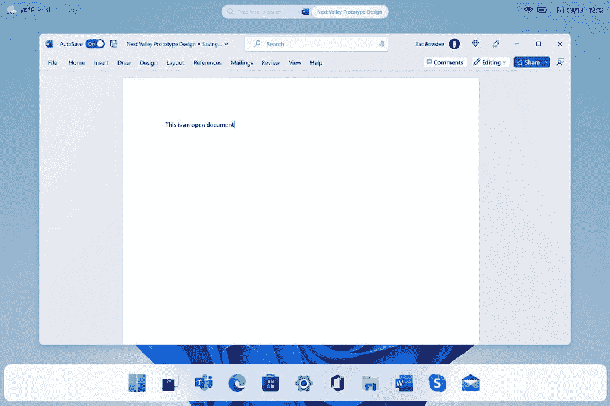

# 微软显然在 Ignite 上展示了 Windows 12 的设计原型

> 原文：<https://www.xda-developers.com/windows-12-design-prototype-ignite-2022/>

微软的 Ignite 2022 keynote 挤满了关注微软 365 的新闻，但除了官方宣布的内容，该公司还展示了一些可能不是故意的东西。在网上主题演讲期间，一张截图简要显示了一个运行微软团队的 Windows 桌面，但这个桌面看起来不太像我们今天所知道的，可能暗示了 Windows 的未来版本——我们推测将被称为 [Windows 12](https://www.xda-developers.com/windows-12/) 。

通常，类似这样的东西可能只是微软为视频拼凑的一个模型，但 *Windows Central* 的扎克·鲍登证实，几个月前当我们第一次听说[微软正在为将于 2024 年某个时候发布的重要 Windows 版本](https://www.xda-developers.com/windows-12-coming-2024-report/)工作时，这个设计原型已经在内部展示了。事实上，这个原型还存在其他一些变体，包括顶部的 UI 元素位于屏幕顶部的半透明栏上。

正如 Twitter 上的一些用户很快注意到的，与 Windows 11 相比，这里有一些很大的变化。首先，我们可以在底部看到一个浮动的任务栏，这意味着它不会直接停留在屏幕底部。这有点让人想起 macOS 或一些 Linux 发行版中的 UI。此外，您可以在屏幕顶部看到许多信息，包括当前天气、搜索栏以及 Wi-Fi 和电池等系统图标。在主题演讲中展示的屏幕截图分辨率相当低，但是 Bowden 创建了一个模型，在这里你可以看到更多细节的 UI 元素。

 <picture></picture> 

Image credit: Zac Bowden

据报道，这种新设计方法的目标是进一步优化触摸用户的 UI，而不会疏远今天占 Windows 用户大多数的鼠标和键盘用户。这是微软在 Windows 8 中明显没有做到的事情，从那以后，它很难找到合适的平衡来满足这两种受众——尽管 Windows 11 version 22 H2 在这方面确实做了一些改进。

当然，这并不是说，如果 Windows 12 最终发布，我们就一定会看到这样的 UI 设计。毕竟，这只是一个原型，在未来的几个月或几年里，事情可能会发生根本的变化。就在最近，我们看到了 Windows 8 设计理念的[早期原型，它在操作系统发布前两年在内部展示，其中有许多想法没有实现。我们将不得不等待，直到我们接近所谓的发布日期，看看最终的用户界面最终会是什么样子。](https://www.xda-developers.com/early-windows-8-concepts-widgets-panel-like-windows-11/)

* * *

**来源:** [Windows Central](https://www.windowscentral.com/software-apps/windows-11/microsoft-accidentally-revealed-a-ui-design-prototype-for-the-next-version-of-windows-at-ignite-2022)