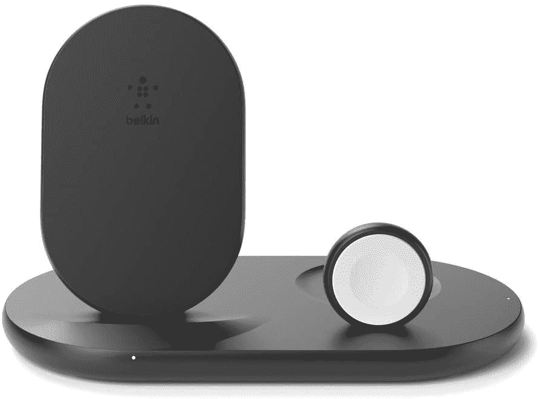

# 无线充电器防水吗？我可以安全地使用湿式无线充电器吗？

> 原文：<https://www.xda-developers.com/wireless-charger-waterproof/>

随着越来越多的智能手机制造商推出支持无线充电器的设备，无线充电器正在成为主流。现在市场上有数百种。想要购买无线充电器的消费者通常会有很多疑问。在本文中，我们将尝试解决这样一个问题——无线充电器防水吗？实际上，目前市场上所有的无线充电器都没有任何防水功能，所以答案是相当大的“不”。

## 不，无线充电器不防水

你必须**非常小心无线充电器周围的水**，因为你会在任何其他连接到电源插座的电子设备周围。如果你试图使用湿的无线充电器，你可能会触电而死，并损坏你的电器，我们强烈建议你不要这样做。

如果你的无线充电器不知何故变湿了，**在再次使用它之前确保它完全干燥**。像对待有线充电器一样对待它。如果你的智能手机是湿的，在把它放到无线充电器上之前也要把它弄干。

请记住，充电垫使用磁性将电力传输到设备。虽然我们还没有看到任何来自主要制造商的防水无线充电器，但这种设备可能会在未来出现。然而，目前来说，保持整个仪器远离水仍然是一个好主意，因为你是连接到墙上的插座。最好不要冒险，除非制造商能够提供某种形式的附件安全保证。

## Qi 无线充电器是如何工作的？

Qi 无线充电器是相对简单的硬件。他们使用感应充电将充电器的电能传输到你的手机。无线充电器主要包括两个关键部件——PCBA(印刷电路板组件)和线圈。除了这两件事之外，无线充电器还需要一个电源适配器，用于将墙上插座的交流电转换为充电器的 DC 电流。

无线充电器中的 PCBA 从电源适配器获取 DC 电流，并使用线圈来创建交变电磁场。这个磁场在你手机的接收线圈中产生能量，同样的能量也被输送到电池中。在这个过程中，一部分电能以热量的形式流失，这也是无线充电比有线充电慢的原因之一。你会注意到你的手机发热，因为它在充电时会变热。这是正常的，也不是太热。此外，无线充电器带有安全措施，如果检测到过热，就会停止充电过程。

Qi 无线充电器通常提供最低 5W 的充电速度。你还会在市场上看到提供 7.5W、10W 和 15W 充电速度的充电器。对于超过 15W 的充电速度，制造商通常使用专有技术。因此，这种充电器只能为非常精选的设备提供更高的速度。在购买任何无线充电器之前，请确保您知道您的手机可以支持的充电速度。

 <picture></picture> 

Anker PowerWave 15 Pad

##### Anker PowerWave 15 Pad

Anker PowerWave 15 Pad 自带 5W、7.5W、15W 无线充电模式。如果你的手机支持更快的无线充电，这款 Anker 充电器将能够提供。然而，它没有配备电源适配器。

 <picture></picture> 

Belkin 3-in-1 Wireless Charger

##### Belkin 3 合 1 无线充电器

当单双充电器都不够用的时候，你可以得到这款 Belkin 三合一充电器。它可以同时为您的 Qi 兼容手机、耳塞和智能手表充电。该充电器支持为手机充电 7.5W，为其他设备充电 5W。

 <picture></picture> 

Spigen wireless charger

##### Spigen 敞篷 15W 无线充电器

在某些日子更喜欢站立模式，而在其他日子更喜欢平板模式？Spigen 无线充电器可以为您做到这两点。它还支持高达 15W 的快速无线充电。此外，它上面还有一个防滑垫，防止你的手机在充电时打滑。

* * *

希望我们能够回答你关于无线充电器是否防水的问题。如果你想了解更多关于有线快速充电的信息，请务必浏览我们关于该主题的详细解释者。我们还公布了目前市场上三星 Galaxy S21 的[最佳快速充电器名单——也来看看吧。](https://www.xda-developers.com/best-galaxy-s21-fast-chargers/)