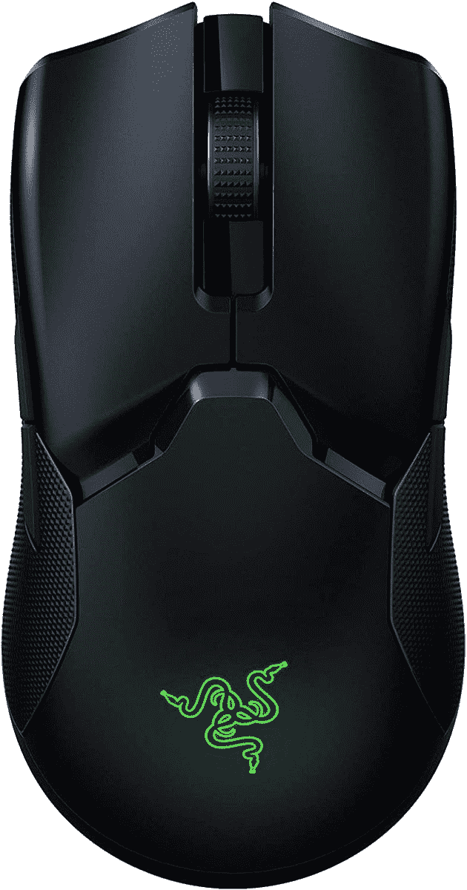

# 只需 70 美元即可获得无线 Razer Viper Ultimate

> 原文：<https://www.xda-developers.com/wireless-razer-viper-ultimate-cyber-monday/>

# 只需 70 美元即可获得无线 Razer Viper Ultimate

你现在只需花 70 美元就可以在网络星期一买到无线 Razer Viper Ultimate。如果你有竞争力，这是一个值得的升级！

如果你是一个电脑游戏玩家，你可能已经看过我们的黑色星期五和网络星期一交易了。在个人电脑外设和其他邻近产品上已经有了大量的[奇妙的交易](https://www.xda-developers.com/best-black-friday-pc-gaming-deals/)，但是我们最近发现的是无线 Razer Viper Ultimate 鼠标。这款鼠标的建议零售价为 130 美元，现在只卖 70 美元。

 <picture></picture> 

Razer Viper Ultimate

##### 雷蛇毒蛇终极版

Razer Viper Ultimate 是 Razer 的一款轻型无线鼠标，只需 70 美元就可以买到。

无线鼠标对任何游戏玩家来说都是一个很好的补充。我使用的是[罗技 G Pro wireless](https://www.amazon.com/Logitech-Wireless-Gaming-Esports-Performance/dp/B07GCKQD77/?tag=xda-6d2ljni-20&ascsubtag=UUxdaUeUpU6687&asc_refurl=https%3A%2F%2Fwww.xda-developers.com%2Fwireless-razer-viper-ultimate-cyber-monday%2F&asc_campaign=Short-Term) ，这是我对我的设置进行的最大升级之一——这都要归功于它是无线的。在像*反恐精英:全球攻势*和 *VALORANT* 这样的电子竞技游戏中，没有电缆是非常自由的，无线鼠标的电池寿命往往相当好。Razer 声称，这款鼠标一次充电可以使用 70 小时，它通过 micro USB 充电。Razer Viper Ultimate 是一款双手灵巧的鼠标，有八个可编程按钮，它也有 Razer 的色度照明。它可以达到 20，000 DPI，而且超级轻，只有 74g。这意味着它很容易移动，并且在试图快速移动时不会拖累你的手。

不仅如此，Razer 声称它是该领域最快的鼠标之一，这款无线鼠标的延迟应该不是问题。我从未注意到我的罗技 G Pro wireless 上有线和无线的个人差异，所以如果 Razer Viper Ultimate 更好，那么就不会有问题。如果你想买一个新的鼠标，这绝对是一个值得考虑的选择！