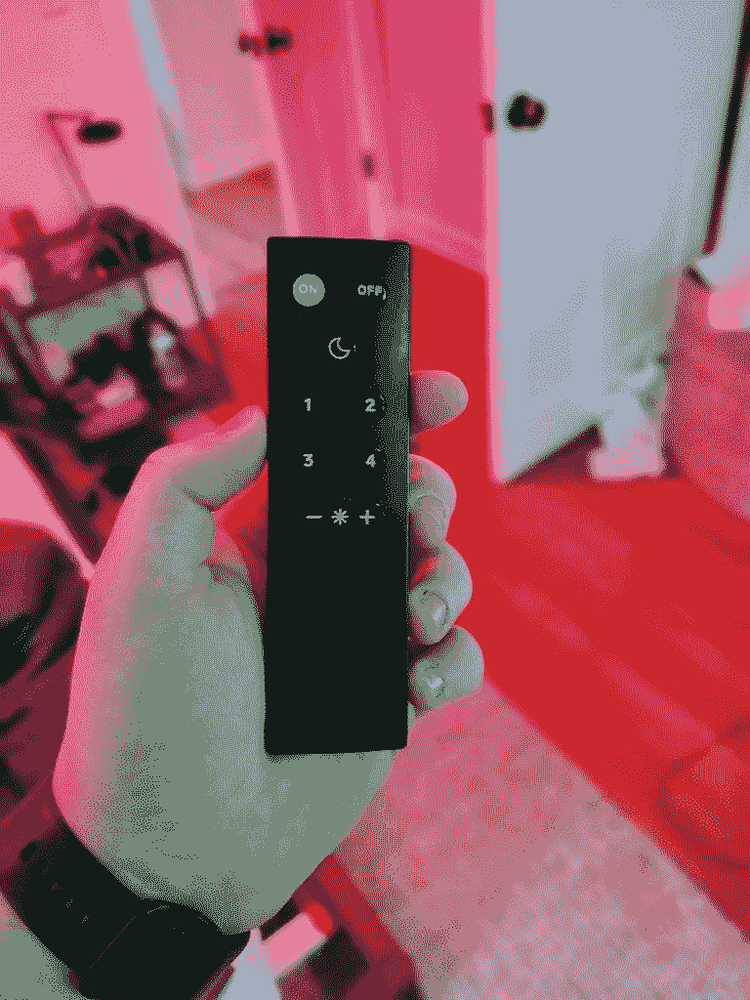

# WiZmote 遥控器评论:智能灯有用的唯一原因

> 原文：<https://www.xda-developers.com/wizmote-review/>

WiZ 智能灯是我用过的最酷的智能灯之一。它们与三星 SmartThings 和谷歌助手等应用程序有很好的集成。智能灯泡在任何地方都能很好地控制你的灯，但它们确实有些不尽如人意。没有帮助控制灯的物理灯开关等价物。WiZ 希望通过 WiZmote 来解决这个问题，这是一种用于智能家居系统的无线控制器。

WiZ 的智能灯是我第一次真正进入智能家居生态系统的冒险。到目前为止，我家里只有谷歌家用设备。我从来没有过智能电视或智能灯或类似 Nest 恒温器的东西。所以得到 WiZ，我真的很兴奋，因为这是我第一次真正冒险进入智能家居丛林。

一开始很棒。我非常喜欢玩街边的灯，改变灯的颜色，透过窗户看灯的变化。随着时间的推移，当你开始在日常生活中使用它们时，这种乐趣会逐渐消失。很多人喜欢你可以用手机控制智能灯，但对我来说，由于这个原因，它们实际上变得很烦人。

对于普通灯泡来说，控制灯光很简单。你向上拨动开关就可以打开它们，向下拨动开关就可以关闭它们。它们会立即打开和关闭。我们都知道这一点。对于智能灯，同样的事情发生了，你仍然可以扳动开关来打开和关闭它们。你还可以通过 Siri automation 使用智能手机应用程序、谷歌助手、Bixby、SmartThings、NFC 标签等来控制灯光。

然而，所有这些控制灯光的方法又增加了一层，老实说，有时会让他们感到不方便。这不仅仅是指 WiZ 灯，这绝对是令人惊叹的灯，而是指一般的智能灯。有太多的方法来控制灯光，以至于我发现自己只能回去扳动开关。直到我记起 WiZ 给我发了带智能灯的 WiZmote。

WiZ 智能灯最酷的地方在于颜色选择。这些颜色很有趣，只是交换和随机选择颜色。我喜欢对着我的谷歌主页大喊“嘿，谷歌，把灯调成橙绿色”，过一会儿我就沐浴在橙绿色的光中了。您还可以使用 WiZ 应用程序来控制特定的颜色，或者将其设置为更有趣的预设之一。我最喜欢的是聚会、深潜和海洋。它们可能没有任何用处，但是有趣的东西真的不是有用的。他们确实有一种真正有用的叫做“植物生长”的方法，它有助于室内植物的生长。

WiZmote 让这些灯对我来说变得实用和智能。我只需按下无线遥控器上的一个按钮，而不必告诉谷歌助手打开/关闭灯光或改变颜色。可以说，这比打开电灯开关容易多了。这使得这些灯实际上可以作为智能灯。

 <picture></picture> 

WiZmote in its glory

遥控器可以做几件不同的事情。它可以打开和关闭灯，当然，在 4 个不同的颜色配置文件之间切换，改变灯光亮度，并启用夜间照明。每个不同的选项只有一个按钮。它很简单，是电灯开关的完美替代品。

 <picture></picture> 

Party Mode on 4 lights

夜灯、开、关和亮度按钮都被设置为那些特定的功能，不能如预期的那样改变。可以改变的是 4 个颜色配置文件按钮，我改变了它们。我把我的调成了暖白色(这是我能找到的最接近白炽灯的颜色)，日光，舒适，派对。前三种是更通用的模式，适合日常使用。我会在周末使用派对模式来体验没有被邀请参加的派对。

使用控制器来控制灯光使智能灯的用处增加了 100 倍。有时候，使用谷歌助手或打开应用程序还不如按一个按钮来得快。这确实让智能灯成为了一种切实可行的家居解决方案。如果你想买智能灯，我强烈推荐带 WiZmote 的 WiZ 灯。WiZmote 确实让智能家居系统感觉很完整。第二代 WiZmote 将于 4 月开始上市，相信我，这是值得等待的。

[在亚马逊上购买带启动灯的 WiZ mote](https://www.amazon.com/stores/node/20653211011?_encoding=UTF8&field-lbr_brands_browse-bin=WiZ&ref_=bl_dp_s_web_20653211011&tag=xda-6oa3qcq-20&ascsubtag=UUxdaUeUpU27278&asc_refurl=https%3A%2F%2Fwww.xda-developers.com%2Fwizmote-review%2F&asc_campaign=Short-Term)| |[WiZ 智能灯](https://www.amazon.com/s?k=wiz&rh=n%3A322525011&ref=nb_sb_noss&tag=xda-6oa3qcq-20&ascsubtag=UUxdaUeUpU27278&asc_refurl=https%3A%2F%2Fwww.xda-developers.com%2Fwizmote-review%2F&asc_campaign=Short-Term)