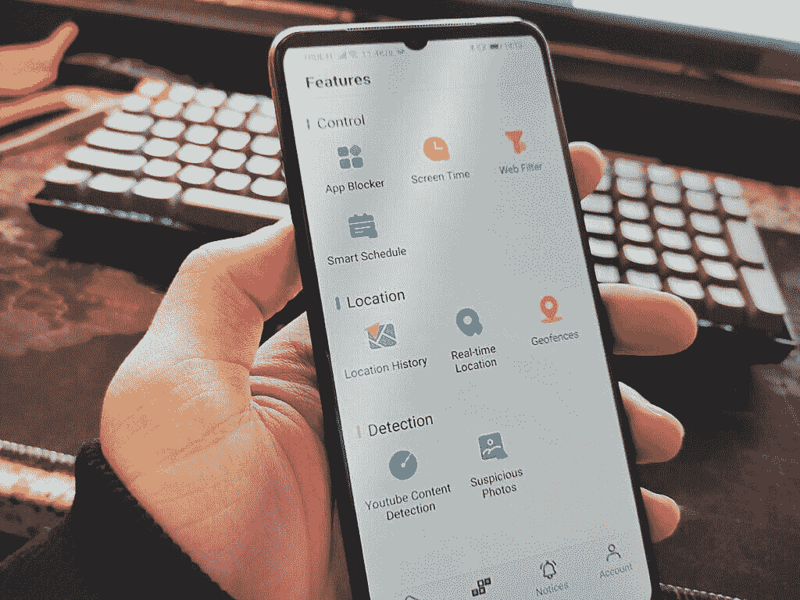

# 如何使用 Wondershare FamiSafe 应用程序管理孩子的屏幕时间

> 原文：<https://www.xda-developers.com/wondershare-famisafe/>

在美国，孩子第一次获得智能手机的平均年龄是十岁。无人监管的儿童可以访问许多不同的应用程序，这些应用程序可能会让他们接触到不想要的内容。无论是流媒体服务、聊天应用还是社交媒体应用，儿童都可以在线观看任何类型的内容或与陌生人交谈。对于许多父母来说，儿童的这种接触水平是一个合理的担忧。监控孩子智能手机活动的能力对于保护他们的安全至关重要。

有许多不同的方法可以保护你的家人在网上。VPN 作为一种保护您的在线身份和防止您的在线活动被跟踪的方式很受欢迎。你也可以在手机上设置儿童安全模式，如果制造商已经包括该功能的话。但是控制和监控你的孩子在手机上做什么的最好方法是使用 Wondershare 的[家庭安全家长控制应用](https://www.anrdoezrs.net/links/100122946/type/dlg/sid/UUxdaUeUpU30542/https://famisafe.wondershare.com/)。

FamiSafe 是管理孩子手机最可靠的方式，即使你有很多不同年龄的孩子。通过限制孩子使用设备，帮助他们养成良好的数字习惯。使用实时 GPS 定位数据跟踪他们的位置。最重要的是，通过阻止可能使他们遭受欺凌或儿童捕食者的应用程序和网站，让他们远离危险。这是一个非常棒的全方位服务解决方案，可以确保您的孩子安全地使用他们的智能手机或平板电脑。

**Wondershare FamiSafe 在[苹果商店](https://apps.apple.com/us/app/famisafe-parental-control-app/id1385417904)和 [Google Play](https://play.google.com/store/apps/details?id=com.wondershare.famisafe) 上有售。 [FamiSafe 还可以监控亚马逊 Kindle Fire 和 Win/Mac PC](https://www.amazon.com/gp/product/B0876SHYGC?tag=xda-kk0akip-20&ascsubtag=UUxdaUeUpU30542&asc_refurl=https%3A%2F%2Fwww.xda-developers.com%2Fwondershare-famisafe%2F&asc_campaign=Short-Term)。**

* * *

 <picture></picture> 

FamiSafe Control Panel

## 家庭安全家长控制功能

FamiSafe 提供了许多功能来帮助父母轻松控制孩子手机上的内容。**活动报告**生成一个全面的事件时间表，显示您孩子一整天的使用情况。这份报告发到你的手机上，非常简单易懂。你可以一目了然地了解孩子的日常活动。该报告将显示他们使用过的每个应用程序，以及每个应用程序的使用时间。

如果您看到您的孩子使用不安全的应用程序，则**应用程序拦截器&用法**功能将发挥作用。你可以远程控制要在目标手机上阻止哪些应用程序，或者对过度使用的应用程序设置时间限制。因此，在你回顾每天的时间表时，你可能会发现你的孩子已经使用抖音或 YouTube 几个小时了。只要在那个应用程序上设置一个时间限制，你就能鼓励更多的时间花在家庭作业或更有成效的活动上。这些限制也可以是基于位置的。因此，当孩子离开家时，可以限制或允许使用某个特定的应用程序。

网络浏览器是孩子可能陷入麻烦的另一个地方。**网页内容**管理器可以让你查看用户的浏览历史，以及阻止访问不适当的网站。您还可以保留想要限制的特定网站的黑名单。

防止你的孩子与网上的人有不适当的接触的最好方法是使用**父母提醒**功能。这将发送一个警报到您的手机时，明确的文本或信息检测。这对社交媒体网站和聊天应用来说是好事。它还可以检测色情照片，这有助于阻止儿童捕食者。

最后一个值得注意的特点是**家庭定位器**。它只是一个实时 GPS 追踪器，适用于家庭安全设置中的每部手机。这将显示用户在哪里，以及他们去过的位置历史。您可以设置地理围栏，如果有孩子超出许可区域，它会提醒您。

* * *

## 如何在 Android、iOS 和其他设备上使用 FamiSafe

如果你正在寻找设置家庭安全系统的帮助，[这些用户指南](https://www.anrdoezrs.net/links/100122946/type/dlg/sid/UUxdaUeUpU30542/https://famisafe.wondershare.com/user-guide/)让这个过程变得非常简单。您将能够找到关于如何为成人和儿童设置设备的指南。有针对 Android、iOS、MAC 或 Windows 设备的教程。

注册家庭安全后，你可以使用谷歌和脸书等第三方登录服务。iOS 用户将可以使用他们的 Apple ID 注册，这使得注册过程尽可能简单。当您准备好添加孩子的设备时，只需输入一个代码，即可将他们的手机添加到您的帐户中。

家庭安全是管理您的家人可以访问的内容的好方法。你可以根据自己的需要设定严格或放松。简单性和实时报告使其成为如此有效的系统。作为不当行为的结果，可以实施更严厉的限制，或者你可以授予更多的权限作为奖励制度。今天就开始查看可用的[价格计划](https://www.anrdoezrs.net/links/100122946/type/dlg/sid/UUxdaUeUpU30542/https://famisafe.wondershare.com/store/family.html?usource=lc&src=linkconnector&lctid=31955873)。

###### *我们感谢 Wondershare 赞助了这篇文章。我们的赞助商帮助我们支付与运行 XDA 相关的许多费用，包括服务器成本、全职开发人员、新闻撰稿人等等。虽然您可能会在门户内容旁边看到赞助内容(这些内容将始终被标记为赞助内容),但门户团队对这些帖子不承担任何责任。赞助内容、广告和 XDA 仓库完全由一个独立的团队管理。XDA 绝不会通过接受金钱来赞扬一家公司，或以任何方式改变我们的观点或看法，从而损害其新闻诚信。我们的意见不能被收买。*