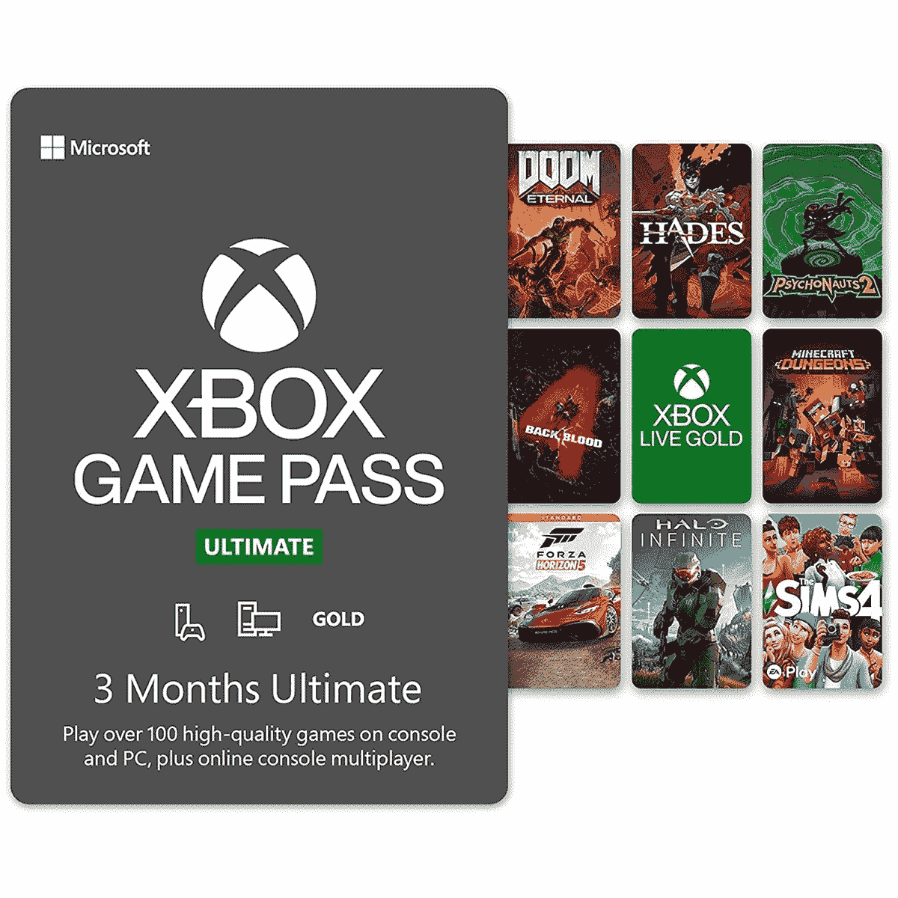

# Xbox 云游戏获得激动人心的更新，登陆三星电视

> 原文：<https://www.xda-developers.com/xbox-cloud-gaming-samsung-tvs/>

# Xbox 云游戏登陆 2022 三星智能电视，扩展到阿根廷和新西兰

Xbox 云游戏通过在 2022 年登陆三星智能电视，为无主机体验做出了又一次飞跃。

随着非 E3 赛季全面启动，Xbox 开始发布一些与云相关的重大公告。在本周末 Xbox-Bethesda 联合展示之前，我们得到了一些 Xbox 云游戏平台的消息。

随着 Xbox 的 20 周年纪念日刚刚过去，让您知道我们对 Xbox 团队的期望也很重要，包括我们的设备和服务，因为我们为未来 20 年的游戏构建了一个平台。今天，我们想分享我们接下来要做的事情，以继续使 Xbox 成为游戏中的最佳价值，让玩家享受最佳游戏，跨流派，跨主机，PC 和云，包括在发布当天就推出 Xbox Game Pass 的新 Xbox 游戏工作室游戏。

第一条有趣的消息是 Xbox 云游戏加入三星 2022 年智能电视阵容。从 6 月 30 日起，它将在三星游戏中心占据一席之地，只需要一个微软账户和一个蓝牙控制器。堡垒之夜将像其他 Xbox 云游戏平台一样对所有人免费开放。其余的你需要一个 Xbox 游戏通行证终极订阅。

虽然目前这只是智能电视的一小部分，但这无疑是朝着正确方向迈出的一步。随着关于“Keystone”的谣言满天飞，一款已确认但尚未发布的专用流媒体设备，以及现在的这条新闻，Xbox 显然正在继续向云进军。

## Xbox 云游戏将在阿根廷和新西兰推出

比更多的硬件更好的是，更多的游戏玩家可以接触到 Xbox 云游戏。两个新的国家现在是 Xbox 云游戏家族的一部分。阿根廷和新西兰的游戏玩家现在首次获得这项服务。适用所有相同的规则，包括支持的设备和免费访问所有堡垒之夜。

微软最近在 Build 上宣布 [Xbox 云游戏拥有超过 1000 万玩家](https://www.xda-developers.com/xbox-cloud-gaming-now-has-over-10-million-players/)，因此需求是肯定存在的。下一个发展也正在被取笑，Xbox 准备通过云提供一些你购买的游戏。

我们很高兴地告诉大家，今年晚些时候，我们打算推出 Xbox Game Pass Ultimate 成员从云中选择他们已经拥有或在 Xbox Game Pass 库之外购买的游戏的功能。

考虑到 Xbox 目录的规模，这肯定会是一个受欢迎的功能，并将使 Xbox 云游戏更加符合像[谷歌 Stadia](https://www.xda-developers.com/stadia-appreciation-editorial/) 和 NVIDIA GeForce Now 这样的服务。

 <picture></picture> 

Xbox Game Pass Ultimate (3 months)

##### Xbox 游戏通行证

通过 Xbox Game Pass Ultimate 订阅，您可以访问控制台、PC 和云中的 Game Pass 库，每个月都会添加新游戏。

**来源:** [Xbox](https://news.xbox.com/en-us/2022/06/09/whats-next-for-gaming/)