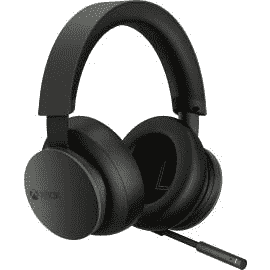

# 新的 Xbox 无线耳机看起来很棒，您现在就可以预购

> 原文：<https://www.xda-developers.com/xbox-wireless-headset/>

你是一台 [Xbox 系列 X 或 S](https://www.xda-developers.com/xbox-series-x-restocks/) 的幸运拥有者吗？或者你是一个电脑游戏玩家，需要一个新的，高品质的耳机，而不是打破银行？微软发布了 Xbox 无线耳机。听起来很简单，这是一个新的无线游戏耳机，你可以用你的 Xbox 和 PC！它的售价仅为 99 美元，比市场上许多其他无线耳机的价格都要便宜！

这款耳机有什么特别之处？[微软表示](https://news.xbox.com/en-us/2021/02/16/xbox-wireless-headset-announcement/)通过兼容 Windows Sonic 和杜比 Atmos，你将获得惊人的音频质量。麦克风还会自动调谐，确保聊天时过滤掉背景噪音。无线耳机还可以在 Xbox 系列游戏机、Xbox One 和 PC 上使用，并且您可以为每个设备设置独特的配置文件。调整它为每个控制台的完美体验！

但是，在我看来，Xbox 新耳机最好的地方是价格。老实说，对于这样一款多功能耳机来说，99 美元是一个相当低的价格！Razer 和 Corsair 的同类耳机轻松突破了 150 美元的价格区间。因此，这是一款经济实惠的耳机，您可以在 Xbox 和 PC 上使用！

Xbox 无线耳机将于 3 月 16 日正式发布。不过，你可以在亚马逊和微软商店预购这款设备。在撰写本文时，两家商店都暂时缺货，但似乎在未来几天会有更多的库存，并且可能会有更多的库存发布。因此，请务必留意商店页面，并获得您的预购订单！

 <picture></picture> 

Xbox Wireless Headset

##### 微软 Xbox 无线耳机

 <picture></picture> 

Xbox Wireless Headset

##### 微软 Xbox 无线耳机

 <picture></picture> 

Xbox Wireless Headset

##### 微软 Xbox 无线耳机

如果你想知道微软耳机的可能替代品，看看 [Razer Nari 无线耳机](https://www.amazon.com/Razer-Nari-Wireless-Gel-Infused-Cushions/dp/B07G5RKF3W?tag=xda-1k91e6j-20&ascsubtag=UUxdaUeUpU767&asc_refurl=https%3A%2F%2Fwww.xda-developers.com%2Fxbox-wireless-headset%2F&asc_campaign=Short-Term)。虽然售价 150 美元，但这款耳机与微软的产品有很多相同的功能。你不会得到多个配置文件，但你也可以在你的 PS5 和交换机上使用它。