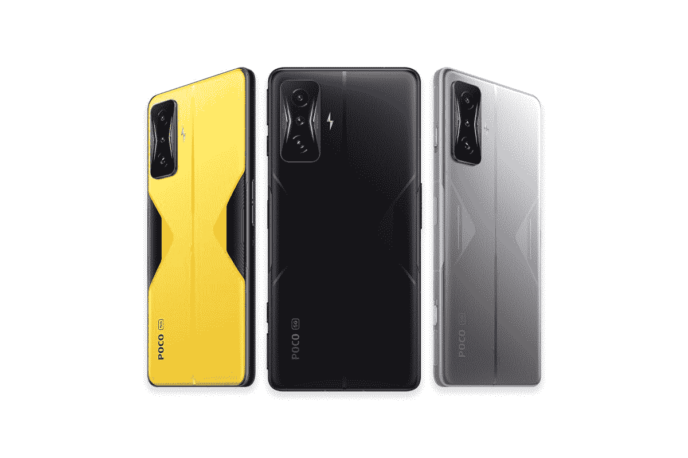

# 一加 11、联想 ThinkPhone、摩托罗拉 Edge 30、Poco F4 GT、红米 Note 12、华为 Mate 50 系列论坛现已开放

> 原文：<https://www.xda-developers.com/xda-forums-oneplus-11-lenovo-thinkphone-motorola-edge-30-poco-f4-gt-redmi-note-12-huawei-mate-50/>

如果你很难跟上所有的电话通知，我们不怪你。事实上，随着时间的推移，情况会变得更加疯狂。为了让潜在买家和发烧友更容易在一个地方找到所有相关信息，我们决定为新发布的[一加 11](https://www.xda-developers.com/oneplus-11/) 和[联想 ThinkPhone](https://www.xda-developers.com/lenovo-thinkphone-by-motorola-launch-ces/) 开放 XDA 论坛。我们还为一些旧设备开辟了新的论坛页面，比如 Redmi Note 12 系列和摩托罗拉 Edge 30。

## 一加 11

一加的 2023 旗舰产品上周在中国亮相，采用 6.7 英寸 2K LTPO 3.0 AMOLED 显示屏，峰值刷新率为 120Hz，支持可变刷新率。一加 11 由高通最新和最棒的骁龙 8 代 SoC 驱动，加上高达 16GB 的内存和 512GB 的板载存储。哈苏品牌的相机部门配备了 50MP 主传感器，32MP 长焦传感器，48MP 超宽相机和 16MP 自拍相机。该设备采用 5000 毫安时电池，支持 100 瓦有线充电。该公司计划下个月将这款手机推向国际市场。

**[一加 11 XDA 论坛](https://forum.xda-developers.com/f/oneplus-11.12687/)**

## 摩托罗拉的联想 ThinkPhone

联想的 ThinkPhone 与其他联想手机截然不同，提供 IP68 防尘防水等级和 MIL-STD 810H 认证，等等，运行在 Android 上的独立处理器增加了一层安全保护敏感数据。这款商务智能手机由摩托罗拉制造，采用芳纶纤维背板，航空级铝框架，显示屏采用大猩猩玻璃 Victus 保护。它还提供了一套新的 Think 2 Think 连接功能，可以将其与联想的 ThinkPad 笔记本电脑无缝集成。

**[联想 ThinkPhone 由摩托罗拉 XDA 论坛](https://forum.xda-developers.com/f/lenovo-thinkphone-by-motorola.12693/)**

## 红米 Note 12 系列

Redmi Note 12 的基本型号是一款价格实惠的 5G 手机，采用高通的骁龙 4 Gen 1 SoC，6.67 英寸 120Hz AMOLED 显示屏，双摄像头设置，48MP 主摄像头，5,000mAh 电池，支持 33W 有线快速充电。对设备有疑问吗？点击下面的链接进入论坛页面，询问 XDA 的读者。

**[红米笔记 12 XDA 论坛](https://forum.xda-developers.com/f/redmi-note-12-5g.12689/)**

与普通版非常相似，Redmi Note 12 Pro 和 Redmi Note 12 Pro Plus 采用 120Hz 有机发光二极管显示屏，但也支持杜比视觉。这些设备采用联发科的 Dimensity 1080 SoC，外加高达 12GB 的 RAM 和 256GB 的板载存储。

在成像方面，“Pro”型号配备了 50MP 主摄像头，而“Pro Plus”型号配备了 200MP 三星 ISOCELL HPX 传感器。此外，还有一个 8MP 超宽相机，一个 2MP 微距相机和一个 16MP 自拍相机。它们都装有一个 5000 毫安时的大电池，分别支持 67 瓦和 120 瓦的快速充电。由于内部的相似性，他们共享一个共同的固件库，因此我们为他们创建了一个联合论坛。

**[红米 Note 12 Pro 和 12 Pro 加 XDA 论坛](https://forum.xda-developers.com/f/redmi-note-12-pro-pro-plus-5g.12691/)**

## 摩托罗拉边缘 30

摩托罗拉 Edge 30 是一款中档手机，采用高通的骁龙 778G Plus 芯片组，6.5 英寸 144Hz 极化显示屏，三摄像头和 50MP 主摄像头，以及 4,020mAh 大电池，支持 33W 有线快速充电。我们论坛上的开发者已经为该设备发布了 LineageOS 20 的官方版本，我们预计不久将会有更多的售后开发。

**[摩托罗拉缘 30 XDA 论坛](https://forum.xda-developers.com/f/motorola-edge-30.12697/)**

## Poco F4 GT/Redmi K50 游戏

 <picture></picture> 

POCO F4 GT

Poco F4 GT(最初在中国发布为红米 K50 游戏)是一款 2022 年的旗舰游戏手机，采用高通的骁龙 8 代 1 芯片组，高达 12GB 的内存和高达 256GB 的存储。该设备正面有一个 6.67 英寸的 FHD+ 120Hz AMOLED 显示屏，内部有一个 4700 毫安时的电池，支持 120 瓦的有线快速充电。

在摄像头方面，Poco F4 GT 配备了 6400 万像素的主摄像头，800 万像素的超宽摄像头，200 万像素的宏观传感器和 200 万像素的自拍摄像头。该设备运行基于 Android 12 的 MIUI 13 for Poco。

**[Poco F4 GT/红米 K50 博彩 XDA 论坛](https://forum.xda-developers.com/f/xiaomi-poco-f4-gt-redmi-k50-gaming.12699/)**

## 华为 Mate 50 系列

标准的华为 Mate 50 于 2022 年 9 月推出，提供 6.7 英寸 1224 x 2700 有机发光二极管平板显示器，刷新率为 90Hz，高通骁龙 8 Plus Gen 1 4G SoC，50MP 主摄像头，4,460mAh 电池，支持 65W 有线和 50W 无线充电。与此同时，华为 Mate 50 Pro 配备了一个 6.74 英寸的曲面显示屏和一个强大的 64MP 长焦摄像头，以及一个 13MP 超宽摄像头，该摄像头还兼作宏观传感器。

**[华为 Mate 50 和 Mate 50 Pro XDA 论坛](https://forum.xda-developers.com/f/huawei-mate-50-50-pro.12685/)**