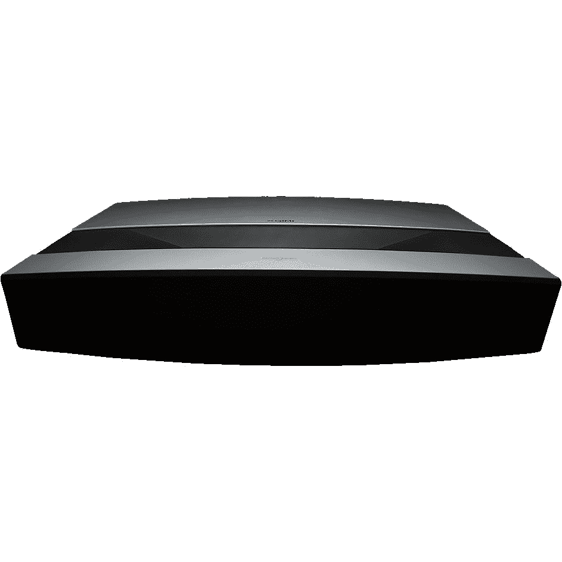
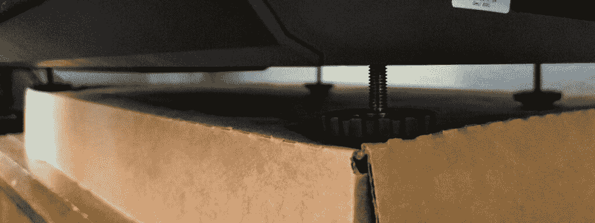
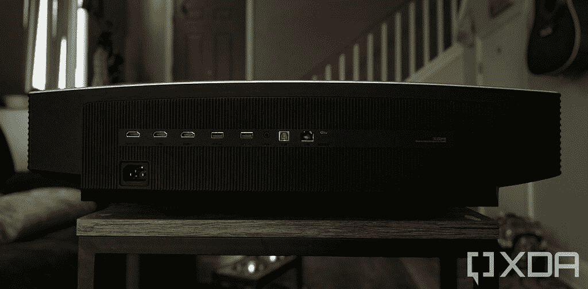
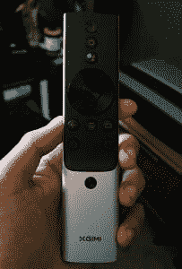
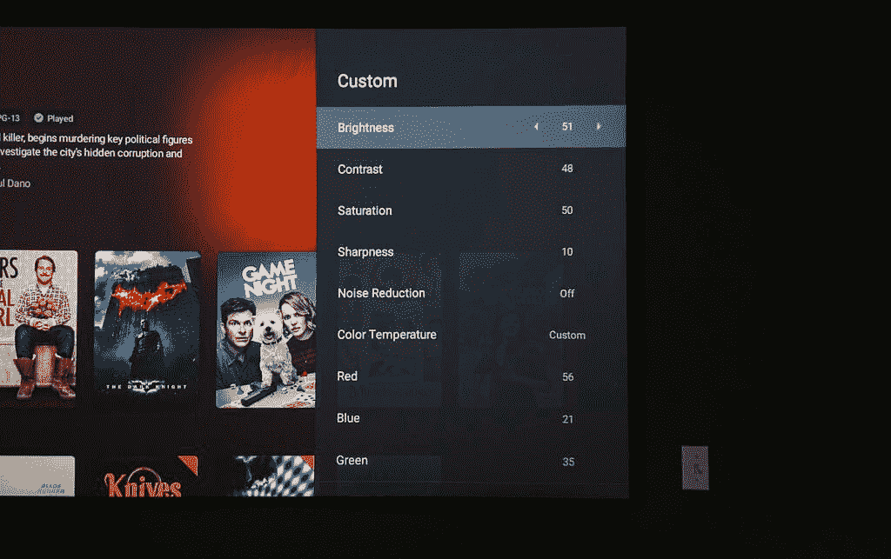
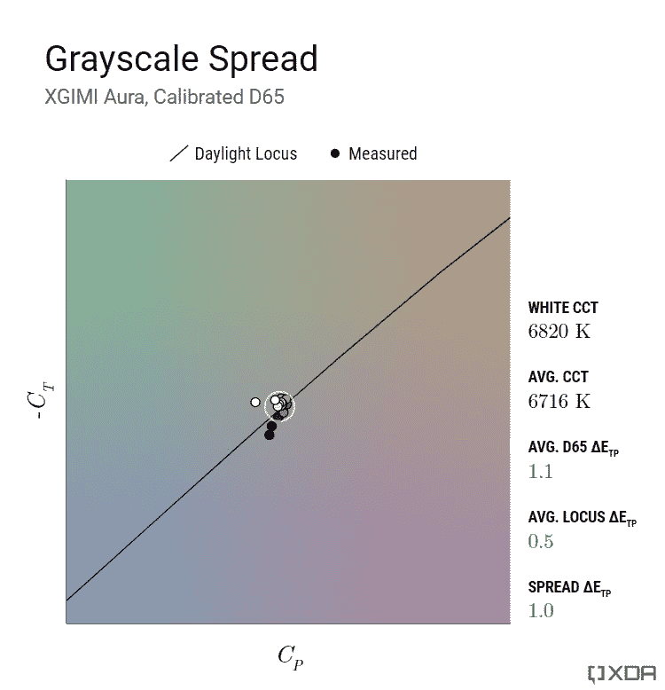
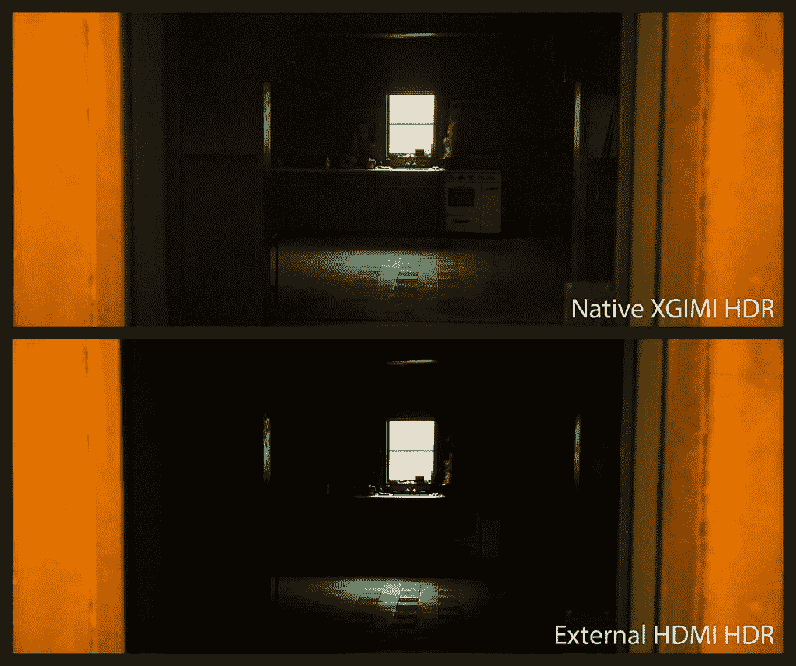

# XGIMI Aura 智能投影仪评论:性能满足便利性

> 原文：<https://www.xda-developers.com/xgimi-aura-4k-smart-projector-review/>

如果你告诉我你的卧室里安装了一个 100 英寸的投影屏幕，我可能会认为你疯了。大多数理智的人会简单地为他们的舒适区设置一台智能电视，但为什么不设置一台 T2 智能投影仪呢？当人们听到这个词时，他们往往会想到剧院或成熟的家庭影院系统。但最近，一些投影仪制造商开始让他们的产品更适合家庭和用户，提供一体化的“盒子里的家庭影院”，在家庭环境中看起来很自然，并且易于设置和使用。

奥拉 4K 超短焦就是 XGIMI 的一款这样的产品，该公司将其宣传为可以取代家庭电视的投影仪。我在自己舒适的卧室里进行了测试，看看这样做的可行性如何，以及它在这次评测中的表现如何。

 <picture></picture> 

XGIMI Aura 4K Laser Ultra-Short Throw

##### XGIMI Aura 4K 激光超短焦

Aura laser short throw 是 XGIMI 最新的旗舰投影仪，集性能、风格和简洁于一体

***关于本次评测:** XGIMI 给我们发了一个气场投影仪进行评测。该公司没有参与此次审查的内容。*

* * *

## XGIMI 光环:风格和设置

由于 XGIMI Aura 是一件旨在融入您家庭环境的设备，所以外观*很重要。在音频视频社区中有一个经常使用的指标叫做*妻子接受系数* (WAF)，这是一个衡量你的另一半对房间里有一个特殊装置有多满意的指标。*

在客厅里，XGIMI Aura 得到了很高的 WAF 分数:它有一个漂亮的织物正面，隐藏了四个 Harman Kardon 15W 驱动器，还有一个光滑的银色顶部口音，让机顶盒有些存在感。测量大约 24 英寸宽，16 英寸深，6 英寸高，气场在房间里不会特别消失——房间可能仍然需要围绕它进行设计。这是拥有一台使晶圆垂直下落的投影仪的典型部分，但你必须让结果自己说话。

XGIMI Aura 是一款外观时尚的机顶盒，但其尺寸可能会使其难以定位

将要取代电视的东西应该能持续很长时间。没有人喜欢更换电视背光灯或灯泡。XGIMI 声称其 Aura 投影仪内部的激光光源可以持续长达 25，000 小时，如果你每天使用 4 小时，应该可以持续 17 年左右。我有时不是最节省能量的人，所以在我的书中，长寿对于任何展示都是一个极其重要的品质。有些日子，我会让节目或视频在后台运行，而在其他时候，我会让它通过我的照片放映，只是为了营造气氛。我会对打开任何基于灯的投影仪保持警惕，即使我目前的有机发光二极管，这样做肯定会出现烧伤。如果 XGIMI 声称的 25000 小时是准确的，那么光环应该会让你安心地不负责任地使用屏幕时间。

一体式系统的一部分是拥有直观易用的智能操作系统。XGIMI Aura 启动 Android TV 10.0，与 Chromecast 捆绑，用于无处不在的内容流。如果你熟悉 Android 的操作系统，Aura 的界面会让你感觉很舒服。即使你不知道，界面也是简单明了的，可以快速导航。使用 Android TV，你可以安装所有流行的流媒体服务应用程序，如 Hulu、Prime Video、HBO Max 或 Peacock。网飞并不容易得到支持，但是如果你看的话，在互联网上有一些变通方法。

 <picture></picture> 

Bottom of XGIMI Aura. Yes, I'm using a cardboard box for some extra height.

为了帮助定位短投，底部有四个高度可调的挡块，用于微调投影倾斜和高度。没有任何形式的物理镜头调整，但 Aura 确实有一个 8 点电子梯形校正，如果你想要最清晰的图像，应该尽可能少地摆弄它。

 <picture></picture> 

XGIMI Aura's rear I/O ports

许多使用这款投影仪的人可能会满足于使用其内置的操作系统，但对于那些想要连接外部设备的人来说，XGIMI Aura 提供了三个 HDMI 2.0 端口，其中一个支持 ARC。还有一个光学和模拟 3.5 毫米端口，用于连接条形音箱或书架。如果你想播放拇指驱动器上的一些文件，还有两个 USB 2.0 端口，对于有线互联网连接，还有一个以太网端口。如果你坚持无线，只是被警告内置 OS 不支持 Wi-Fi 6。

 <picture></picture> 

XGIMI Aura remote

控制投影仪的是一个又高又窄的铝制遥控器，按钮用黑色塑料装饰。它看起来很光滑，和 XGIMI 为其[地平线投影仪](https://www.xda-developers.com/xgimi-horizon-pro-projector-review/)提供的遥控器是一样的。有一个很好的分量，虽然我个人不喜欢处理铝外壳。按钮的位置很容易记忆，而且它们有不同的纹理来帮助感觉它们。除了后退/菜单/主页/音量等标准按钮，Aura 遥控器还有一个用于快速设置、语音控制和自动对焦的专用按钮。快速设置菜单中有更改图像模式、声音设置、HDMI 设置和梯形校正的选项。我本来希望灯的亮度可以在快速设置中调整，但是它在主投影仪设置中的位置更深一点。

至于调整图像校准的能力，XGIMI Aura 上的调谐控制有些有限。快速设置中有一些图片模式预设，尽管它们实际上彼此之间没有太大的差异，除了*游戏*预设，它显著降低了输入延迟。对于更精细的控制，*自定义*画面模式提供了对*亮度*、*对比度*、*饱和度*、*锐度*、*降噪*、*色温*和*运动补偿*的调整。将*色温*设置为*自定义*允许单点 RGB 调整，这足以实现整个灰度的一致白平衡。然而，没有任何色调映射或伽马控制，这对于这个价格的显示设备来说是非常令人失望的。也没有色彩管理控制，尽管由于光源的色域很小，这并不是真正必要的。有一个选项可以改变*局部对比度*的强度，但从我的测试来看，这个功能即使在最强的设置下也几乎不起作用。

## 印象

取代我墙上的 65 英寸有机发光二极管的是一个 100 英寸的环境光阻挡投影仪屏幕，专为超短焦设计。有机发光二极管电视是一个非常高的比较画质的标准，但这是光环与之竞争的价格点。最初，我在客厅的一面普通白墙上测试了 XGIMI Aura，但来自窗户的杂散光很容易洗掉投影仪发出的图像，即使是在最亮的设置下。安装了 ALR 投影屏幕后，光环即使在白天也能产生足够的图像。然而，这样一个屏幕可以运行你一个额外的 600 美元或更多。

大约 2499 美元，XGIMI Aura 与 77 英寸 OLEDs 竞争，所以这是我应该与 Aura 进行比较的尺寸。即使在这样的尺寸下，100 英寸的对角线提供的表面积几乎是 77 英寸电视的两倍，所以仍然存在惊人的差异。坐在 12 英尺外，我的 65 英寸和 100 英寸之间的差别是一个完全不同的世界。尽管有机发光二极管的图像质量客观上更好，但视觉包围图像创造的体验是无法替代的。THX 的电影迷们建议屏幕视角大约为 36 度，从我的座位看，77 英寸的屏幕只能覆盖大约 26 度。

许多视频爱好者会插嘴说，比起数量，他们更喜欢*的质量，这我完全理解。作为一个在看电影时花太多时间在画面设置上的人，画面保真度对我来说是一个合理的关注和优先考虑的问题。我过去用过的投影仪，要么性能不够好，要么太不方便，无法完全取代电视。虽然 XGIMI Aura 的图像质量无法与任何有机发光二极管相提并论，但我想说投影仪的输出足够体面，当我真正沉浸在场景中时，我可以*忘记*担心它的缺乏。*

也就是说，作为一个色彩纯粹主义者，它需要一定程度的图片保真度和色彩准确性，以便我不会经常感到烦恼。去年，[我评测了 XGIMI Horizon Pro](https://www.xda-developers.com/xgimi-horizon-pro-projector-review/) ，尽管它功能多样且易于使用，但由于对比度差和不可修复的过饱和问题，我无法用它替换我的任何电视。XGIMI Aura 的激光光源在这两个方面的改进足以让我感觉更好。

光环上的休闲游戏一直令人愉快，当选择*游戏*画面预设时，它是完全可行的。像*替罪羊*和*需要两个人*这样的潜在协调游戏可以正常玩，但与快速显示器相比，抽搐反应游戏受到了明显的打击。*游戏*模式下禁用所有视频后期处理和画面调整，实现低延迟，可惜；像白平衡、亮度和对比度这样的基本设置应该在计算上足够便宜，以至于对延迟几乎没有影响。如果 Aura 支持*自动低延迟模式*也不错，这样我就不需要手动切换*游戏*模式了。最后，投影仪的刷新率仅官方支持 60 Hz，没有任何可变刷新率，这使其保持在纯休闲游戏玩家的领域。

从光环中发出的声音令人惊讶地浑厚。简单来说，比我听过的任何一款电视音箱都要好，堪比预算级的书架。由于有多个前置驱动程序，对话非常清晰，DSP 在挤出一些低端方面做得很好。它们变得比我在自己房间里需要的声音还要大，我要说它们能够填满一个客厅，而不会扭曲到接近最大音量。那些想要保持简约设置的人可能会对这些音频感到满意。由于 Aura 配备了带有 Chromecast 的 Android 电视，因此在必要时可以毫不费力地从智能手机上播放您最喜爱的音乐。

## 绩效和测量

XGIMI Aura 的规格似乎与 2000-3000 美元价格范围内的投影仪一样。它使用 0.47 英寸的 DMD 和像素偏移来实现真正的 4K 图像，额定高达 2400 ANSI 流明。它的投掷比是 0.233:1，可以在距离墙壁大约 8.2 英寸的深度投射 100 英寸的对角线。因为这是一个超短焦，所以与普通投影相比，当投影到屏幕上时，更多的流明输出被保留下来，所以 2400 流明可以走很长的路。对于我的 100 英寸 0.6 增益投影仪屏幕，我测得的最大屏幕亮度约为 110 尼特，这在光线控制的客厅中表现良好。

 <picture></picture> 

Custom picture settings used for the XGIMI Aura

在投影仪的原生配置中，我测得 XGIMI Aura 的静态完全开/关对比度约为 **2500:1** ，这对 DLP 投影仪来说相当不错。这种水平的对比度相当于没有动态背光的中档电视，所以就质量而言，没有什么值得大书特书的。但是当它以大得多的画面显示时，中档电视质量看起来出奇的好。高端投影仪提供了一个动态光圈，可以调节场景到场景的光输出，以实现最大的对比度，但遗憾的是，Aura 不具备这样的功能。尽管如此，它的对比度水平仍然有助于令人愉快的深度画面，我更喜欢中等水平的静态对比度，而不是可能出现伪像的动态对比度实现。

坏消息是 XGIMI 光环的原生光源放出大量蓝色能量，开箱白平衡过度偏冷。通常，大多数显示器上都有一个图片预设，可以提供相当高的颜色准确度，但 XGIMI Aura 没有这样的设置。人们会认为 XGIMI 的*电影*预设会是那个设置，但在这个设置中，白平衡仍然测量 9000 K 以北。图片预设需要设置为*自定义*以调整白平衡更接近参考，但即使是*暖*白平衡预设也太冷了。

按照行业标准 D65 校准白平衡通道需要去除大量蓝光能量，这会显著降低图像对比度。一旦这样做了，XGIMI 光环的静态对比度下降到大约 1500:1，这只是*还好*，但价格接近平庸。

在进一步研究投影仪的输出测量之前，了解投影仪和电视之间的观看条件有不同的标准是很重要的。根据行业标准，人们希望在昏暗的灯光下观看电视，而投影仪通常在尽可能暗的环境中观看。因此，对于这两种技术，来自屏幕的预期光量是不同的:电视通常被校准到 100 尼特的白色水平，而投影仪被校准到大约 50 尼特。当然，这些值取决于实际的观察环境，但是我们坚持使用这些值进行标准测量。

 <picture></picture> 

Tone mapping for XGIMI Aura, measured at 18% APL

在电视领域，标准音调响应的伽马功率约为 2.40。投影仪没有明确的标准，但许多校准器只是沿用了 2.40 伽马功率响应，我觉得这是一个错误。由于电视和投影仪之间的观看条件不同，使用相同的色调响应并不能转化为相同的感知图像对比度；投影仪的图像在高光处的细节会减少，而在阴影处会加重。还有一个画面标准，叫 BT.1886，我用它来比喻 XGIMI 光环代替。该曲线考虑了显示器的对比度和亮度，以形成定制的色调响应，该色调响应保持了在理想显示器上看到的 2.40 伽马功率的相对结构。

在 D65 校准并将灯亮度设置为大约 50 尼特之后，XGIMI Aura 输出大约 2.10 的显示灰度系数。然而，单一的伽马功率值不适合表征投影仪的输出；光环的色调映射有轻微的 S 曲线，牺牲高光中的细节以实现更陡峭的对比度。从我的观看测试来看，它并没有过火，它仍然自然地呈现场景，令人愉快地增强了冲击力。明亮的区域会稍微散开，虽然阴影没有被跟踪，但在黑暗中看起来仍然清晰可辨。这是一个很好的妥协，它利用了投影仪的观看条件，但我仍然更喜欢将色调调整到更接近 BT.1886 曲线的能力。

 <picture></picture> 

Grayscale precision for XGIMI Aura, measured at 18% APL

白平衡一致性在整个光环的灰度中非常出色。这弥补了一点白平衡调整，因为所有灰点都会跟踪它的设定值。尽管如此，多点调整仍然很重要，以便可以调整色调映射。唯一的异常值是 100%白色，它比灰度的其余部分稍微冷一些。将*对比度*设置为 48，使其与其余的点一致。

到达 XGIMI 光环最弱的地方就是它的颜色表现。激光光源的最大色域仅覆盖 Rec.709 的约 93%或 DCI-P3 的约 76%(相对于 ICtCp)。这和它的静态对比意味着 HDR 内容在 XGIMI 光环上几乎看不到任何好处，尽管它有回放它们的能力。

在颜色准确性方面，光环的测量也很差。即使在尽可能接近 D65 校准白点之后，平均颜色误差仍然测量为大约δ*E[TP]*= 11，远远超过 3.0 的视觉阈值，误差延伸到δ*E[TP]*= 36。深蓝颜色混合物变得高度过饱和并且色调扭曲；天空略带靛蓝，蓝绿色是纯青色。纯红色和绿色并不太坏，尽管黄色看起来有点像霓虹灯。幸运的是，一些关键的记忆颜色，如肤色和树叶，表现得相当准确。这是整个混乱局面的可取之处，因为与这些关键的颜色相比，扭曲其他颜色要容易忍受得多。

 <picture></picture> 

Photo comparison of HDR content played back on native XGIMI OS vs external HDMI device. HDR playback in native OS appears correct with natural tone mapping while external devices result in black crush.

正如我之前提到的，光环的性能使它不适合播放 HDR 的内容。这是大多数投影仪的真实情况，而不仅仅是 XGIMI Aura 该技术仍然主要受限于其缺乏同步对比度和光输出。一些高端投影仪试图通过动态色调映射来规避这一缺点，但这一功能不应以 Aura 的价格来预期。

我注意到 XGIMI 投影仪的另一个问题是，如果没有在原生操作系统中播放，它会扰乱 HDR10 的渲染。在外部 HDMI 设备上，整个对比度曲线看起来更陡，粉碎了阴影细节，使黑暗的场景看起来模糊不清。播放 HDR10 时，如果外部设备将工作色彩空间切换到 Rec.2020，颜色也会变得扭曲。如果你坚持在原生操作系统之外观看 HDR 内容，这有助于将 Aura 的亮度设置增加到 52，并确保它保持在 Rec.709 图片模式下。最后，我建议只在 XGIMI Aura 上观看 SDR master 的节目和电影，除非 HDR 版本的比特率大幅提高。

## 定论

XGIMI Aura 整体表现出色，尽管有一些主要的“但是”。它的整体包装是为那些希望在一个简单的界面中获得漂亮、大画面和大声音的休闲观众量身定制的。就画面质量而言，Aura 激光输出清晰、明亮和有力的图像，我毫不怀疑 XGIMI Aura 足以让大多数客厅的观众惊叹不已(因为它确实如此，就我而言)。然而，对于与大型高端电视竞争的东西，我希望它能勾选更多的框。

从家庭影院发烧友的角度来看，如果没有专业的色彩控制，很难推荐一款视频产品。XGIMI 就是这种情况——对于投影仪的价格来说，光环几乎看起来是不可行的。使用 XGIMI 的[入门级 Horizon Pro 投影仪](https://www.xda-developers.com/xgimi-horizon-pro-projector-review/)时，这是一个我无法逾越的障碍，现在我正在重新评估一款更昂贵产品的相同问题。Aura 激光投影仪的整体图像质量无疑比 Horizon Pro 有了明显的改善，但它是否能取代高端电视的问题仍然很复杂。

当我不想沉浸在电影中时，OLED 电视仍然更方便:它占用更少的空间，启动更快，对游戏来说更好*，并且让我对在背景中播放节目不那么内疚。但归根结底，我用 XGIMI Aura 看电影的体验比用 65 英寸有机发光二极管好得多。大声音和大场景*需要*大屏幕，所以无论《我的有机发光二极管》看起来多么完美，它都无法再现像《金刚大战哥斯拉》那样的混乱氛围。正如我提到的，气场在色度上看起来足够体面，不会完全降低大多数场景的艺术完整性。*

 *我的观点是，如果参考级别的色彩准确度不是绝对的首要任务，XGIMI Aura 是电视的绝佳替代品。我相信 XGIMI Aura 提供了足够的便利和图像保真度来满足大多数电影观众，包括漫不经心和半挑剔的观众。不推荐任何类型的严肃游戏，但 XGIMI Aura 上的休闲游戏可以带来独特的沉浸式体验。家用投影仪仍有很大的改进空间，但与此同时，我对 XGIMI 光环占据我的一个房间感到很舒服。

 <picture></picture> 

XGIMI Aura 4K Laser Ultra-Short Throw

##### XGIMI Aura 4K 激光超短焦

Aura laser short throw 是 XGIMI 最新的旗舰投影仪，集性能、风格和简洁于一体*