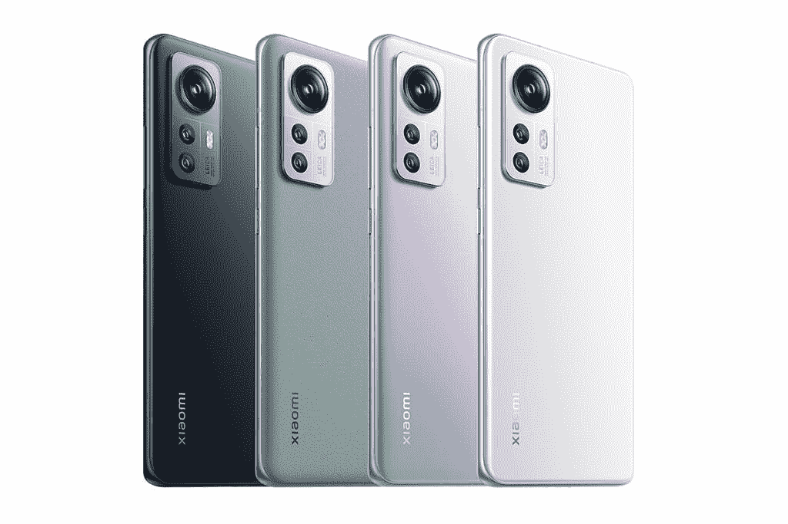
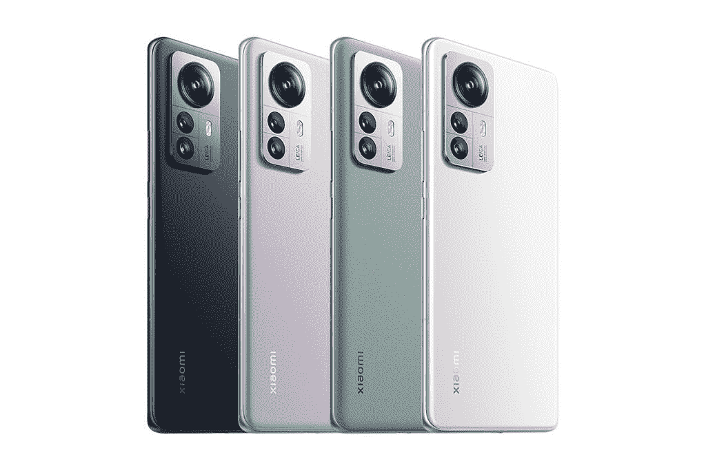

# 小米 12S 和 12S Pro 对小米 12 系列进行了小幅升级

> 原文：<https://www.xda-developers.com/xiaomi-12s-series-launch/>

小米今天发布了三款旗舰设备，作为其新小米 12S 系列的一部分——小米 12S、小米 12S Pro 和[小米 12S Ultra](https://www.xda-developers.com/xiaomi-12s-ultra-launch/) 。在这三款产品中，小米 12S 和小米 12S Pro 是对去年旗舰产品小米 12 和小米 12 Pro 的小幅升级。然而，顶级的小米 12S Ultra 是一款全新的设备，继承了旧的小米 11 Ultra。我们已经在另一篇文章中介绍了小米 12S Ultra 的所有新功能，在这篇文章中，我们将快速了解其他两款机型。

## 小米 12S &小米 12S Pro:规格

| 

规格

 | 

小米 12S

 | 

小米 12S Pro

 |
| --- | --- | --- |
| **建造** | 

*   康宁大猩猩玻璃 Victus

 | 

*   康宁大猩猩玻璃 Victus

 |
| **尺寸&重量** | 

*   玻璃背面:
    *   152.7 x 69.6 x 8.16mm 毫米
    *   182 克
*   皮革背面:
    *   152.7 x 69.6 x 8.66mm 毫米
    *   179 克

 | 

*   玻璃背面:
    *   163.6 x 74.6 x 8.16mm 毫米
    *   204 克
*   皮革背面:
    *   163.6 x 74.6 x 8.66mm 毫米
    *   203 克

 |
| **显示** | 

*   6.28 英寸 FHD+ AMOLED
*   2400 x 1800p 分辨率
*   120 赫兹刷新率
*   高达 240Hz 的触摸采样率
*   1100 尼特峰值亮度
*   100% DCI-P3 覆盖率
*   杜比视觉支持

 | 

*   6.73 英寸 2K AMOLED
*   3200 x 1440p 分辨率
*   120 赫兹刷新率
*   高达 240Hz 的触摸采样率
*   1500 尼特峰值亮度
*   100% DCI-P3 覆盖率
*   杜比视觉支持

 |
| **SoC** | 高通骁龙 8 加第 1 代 | 高通骁龙 8 加第 1 代 |
| **内存&存储** | 

*   8GB LPDDR5 内存+ 128GB UFS 3.1 存储
*   8GB + 256GB
*   12GB + 256GB
*   12GB + 512GB

 | 

*   8GB LPDDR5 内存+ 128GB UFS 3.1 存储
*   8GB + 256GB
*   12GB + 256GB
*   12GB + 512GB

 |
| **电池&充电** | 

*   4500 毫安时
*   67W 有线充电支持
*   50W 无线充电支持
*   10W 反向无线充电支持

 | 

*   4600 毫安时
*   120W 有线充电支持
*   50W 无线充电支持
*   10W 反向无线充电支持

 |
| **安全** | 显示指纹扫描仪 | 显示指纹扫描仪 |
| **后置摄像头** | 

*   主要:50MP IMX707，f/1.79
*   超宽:1300 万像素，f/2.4，123 度视野
*   宏:5MP

 | 

*   主要:50MP IMX707，f/1.9
*   超宽:50MP，f/2.2，115 度 FoV
*   长焦:50MP，f/1.9

 |
| **前置摄像头** | 32MP f/2.4 | 32MP f/2.4 |
| **港口** | USB 类型-C | USB 类型-C |
| **音频** | 不适用的 | 不适用的 |
| **连通性** | 

*   5G
*   4G LTE
*   无线网络 6
*   蓝牙 5.2
*   国家足球联盟

 | 

*   5G
*   4G LTE
*   无线网络 6
*   蓝牙 5.2
*   国家足球联盟

 |
| **软件** | 基于 Android 12 的 MIUI 13 | 基于 Android 12 的 MIUI 13 |
| **其他特征** | 

*   x 轴线性振动电机

 | 

*   x 轴线性振动电机

 |

* * *

从上表可以看出，小米 12S 和小米 12S Pro 与去年的小米 12 系列相比，仅有少量变化。新款机型配备了高通最新的旗舰产品骁龙 8 Plus 第 1 代芯片组，应该可以提供略好的性能和能效。

 <picture></picture> 

Xiaomi 12S

小米还升级了其中一款新机型的摄像头系统。小米 12S 现在配备了 50MP 索尼 IMX707 主传感器，而不是 IMX766，但超宽和微距相机保持不变。然而，小米 12S Pro 配备了与小米 12 相同的相机系统。

 <picture></picture> 

Xioami 12S Pro

这两款手机都采用了与各自前辈相同的显示屏，以及相同的 32MP 自拍相机，内置于一个打孔切口中。电池容量和快速充电能力也保持不变，小米也没有在连接方面做出任何改进。

软件方面，小米 12S 和小米 12S Pro 开箱运行基于 Android 12 的 MIUI 13。目前，小米尚未分享其对该设备的软件更新承诺。

## 定价和可用性

小米 12S 和小米 12S 将提供四种 RAM/存储版本，价格如下:

*   小米 12S:
    *   8GB+128 GB:CNY 3999 英镑(约 597 美元)
    *   8GB+256 GB:CNY 4299 英镑(约合 642 美元)
    *   12GB+256 GB:CNY 4699 英镑(约合 702 美元)
    *   12GB+512 GB:CNY 5199 英镑(约合 777 美元)
*   小米 12S Pro:
    *   8GB+128 GB:CNY 4699 英镑(约合 702 美元)
    *   8GB+256 GB:CNY 4999 英镑(约合 747 美元)
    *   12GB+256 GB:CNY 5399 英镑(约合 807 美元)
    *   12GB+512 GB:CNY 5899 英镑(约合 881 美元)

这些设备将于 7 月 6 日开始在中国销售，今天晚些时候开放预购。小米尚未分享其他地区的定价和可用性细节。我们预计该公司将在未来几周发布相关信息。