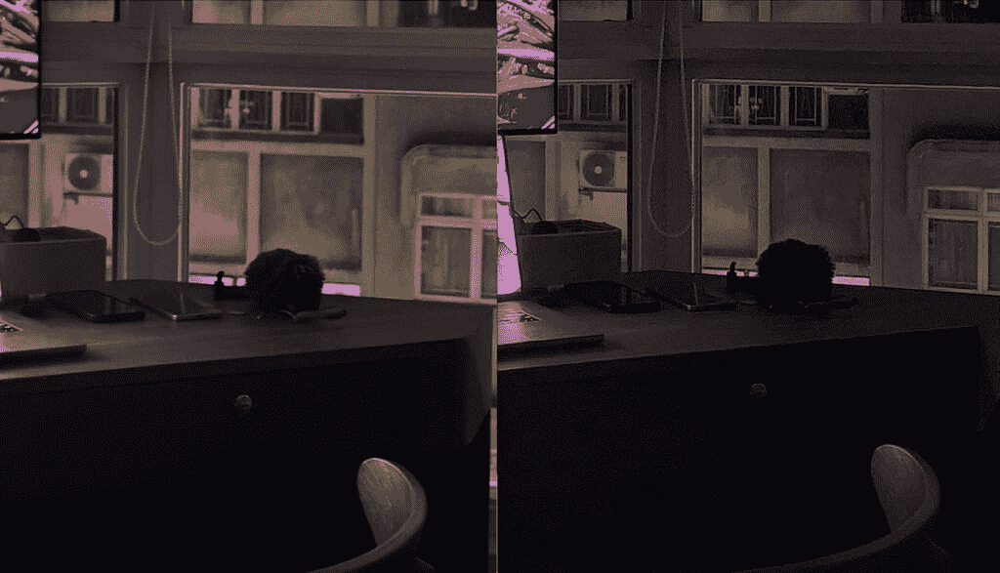
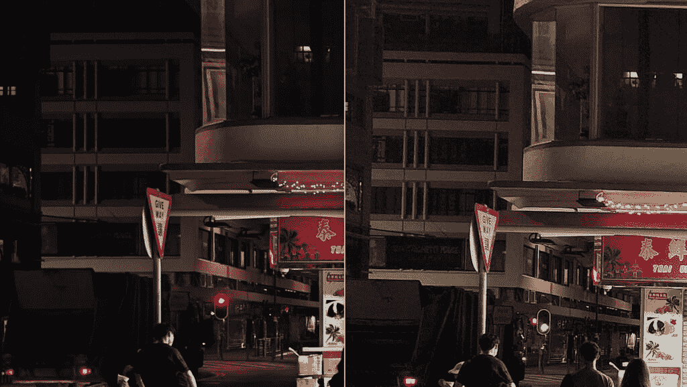

# 小米 12S Ultra vs 三星 Galaxy S22 Ultra:优质手机硬件大战！

> 原文：<https://www.xda-developers.com/xiaomi-12s-ultra-vs-samsung-galaxy-s22-ultra/>

小米可能不会公开承认这一点，但它的 Ultra 系列显然旨在与三星的同名产品竞争，每年都有值得一提的比较。我说这个不是*只是因为*的“超”意符。见鬼，[中兴也有一款 Ultra 手机](https://www.xda-developers.com/zte-axon-40-ultra-review/)，我不认为这款手机是[三星 Galaxy S22 Ultra](https://www.xda-developers.com/samsung-galaxy-s22-ultra-review/) 的真正竞争对手。为了赢得与 Android 老大的比较，新手机必须带来最新的尖端技术，并以完善的软件作为支持，以获得整体高端体验。你必须言行一致才能做到极致，[小米 12S Ultra](https://www.xda-developers.com/xiaomi-12s-ultra-review/) 就是这样做的。

我知道对于大多数读者来说，这种比较不能被视为真正的买家指南，因为小米手机只在中国销售——目前如此。但我感觉 12S Ultra 最终会在全球首次亮相。即使 12S Ultra 没有广泛上市，出于好奇，它仍然值得进行比较，因为就平板手机而言，小米 12S Ultra 和三星 Galaxy S22 Ultra 目前提供了最好和“最多”的硬件。我一直在大量使用这两款手机，我有很多想法，包括一个非常详细的相机部分，有几十个样本。让我们开始吧。

 <picture></picture> 

Samsung Galaxy S22 Ultra

三星 Galaxy S22 Ultra 拥有手机中最好的变焦镜头，其他相机也非常好

 <picture></picture> 

Xiaomi 12S Ultra

##### 小米 12S Ultra

小米的 12S Ultra 拥有一个巨大的 1 英寸传感器，采用徕卡光学技术——它不负众望。

## 三星 Galaxy S22 Ultra vs 小米 12S Ultra:规格

| 

规范

 | 

三星 Galaxy S22 Ultra

 | 

小米 12S Ultra

 |
| --- | --- | --- |
| **打造** | 

*   铝制中框
*   大猩猩玻璃 Victus 回
*   大猩猩玻璃 Victus 正面

 | 

*   铝制中框
*   人造革背面
*   大猩猩玻璃 Victus 正面

 |
| **尺寸&重量** | 

*   163.3 x 77.9 x 8.9mm 毫米
*   229 克

 | 

*   163.17 x 74.92 x 9.06mm 毫米
*   225 克

 |
| **显示** | 

*   6.8 英寸动态 AMOLED 2X 曲面显示屏
*   可变刷新率高达 1Hz 至 120Hz

 | 

*   6.73 英寸三星 E5 AMOLED
*   杜比视觉真彩色显示器
*   3200 x 1440 分辨率，522 像素
*   1-120 赫兹自适应刷新率
*   1500 尼特峰值亮度
*   360 度环境光传感器
*   原生 10 位颜色深度

 |
| **SoC** | 

*   **国际:** Exynos 2200
*   **美国、中国、印度等:**高通骁龙 8 Gen 1

 | 高通骁龙 8 代 1 |
| **风筒&储存** | 

*   8GB/12GB 内存
*   128GB/256GB/512GB/1TB

 |  |
| **电池&充电** | 

*   5000 毫安时
*   45W USB 供电 3.0 快充
*   15W 无线充电
*   4.5 反向无线充电
*   大多数地区包装盒中没有充电器

 | 

*   4860 毫安时
*   67W 有线快速充电支持
*   50W 无线快速充电支持
*   10W 反向无线充电支持
*   小米 Surge P1 充电芯片
*   小米浪涌 G1 电池管理芯片

 |
| **安全** | 超声波显示指纹扫描仪 | 光学显示指纹扫描仪 |
| **后置摄像头** | 

*   **主:** 108MP 宽，f/1.8，1/1.33 寸，OIS，激光自动对焦
*   **次要:** 12MP 超宽，f/2.2
*   **第三:** 10MP 长焦，3 倍光学变焦，f/2.4
*   **四进制:** 10MP，潜望镜，10x 光学变焦，f/4.9

 | 

*   主镜头:5030 万像素 IMX989，f/1.9，8P 非球面镜头，octa-PD 自动对焦
*   超宽:48MP IMX586，f/2.2，徕卡 Summicron 1:1.9-4.1 / 13-120 非球面镜头，双 PD 自动对焦，支持微距模式
*   长焦:48MP IMX586，f/4.1，120 倍潜望镜变焦，远视
*   徕卡真实外观和徕卡活力外观摄影风格

 |
| **前置摄像头** | 40MP | 32MP |
| **端口** | USB-C | USB-C |
| **音频** | 立体声扬声器 | 

*   对称立体声扬声器
*   由哈曼卡顿调音
*   杜比全景声认证

 |
| **连通性** | 

*   5G(毫米波)
*   支持 2x2 MIMO 的 Wi-Fi 6 (802.11ax)
*   蓝牙 5.0
*   国家足球联盟

 | 

*   5G(毫米波)
*   Wi-Fi 6E (802.11ax)
*   蓝牙 5.1
*   国家足球联盟

 |
| **软件** | Android 12 上的 OneUI 4.1 | MIUI 13 超过 Android 12 |
| **其他特征** | 包括双物理模拟人生笔 | 双物理 SIM |

***关于这个对比:*** 这个对比是在分别对一款三星 Galaxy S22 Ultra 和小米 12S Ultra 进行了数月和数周的测试后完成的。每部手机都是该公司出于审查目的提供的，但三星和小米都没有在这篇文章中发表任何意见。

* * *

## 小米 12S Ultra vs 三星 Galaxy S22 Ultra:硬件和设计

两款 Ultra 手机在相机理念和软件功能方面实际上有很多共同点，所以两款设备最大的差异可能实际上在设计上。Galaxy S22 Ultra 是四四方方的，有坚硬的边角和极简的相机系统设计，没有相机岛——镜头就放在手机机身上。与此同时，小米的 12S Ultra 具有圆角和巨大的摄像头模块，引人注目。

显然，背面材料也不同。三星使用了摸起来很冷的磨砂玻璃面板。小米使用人造革表面，摸起来有质感，抓地力和温暖。就我个人而言，我更喜欢 Galaxy S22 Ultra 的方形设计，因为它给了这款设备一种庄严、成熟的整体平板氛围，而不是那种多如牛毛的圆形。但我发现方形设计的*握在手中的感觉*很不舒服，因为边角会抠进我的手掌。然而，使用案例基本上解决了这个问题。

另一个主要的区别因素是:Galaxy S22 Ultra 有一个触控笔，通过设备底部的一个筒仓存储在设备内部。小米的 Ultra 没有这样的产品，所以它自然也失去了所有这些功能。

### 显示

除此之外，这两款手机开始有了很多相似之处。举例来说，这些显示面板尽管形状不同，但在技术上却相对相似。它们都是三星开发的 WQHD+ 120Hz AMOLED，都是绝对华丽的面板。吹毛求疵:Galaxy S22 Ultra 确实亮度稍高一些，但只有在炎热的阳光下，没有任何遮挡物的情况下(比如在海滩上)，才可能看到这种情况。在香港，很多高楼总能为我提供一些荫凉，我几乎从来不需要让任何一个手机显示器发挥最大亮度。

 <picture></picture> 

Xiaomi 12S Ultra (left) and Galaxy S22 Ultra (right).

### 社会学

小米 12S Ultra 基于高通骁龙 8 Plus Gen 1，这是目前 Android 领域最好的处理器。三星的手机比这款手机早了几个月，因此它的运行平台可以是老式的骁龙 8 Gen 1，也可以是三星自己的 Exynos 2200，具体情况要看购买地区而定。我根本没有使用过 Exynos 2200，但根据我的同事亚当康威和其他媒体同行的说法，Exynos 2200 是一个有问题的 SoC，比不上骁龙 8 Gen 1 芯片。因此，如果你所在的地区只能使用 Exynos 2200，小米 12 超和三星 Galaxy S22 超在性能和效率上可能会有很大的差距。

如果你可以使用骁龙版的 Galaxy S22 Ultra，那么这两款手机的性能会更接近。显然，骁龙 8 Plus Gen 1 在 CPU 性能方面带来了一点改进，但您只会在基准测试中注意到这一点。在现实世界中，99%的受访者对比特币的使用过于苛刻。其中骁龙 8 Plus 第 1 代明显优于骁龙 8 Gen 1 是电池效率。我已经使用了骁龙 8 Plus 第 1 代芯片的两部手机，这两款手机都提供了明显优于以前的骁龙 8 第 1 代或骁龙 888 手机的电池寿命。我的使用习惯是一贯的，所有这些手机都是 120 赫兹有机发光二极管屏幕，所以我相信我的结论持有重量。

### 电池、内存、其他硬件位

Galaxy S22 Ultra 拥有比 12S Ultra 的 4，860 mAh 更大的 5000 mAh 电池，但对我来说，小米手机的电池寿命更长，因为骁龙 8 Plus 第 1 代比骁龙 8 Gen 1 更高效。两种手机的 RAM 都一样，都是 8GB 或 12GB 的 RAM，但除了现在的旗舰标准 256GB/512GB 变型之外，三星还提供了高达 1TB 的更高存储选项。小米 12S Ultra 只推出了后两款。

触觉是扬声器，在这两款手机上都很棒。我认为 Galaxy S22 Ultra 的触觉效果稍微好一点(稍微精确一点)，但它的扬声器系统稍微好一点(声音更丰满一点)。

好吧，这部分应该有自己的章节，这是一个很长的一节，因为在我看来，相机系统是这两款手机最大的卖点。

* * *

## 小米 12S Ultra vs 三星 Galaxy S22 Ultra:相机

### 主摄像机

三星的主要射手是一个使用该公司自己的 ISOCELL HM3 传感器的 108MP 相机。它有一个相当大的 1/1.33 英寸的尺寸，再加上诺娜宁滨技术(将九个像素的数据合并为一个 12MP 的图像)，这使得它成为一个非常有能力的拍摄者，在保持对比度的同时捕捉大量的光线。

然而，小米的主摄像头在技术上更令人印象深刻:这是一个 50MP 的 SonyIMX 989 摄像头，配有 1 英寸的图像传感器，比三星的 1/1.33 英寸大 86%。它也使用像素宁滨技术(只有四合一，而三星的九合一)来产生 1250 万像素的照片。该相机还被一个八层镜头所覆盖(至少根据公司营销)，这是徕卡专门为这款相机开发的。

过去两周，我在各种光线条件下并排拍摄了 100 多张照片，我注意到了两个主要传感器之间的两个关键差异。

*   小米更大的传感器产生更窄的焦平面，导致明显更强的焦点衰减，也就是散景效应
*   小米的色彩科学一直保持阴影较暗，这显然是为了实现徕卡的外观。与三星试图将更多光线注入场景的处理相比，这是不和谐的

在数字成像中，传感器尺寸可以说是最重要的硬件因素

我应该向可能不熟悉的读者解释一下更大的图像传感器意味着什么:在数字成像中，传感器尺寸可以说是最重要的硬件因素，比百万像素或光圈更重要。更大的图像传感器可以吸收更多的光线信息，从而拍摄出更多细节和动态范围的照片。更大的传感器通常意味着更强的散景，这在下面的第一组样本中很明显。请注意，小米的镜头不仅展示了相机和后面的植物之间的散景，还展示了相机镜头和相机机身之间的散景。三星的图像只有散景作为背景，相机机身和镜头看起来完全对焦。这两个镜头本身都没有错，但小米的图像感觉更有深度，而三星的图像感觉有点平。

这和下面的场景是一样的，都是在弱光条件下拍摄的。请注意小米照片中微妙的焦点衰减——散景有层次。橙色水瓶后面的塑料搁板有点模糊，然后在房间的更后面显示出更强的散景。三星的聚焦面板要宽得多，也能保持 5 英尺远的事物在焦点上。到目前为止，你可能会注意到三星的图像似乎更亮一些，颜色更流行一些。这是因为 12S Ultra 有两种颜色配置:徕卡正宗或徕卡活力。“真实”让色彩更接近真实生活，但阴影比通常的对比徕卡看起来更深。徕卡活力公司将加强色彩，使场景变得明亮一点，就像三星在每个镜头中做的那样。我大多是用徕卡正品拍的，到目前为止所有小米样品都是徕卡正品。

移动到更一般的主相机样本，我们可以看到不同的颜色科学展示。

但如果我们放大到 100%的像素窥视，你可以看到 Galaxy S22 Ultra 做了很多数字锐化，以至于它看起来不自然。这显然与较小的图像传感器有关，但事实上，1.08 亿像素装入较小的传感器意味着 S22 Ultra 图像中的单个像素比 12S Ultra 的像素质量低。三星利用宁滨理工大学来解决这个问题，但这还不够。如果你看看下面的 100%作物，小米的图像展示了优越的细节。

顺便说一句，我知道许多读者想查看全尺寸样本和像素窥视自己。别担心，我抓住你了。我已经在下面的 Flickr 相册中上传了本文中所有照片的原始全尺寸版本。

到目前为止，大多数样本都是非常容易拍摄的，在充足的光线下面向正确的方向拍摄。让我们试试更有挑战性的镜头。在这里，我特意在非常刺眼的阳光下拍摄

在我看来，三星在这里取得了明显的胜利，因为它的 HDR 至少能够找到烈日的形状，同时保持阴影区域仍然有些可见。小米的图像吹出来的是天空，阴影区域要暗很多。我像素偷窥两个镜头在 100%的大小。细节和锐度是一个虚拟的纽带。

但是移到另一组困难的对比场景，结果就反过来了。这一次，是小米管理了困难的曝光，处理了从窗户进来的光以及从 Nothing Phone 1 和我的屏幕发出的各种光。

如果我们放大到 100%的尺寸，小米的图像明显更清晰，颗粒更少。

转到弱光图像，首先要注意的是小米 12S Ultra 不像三星那样经常使用夜间模式，因为更大的传感器可以自然地吸收更多的光线。比如下面三组弱光样张，只有最后一组小米开启了夜间模式，前两组只是正常抓拍。然而，三星的三张照片都使用了夜间模式。

在这些照片中，夜间模式的好处是显而易见的。在第一个样本中，虽然小米的镜头尽管没有使用夜间模式，但仍然“更亮”，但在我看来，三星的处理产生了更具视觉吸引力的镜头。这个公园的颜色在现实生活中更接近小米的照片，但由于强烈的荧光灯，它有点太黄了。三星的图像处理对镜头进行了冷却，这使得场景看起来更好。池塘里的水实际上看起来像水，而不是小米拍摄的黄色玻璃片。

下面的第二组照片是在一个相对黑暗的小巷中拍摄的，同样，12S Ultra 只是立即拍摄了照片，而 Galaxy S22 Ultra 需要一个半秒的夜间模式。我有像素窥视这一套，老实说，它的质量非常接近。有一些微妙的颜色科学差异(三星再次冷却拍摄)，但这是一个虚拟的平局。然而，请记住，只有在拍摄像墙壁一样的静止物体时，夜间模式才看起来不错，因为它需要超过一秒钟的时间来捕捉镜头。

在最后一组照片中，小米终于需要夜间模式了，这是凌晨 2 点在我的公寓关灯拍摄的。我们可以看到小米的镜头稍微亮了一点。

像素偷窥在黑暗的房间里拍摄的夜间模式图像有点无意义，但如果我们这样做，我们可以看到三星的图像噪声更大，但你可以更好地看到我办公桌上的内容。

 <picture></picture> 

100% crops, 12S Ultra (left), S22 Ultra (right).

最后，我给出最后一个弱光样品。下面，12S Ultra 再次没有使用夜间模式，而 Galaxy S22 Ultra 使用了夜间模式。我们可以看到小米的镜头整体较暗，但准确地暴露了大排档的亮光。

对三星来说更糟糕的是，如果我们进行 pixel peep，三星的图像有噪音和颗粒，而小米的图像更暗，但更干净。

 <picture></picture> 

100% crops, 12S Ultra (left), S22 Ultra (right).

根据这些样本加上我拍摄的十几张照片，我不得不把主要相机类别的胜利交给小米 12S Ultra，因为它始终拍摄出噪音更少、景深更强的图像。与三星经过大量处理的图像相比，这只是一个更有机的镜头。顺便说一下，这并不是说 Galaxy S22 Ultra 相机不好。还是顶级射手。相信我，我也用 iPhone 13 Pro 抓拍了这些相同的照片，它始终以第三名的成绩遥遥领先。但是，除非你的软件处理明显领先，否则很难击败比它大 86%的传感器，而三星的则不然。

* * *

### 超宽照相机

小米 12S Ultra 的超宽相机是一个 48MP 的拍摄者，具有 f/2.2 光圈，而三星 Galaxy S22 Ultra 则包装了一个 12MP 的相机，也具有 f/2.2 光圈。这意味着小米的超宽将使用宁滨理工大学，而三星的超宽将正常拍摄。

首先要检查的是超宽相机是否产生与主相机一致的颜色，在下面的设置中，我们可以看到 Galaxy S22 Ultra 做得更好。在小米的主摄像头和超宽摄像头中，红色和黄色有明显的颜色偏移。

像素偷窥超宽镜头真的没有太多意义，因为拍摄超宽镜头的目的是为了查看一个扫描图像，但只是为了吹毛求疵，我们将做一组。当以 100%观看时，我可以看到小米超宽镜头的中心比三星的中心看起来干净得多，三星再次显示了经过大量处理的数字锐化外观。但是移动到照片的边缘到四个角，S22 Ultra 的超宽丢失的细节比小米少。所有超宽相机的中间都会比角落更清晰，但小米的情况尤其如此。

低光场景是超宽相机通常遭受的地方，因为它们通常没有主相机获得的大传感器支持。从远处看，这些镜头有点均匀。我觉得小米的超宽在大排档第一套更好看，三星的超宽在宝塔型结构的园区更好看。但如果你像素窥视，Galaxy S22 Ultra 的超宽明显噪音更大，细节更柔和。

三星值得道具保持超宽色彩与主摄像头一致，但小米的超宽处理动态范围更好一点

但是，正如我所说的，放大超宽和吹毛求疵真的没有意义，所以这一点基本上是没有意义的。这些镜头中的任何一个都比大多数其他手机的超宽镜头好得多。

三星保持超宽色彩与主摄像头一致值得道具，但小米超宽处理动态范围更好一点。我们可以称之为平局？

* * *

### 变焦摄像机

这是三星应该获胜的地方。Galaxy S22 Ultra 不仅有两个变焦镜头(都是 10MP)，而且它的潜望镜还是一个 10 倍光学变焦镜头，在过去半年的使用中，它一直让我惊讶不已。小米唯一的潜望镜变焦镜头是一个 48MP 的拍摄者，具有 5X 光学变焦范围。

这些样品确实让三星胜出。如果你只是在手机上查看本文中的图像，可能很难看出，但如果你在屏幕上查看全尺寸图像，你可以看到小米 12S Ultra 的 10 倍变焦功能具有数字锐化和更重的处理。同样的优点也适用于弱光环境。此外，三星的软件有一个非常智能的自动主体锁定功能，即使放大 20 倍或更多，取景器也能保持比平时更稳定。

小米 12S Ultra 的潜望镜变焦镜头确实不错，但 Galaxy S22 Ultra 的潜望镜变焦才是商家中最好的。

如前所述，Galaxy S22 Ultra 也有更短的 3 倍长焦变焦镜头，而 12S Ultra 没有。这意味着 Galaxy S22 Ultra 也更加通用。

### 画像

由于小米的 5X 变焦镜头对于人像拍摄来说太长了，这款手机将使用主摄像头拍摄人像，但会进行数字裁剪，以类似于 50 毫米的焦距。与此同时，Galaxy S22 Ultra 可以用 3 倍长焦相机或主相机拍摄人像。

我认为 Galaxy S22 Ultra 的肖像一贯更具美感，边缘检测也稍微更准确。特别是在下面的一组中，我们可以看到小米 12S Ultra 的人工散景真的很不稳定，弄乱了第二个狮子雕像周围的模糊。事实上，第二个狮子雕像不应该如此聚焦，因为它位于第一个狮子的后面。三星的人像拍摄有一个更现实的焦点下降。所以如果你在家里记分:小米 12S Ultra 的自然散景比三星的好，但三星的人工散景比小米的好得多。

* * *

### 录像

两款手机都可以录制高达 8K 分辨率的视频剪辑，但我坚持使用 4K/30，因为这是最好的整体格式。白天，我发现这些镜头几乎不分上下，但在晚上，Galaxy S22 Ultra 的稳定性似乎更容易受到我每走一步的微抖动的影响。然而，Galaxy S22 Ultra 的音频更好，在捕捉我的声音的同时，隔离背景噪音也更好一些。你自己看吧。

* * *

### 自拍相机

啊，我最不喜欢测试的类别，但是，唉，一个必须做的。小米 12S Ultra 的 32MP 摄像头，一言以蔽之，乏善可陈。它总是捕捉高光溢出和随机平滑皮肤的图像，即使我以为我已经关闭了它。三星的 40MP 自拍器也会应用厚重的美颜滤镜(亚洲品牌，请停止这一点)，但至少它一直在那里。我知道我用 Galaxy S22 Ultra 自拍会得到什么。小米 12S Ultra 自拍质量因镜头而异。

当你考虑到 12S Ultra 也不能拍摄 4K 自拍视频，但 Galaxy S22 Ultra 可以，那么这个类别对三星来说是一个明显的胜利。

* * *

### 小米 12S Ultra vs 三星 Galaxy S22 Ultra:哪款相机更好？

根据我的计算，小米赢得了主要的相机大战，而超宽是一个平局。三星在变焦镜头、人像拍摄和自拍方面胜出。视频性能接近，但我认为小米更有优势，因为它有更好、更强的散景。从技术上来说，三星赢得了三个类别，小米赢得了两个类别，但我认为主要类别占据了最大的权重，是最重要的胜利。

这两款相机都非常非常好——在我的[四大智能手机相机中(连同](https://www.xda-developers.com/best-smartphone-cameras/) [Vivo X80 Pro](https://www.xda-developers.com/vivo-x80-pro-review/) 和[谷歌 Pixel 6 Pro](https://www.xda-developers.com/google-pixel-6-pro-review/) )。虽然三星的变焦镜头对我来说非常有用，但我只是被小米 12S Ultra 的 1 英寸传感器迷住了。自然的散景非常好，事实上，我已经用 12S Ultra 代替我通常的相机拍摄了一些产品照片。比如我上周写的这篇[小米 12 Lite 评测](https://www.xda-developers.com/xiaomi-12-lite-review/)，里面的大部分产品镜头都是 12S Ultra 抓拍的。

* * *

## 小米 12S Ultra vs 三星 Galaxy S22 Ultra:软件和性能

这两款手机都运行 Android 12，每个品牌的 Android 皮肤都在上面:三星的 OneUI，小米的 MIUI。这两套软件在美学上并没有太大的区别，五颜六色的图标，不少品牌特有的“膨胀软件”应用程序(例如，三星和小米都希望你使用他们自己的浏览器)，并且一般来说向下滑动会做什么都一样，等等。这两款 Android 皮肤都非常擅长多任务处理，允许应用程序以分屏和浮动窗口模式运行。在很大程度上，MIUI 和 OneUI 都提供了足够多的额外功能和定制选项，而不会妨碍安卓系统。

但如果我吹毛求疵，那么 Galaxy S22 Ultra 的软件比 12S Ultra 更好。其一，小米手机只在中国销售，所以是中国 ROM 版 MIUI，对西方用户优化较少。例如，谷歌应用程序没有开箱即用的 12S Ultra 您必须自己安装它们。虽然这个过程很简单，但你仍然需要 5 到 10 分钟才能拥有除中国之外的世界上大多数人使用的核心谷歌应用程序。

三星的 OneUI 还为 Galaxy S22 Ultra 提供了 Samsung DeX，允许手机将类似 Windows 桌面的 UI 输出到外部显示器，如果你手中有额外的键盘和鼠标/触控板，这将使工作变得更加容易。

当然，还有额外的 S-Pen 触控笔，它只是让 Galaxy S22 Ultra 做更多的事情。您可以使用手写笔进行素描，或将其用作蓝牙遥控器来拍摄免提照片。

就一般性能而言，这两款手机都非常出色——前提是你使用的是骁龙版的 Galaxy S22 Ultra。但正如我所说，小米 12S Ultra 给了我更好的电池寿命。我是一名超级用户，所有功能都设置为最大，我拍摄了很多视频，甚至会当场编辑它们(通过应用程序 Power Director)并分享到 Instagram，我还通过 Slack、微信、WhatsApp 等每天收到和回复大约 50-80 条消息。

如果我吹毛求疵，那么 Galaxy S22 Ultra 的软件比 12S Ultra 更好

对我来说，Galaxy S22 Ultra 一次充电一天只能勉强维持 12 小时。小米 12S Ultra 可以持续再坚持一两个小时。这一点很重要，因为在周六，我往往整天都在外面，大多数配备 120Hz/WQHD+屏幕的骁龙 888 或骁龙 8 第 1 代旗舰产品要么耗尽电量，要么在我一天结束时勉强维持生命。小米 12S Ultra 是唯一一款 120Hz/WQHD+屏幕的 Android 旗舰产品，在我一天的最后一段时间里没有给我带来电池问题。小米 12S Ultra 的充电情况也比三星 Galaxy S22 Ultra 好很多，没有竞争对手。

* * *

## 小米 12S Ultra vs 三星 Galaxy S22 Ultra:哪款手机适合你？

这是一个棘手的问题，因为这些手机中只有一款在世界各地广泛销售。是的，有进口选项，但进口会抬高价格，加上你可能没有保修，小米 12S Ultra 也不能保证在你的运营商上工作。所以对于中国以外的大多数人来说，你应该只买 Galaxy S22 Ultra。

但这篇文章从来就不是典型的买家指南。这篇文章是写给小工具爱好者的，他们关心移动技术及其进步。这个比较是针对手机收藏者和手机书呆子的。这是关于回答“Galaxy S22 Ultra 仍然是智能手机中最棒的硬件吗？”和“1 英寸的传感器重要吗？”

我希望这篇文章有助于解决这些问题。

 <picture></picture> 

Samsung Galaxy S22 Ultra

三星 Galaxy S22 Ultra 拥有手机中最好的变焦镜头，其他相机也非常好

 <picture></picture> 

Xiaomi 12S Ultra

##### 小米 12S Ultra

小米的 12S Ultra 拥有一个巨大的 1 英寸传感器，采用徕卡光学技术——它不负众望。

万一你不能得出你自己的结论，我可以借出我的一些，但是请注意，这些结论被严重压缩，因此失去了我们在上面的文章中描绘的许多细微差别。小米 12S Ultra 的摄像头更好，性能更好，电池和充电情况更好，手感更好。三星凭借更频繁的安全更新和更长的更新承诺，以及像 DeX 和附带的 [S Pen 手写笔及其周围的功能](https://www.xda-developers.com/samsung-galaxy-s22-ultra-s-pen-features/)这样的好东西，在软件方面保持了微弱的优势。对于大多数实际上很重要的标准来说，小米 12S Ultra 是比三星 Galaxy S22 Ultra 更好的智能手机。但我们再次注意到，两者之间的差异仍然非常非常小，两者都仍然是优秀的智能手机。