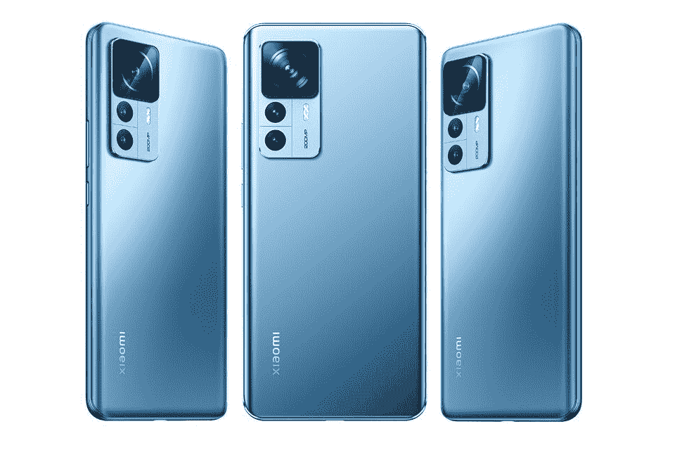

# 小米 12T Pro 评测:年中升级至 200MP

> 原文：<https://www.xda-developers.com/xiaomi-12t-pro-review/>

在 2022 年推出一款不错但并不令人兴奋的旗舰产品——这将是标准的[小米 12 Pro](https://www.xda-developers.com/xiaomi-12-pro-review/)——之后，小米在今年夏天大踏步前进，推出了两款硬件明显超过竞争对手的巨大设备——这两款设备将是带有 1 英寸摄像头传感器的[小米 12S Ultra](https://www.xda-developers.com/xiaomi-12s-ultra-review/) 和具有令人难以置信的薄设计的[小米 Mix Fold 2](https://www.xda-developers.com/xiaomi-mix-fold-2-review/) 。

对大多数读者来说，坏消息是 12S Ultra 和 Mix Fold 2 都只在中国发行。但小米凭借 12T 系列重返国际舞台，Pro 机型配备了引人注目的 200MP 传感器。

过去两周我一直在使用小米 12T Pro，不，它没有达到 12S Ultra 和 Mix Fold 2 设定的高度，但价格从 *€749 起(*在香港和新加坡等亚洲地区略低)，它也没有试图与它们竞争。相反，小米 12T Pro 是一个很好的年中升级，为年中更新带来了比平时更多的“新东西”。

是的，200 兆像素的传感器基本上是合法的。

 <picture></picture> 

Xiaomi 12T Pro

##### 小米 12T Pro

小米 12T Pro 带来了一个 200MP 的主摄像头，可以拍摄 16 合 1 的 binned 图像，或完整的 200MP 分辨率照片。

## 小米 12T Pro:规格

| 

规格

 | 

小米 12T Pro

 |
| --- | --- |
| **打造** | 

*   塑料框架
*   大猩猩玻璃 5 正面

 |
| **尺寸&重量** | 

*   163.1mm x 75.9mm x 8.6mm
*   205g

 |
| **显示** | 

*   6.7 英寸 120 赫兹有机发光二极管
*   20:9，2712 x 1220
*   480Hz 触摸取样鼠

 |
| **SoC** | 高通骁龙 8 加第 1 代 |
| **风筒&储存** | 

*   8GB LPDDR5 内存+ 128GB UFS 3.1 存储
*   12GB + 256GB

 |
| **电池&充电** | 

*   5000 毫安时
*   120W 有线快充支持

 |
| **安全** | 光学显示指纹扫描仪 |
| **后置摄像头** | 

*   主要:200MP ISOCELL HP1，f/1.6，1/1.22 英寸
*   超宽:800 万像素 f/2.4，123 度 FoV
*   2MP 宏

 |
| **前置摄像头** | 2000 万 |
| **端口** | USB 类型-C |
| **音频** | 

*   对称立体声扬声器
*   由哈曼卡顿调音
*   杜比全景声认证

 |
| **连通性** | 

*   双 5G
*   4G LTE
*   无线网络 6
*   蓝牙 5.2
    *   BLE 音频支持
    *   骁龙声音支持
    *   AAC/LDAC/LHDC/aptX 自适应

*   多功能 NFC

 |
| **软件** | 基于 Android 12 的 MIUI Fold 13 |
| **其他特征** |  |

***关于这篇评论:**小米邀请我去慕尼黑参加 12T 系列的发布会，在那里它也给我提供了一台设备进行测试。小米在这篇文章中没有投入。*

* * *

## 小米 12T Pro:硬件和设计

*   骁龙 8 加第 1 代
*   塑料框玻璃背
*   5000 毫安时电池，120 瓦快速充电

小米 12T Pro 明显延续了 12 Pro 的设计语言，但有一个主要偏差:6.7 英寸 120Hz 有机发光二极管显示面板是平的。整体设计看起来不错，但在我看来有点平淡无奇。小米的 12S Ultra 采用皮革背面和巨大的摄像头模块，甚至是竞争对手的手机，如带有溢出摄像头模块的[一加 10T](https://www.xda-developers.com/oneplus-10t-review/) ，都更具个性和特色。它没有帮助，我得到了暗灰色的配色；在我看来，蓝色和银色的单元看起来更醒目。

但这款手机的厚度为 8.6 毫米，重量为 205 克，握起来很舒服，而且结构也符合标准。按钮是点击式的，光学显示指纹扫描仪快速准确。触觉技术并不是小米能够推出的最好的产品——它们仍然很强，但感觉不那么精确——但仍然比任何三星 Galaxy FE 或 A 系列手机的糊状触觉技术好得多。

对于未经训练的人来说，小米 12T Pro 看起来像任何其他现代旗舰产品，但有几个方面的妥协，以满足这一较低的价格标签。没有无线充电或官方 IP 等级，框架是塑料而不是通常的铝。好消息是，框架非常薄，你不会真正感觉到塑料——大多数时间你的手仍然可以感觉到玻璃正面(大猩猩玻璃 5)和背面(只是标准玻璃)。

### 显示

6.7 英寸的有机发光二极管显示屏分辨率为 2712 x 1220，刷新频率高达 120Hz，但它不是 LTPO 2.0 面板。你的选项或刷新率必须是 30Hz/60Hz/90Hz/120Hz，尽管小米的软件可以为你切换。可视角度和色彩还原都非常出色，但屏幕的最大亮度 500 尼特(标准)和 900 尼特(峰值)没有我处理过的其他旗舰高。在强烈的阳光下，屏幕仍然可见，但不如 [iPhone 14 Pro](https://www.xda-developers.com/apple-iphone-14-pro-review/) 或 [Galaxy S22 Ultra](https://www.xda-developers.com/samsung-galaxy-s22-ultra-review/) 那么明显。

### 硅、内存、电池和其他芯片

内部是顶级的:骁龙 8 加第一代，8 或 12GB 的内存和 128 或 256GB 的存储，分别在 LPDDR5 和 UFS 3.1。5，000 mAh 的电池充满内部，使用随附的充电砖可以以 120W 的功率充电。根据我的测试，从没电的电池充满电需要 24 分钟。

你有 Harmon/Karon 微调的立体声扬声器，就像小米的高端手机一样，扬声器格栅是对称的，位于设备的顶部和底部，以获得相等的声音输出。对于电话扬声器来说，音频质量非常好。

* * *

## 小米 12T Pro:相机

*   200MP，f/1.6，1/1.2 英寸 ISOCELL HP1 传感器
*   800 万像素 f/2.2 英寸 1/4 英寸超宽
*   20MP f/2.3 自拍
*   2MP 宏观传感器(ugh)

首先:你在这篇文章中看到的所有图像都是压缩的；我在下面的相册中上传了一些全尺寸的样本到 Flickr。

再来说说那个 200MP 的摄像头。这是去年发布的三星 ISOCELL HP1 传感器，但今年才出现在手机上。小米实际上不是第一个使用它的公司，摩托罗拉的 Edge 30 Ultra 已经推出，尽管这款手机目前似乎只在中国有售。顺便说一下，我还没有机会测试那个设备。

就像摩托罗拉的手机一样，小米的 12T Pro 使用 200MP 摄像头拍摄 16 合 1 像素的装箱图像，分辨率达到 12.5MP。拥有更多百万像素并不总是一件好事，因为图像需要更多的光线来填充像素，但 1/1.22 英寸的大传感器和快速 f/1.6 光圈可以做得很好。在这种正常装箱模式下拍摄的照片具有出色的动态范围，并且由于大传感器，还有很好的自然散景。夜晚的图像几乎没有噪音。

也可以全 200MP 模式甚至 50MP 模式拍摄。在这些拍摄模式下，明显的好处是你可以比平时放大/裁剪更多的图像，并且仍然可以看到精细的细节。我真的没有看到 200MP 和 50MP 拍摄的图像质量有太大差异(除了前者可以裁剪更多)，所以我们不妨只关注 200MP 拍摄。这种模式下的图像非常大——每张图像从 55 到 75MB 不等，而且它们允许你裁剪更多的图像。

然而，如果你期待非常详细和清晰的图像，即使你一直裁剪到实际尺寸，你会失望的。小米这边还是做了很多数字放大，这意味着如果你放大实际尺寸，图像看起来非常数字锐化和人工。但这仍然是一个比普通的 1250 万像素拍摄更大的收获。在下面的例子中，我用 12.5 兆像素和 200 兆像素两种模式抓拍了这个场景，然后将这两张图片裁剪成大致相同的取景。你可以看到，虽然 200MP 的镜头没有那么清晰，但它仍然比“正常”拍摄的相同作物更详细。

这是另一个样本集:

但尽管如此，12.5 百万像素的拍摄模式是默认的，因为这是快门速度最快的时候，由于小米的计算摄影利用了宁滨，图像具有最佳的动态范围。如果我将 12.5 百万像素的图像与 200 百万像素的图像进行比较，前者通常具有更好的动态范围。

小米 12T Pro 上的 200 万像素摄像头拍摄的照片确实可以让你放大很多

但是 12T Pro 的主摄像头和 iPhone 14 Pro 比起来怎么样呢？这是样品。一般来说，iPhone 图像更亮，因为 14 Pro 会非常自由地打开夜间模式，而 12T Pro 不会真正使用夜间模式，除非是在接近漆黑的情况下。

我还用 14 Pro 拍摄了完整的 4800 万像素图像，看看它在细节方面与小米的 200 万像素相比如何。

我们可以看到，与 12T Pro 的 200MP 图像相比，iPhone 14 Pro 的 48MP 模式看起来更好，因为小米的图像有很多数字处理。

### 其他相机，拍摄模式

小米 12T Pro 没有物理变焦镜头，但 200MP 传感器可以进行传感器内裁剪，以产生近乎无损的 2 倍变焦，就像 iPhone 14 Pro 手机一样。800 万像素的超宽相机在夜晚显得有些乏味，细节明显柔和。

不过白天超宽还是能抓拍到一些好看的图像。

### 自拍和肖像

12T Pro 有一个非常好的人像模式，在主传感器中使用数字裁剪来获得更近的焦距，但仍然会有一些自然散景，然后通过人工散景来增强。我也是“电影肖像”滤镜的粉丝，它让肖像看起来像是由老式相机拍摄的。

自拍镜头还好——它往往会软化皮肤，细节丢失，自拍人像效果看起来不自然。

### 显像记录

如果你一直拍摄到 4k 分辨率，主摄像头的视频录制非常棒。你可以用 8k 射击，但是稳定性会受到影响。

小米很好玩的拍摄模式都还在，包括我的最爱之一——克隆视频。

通过 12T Pro，小米显然将大部分注意力放在了主摄像头上，而不是其他镜头上。这基本上没问题，因为主摄像头兼作人像和 2 倍变焦镜头，静态照片和视频看起来很棒。超宽和自拍可以更好，但在这个 750 美元左右的价格，这个主摄像头可以与任何人面对面。

* * *

## 小米 12T Pro:软件和一般性能

*   MIUI 13 超过 Android 12
*   仍然有点热-无法在 3D Mark 中完成 20 分钟的“极限压力测试”
*   出色的电池寿命

小米 12T Pro 搭载安卓 12，上面是小米的 MIUI 13。软件体验很好，类似于以前的小米旗舰产品，这意味着动画流畅，UI 快速，大多数事情都像它们应该的那样工作。我对 MIUI 的常见抱怨在这里，比如一个复杂的设置面板，有三个部分专门用于显示；或者你仍然不能双击屏幕来唤醒它。

但我喜欢小米软件的其他方面，如异想天开的动画，以及让我在浮动窗口中打开应用程序的出色的多任务系统，都在这里。

性能对于那些不怎么推手机的人来说很棒。对于社交媒体使用、媒体消费和拍照，这款手机表现良好。但令人失望的是，12T Pro 遇到了与 12 Pro 最初相同的散热问题，即手机无法完成 app 3D Mark 的 20 分钟“极限压力测试”。公平地说，这项测试被命名为“极限压力”是有原因的，因为它确实在 20 分钟内尽可能多地推动智能手机。这位 12T 的职业选手在 12 分钟后退出了比赛。作为参考，小米 12S Ultra 可以完成测试，一加 10 Pro 等其他设备也可以，当然还有 iPhone 14 Pro。

### 电池寿命

使用 5000 毫安时电池和骁龙 8 Plus Gen 1，电池续航时间非常长。一次充电可以让我一天工作 14 个小时，还有大约 15%的电池剩余。在这段时间里，屏幕显示时间通常在 6 到 7 个小时左右。充电速度很快，如前所述，使用随附的充电砖:从 0 到 100 只需 24 分钟。

* * *

## 该不该买小米 12T Pro？

**你应该买小米 12T Pro 如果:**

*   你想要一个高性能的主摄像头和最好的安卓芯片，而不需要支付超过 800 美元
*   你喜欢小米的 UI 和生态系统，想要它的最新旗舰

**你不应该买小米 12T Pro 如果:**

*   你想要一个更全面的，多功能的相机系统，一个好的超宽和变焦镜头
*   你已经拥有了小米 12 Pro 或者米 11 Ultra
*   你对 Pixel 7 系列感兴趣

小米 12T Pro 处于真空状态，这是小米的另一款精心制作的手机，相对于同行而言，价格并不太高。750 美元(换算后)，比最接近的三星旗舰机(999 美元的 Galaxy S22)更划算。但 12T Pro 与刚刚推出的[谷歌 Pixel 7 系列](https://www.xda-developers.com/google-pixel-7-pro/)存在激烈竞争。

小米 12T Pro 是小米的另一款精心制作的手机，相对于同行来说价格并不太高

Pixel 7 Pro 贵 150 美元，但大多数西方消费者更喜欢它的用户界面，而不是小米的，Pixel 7 Pro 有更好的变焦和超宽镜头。虽然我不会过早地假设 Pixel 7 Pro 的主摄像头更好，但我认为 Pixel 7 Pro 的主摄像头应该至少和 12T Pro 的主摄像头一样好，而且很有可能更好。与此同时，Pixel 7 售价 599 美元，它保留了 Pixel 7 的许多诱人之处。

然而，这种比较并不完全对小米不利。12T Pro 的包装盒中包括充电器、保护壳和屏幕保护器，而这些都是为 Pixel 单独购买的。与 Pixel 7 的三年前的相机传感器相比，配备更大传感器的 200MP 相机的硬件上限更高。

最终，对我来说，问题是小米的前两次发布 12S Ultra 和 Mix Fold 2——将标准定得太高了。即使这两款手机只在中国销售，小米也让西方媒体接触到了这些设备，所以大多数智能手机粉丝都知道它们的存在。当你将 12T Pro 与这两个庞然大物进行比较时，它不禁看起来令人印象深刻。这两款手机没有广泛销售也没关系。它们是存在的，这给小米的其他顶级产品蒙上了阴影。想象一下，如果三星只在韩国发布了 Galaxy S22 Ultra，那么一个月后在美国和欧洲推出了 Galaxy S22 和 S22 Plus。那里的手机发烧友也很难兴奋起来。

 <picture></picture> 

Xiaomi 12T Pro

##### 小米 12T Pro

小米 12T Pro 带来了一个 200MP 的主摄像头，可以拍摄 16 合 1 的 binned 图像，或完整的 200MP 分辨率照片。