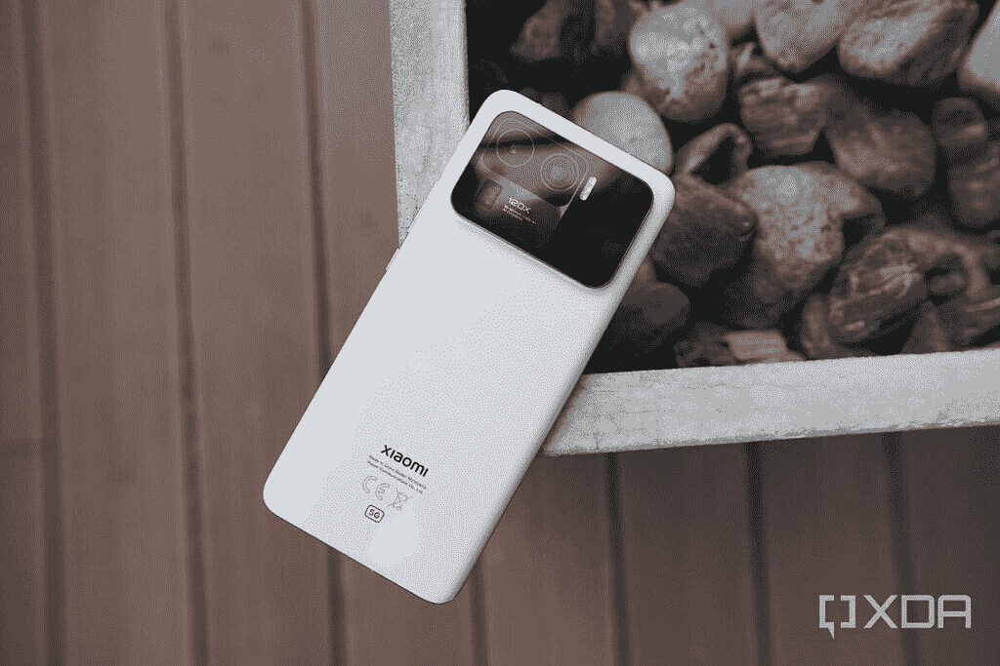

# 小米确认与徕卡合作，首款手机将于 7 月上市

> 原文：<https://www.xda-developers.com/xiaomi-confirms-leica-partnership/>

小米今天正式证实了传言已久的消息:这家总部位于北京的科技巨头将与德国相机制造商徕卡开始“长期战略合作”，首款徕卡品牌的小米智能手机将于今年 7 月发布。

这一消息是周一上午在亚洲通过新闻稿宣布的，此前有传言称徕卡和华为的合作关系在一年前结束，XDA 高级成员 [kacskrz](https://forum.xda-developers.com/m/kacskrz.8240900/about) 在 3 月下旬发现了[合作的具体证据。徕卡是一家以相机和镜头闻名的百年老店，过去五年一直是华为的合作伙伴。去年夏天，徕卡还与日本品牌夏普合作，推出了一款专属于日本市场的徕卡品牌手机。](https://www.xda-developers.com/xiaomi-leica-branded-cameras-leak/)

 <picture></picture> 

A promotional image released as part of the press release.

声明中没有透露太多信息:它没有说明这种合作关系是否是排他性的(这意味着其他智能手机在不久的将来不会使用徕卡品牌)，小米代表拒绝就此发表评论。发布会确实引用了小米首席执行官雷军的话，他说两个品牌的合作带来了“光学设计、审美取向、图像偏好和创新技术方面前所未有的深度碰撞和融合。”

当然，这主要是营销上的说法——每一个与传统相机/镜头制造商合作的手机品牌在发布会上都说过类似的话；小米与徕卡的合作是否会给小米已经相当不错的旗舰相机系统带来有意义的改进，还有待观察。

 <picture></picture> 

The Xiaomi 11 Ultra

虽然新闻稿也没有提到 7 月份发布的智能手机，但几乎可以肯定的是小米 12 Ultra，它几乎可以肯定将运行在[骁龙 8 Plus 第 1 代](https://www.xda-developers.com/smartphone-with-snapdragon-8-plus-gen-1-7-gen-1-processors/)上。

中国智能手机制造商与传统欧洲光学品牌合作并不新鲜:华为在 2016 年与徕卡的合作伙伴关系(很可能已经结束)开创了这一趋势，OPPO/一加与哈苏合作，Vivo 与蔡司合作。这些合作伙伴关系到底有多少是真正的合作努力，或者纯粹是一个标志性的品牌出于营销目的授权其名称，这不得而知。但尽管如此，小米 12 Ultra 至少有几个功能将它与迄今为止 2022 年发布的智能手机区别开来。