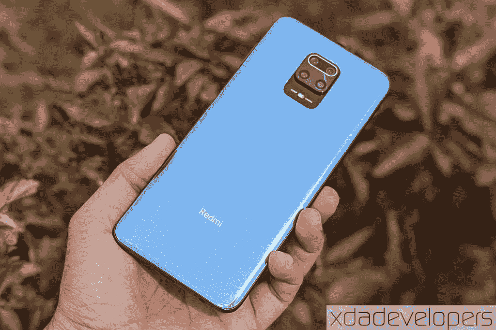
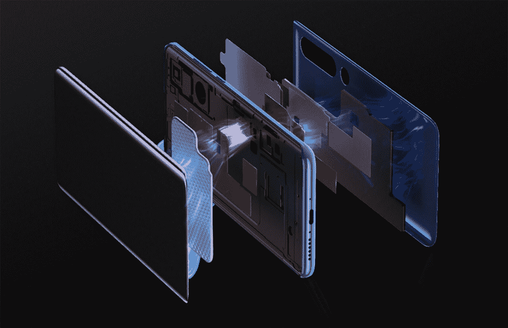

# 小米 mi 10 回顾-将 Mi 重新定义为高端智能手机品牌

> 原文：<https://www.xda-developers.com/xiaomi-mi-10-review/>

描述小米产品最常用的词是“实惠”。在每个类别中，小米的产品通常都比竞争对手的价格低。因此，寻求与三星、华为或苹果旗舰产品竞争的优质小米智能手机对那些将小米视为终极性价比“价值”品牌的用户来说似乎很奇怪。小米试图通过在欧洲等市场推出 Mi MIX 系列或 [Mi 品牌旗舰手机等高端智能手机来推翻这一预期，它们在改变观念方面取得了一些进展。不过，在印度等对价格高度敏感的市场，在早期旗舰产品发布失败后，小米已经慢慢改变了策略。它在印度推出的最后一款真正的旗舰产品是 2017 年推出的 Mi MIX 2，其继任者 Mi MIX 3 甚至没有在该地区发布，因为小米被认为是“平价智能手机品牌”。相反，小米专注于次高端智能手机领域，如](https://www.xda-developers.com/redmi-k20-launches-internationally-as-xiaomi-mi-9t/) [POCO F1](https://www.xda-developers.com/xiaomi-poco-f1-design-display-gaming-performance-review/) 及其精神继承者 [Redmi K20 Pro](https://www.xda-developers.com/redmi-k20-pro-xiaomi-mi-9t-pro-review-flagship/) 。但摆在小米面前的既有将其形象从廉价品牌转变为高端品牌的挑战，也有进入投资回报率更高的细分市场的机遇。这就是小米最新旗舰小米 Mi 10 的用武之地。小米 10 和小米 10 Pro 是小米迄今为止最贵的小米设备，随着这款产品的推出，小米正在接近真正的高端智能手机市场。

[**小米米 10 论坛**](https://forum.xda-developers.com/xiaomi-mi-10)**| |[小米米 10 Pro 论坛](https://forum.xda-developers.com/xiaomi-mi-10-pro)**

小米 10 有一个非常漂亮和优质的外观设计，将吸引你的眼睛。内部硬件包括最新和最强大的高通移动平台，骁龙 865。骁龙 X55 调制解调器也支持 Mi 10 上的 5G 支持，但由于缺乏适当的 5G 连接，这在印度没有任何影响。米 10 系列还具有 30W 快速无线充电和 108MP 摄像头。

小米过去的发布已经证明[他们可以擅长制造高端智能手机](https://www.xda-developers.com/xiaomi-mi-mix-3-review-proof-that-xiaomi-can-do-premium-too/)，那么是什么让小米 10 与众不同呢？小米预计小米 10 将被纳入三星 Galaxy S20、苹果 iPhone 11 或一加 8 的行列。但尽管小米 10 提供了所有这些，但小米品牌的扭曲观点让小米粉丝“感觉”小米 10 定价过高。米 10 的 108MP 摄像头、曲面 Super AMOLED 显示屏和骁龙 865 是否证明了小米选择以远高于去年米 9 的价格推出旗舰机的合理性？

小米借给我们一台小米 Mi 10 的印度单元，8GB 的 RAM 和 128GB 的内部存储配置，以供审查。我从 5 月 19 日开始使用这个设备。在我们开始之前，这里有一个小米米 10 规格的纲要:

* * *

## 小米 Mi 10 5G 规格

### 小米 Mi 10 5G 规格

| 

规格

 | 

小米 Mi 10 5G

 |
| **尺寸&重量** |  |
| **显示** |  |
| **安全** |  |
| **片上系统** | [高通骁龙 865](https://www.xda-developers.com/qualcomm-snapdragon-865-processor-specifications-features/) :

*   1 个 Kryo 585(基于 ARM Cortex-A77)Prime core @ 2.84 GHz
*   3 个 Kryo 585(基于 ARM Cortex-A77)性能内核@ 2.4GHz
*   4 个 Kryo 385(基于 ARM Cortex A55)高效内核@ 1.8GHz

肾上腺素 650 |
| **闸板** | 8GB LPDDR5 |
| **存储** |  |
| **电池&充电** |  |
| **后置摄像头** |  |
| **前置摄像头** | 2000 万 |
| **软件版本** | 基于 Android 10 的 MIUI 11 |
| **连通性** |  |
| **音频** | 立体声扬声器，高分辨率音频认证 |
| **颜色** | 珊瑚绿，黄昏灰 |

* * *

## 设计:引人注目

小米 Mi 10 因其纤薄的外观而名不虚传。这款手机采用玻璃夹层设计，正面和背面都有曲面玻璃，使其看起来超级光滑。正面和背面的玻璃表面受到 Gorilla Glass 5 层的保护，虽然这确保了很好的防刮擦保护，但您必须依靠外壳来防止由于跌落造成的任何划伤或损坏。

桥接两个玻璃窗格的是一个金属框架，它沿着手机的角落逐渐变细，因为在前玻璃和后玻璃部分的弯曲边缘之间有一条细缝。框架具有镜面光洁度，圆形边缘与手机的曲线设计相一致。沿着整个框架的外围共有 7 个网络带，除此之外，打破光滑表面连续性的元素包括双 SIM 卡托盘、主麦克风、USB Type-C 端口和手机底部的两个立体声扬声器之一。音量摇杆和电源按钮位于右侧，而辅助麦克风、第二个立体声扬声器和红外增强器位于小米 10 的顶部。

小米米 10 的背板几乎像镜子一样反光。小米 10 的背板有两种颜色可供选择——“珊瑚绿”或“暮光灰”——我正在审查后一种选择。后面板由具有不同反射率的多层组成，这些层共同产生了一种深度错觉。除此之外，来自任何弦光源的光都会沿着灯罩的弯曲边缘弯曲，并分散到振动中，根据光源的色温，振动可能可见，也可能不可见。这些小的添加为小米 Mi 10 已经精致的设计增添了个性。小米在让这款手机看起来尽可能有吸引力和溢价方面做得很好。虽然磨砂玻璃背面的选择会很好，但我们不能忽视设计中的华丽。

> Mi 10 的设计让它像任何手机一样诱人！

虽然我会对小米 Mi 10 的美学评分为 10/10，但这些因素削弱了它的可用性。虽然小米 10 较长边缘的曲率使这款手机看起来很薄，但它的中心明显很厚，不包括厚的摄像头凸起，约为 9 毫米。从侧面看，摄像头的碰撞不容忽视，因为摄像头的不对称放置会导致手机在放在桌子等平坦表面上使用时晃动。一个保护性的后盖或外壳，如包装盒内的那个(不是 TPU 材料，而是一种柔性塑料材料)，可以在一定程度上纠正摆动，尽管这取决于材料和外壳的厚度。

设计并没有坚持我们在[红米 Note 9 Pro/9S](https://www.xda-developers.com/xiaomi-redmi-note-9-pro-review-snapdragon-720g-48mp/) 上看到的小米最新的“光环平衡设计”的设计理念。这一理念意味着该设计是沿着穿过电话中心的假想垂直线对称的，从而产生一种中心加重的外观。

 <picture></picture> 

Redmi Note 9 Pro with a center-weighted design

在结构上，小米 Mi 10 和 Mi 10 Pro 没有太大的区别，除了 Pro 的相机阵列上增加了激光自动对焦模块。尽管小米推出了不同颜色和表面的 Mi 10 智能手机，以便更容易区分它们，但大多数用户不会注意到这些细微差别。

小米 10 的外部采用了丰富的玻璃设计，内部采用了高端规格和大电池，它肯定会很重——的确如此！这款手机的重量远远超过 200 克(准确地说是 208 克)。举起它可能是一项艰巨的任务，尤其是如果你打算在智能手机上玩游戏。这一点，再加上背板对追踪指纹和污迹的亲和力，是这个设计唯一让我恼火的地方。

另一方面，展示给我带来的兴奋感和设计的其他部分一样。将 Mi 10 翻转到前面，映入眼帘的是一个巨大的 AMOLED 显示屏，具有弯曲的侧边和一个微小的打孔切口。小米对显示器质量有很高的要求，我们将在下一节中讨论这些细节。自[小米 Note 2](https://www.xda-developers.com/xiaomi-mi-note-2-review-solid-first-step/) 以来，小米还没有推出过两面都是曲面的玻璃夹层设计手机，因此通过这一设计决定，该公司转向高端市场的愿望变得更加明显。然而，弯曲的显示屏意味着你必须使用保险杠或外壳，或者不断冒着打破屏幕的风险，以防手机掉落在坚硬的表面上。

* * *

## 展示:华丽

小米 Mi 10 智能手机正面采用 6.67 英寸 AMOLED 显示屏。该显示器经过 HDR 10+内容认证，对比度为 5，000，000:1。此外，小米声称显示屏覆盖了 100%的 sRGB、NTSC 和 DCI-P3 色域，这表明色彩准确度高，接近人眼所见。虽然小米没有透露这种显示器的制造商，但对于面板的亮度有不同的说法。小米网站在不同地区声称的峰值亮度存在悬殊，数值从 800 尼特到 1200 尼特不等。然而，小米在中国发布会上声称的数值是，米 10 为 1120 尼特，米 10 Pro 为 1200 尼特。这种差异很可能是因为包含了高亮度模式，以提高阳光下显示器的亮度。

在实际使用中，小米 10 的 AMOLED 显示屏与三星智能手机上的超级 AMOLED 面板一样亮，包括[一加 7T](https://www.xda-developers.com/oneplus-7t-review-premium-practical-smartphone/) 和[三星 Galaxy S10 Lite](https://www.xda-developers.com/samsung-galaxy-s10-lite-review/) 。即使在强光或日光下，显示屏也足够明亮，具有可读性。此外，小米 MIUI 中的高亮度模式提高了对比度，并淡化了黑暗的背景，以提高户外强光下的可读性。显示屏非常反光，但这通常不会妨碍它的可读性。

> 这是一款全高清+显示器，在色彩和清晰度方面质量一流。

事实上，在我的大部分使用中，我发现色彩饱和度比我预期的要好。MIUI 还提供了许多选项，通过设置色温来根据您的喜好调整颜色配置文件。您还可以获得一个高级菜单来更改参数，如显示器的对比度和 gamma 值，或者调整色调和饱和度设置。

显示器的色彩还原、亮度和对比度在这个价格范围内是最好的。当你不正面看的时候，当你从侧面看的时候会有轻微的颜色变化。然而，颜色的变化在可接受的范围内，不会影响我的体验。

除了在极端视角下的颜色偏移之外，在显示器弯曲部分的亮度和颜色饱和度方面也有明显的差异。当你从侧面看显示器时，颜色和亮度差异变得更加明显，甚至当你从显示器的弯曲边缘看得更远时，你可能会受到这种差异的困扰。虽然使用曲面显示器而不是平面显示器增加了它因撞击而破裂的风险，但它增强了使用导航手势的体验，特别是背面的滑动手势。

*弯曲部分的亮度差异在弱光下更加明显*

该显示器的另一个关键亮点是其 90Hz 的刷新率，与 60Hz 的显示器相比，可以提供更流畅的滚动体验。这仅仅意味着显示器每秒刷新 90 次(或每 11 毫秒一次)，比标准的 60Hz 显示器快 1.5 倍。虽然这也意味着 CPU 和 GPU 的负载增加，以更快地加载屏幕上的内容，但这对小米 10 的硬件来说应该不是问题。我们已经看到相当多的智能手机支持 90Hz，120Hz，甚至 144Hz 的刷新率，这种趋势将会持续下去。小米 10 和小米 10 Pro 是小米第一款采用 90Hz AMOLED 显示屏的智能手机，尽管该公司此前推出了采用更平滑的 120Hz 液晶显示屏的 Redmi K30 系列。

90Hz 的刷新率也改善了一些游戏的体验，因为运动将感觉更加完美和流畅。我在小米 Mi 10 上试过的一些游戏包括 [*Lara Croft GO*](https://play.google.com/store/apps/details?id=com.squareenixmontreal.lcgo) 、 [*奥拓的奥德赛*](https://play.google.com/store/apps/details?id=com.noodlecake.altosodyssey) 、 [*Game For Peace*](https://www.tap.io/app/70056) (中国版的 *PUBG Mobile* )和 *[Vainglory](https://play.google.com/store/apps/details?id=com.superevilmegacorp.game) 、*设备在高帧率下持续运行这些游戏完全没有问题。此外，显示面板的 180Hz 触摸响应速度意味着高强度射击者对游戏的反应非常灵敏。

除了游戏，更高的刷新率允许网页或 Snapchat 或 Instagram 等社交媒体应用程序更流畅地滚动。请注意，更平滑并不等同于更快的滚动，因为后者也依赖于应用程序，就像它依赖于硬件一样。

最后，该显示器还内置了一个显示下指纹扫描仪，它非常准确，反应灵敏。唯一的警告是，手机可能不会解锁，直到解锁动画运行，所以我的建议是选择持续时间最短的动画。不用说，手机有各种各样的永远显示选项，但使用它们可能会增加电池电量。这款手机还支持边缘照明选项，以弥补通知 LED 的缺失。

总体而言，尽管对其亮度有各种说法，但小米 10 的显示屏在观看内容方面令人难以置信地满意。显示器的弯曲部分非常容易融合，不会像拇指一样突出，并且不会阻碍使用或打字，尤其是沿着边缘。考虑到对 HDR10+标准的支持，全高清+分辨率不仅足以完成日常任务，也足以满足媒体消费。

* * *

## 性能:糟糕透顶

对于这个价格来说，选择最好的内部硬件是显而易见的，因此小米选择了高通骁龙 865 移动平台来支持 Mi 10 和 Mi 10 Pro。骁龙 865 移动平台采用 TSMC 的 7 纳米 N7P 代工工艺制造，这比之前用于制造骁龙 855 和 855+移动平台的 7 纳米 DUV 工艺有了进一步的改进。这些优化使性能提高了 7%,尽管功耗相同，从而提高了最新芯片组的效率。

 <picture></picture> 

Mi 10's multi-layered vapor cooling system

对于其 CPU，骁龙 865 使用八核配置，其 CPU 核心以 1+3+4 集群布局排列。其中包括一个最大频率为 2.84GHz 的 Kryo 585“Prime”内核(基于 ARM Cortex-A77 微架构)，三个时钟频率为 2.4GHz 的 Kryo 585 性能内核，以及四个时钟速度为 1.8GHz 的 Kryo 385 效率内核(基于 ARM Cortex-A55)。

对于其 GPU，SoC 使用 Adreno 650，支持 Vulkan 1.1 图形 API。Adreno 650 是高通第一款支持可升级图形驱动程序的 GPU，可以通过谷歌 Play 商店等应用商店直接更新。在中国，小米 Mi 10、Mi 10 Pro 和 Redmi K30 Pro 已经可以使用“ [GPU 驱动程序更新程序](https://www.xda-developers.com/xiaomi-adreno-gpu-driver-update-snapdragon-865/)”工具。

在去年 12 月的骁龙 865 发布会上，高通表示，与骁龙 855+相比，新芯片组的 CPU 和 GPU 性能分别快 25%和 20%，后者本身就是骁龙 855 的超频版本。从我们的[基准测试比较](https://www.xda-developers.com/qualcomm-snapdragon-865-benchmarks-cpu-gpu-performance-vs-kirin-990-snapdragon-855-snapdragon-845/)中可以看出，性能提升非常明显。

虽然骁龙 855+的性能提升很明显，但我们在小米 10 上运行了一些综合基准，以量化与我们在 XDA 评估的骁龙 865 的其他设备相比，这一点在该设备上的应用情况。为了这个对比，我们有[一加 8](https://www.xda-developers.com/oneplus-8-xda-review/) 、[一加 8 Pro](https://www.xda-developers.com/oneplus-8-pro-review-never-settle-on-hardware/) 、[三星 Galaxy S20+ (Exynos 990)](https://www.xda-developers.com/samsung-galaxy-s20-plus-review/) 、 [Galaxy S20 Ultra(骁龙 865)](https://www.xda-developers.com/samsung-galaxy-s20-ultra-review/) 、 [LG V60 ThinQ](https://www.xda-developers.com/lg-v60-thinq-dual-screen-review/) ，以及 [iQOO 3](https://www.xda-developers.com/iqoo-3-5g-review-one-of-the-fastest-but-not-smoothest-smartphones/) 。在某些测试中，我们还将包括一加 7T，以比较性能的改善。

### 极客工作台 5

从跨平台 CPU 基准测试 Geekbench 开始，我们看到了由骁龙 865 移动平台支持的所有设备之间的并行性。在这些产品中，小米 10 的单核分数最低，尽管它仅以微小的差距落后于其他产品，多核测试的分数也中等。基于单个基准很难将这种差异归因于任何特定的属性，因此我们将在比较所有基准的结果后尝试描绘一幅更好的画面。

### PCMark Work 2.0

PCMark 的 Work 2.0 基准测试测试了手机完成日常现实任务的能力，这些任务可能要求不是很高。这些任务包括网页浏览、笔记、照片或视频编辑，以及在电子表格上显示数据并在移动设备上编辑它们。在我们的对比中，小米 10 在 Work 2.0 测试中的得分异常低，在我们的测试组中整体得分最低——甚至低于一加 7T。

考虑到其他几款具有相同硬件分数的手机比小米 Mi 10 好得多，我们怀疑这种差异可能是由于小米定制的 Android 皮肤 MIUI 的一些效率低下。

### 3DMark 吊索镜头极限

接下来，我们考虑 3DMark Sling Shot Extreme 来比较小米 Mi 10 与我们测试组中其他设备的图形性能。基准测试使用 Vulkan 和 OpenGL ES 3.1 APIs 渲染图形密集型场景，以测试设备的图形性能。小米 Mi 10 在 Sling Shot Extreme 方面的表现优于采用 Exynos 990 的三星 Galaxy S20+,但落后于 Galaxy 20 Ultra 和 LG V60 ThinQ，这两款产品与小米 10 共用相同的 CPU 和 GPU。

正如我之前提到的，小米 Mi 10 和 Mi 10 Pro 是最早获得可升级 GPU 驱动程序的手机之一，所以当更多的驱动程序更新在全球推出时，我们可能会看到图形性能的一些改善。

### GFXBench

为了量化 Adreno 650 GPU 相对于骁龙 855+移动平台上的老一代 adre no 640 的图形性能提升，我们使用了 GFXBench 基准测试。在 GFXBench 的高强度测试中，9 次测试中有 8 次测试的帧率较高，这非常明显地显示了小米 10 相对于一加 7T 的 GPU 性能提升。

### 热量和 CPU 节流

骁龙 865 是一个糟糕的表现者，这意味着一旦内核频率上升，CPU 就会开始产生大量热量。为了防止过热损坏硬件，节流算法会限制性能，从而限制设备产生的热量。虽然小米 Mi 10 配备了一个 3D 蒸汽室来消散 CPU 的热量，但我们仍然见证了 Mi 10 上的一些节流。为了测试 CPU 节流对热量上升的响应程度，我们使用了一个名为 CPU 节流测试的应用程序，该应用程序运行一个用 C 编译的迭代代码来测试 CPU 在不同时间内接受一项挑战性任务时的响应情况。

在我们的测试中，我们在三种不同的场景下运行测试:第一种是测试时间设置为 15 分钟，第二种是测试时间设置为 30 分钟，第三种是手机充电时运行 15 分钟。考虑第三种情况来测试由于 CPU 使用和充电而产生的发热的综合影响。我们发现，当测试运行 15 分钟时，Mi 10 在测试中的性能降低到峰值分数的 92%左右。当测试运行 30 分钟时，性能被限制在其峰值的 93%,但同时峰值性能也有所下降，限制后性能下降了近 88%。

最后，对于 Mi 10 正在充电的情况，输出有很大的下降。虽然性能下降到特定测试运行的大约 84%,但是峰值性能下降到第一次测试的大约 87%。这意味着整体性能下降到我们在第一次测试中看到的大约 73%。

在 GFXBench 中运行电池测试超过 30 次迭代时，我们还通过考虑 GPU 的发热和性能下降来检查图形性能的调节。测试开始时，CPU 温度约为 33°C，每次迭代渲染约 4600 帧。在第五次迭代之后，性能很快停止，在第七次运行期间下降到大约 3，700 帧。同时，电池温度快速上升，在大约 13 分钟内超过 45 ℃,而渲染的帧数下降到大约 3，500，并保持不变，直到测试结束。这意味着 CPU-GPU 的总性能降低了约 76%。

相比之下，我们在评测内置骁龙 855+芯片组的 Realme X2 Pro 时进行了同样的测试，发现其峰值性能出人意料地接近骁龙 865 结果的末尾，考虑到这两个移动平台仅相隔六个月推出，这令人惊讶。

> 尽管节流，小米 Mi 10 5G 上的骁龙 865 还是碾压了去年旗舰上的骁龙 855+。

尽管这些 CPU 节流测试的结果看起来令人沮丧，但骁龙 865 和 Adreno 650 已被证明优于去年的前辈。而且小米米 10 四周的金属边框在向周围散发内部热量方面非常有效。不仅如此，在一场激烈的游戏后，我可以把手机放在空调前，让它迅速降温。

我必须澄清，环境温度可能会影响手机的冷却，甚至会扭曲我们从基准测试中获得的结果。虽然这次评测的基准结果或多或少对小米 Mi 10 有利，但随着气候的变化，我们可以预计会有一些偏差。请注意，上述测试是在 25°c 的环境温度下进行的。

### 安卓长凳

小米的 Mi 10 配备了 UFS 3.0 NAND 存储，显然比小米去年旗舰设备中使用的 UFS 2.1 系统更快。为了测试小米 Mi 10 上的文件传输速率，我们使用 AndroBench 存储基准测试获得了以下结果:

在我们的比较中，顺序和随机读/写速度与其他设备几乎处于同一范围。值得注意的是，iQOO 3——第一款采用 UFS 3.1 NAND 存储芯片的手机——是该系列中速度最快的。

我们知道，合成基准测试虽然展示了一部手机的可感知性能，但并没有全面阐述其真实性能。因此，请继续关注小米 Mi 10 和 Mi 10 Pro 旗舰产品的游戏分析。

### 触觉论

小米米 10 上的 haptics 引擎为用户体验增添了优质的味道。智能手机上的 X 轴振动电机可以对不同强度的振动做出响应，以进行不同的操作，如解锁手机、点击快速设置磁贴、打开最近通话、清除通知或使用导航手势返回。触觉反馈将手机上的体验提升到了一个前所未有的高度。

小米 10 的触觉反馈体验甚至超过了我最近使用的任何其他旗舰产品，包括一加 7T、[谷歌 Pixel 3 XL](https://www.xda-developers.com/google-pixel-3-xl-camera-software-design-pixel-stand/) 、苹果 iPhone XS 和三星 Galaxy S10。此外，您还可以根据自己的喜好微调触觉反馈的强度。

### 声音的

小米 Mi 10 的另一大亮点是其立体声扬声器设置。除了双 1216 线性扬声器，Mi 10 还通过了高分辨率音频播放认证，可通过这些扬声器进行无损声音输出。侧向发射扬声器产生响亮、清晰、平衡的声音输出。当你改变手持电话的方向时，左右声道会根据陀螺仪的信息自动调整。

* * *

## 电池

小米在 Mi 10 中装入了一块 4780 毫安时的大电池，可以轻松支持你一整天的随意使用。考虑到大，充满活力，光滑，因此，耗电显示器，这将是不合理的期待同样适用于重型使用。但是，您可以通过关闭“永远在线”显示来获得几个小时的额外备份。在正常使用情况下，在没有大量游戏的情况下，小米 10 可以持续使用电池约 20 小时，屏幕打开时间为 4.5 至 5 小时。

我们在两种不同的屏幕亮度设置下对设备进行了 PCMark 的 Work 2.0 电池寿命测试——全亮度和 200 尼特值(使用[勒克斯测光表](https://play.google.com/store/apps/details?id=com.doggoapps.luxlight)应用程序对像素 3 进行测量)。在 200 尼特的亮度下，小米 Mi 10 持续了四分之一超过 13 个小时。另一方面，手机在全亮度下运行了 7 个多小时(在室内使用上述相同的应用程序测得约 500 尼特)。

相比之下， [Realme X50 Pro](https://www.xda-developers.com/realme-x50-pro-5g-review/) 的 4，200 毫安时电池在最大亮度下只能维持约 6 小时，在最小亮度下只能维持 11 小时，尽管它的显示屏要小得多，也很平。

### 充电

Mi 10 的电池可以持续一整天，但你偶尔考虑充电也是合理的。小米 10 配备了 30W 快速有线充电支持以及 30W 快速*无线*充电支持。使用有线充电器，手机从 10%充电到 50%需要大约 25 分钟，从 10%达到满容量总共需要大约 1 小时。

除了 Mi 10，小米还推出了内置风扇的 30W 无线充电支架。使用无线充电器时，充电持续时间可能会更长，从 1 小时 15 分钟到 2.5 小时不等。这是因为调整充电速率是为了防止电池过热。小米印度还为我们发送了一个 mi 快速无线充电器和智能手机，用于此次测试。盒子里有一个 33W 的适配器和 USB-C 电缆，但你必须为印度的[₹2,299](https://store.mi.com/in/item/3201900001)单独购买。

我们测试了三种不同场景下的电池充电速率:首先，使用 30W 有线充电器；其次，在环境温度为 25°C 的空调房间中使用无线充电器；最后，在环境温度为 35°C 的无空调房间中使用无线充电器(测量结果由 Mi 空气净化器提供)。

下图显示了三种不同情况下的收费率比较:

正如你在上面看到的，小米 10 在没有空调的情况下，通过有线连接充电最快，使用无线充电支架充电最慢。无线充电座的充电时间可能会随着温度的变化而变化，甚至会在更高的温度下增加，但这并不能抵消它给桌子带来的便利。您无需将手机拴在墙上的适配器上，当您不需要使用手机时，可以将其放在充电板上，然后在需要时立即拿起。尽管充电时间较长，但我一直主要用无线充电器给小米 Mi 10 充电。

> Mi 10 的 30W 快速无线充电不仅可以让您免于连接到墙上的适配器，而且不会减慢充电过程。

最后，小米 Mi 10 还支持 10W 反向无线充电，可用于为任何符合 Qi 标准的配件或智能手机充电。

* * *

## 软件

在上面的性能评测中，我们看到了小米 10 是目前性能最好的智能手机之一，但我觉得它在软件体验方面还有很多不足之处。小米 Mi 10——就像大多数其他小米或红米手机一样——搭载 MIUI 11，我认为这是智能手机唯一的负面。MIUI 是功能最丰富的基于 Android 的软件体验之一，随着 MIUI 12 的推出，它将会变得更好。但就目前的情况来看，软件体验感觉不够完美，同时也缺乏 OxygenOS 等其他界面带来的精致感。

小米试图通过用谷歌的同类应用替换他们的消息、拨号器和[臭名昭著的浏览器应用](https://www.xda-developers.com/xiaomi-mi-web-browser-pro-mint-collecting-browsing-data-incognito-mode/)来改善软件体验。该公司甚至增加了一个选项，通过从主屏幕底部向上滑动来使用谷歌的 Discover feed。但用户界面仍然带有不想要的臃肿软件和小米应用程序，而小米视频应用程序以及 GetApps 应用程序商店仍然会向你发送令人讨厌的应用程序和内容通知。对于廉价的小米手机来说，这可能是合理的，但它完全破坏了像 Mi 10 这样的高端智能手机的体验。

此外，虽然小米声称 UI 中没有广告，但在设置过程中仍然会显示“广告个性化”选项。我还没有在系统中看到任何广告——除了来自视频应用程序的恼人通知——但这个选项仍然让我扬起眉毛。

幸运的是，小米目前支持定制开发，[不会因为解锁其设备的引导程序](https://www.xda-developers.com/xiaomi-india-clarifies-bootloader-unlocking-does-not-void-warranty/)而取消你的保修。这将允许你尝试第三方定制 rom 或 GSI，以改善小米 Mi 10 上的软件体验。然而，这些选项是为铁杆发烧友准备的，并不是每个花这么多钱买智能手机的人都愿意冒险安装定制固件。相反，他们希望预装一个干净、快速、交互式的用户界面，以获得开箱即用的优质体验，而这正是小米目前在 MIUI 11 上失败的地方。

* * *

## 连通性

小米 Mi 10 支持 SA 和 NSA 5G 连接，但仅支持 6 GHz 以下的频率，不支持毫米波。还支持载波聚合的 4G。此外，还有 Wi-Fi 6 支持超快速 WLAN 和双频 GNSS 支持，定位更准确。Mi 10 全球版本支持的网络频段包括:

*   **5G:su B- 6 GHz:**n1/n3/n7/n28/n77/n78
*   4G FDD-LTE:n1/N2/n3/n4/n5/n7/n8/n20/n28/n32
*   **4G TD-LTE:**n38/n40

这款智能手机在印度和中国支持双卡双待和双 4G 连接。然而，全球版本只有一个 SIM 卡插槽。此外，对于那些拥有双 SIM 卡型号的人来说，只有主 SIM 卡才能在 5G 上运行，而辅助 SIM 卡可以在最大载波聚合下运行 4G。

* * *

## 照相机

小米 Mi 10 和 Mi 10 Pro 上的 108MP 摄像头是该设备的一大亮点。该相机使用[三星 ISOCELL 明亮 HMX](https://www.xda-developers.com/samsung-isocell-bright-hmx-108mp-camera-sensor-xiaomi/) 传感器，尺寸大于该公司的 64MP 或 48MP 传感器，像素大小为 0.8μm。使用 4 合 1 像素宁滨，该相机可以拍摄 2700 万张照片。在视频方面，Mi 10 在主传感器上配备了 OIS，并支持高达 60fps 的 4K 录制和 24fps 或 30fps 的 8K 录制。

除了主摄像头，Mi 10 还配备了 1300 万像素的广角摄像头，200 万像素的自动对焦微距摄像头和 200 万像素的深度传感器。

根据新冠肺炎的建议，由于在印度的行动限制，我们在这篇评论中跳过了完整的摄像机分析。然而，我的同事 Max Weinbach 在他的 Mi 10 Pro 设备上拍摄了多张照片，我们可以在这里分享。我们将 Mi 10 Pro 的主要后置摄像头和自拍摄像头的照片放在了一起，因为这两个传感器与我正在评估的标准 Mi 10 上的传感器相同。

**[小米米 10 (Pro)主 108MP 后置和 20MP 自拍相机样张](https://photos.app.goo.gl/BExrsqT2RBUA6AMR8)**

我们希望在不久的将来使用其他后置摄像头，不仅可以评估整体相机质量，还可以与小米的 48MP 和 64MP 相机手机进行比较。

* * *

## 小米 mi 10:重塑 Mi 品牌

小米制造了迄今为止外观最华丽、性能最好的手机，理应得到认可。Mi 10 和 Mi 10 Pro 不仅以其设计吸引了您的注意力，还因为令人印象深刻的性能而让您着迷。无论你是想用 108 百万像素的相机拍摄清晰的图像，还是擅长移动游戏，小米 10 都可以满足所有场景。

这款智能手机唯一的缺点是 MIUI 11 的软件体验，尽管小米似乎已经解决了 MIUI 12 更新中的许多问题，但它仍然不像是最流畅的界面。但如果你能配合 MIUI 工作，那么米 10 绝对是一款值得你关注的智能手机。

如果你想在欧洲购买 Mi 10，你必须在€花 799 买 8GB + 128GB 的版本，或者在€花 899 买 8GB + 256GB 的版本(尽管你可能会在一些地方找到更便宜的版本)。在印度，Mi 10 的 128 或 256GB 存储版本分别在₹49,999 或₹54,999 定价。这些价格远高于中国，但小米只在印度和中国生产这些设备，其他地区的成本包括进口税和/或其他当地税费。

**买小米 Mi 10 5G: [印(₹49,999 首发)](https://www.amazon.in/Test-A6010-Dummy-Asin_39/dp/B07WZG2YR3/?tag=xdaportalin-21) || [意(€737)](https://www.amazon.it/Xiaomi-Smartphone-256-Twilight-Grey/dp/B086B1KBVG) ||| [德(€870)](https://www.amazon.de/Xiaomi-Smartphone-Kopfh%C3%B6rer-R%C3%BCckkamera-Frontkamera-Twilight-Grey-Grau/dp/B0869WPP2P/) || [西(€799)](https://www.amazon.es/Xiaomi-Lanzamiento-Pantalla-Snapdragon-Wireless/dp/B086CYQ28B/)**

[**小米米 10 论坛**](https://forum.xda-developers.com/xiaomi-mi-10)**| |[小米米 10 Pro 论坛](https://forum.xda-developers.com/xiaomi-mi-10-pro)**