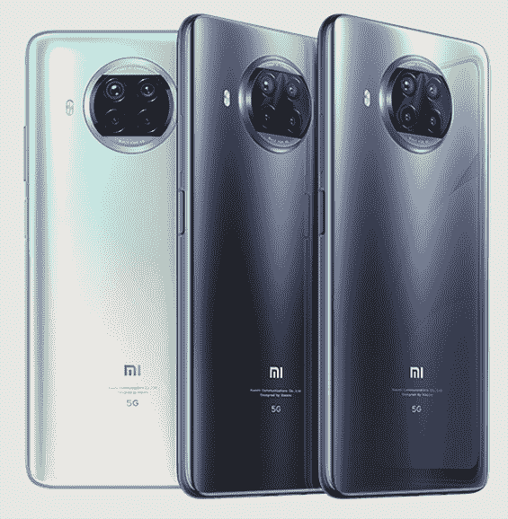

# 小米 Mi 10i 5G 点评:108MP 摄像头搞定次优角色

> 原文：<https://www.xda-developers.com/xiaomi-mi-10i-5g-review/>

小米的 [Mi 10i](https://www.xda-developers.com/xiaomi-mi-10i-108mp-cameras-snapdragon-750g-miui-12-india/) 是该公司在印度产品组合的最新成员。尽管小米 10i 被认可为专为印度制造的产品，但它在[设计和规格](https://www.xda-developers.com/xiaomi-mi-10t-lite-qualcomm-snapdragon-750g-120hz-display-launch/)(除了新的 108MP 摄像头)方面与小米的小米 10T Lite 相似，也类似于小米的[红米 Note 9 Pro 5G](https://www.xda-developers.com/xiaomi-redmi-note-9-pro-5g-4g-redmi-watch-china-launch/) 。如果你可以忽略这一点，小米 Mi 10i 是你在印度可以买到的最经济的 5G 手机之一，因为该国正在为 5G 时代做准备。

几年来，小米在“mi”和“Redmi”品牌设备之间有着明显的区别。小米将小米描述为一个优质品牌，而红米因其设备令人难以置信的性价比而赢得赞誉。然而，这些界限在过去几年里变得模糊了，Redmi 作为一个独立的实体剥离出来，并努力与一个更高级的身份联系在一起。像 Redmi K40 系列这样的智能手机证明了这种追求。尽管已经独立存在，Redmi 继续与 mi 品牌共享资源。这种混合的结果是，各种相同的设备被不同地命名，以适应不同的市场。

由于大多数终端用户只需要让他们所花的钱发挥最大价值，[小米令人困惑的命名方案](https://www.xda-developers.com/opinion-smartphone-branding-out-of-control/#tagbar-list:~:text=Xiaomi,-Xiaomi%E2%80%99s)应该是他们最不关心的。然而，除了混乱的命名，重新贴牌的产品经常与品牌的身份不符。通过 Mi 10i，小米做出了一些明显的妥协，这些妥协有损于 Mi 产品的高级身份，并使其更适合红米 Note 的角色。一个例外是 108 百万像素的摄像头，这可能会弥补这种权衡。如果 Mi 10i 看起来是你感兴趣的选择，你可能想在冒险之前知道这些注意事项。

在我们进入细节之前，这里是小米 Mi 10i 的规格:

## 小米 Mi 10i 规格

### 小米米 10i 规格。单击或点击以展开。

| 

规格

 | 

小米 Mi 10i

 |
| --- | --- |
| **构建** | 

*   玻璃背面
*   正面和背面的康宁大猩猩玻璃 5

 |
| **尺寸&重量** | 

*   165.38 x 76.8 x 9 毫米
*   215 克

 |
| **显示** | 

*   6.67 英寸 FHD+液晶显示器
*   120 赫兹刷新率
*   居中打孔机

 |
| **SoC** | 高通骁龙 750 克:

*   2 个 ARM Cortex-A77“高性能”内核@ 2.2GHz 以上
*   6 个 ARM Cortex-A55“高效”内核@ 1.8GHz

肾上腺素 619 |
| **风筒&储存** | 

*   6GB + 64GB UFS 2.2
*   6GB + 128GB
*   8GB + 128GB

 |
| **电池&充电** | 

*   4820 毫安时
*   33W 有线快速充电

 |
| **安全** | 侧装式指纹扫描仪 |
| **后置摄像头** | 

*   **主要:**108 兆像素，1/1.52 英寸传感器，9 合 1 像素宁滨，f/1.75
*   **次要:** 8MP 超广角，f/2.2，120 FoV
*   **第三级:** 2MP，宏
*   **第四纪:** 2MP，深度

视频:

*   4K @ 30fps
*   1080p @ 60fps，30fps

 |
| **前置摄像头** | 16MP |
| **端口** | USB-C，3.5 毫米耳机插孔 |
| **音频** | 双扬声器，AAC，LDAC，LHDC 支持 |
| **连通性** | 

*   无线网络:802.11a/b/g
*   蓝牙 5.1
*   GNSS:
    *   北斗 B1l + B2a
    *   GPS L1 + L5
    *   伽利略 E1 + E5a
    *   GLONASS·G1
    *   QZSS L1 + L5
*   乐队:
    *   5G: n1、n3、n41、n78、n79
    *   4G: FDD-LTE: B1，3，5，7，8TDD-LTE: B34，38，39，40，41
    *   3G: WCDMA: B1，2，5，8CDMA EVDO: BC0
    *   2G: GSM: B2，3，5，8

 |
| **软件** | 基于 Android 10 的 MIUI 12 |
| **其他特征** | 红外线增强器 |

**关于本次评测:** *小米印度借给我们一台 8GB+128GB 的米 10i 的变种进行评测。这个评测是在用了差不多两个月之后。小米对该评论的内容没有任何意见。*

**[小米 Mi 10i 论坛](https://forum.xda-developers.com/f/xiaomi-mi-10i.12065/)**

* * *

## 设计

那些已经在使用小米、Redmi 或 POCO 设备的人应该对小米 Mi 10i 很熟悉。它遵循了这些公司通常的玻璃夹层设计，有一个弯曲的玻璃背面和一个平板显示器。Mi 10i 的正面和背面都受到大猩猩玻璃 5 的保护。虽然侧面的框架由塑料制成，但其金属光泽表面赋予了它金属般的外观。

背面有一个圆形摄像头凸起，用于固定四摄像头设置。摄像头凸起让人想起了 [POCO X3](https://www.xda-developers.com/poco-x3-launched-india/) 和 [Redmi K30 Pro](https://www.xda-developers.com/xiaomi-redmi-k30-pro-notchless-pop-up-camera-design-snapdragon-865-china-launch/) (重新命名为 [POCO F2 Pro](https://www.xda-developers.com/poco-f2-pro-review/) )，但它在 Mi 10i 上比那些设备更紧凑。108MP 相机确实使相机明显变厚，你需要一个外壳来防止相机玻璃在平面上磨损。

米 10i 设计中最令人兴奋的元素是它的颜色，尤其是太平洋日出款。我们也有同样的款式，它的特点是两种对比鲜明的颜色以微妙的渐变融合在一起。顾名思义，这种颜色组合可以提醒你迷人的自然现象，如海上或海洋的日出或日落。

虽然海洋日落是小米对这一设计的愿景，但这些动态的颜色让我想起了覆盖着果冻的冰淇淋。可以肯定地说，这个设计可以有多种解释，应该会激发你——至少一次——去思考它的灵感来源。

[sc name = " pull-quote " quote = " Mi 10i 的《太平洋日出》采用了受自然启发的艺术手法。"]

当阳光落在背面时，它像聚光灯一样扩散和散射，这有助于将注意力吸引到智能手机上。同时，磨砂玻璃背面防止漫射光从表面反射。在背面的 Mi 徽标下，有一个引人注目的 5G 徽章，明确定义这是一款准备好 5G 连接的设备，尽管印度用户尚未获得网络频谱。

Mi 10i 是一款便于握持和使用的大型设备，尤其是由于它的大显示屏，我们将在下一节讨论这一点。然而，与 POCO X3 相比，这款手机实际上握起来更方便。它更薄(9 毫米)，没有锋利的边缘。尽管 Mi 10i 很宽，但弯曲的背部使其易于握持，您还可以使用外壳来进一步提高握持力。重量为 215 克，Mi 10i 不是一个轻的手机，但重量分布得非常好，你不会感觉到质量集中在任何一个区域。

以下特征与侧架一起放置:

*   侧面安装的指纹扫描仪和右侧的音量摇杆，
*   3.5 毫米耳机插孔、USB Type-C 端口、主麦克风和底部的扬声器，
*   左侧有一个 SIM 卡和 microSD 卡插槽，以及
*   顶部有一个辅助降噪麦克风和一个红外增强器。

一个扬声器放在智能手机的底部，另一个放在耳机中，为 Mi 10i 提供了立体声音频设置。

总的来说，Mi 10i 的设计既令人熟悉又令人耳目一新，这要归功于传统的布局以及诱人的太平洋日出色。这种设计的另一个方面是我们将在下一节讨论的大显示屏。

* * *

## 显示

Mi 10i 配备了一个 6.67 英寸的 LCD，顶部边缘中心有一个穿孔。虽然 Mi 10i 是一种重新标记的设备，但这种显示器过去也曾出现在许多其他 Redmi 和 POCO 设备上。这些设备包括[红米 Note 9 Pro](https://www.xda-developers.com/xiaomi-redmi-note-9-pro-max-snapdragon-720g-33w-fast-charging/) (在欧洲改称红米 Note 9S)、[红米 Note 9 Pro Max](https://www.xda-developers.com/redmi-note-9-pro-max-hands-on-video/) 、[波科 X2](https://www.xda-developers.com/poco-x2-review-better-than-poco-f1/) 和波科 X3。

米 10i 上的显示屏与我们去年在红米 Note 9 Pro 评测中发现的几乎相同。唯一的区别在于，虽然后者具有 60Hz 的刷新率，但 Mi 10i 的显示器支持高达 120Hz 的[刷新率](https://www.xda-developers.com/smartphone-display-refresh-rates-explained/)。该智能手机还继承了米 10T Pro 的[动态刷新率切换。这意味着显示器的刷新率会与显示器上运行的内容的帧速率同步变化。帧速率和显示器刷新率之间的同步有助于最小化帧撕裂。](https://www.xda-developers.com/xiaomi-mi-10t-pro-great-lcd-better-than-good-amoled-display/#gallery-1:~:text=nature.-,Refresh%20Rate)

虽然 Mi 10i 并不匹配每个单一步骤的帧速率和刷新率，但小米定义了六种不同的刷新率值，以覆盖我们常见的大多数不同类型的内容。这些定义的值包括 30Hz、48Hz、50Hz、60Hz、90Hz 和 120Hz。与三星根据应用程序改变的自适应刷新率不同，小米的自适应刷新率随着显示器上正在播放的任何内容的变化而实时变化。

Mi 10i 的展示还有很多不足之处。刷新率 bug 恶化了这种感觉。”]

我们在 Mi 10i 上遇到了一个错误，如果超过一分钟没有触摸屏幕，智能手机的显示将限制在 50Hz 的刷新率。使用 MIUI 开发人员选项中的电源监控工具实时检查活动刷新率值。这可能会影响您的观看体验，并违背自适应刷新率同步功能的目的。此外，该漏洞还限制了手机在 PCMark 等综合基准测试中的性能，本文稍后将对此进行讨论。触摸显示屏时，激活的刷新率同步会恢复。这个错误被报告给了小米印度，但是我们还没有收到他们关于这个问题的更新。

虽然在主动刷新率切换方面，Mi 10i 与 Mi 10T Pro 相当，但在显示质量方面，它落后于 Mi 10T Pro。事实上，它的 Redmi Note 角色渗透到了 mi 品牌中。

显示器相当明亮，但却令人难以置信地没有表现出来。对于户外可用性，Mi 10i 配备了“阳光显示 3.0”，但尽管如此，你可能不得不与阻碍反射率作斗争，特别是在强烈的阳光下。并排比较，POCO X3 的显示屏看起来稍微亮一些，这也是我们在[红米 Note 9 Pro 评测](https://www.xda-developers.com/xiaomi-redmi-note-9-pro-review-snapdragon-720g-48mp/)中提到的。

在颜色方面，Mi 10i 的显示器感觉像任何初级的 IPS 显示器。小米声称支持 84%的 NTSC 色域。即使在“饱和”色彩模式下，这种显示屏也显得平淡无奇，缺乏我们在这个价格范围内的许多其他手机上看到的强烈色彩。不用说，[这个价位的许多手机实际上都配有 AMOLED 显示屏。任何为了获得良好的多媒体体验而购买智能手机的人都必然会很容易被 AMOLED 显示屏所左右，即使这意味着性能方面的一些失望。更令人失望的是，](https://www.xda-developers.com/realme-x7-realme-x7-pro-mediatek-dimensity-india/)[红米 K20](https://www.xda-developers.com/xiaomi-redmi-k20-pro-launch-china/#gallery-2:~:text=Redmi%20K20,-Alongside) (改名为[小米 9T](https://www.xda-developers.com/redmi-k20-launches-internationally-as-xiaomi-mi-9t/) )在不到两年前以更低的价格在印度推出了更好的显示屏。

如果你孤立地看一下 Mi 10i，它的显示屏可能并不出众。但是，对于日常使用来说，它是足够的，没有任何基准或期望。如果您购买 Mi 10i 仅仅是为了游戏或性能，并且不期望屏幕以外的巨大价值，您应该会对其高刷新率功能感到高兴。搭配支持 Mi 10i 的骁龙 750G 芯片组，您应该能够享受流畅、无延迟的游戏，无需大量处理能力。

相比之下，推出的红米 Note 10 Pro/Pro Max 配备了更亮的 120Hz AMOLED 显示屏——这是红米 Note 系列的第一款。在我们的 [Redmi Note 10 Pro 评测](https://www.xda-developers.com/xiaomi-redmi-note-10-pro-review/)中了解更多关于这款显示屏的信息。

谈到处理能力，为 Mi 10i 提供动力的芯片组被定位为[骁龙 732G](https://www.xda-developers.com/qualcomm-snapdragon-732g/) 和[骁龙 765G](https://www.xda-developers.com/qualcomm-snapdragon-765-processor-specifications-features/) 之间的中间产品。下一部分将讨论智能手机的性能以及我们在评测中注意到的各个方面。

* * *

## 表演

小米计划将 Mi 10i 作为一款性能可靠的中端产品，因此，人们对可靠的性能有所期待。这款智能手机采用高通最近推出的 5G 中端移动平台，即去年 9 月宣布的骁龙 750G。骁龙 750G，正如你从它的名字中所料，是介于骁龙 732G 和骁龙 765G 之间的机型。小米 Mi 10i 不是第一款采用该芯片组的智能手机，但它的孪生兄弟 Mi 10T Lite 却是。

[高通骁龙 750G](https://www.xda-developers.com/qualcomm-snapdragon-750g-processor-specifications-features/) 是一款 8 纳米 SoC，八个内核排列成一个大的。小建筑。它配备了两个基于 ARM Cortex-A77 设计的高通 Kryo 570 性能核心，主频为 2.2GHz。在能效方面，骁龙 750G 配备了六个基于 ARM Cortex-A55 CPU 核心的效率核心，主频为 1.8GHz。值得注意的是，骁龙 765G 和较新的[骁龙 768G](https://www.xda-developers.com/qualcomm-announces-snapdragon-768g-mobile-platform/) 仍然采用较旧的 Cortex-A76 设计，理论上应该落后于骁龙 750G。然而，这两个特别优秀的芯片组采用了 7 纳米设计，这可能会给他们一些余地。性能核心的更新设计可以导致单核性能的显著领先，我们将在小米 Mi 10i 上使用合成基准测试这一点。

说到图形，高通骁龙 750G 采用了 Adreno 619 GPU。同样，仅限于骁龙 750G 的 Adreno 619，由于其命名的幸运，注定位于骁龙 730/730G、 [720G](https://www.xda-developers.com/qualcomm-snapdragon-720g-662-460-navic/) 和 732G 的 Adreno 618 和骁龙 765G 和 768G 的 Adreno 620 之间。根据高通的说法，GPU 的设计旨在比 Adreno 618 的图形性能提高 10%。值得注意的是，骁龙 765G/768G 上的 Adreno 620 被吹捧为比 Adreno 618 增加了 20%，即 Adreno 619 的两倍。

虽然我们将使用合成基准测试 Mi 1oi 的图形功能，但很高兴知道该芯片组支持一些高通的精英游戏功能，如 Game Color Plus、Adreno [可更新的 GPU 驱动程序](https://www.xda-developers.com/xiaomi-adreno-gpu-driver-update-snapdragon-865/)和 Adreno HDR 快速混合。更新 GPU 驱动程序的能力将允许原始设备制造商最大限度地利用 GPU 的硬件，即使是在它发布几年之后。

对于 5G 连接，骁龙 750G 采用高通骁龙 X52 调制解调器，骁龙 765G 和 768G 也提供该调制解调器。高通的骁龙 X52 调制解调器支持通过 SA 和 NSA 网络的毫米波和低于 6GHz 的频率。

我们运行了一些标准的合成基准和 XDA 的内部定制基准，以量化小米 10i 的性能。我们还纳入了由骁龙 732G 驱动的 POCO X3、由骁龙 765G 驱动的一加诺德和运行 Exynos 9825 的三星 Galaxy F62，以便与类似功能或类似价格的智能手机进行比较。

### 合成基准

#### 极客工作台

基于骁龙 750G 上 ARM Cortex-A77 的较新 Kryo 570 性能内核不仅帮助 Mi 10i 将骁龙 732G 上的 POCO X3 边缘化，还将骁龙 765G 上的一加诺德边缘化。在以 CPU 为中心的 GeekBench 5 基准测试的单核和多核测试中可以看到相同的模式。有趣的是，尽管采用了相同的芯片组，Mi 10i 在两项测试中的得分都低于 [Moto G 5G](https://www.xda-developers.com/moto-g-5g-review-a-5g-phone-goes-back-to-the-basics/) (又名 [Moto One 5G Ace](https://www.xda-developers.com/moto-one-5g-motorola-most-affordable-5g-capable-device/) )，这表明后者的用户体验略好。

[sc name = " pull-quote-right " quote = "骁龙 750G 在 CPU 性能方面胜过骁龙 765G。"]

与此同时，三星 Galaxy F62 的 exy nos 9825——这是一款 7 纳米芯片组，具有两个 2.7Ghz 的高性能内核，两个 2.4GHz 的 Cortex-A75 内核和四个 Cortex-A55 内核——在单核测试中的表现远远超过 Mi 10i，但在多核测试中的差距大幅下降。

#### 3DMark

在以 GPU 为中心的 3DMark 中，我们看到了预期的 GPU 性能。拥有 Adreno 619 的 Mi 10i 位于拥有 Adreno 618 的 POCO X3 和拥有 Adreno 620 GPUs 的一加诺德的中间。不出所料，配备 Mali G76 GPU 的三星 Galaxy F62 在某些测试中的得分是一加·诺德的两倍多。

#### GFXBench

在以 GPU 为中心的多元基准测试 GFXBench 中，我们在初始测试中看到了类似的性能趋势。值得注意的是，军情 10 处和 X3 警察部队的得分差距很小。相比之下，一加诺德的表现一直更好。令人惊讶的是，看到 POCO X3 一贯得分相等或超过 Mi 10i，对此唯一可行的解释是 Mi 10i 上的 GPU 节流。谈到节流——尽管最初的冲刺，Galaxy F62 表现平平，仅与一加诺德一样好。

#### 安卓长凳

当谈到基准存储传输速度时，Mi 10i 在顺序读写速度方面与一加诺德和 Moto G 5G 不相上下。值得注意的是，小米 10i 配备了 UFS 2.2 闪存存储，而其他两款设备仍采用较旧的 UFS 2.1 存储。与 UFS 2.1 相比，UFS 2.2 标准增加了一项称为写加速器的功能，以提高写速度。然而，我们没有看到这转化为写入速度的任何实际增加。

Galaxy F62 再次占据领先地位，因为它的 UFS 3.0 存储具有更高的顺序读写速度。

#### PCMark Work 2.o

说到 PCMark 的 Work 2.0——一个模拟文本或媒体编辑、网页浏览、写作和数据操作等现实生活任务的基准，Mi 10i 表现不佳。尽管 POCO X2 等老中档选手在该基准中的得分几乎高达 9800 分，但小米 10i 的得分限制在 7500 分以下。对这种性能下降的一个可能的解释是我们上面提到的刷新率错误。虽然 Work 2.0 基准测试中的一些测试包括以 60fps 渲染的视频，但该错误将显示器上的输出限制为 50fps，导致基准测试的性能低于智能手机的性能。

#### CPU 节流测试

虽然我们在查看上面的 GFXBench 分数时看到了潜在的 GPU 性能节流的可能性，但我们也专门运行了一个基准来测试 CPU 的节流。为此，我们使用了 CPU 节流测试应用程序，其中用 C 编写的线程在设定的时间段内不断重复。这种持续负载的影响可以通过比较每秒的平均性能和最低性能来量化。

我们在三个不同的场景中运行测试，每个场景持续 30 分钟。将该装置放在一边，并在每次测试之间让其冷却。在第一个场景中，我们在标准条件下运行基准测试。大约 15 分钟后，性能明显下降，与峰值性能相比，最终降低了 85%。

在接下来的场景中，我们将 MIUI 的游戏 Turbo 应用程序中的 CPU 节流应用程序列入白名单，以查看当小米的游戏模式控制性能时，节流是否会减少。该功能对峰值性能没有明显的改善，但限制减少了。在 Mi 10i 上使用 Game Turbo，性能被节流到峰值性能的 91%。

最后，我们在给智能手机充电但不使用 Game Turbo 的情况下，又进行了 30 次相同的测试。由于充电会增加系统的热量，这有助于设备决定降低性能。当手机充电到电池容量的 90%左右时，Mi 10i 被节流到峰值性能的 71%。

除了手机充电时性能的大幅下降，前两种情况下的节流值与我们对该类别其他智能手机的预期非常一致。

### XDA 的自定义基准

除了标准的基准测试，我们还使用 XDA 的几项内部基准测试测试了小米 Mi 10i 的性能。与合成基准不同，这些基准旨在测试任何设备在现实生活中的性能，如滚动和应用程序启动。这些测试中的第一个用于确定 Mi 10i 能够在多大程度上维持 120Hz 显示器的最佳帧率输出。

#### 自定义邱建测试

XDA 用户界面口吃和邱建测试是谷歌开源基准 JankBench 的修改版。该基准包括各种测试，通过复制我们在大多数应用程序中常用或遇到的操作来确定智能手机的性能。

这些任务包括滚动通过具有文本的列表视图、滚动通过具有图像的列表视图、滚动通过具有阴影效果的网格视图、滚动通过低命中率文本呈现视图、滚动通过高命中率文本呈现视图、用键盘输入和编辑文本、用卡片重复透支以及上传位图。

智能手机每帧所用的时间会被记录下来，并以竖条的形式绘制在参考值上，参考值用彩色线表示。这些值对应于系统按照特定刷新率绘制和呈现帧所需的理想时间。例如，60Hz 刷新率意味着系统每秒在显示器上绘制和呈现 60 帧。这意味着渲染每一帧需要 16.67 毫秒(ms)。类似地，系统在 90Hz 的显示器上渲染帧需要 11.11 毫秒，在 120Hz 的显示器上渲染帧需要 8.33 毫秒。

任何违反水平线的帧都被认为是关于该特定刷新率值的断续。由于 Mi 10i 支持最大 120Hz，这是我们旨在为该设备测试的值。

我们在小米 10i 上运行 jank 测试时记录了以下观察结果:

*   Mi 10i 在 **ListView 文本滚动**测试中明显表现不佳，近 19%的帧没有达到这一标准。此外，4%的帧错过了 90Hz 的标志。
*   在 **ListView 图像滚动**测试中，Mi 10i 的表现相对更好，大约只有 5%的帧错过了 120Hz 标记，近 2%的帧错过了 90Hz 标记。
*   在**低命中率**和**高命中率渲染**测试中，分别有大约 11%和 18%的帧没有达到 120Hz 的标准。对于 90Hz，对于**低命中率**和**高命中率**测试，丢失帧的百分比分别为 6%和 11%。
*   在**文本输入和编辑测试**中，几乎 15%的帧未达到 120Hz，大约 9%的帧未达到 90Hz。此外，在 60Hz 刷新率下，几乎 7%的帧无法满足无 jank 输出的时间要求。
*   在 **GPU 透支**方面，近 94%的帧无法以 120Hz 对应的速率渲染。幸运的是，只有 0.53%的人没有达到 90Hz 的标准。
*   最后，根据 **[位图上传](https://developer.android.com/topic/performance/vitals/render#tabpanel-kotlin:~:text=Bitmap%20uploads)** 测试，99%的帧不仅错过了 120Hz 标记，还错过了 90Hz 标记。更令人担忧的是，96%的帧也没有达到 60Hz。

[sc name = " pull-quote-left " quote = " Xiaomi Mi 10i 在 120Hz 显示屏上呈现平滑滚动所需的帧时喘着气。"]

虽然小米吹嘘小米 10i 的滚动流畅无延迟，但我们的测试显示并非如此。在文本和图像滚动测试中，智能手机努力保持 120Hz 的刷新率要求。最重要的是，overdraw 测试中的糟糕性能表明，在 120Hz 显示器上持续平滑的渲染需要更强大的 GPU，而 Mi 10i 缺乏这一点。小米不妨把显示屏限制在 90Hz，你不会注意到有什么大的区别。最后，位图上传测试中令人沮丧的性能表明手机在呈现相当大的 UI 元素时表现出抖动的倾向。

在日常使用中，你可以很容易地发现使用中的口吃，如果你真的在乎 120Hz 的刷新率，你会发现这很烦人。这让我们质疑小米当初选择 120Hz 显示屏而不是 60Hz AMOLED 显示屏的决定。

在接下来的测试中，我们将测试 Mi 10i 在应用程序启动方面的能力。

#### 自定义应用启动速度测试

这个定制基准是由《XDA》的主编[米沙·拉赫曼](https://www.xda-developers.com/author/mishaalrahman/)和资深撰稿人[马里奥·塞拉费罗](https://www.xda-developers.com/author/mario-serrafero/)创建的。它涉及利用 Android 的 ActivityManager shell 接口来启动不同应用程序并测量每次冷启动所需时间的脚本(即当应用程序不在后台运行时)。在这个测试中，我们选取了 12 个流行的应用程序，并测量了启动时间。

这 12 款应用包括谷歌 Chrome、Discord、脸书、Gmail、谷歌地图、谷歌消息、谷歌照片、谷歌 Play 商店、Slack、Twitter、WhatsApp 和 YouTube。我们运行了两种不同的测试，其中应用程序被一个接一个地启动和终止 15 次迭代，然后重复同样的测试 30 次迭代。每个应用程序的 serval 迭代的总时间显示在条形的底部，而条形上方的数字表示中间值。

在 15 次迭代的周期中，启动所有应用程序的平均时间相对少于 30 次迭代的周期。正如我们在上面看到的，这种行为是意料之中的，因为手机在持续使用一段时间后会变热，从而导致节流。然而，也有一些例外，这些例外是谷歌地图、消息和 WhatsApp。这三个应用程序在第一次运行时使用 15 次迭代比使用 30 次迭代花费更多的时间。

与 Mi 10T Pro 相比，Mi 10i 启动应用程序的时间几乎是其四倍。令人惊讶的是，这个时间比我们在[一加诺德评论](https://www.xda-developers.com/oneplus-nord-review/#gallery-6:~:text=loads.-,App%20Launch%20Speed%20Test)中运行相同测试时发现的要少得多。

### 小米 Mi 10i 上的游戏

说到游戏，Mi 10i 可以在中等设置下运行 PUBG Mobile 和 COD Mobile 等竞争对手的游戏。虽然它在 PUBG Mobile 上支持最高 40fps 的游戏，具有平滑的图形设置，但你可以在 COD Mobile 上将帧速率提高到最高 60fps。与此同时，由于其高图形要求，Genshin Impact 的游戏玩起来断断续续，有明显的口吃。

* * *

## 照相机

小米 Mi 10i 配备了 108MP 主摄像头，这是智能手机的主要亮点之一。对于这款 108MP 相机，Mi 10i 采用了 108MP [三星 ISOCELL HM2](https://www.xda-developers.com/samsung-isocell-lineup-promises-smaller-camera-bumps-future-smartphones/) ，它位于 ISOCELL HMX 和 HM1 传感器之后。与三星 Galaxy S20 Ultra 和 [Galaxy Note 20 Ultra(相机评论)](https://www.xda-developers.com/samsung-galaxy-note-20-ultra-camera-review/)上的 ISOCELL HM1 传感器相比，HM2 传感器要小 15%。它的尺寸为 1/1.52 英寸，像素大小为 0.7μm。

尽管较小的 ISOCELL HM2 传感器理论上意味着相机捕捉的光线比无 ISOCELL HMX 和 HM1 传感器少，但三星声称 ISOCELL Plus 和 Smart ISO 技术提高了传感器的光线保持能力。值得注意的是，尽管 ISOCELL HM2 的命名继承了之前的传感器，但它适用于 Mi 10i 等中档设备。对于旗舰产品，三星已经宣布了 ISOCELL HM3 传感器，它与 HMX 和 HM1 传感器一样大，但具有 HM2 传感器的改进的光保留功能。ISOCELL HM3 传感器就是我们在[三星 Galaxy S21 Ultra](https://www.xda-developers.com/samsung-galaxy-s21/) 上看到的传感器。

[sc name = " pull-quote " quote = " Mi 10i 上的 108 百万像素摄像头是一项价格实惠的豪华功能。"]

### 主摄像机

回到小米 Mi 10i，108MP 摄像头通过利用 9 合 1 像素宁滨以 12MP 原生拍摄图像。由此产生的 12MP 图像的像素为 2.1μm。以下是我们使用 12MP 主相机和默认设置拍摄的一些样本图像:

图像细节丰富，呈现的颜色与我们肉眼看到的非常相似。相机有时需要几秒钟以上的时间来对焦，很少会完全停止对焦。但是除了这些问题之外，图像的质量对于价格来说是非常令人印象深刻的。

### 1200 万像素对 108 万像素

原则上，像素宁滨允许相机捕捉更多的光线和细节。这意味着 Mi 10i 在 108MP 模式下必然会比主要的 12MP 模式捕捉到更少的光。然而，由于 108MP 要大得多，它们应该允许你捕捉更多的细节，当你放大图像时，可以看到差异。

为了了解 Mi 10i 在使用和不使用像素宁滨的情况下捕捉这些细节的效果，我们在 12MP 和 108MP 下拍摄了以下图像:

Mi 10i 不仅需要更长的时间来捕捉 108MP 的图像，它们经常变得模糊或失焦。与我们在其他配备 108MP 摄像头的手机上看到的不同，这款小米智能手机未能充分利用这一功能。

### 800 万像素超广角摄像头

除了主 108MP 摄像头，Mi 10i 还配备了一个 8MP 超广角摄像头。这架照相机有固定焦距，可以拍摄 120°的宽视野。这个 8MP 传感器与 f/2.2 光圈镜头配对。以下是一些比较标准相机(即 Mi 10i 上的广角相机和超广角相机)的图片:

正如我们在大多数其他智能手机上看到的那样，超广角摄像头捕捉的光线比主摄像头少。除此之外，色调相对单调，缺乏光泽。不仅如此，超广角相机捕捉的细节也比主相机少，图像大多只适合社交媒体。

### 夜间模式

Mi 10i 也具有夜间模式，就像大多数其他运行 MIUI 的设备一样。这里有几张照片比较了它在夜间使用和不使用夜间模式时的相机性能。

正如所料，夜间模式下较长的曝光设置会使画布充满更多的光线。大多数时候，更多的光线也对应着更多的细节，但有时你可能会有对焦问题，特别是在没有三脚架的情况下拍摄图像。

除了主相机，夜间模式也可以与超广角相机配合使用，可以增加图像的曝光度。

虽然 Mi 10i 上的摄像头应该会激励你继续前进，但可靠的电池使这成为可能。因此，在下一节中，我们将讨论智能手机的电池。

* * *

## 电池

Mi 10i 配备了 4820mAh 电池，可以轻松地让手机航行一天。在适度使用的情况下——包括一些休闲游戏和大部分网络浏览，Mi 10i 的续航时间超过 24 小时，其中约有 7 小时的屏幕打开时间。在此期间，刷新率设置为 120Hz，亮度设置为自动。

使用情况因用户而异，这不能作为经验值的基础。所以，我们做了 PCMark 电池测试。在此测试过程中，PCMark Work 基准反复运行，从 80%电池电量开始，到 20%电池电量结束。在此期间，显示器的亮度被设置为 200lux 的恒定值。在这次测试中，米 10i 持续了近 12 个小时。

[sc name = " pull-quote-right " quote = " 33W 快速充电是一项被低估的优势。"]

说到充电，米 10i 支持小米的涡轮充电技术，功率输出为 33W。包装盒内还包括一个兼容的 33W 充电器。除了快速充电支持，小米 10i 还采用了小米所谓的“双分离充电”。电池被分成两个同时充电的单元。这使得手机在充电过程中充电速度更快，发热程度更低。

使用充电器，小米 Mi 10i 需要近一个小时才能充满电。电池在大约 15 分钟内从 10%的电量充电到 50%，并在大约 40 分钟内达到 90%。这种充电技术不如我们在各种 OPPO 上看到的 65W 快速充电技术快得惊人，特别是在这个价格段的 Realme 手机上。但是，仅仅几分钟的充电也能保证几个小时的使用。

最后，我们使用另一个名为 [DontKillMyApp](https://www.xda-developers.com/dontkillmyapp-benchmark-test-background-app-killing/) 的基准测试来确定你的手机在后台杀死应用程序的力度。该应用程序通过每十秒钟运行一次相同的活动来测试激进的应用程序杀死措施，最长可达八小时。它还每 8 分钟设置一次无声警报。结果显示成功执行的命令的百分比。下图显示了小米 Mi 10i 的结果，正如你所见，这款手机应该不会使用你最喜欢的应用程序。

总体来说，米 10i 上的电池做的不错，快充是加分项。你也可以通过切换到 60Hz 模式来延长电池寿命，但这对大多数用户来说似乎是一个不太可能的选择。

* * *

## 结论

尽管小米声称它专门为印度制造了 Mi 10i，但我们知道这不是一款新手机。在这个时代，发布前的泄露决定了手机上市后的反应，Mi 10i 显然处于劣势。但是，如果你不是那些受泄露影响的人，Mi 10i 提供了令人兴奋的亮点，如 5G 连接和 108MP 摄像头，但预算严格。米 10i 令人眼前一亮的颜色组合也应该有助于你获得朋友和同龄人的关注。

与此同时，智能手机上的显示屏并不令人兴奋，可能会吓跑娱乐爱好者。相反，小米对显示屏的选择表明，这款智能手机的目标是那些要求手机性能良好的用户，而小米 10i 可以提供这一点。它显然不是一款游戏手机，也不是性价比最高的手机，但它可以长时间承受中等强度的工作负载。

**[小米 Mi 10i 论坛](https://forum.xda-developers.com/f/xiaomi-mi-10i.12065/)**

再次强调，不是性能，而是 108MP 摄像头将推动买家购买 Mi 10i，这款机型在₹20,999 的起价为 6GB + 64GB。目前，我们没有办法在印度测试 5G 连接，但对毫米波和 6GHz 以下 5G 网络的支持应该会有不错的应用。总的来说，如果你对智能手机的优质体验没有期望，小米 10i 可能是你需求的一个不错的选择。

 <picture></picture> 

Xiaomi Mi 10i 5G

##### 小米 Mi 10i 5G

小米 10i 是印度最实惠的 5G 手机之一，它还提供旗舰级的摄影功能，配有 108MP 摄像头，并支持 33W 快速充电。